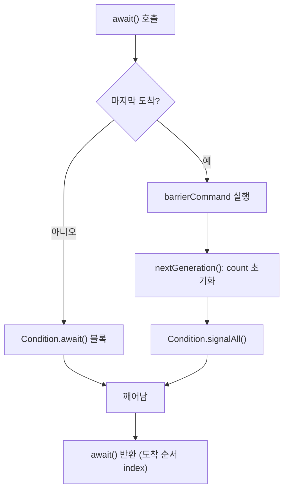

## 정의

**`java.util.concurrent.CyclicBarrier`** 는 **N 개의 스레드가 모두 도착할 때까지 서로 기다리는** synchronizer. 모두 도착하면 동시에 출발, 다시 사용 가능 (cyclic).

## 시각화

```anim:java-cyclic-barrier
{}
```

## 핵심 메서드

```java
CyclicBarrier barrier = new CyclicBarrier(N);
CyclicBarrier withAction = new CyclicBarrier(N, () -> {
    // 모두 도착 시 한 번 실행되는 action
    System.out.println("all arrived");
});

barrier.await();                   // 도착, 다른 스레드도 도착할 때까지 block
barrier.await(timeout, unit);
barrier.getNumberWaiting();        // 현재 대기 중인 스레드 수
barrier.reset();                   // 모든 대기자 깨우고 BrokenBarrierException 던짐
```

## 가장 흔한 패턴, 단계별 동시 실행

```java
CyclicBarrier barrier = new CyclicBarrier(4);

for (int i = 0; i < 4; i++) {
    new Thread(() -> {
        for (int phase = 0; phase < 3; phase++) {
            doPhaseWork(phase);
            barrier.await();          // 다른 3 스레드 도착 대기
            // 모두 같은 phase 완료 후 다음 phase 진입
        }
    }).start();
}
```

병렬 계산의 각 phase 가 모두 끝나야 다음 phase 시작 가능한 경우 (예: 시뮬레이션 stepping).

## BrokenBarrierException

한 스레드가 `await` 도중 인터럽트되거나 timeout 되거나 `reset()` 호출되면 **다른 모든 대기자가 `BrokenBarrierException` 으로 깨어남**. 한 명이 broken 이면 모두 broken.

```java
try {
    barrier.await();
} catch (InterruptedException | BrokenBarrierException e) {
    // 처리
}
```

## CountDownLatch vs CyclicBarrier vs Phaser

| 항목 | [[CountDownLatch]] | CyclicBarrier | [[Phaser]] |
|:---|:---|:---|:---|
| 재사용 | ✗ | ✓ | ✓ |
| 대칭 | 비대칭 (N → 0) | 대칭 (N 만남) | 대칭 + 동적 |
| 참여자 수 | 고정 | 고정 | **동적** (register/deregister) |
| 콜백 | ✗ | barrier action | onAdvance hook |
| 도입 | JDK 1.5 | JDK 1.5 | JDK 1.7 |

`CyclicBarrier` 는 N 이 고정이지만 반복, `Phaser` 는 N 이 매 phase 마다 바뀔 수 있다.

## await 흐름



마지막으로 도착한 스레드가 **barrier action 을 직접 실행**하고 `nextGeneration()` 을 호출해 새 세대(generation)를 시작한다. 다음 phase 는 이 시점부터 즉시 사용 가능.

## 내부 구현 (ReentrantLock + Condition)

`CyclicBarrier` 는 내부적으로 [[ReentrantLock]] 하나와 그에 딸린 `Condition` 으로 구현된다.

```java
// JDK 소스 단순화
public class CyclicBarrier {
    private final ReentrantLock lock = new ReentrantLock();
    private final Condition trip   = lock.newCondition();
    private final int parties;           // 총 참여자 수
    private final Runnable barrierCommand;
    private int count;                   // 남은 도착자 수 (parties → 0)
    private Generation generation = new Generation();

    static class Generation { boolean broken = false; }

    public int await() throws InterruptedException, BrokenBarrierException {
        lock.lock();
        try {
            final Generation g = generation;
            int index = --count;
            if (index == 0) {            // 마지막 스레드
                if (barrierCommand != null) barrierCommand.run();
                nextGeneration();        // count = parties, signalAll
                return 0;
            }
            for (;;) {
                trip.await();
                if (g.broken) throw new BrokenBarrierException();
                if (g != generation) return index;
            }
        } finally { lock.unlock(); }
    }

    private void nextGeneration() {
        trip.signalAll();
        count = parties;
        generation = new Generation();
    }
}
```

`generation` 객체를 교체하는 방식으로 "새 세대" 진입을 구분한다. 오래된 `generation` 을 들고 있는 스레드는 broken 여부를 즉시 감지할 수 있다.

## 실전 예시: 병렬 행렬 연산

```java
// Java 17+: var, record 활용
record MatrixChunk(int startRow, int endRow, double[][] data) {}

void parallelMatMul(double[][] A, double[][] B, double[][] C, int workers) {
    int rows = A.length;
    int chunkSize = rows / workers;

    // barrier action: 중간 결과 집계
    CyclicBarrier barrier = new CyclicBarrier(workers, () ->
        System.out.printf("Phase 완료: %s%n", Thread.currentThread().getName())
    );

    try (var executor = Executors.newFixedThreadPool(workers)) {
        for (int w = 0; w < workers; w++) {
            int start = w * chunkSize;
            int end   = (w == workers - 1) ? rows : start + chunkSize;

            executor.submit(() -> {
                // Phase 1: 행 계산
                computeRows(A, B, C, start, end);
                barrier.await();    // 모든 스레드 Phase 1 완료 대기

                // Phase 2: 정규화
                normalizeRows(C, start, end);
                barrier.await();    // 모든 스레드 Phase 2 완료 대기
            });
        }
    }
}
```

barrier 가 재사용되므로 Phase 1/2 를 별도 `CountDownLatch` 없이 같은 객체로 처리.

## timeout await 와 broken 배리어 복구

```java
try {
    // 5초 안에 도착 못하면 TimeoutException
    barrier.await(5, TimeUnit.SECONDS);
} catch (TimeoutException e) {
    // 이 스레드가 timeout 되면 barrier 가 broken 됨
    // 다른 모든 대기자가 BrokenBarrierException 으로 깨어남
    barrier.reset();   // 복구 (broken 대기자가 없을 때 호출)
} catch (BrokenBarrierException e) {
    // 다른 스레드가 broken 시켰다. 재시도 또는 중단.
}
```

> [!WARNING]
> `reset()` 은 현재 대기 중인 **모든 스레드에 `BrokenBarrierException`** 을 던진다. 대기자가 있는 상황에서 reset 하면 예외 처리 로직이 충분해야 한다.

## JMM (Java Memory Model) 보장

`barrier.await()` 는 **happens-before** 관계를 형성한다.

- **마지막 스레드의 `await()` 이전** 행위는 → 모든 스레드의 **`await()` 반환 이후** 행위에 *visible*
- 즉, Phase N 에서 계산된 모든 데이터는 Phase N+1 시작 시점에 다른 스레드에게 안전하게 보인다
- `barrier.await()` 내부의 `lock.unlock()` / `Condition.signalAll()` 이 이 보장을 제공

별도의 `volatile` 선언이나 `synchronized` 블록 없이도 phase 간 데이터 공유가 안전하다.

## 성능 특성

| 항목 | 특성 |
|:---|:---|
| 락 종류 | `ReentrantLock` (fair=false, 기본) |
| await 비용 | 마지막 스레드 O(1) lock, 나머지는 park/unpark |
| 처리량 | 참여자 수가 많을수록 마지막 도착이 늦어질 수 있음 |
| 스레드 수 | 코어 수의 배수로 맞추는 것이 일반적 |

`CyclicBarrier` 는 락 경합이 한 곳에 집중된다. 고동시성 환경에서는 [[Phaser]] 의 분산 카운터 방식이 더 확장성이 좋을 수 있다.

## 함정

### 1. parties 는 생성 시 고정

런타임 중 참여자 수를 늘리거나 줄일 수 없다. 동적 참여가 필요하면 [[Phaser]].

### 2. barrier action 에서 예외 발생 시 전파

```java
CyclicBarrier barrier = new CyclicBarrier(2, () -> {
    throw new RuntimeException("action failed");  // 모든 대기자가 BrokenBarrierException
});
```

`barrierCommand` 에서 unchecked exception 이 발생하면 barrier 가 broken 되고 **모든 대기자가 `BrokenBarrierException`** 을 받는다.

### 3. 부분 도착 시 blocking 위험

N 개를 등록했는데 M < N 개 스레드만 `await` 를 호출하면 **나머지 스레드들이 영원히 blocking**. 반드시 `await(timeout, unit)` 또는 인터럽트 정책을 함께 사용할 것.

### 4. broken barrier 에서 reset 없이 재사용 불가

barrier 가 broken 상태가 되면 이후 `await()` 호출도 즉시 `BrokenBarrierException`. 재사용하려면 `reset()` 을 명시적으로 호출해야 한다.

## 실전 패턴: 부하 테스트 동시 출발

```java
// Java 17+: 모든 스레드가 동시에 요청을 보내는 부하 테스트
int threads = 100;
CyclicBarrier startGate = new CyclicBarrier(threads + 1);  // +1 for main

try (var executor = Executors.newFixedThreadPool(threads)) {
    for (int i = 0; i < threads; i++) {
        executor.submit(() -> {
            startGate.await();   // 모두 준비될 때까지 대기
            sendRequest();       // 동시 출발
        });
    }
    startGate.await();           // main 도 도착 → 모두 동시 출발
}
```

`CountDownLatch(1)` 로도 비슷하게 구현할 수 있지만, CyclicBarrier 는 **모든 스레드가 준비됐을 때** 출발하므로 더 공정한 동시성 테스트가 가능하다.

## 관련 위키

- [[CountDownLatch]] - 일회용 비대칭 latch
- [[Phaser]] - 동적 참여자 지원 배리어
- [[Semaphore]] - 허가 기반 동시성 제어
- [[ReentrantLock]] - CyclicBarrier 내부 락
- [[Blocking]] - 블로킹 vs 논블로킹
