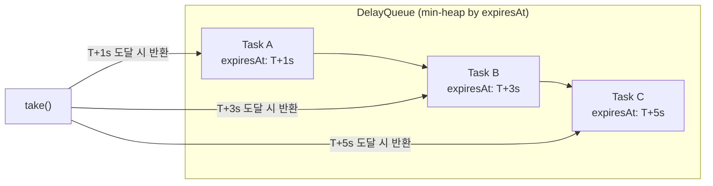

## 정의

**`java.util.concurrent.DelayQueue<E extends Delayed>`** 는 **각 원소가 지정된 delay 가 만료된 후에만** 꺼낼 수 있는 [[java-blocking-queue|BlockingQueue]]. 우선순위는 만료 시각이 빠른 것부터.

내부는 [[java-priorityqueue|PriorityQueue]] (min-heap). 단일 [[java-reentrant-lock|ReentrantLock]] 으로 thread-safe.

## 사용 상황

- **TTL 캐시**: 만료된 항목을 별도 스레드가 주기적으로 정리
- **재시도 큐 (retry queue)**: 실패한 요청을 일정 시간 뒤 재시도
- **작업 스케줄러**: `ScheduledThreadPoolExecutor` 와 유사한 단순 구현
- **세션 만료**: 로그인 세션, 인증 토큰 만료 처리

## 시각화: 시간 기반 꺼내기



## Delayed 인터페이스

원소는 `Delayed` 인터페이스를 구현해야 한다.

```java
public interface Delayed extends Comparable<Delayed> {
    long getDelay(TimeUnit unit);
}
```

`getDelay` 는 **남은 시간** 을 반환. 0 이하가 되면 take 가능. `compareTo` 는 힙 정렬에 사용.

```java
// Java 17+: record 기반 구현
record DelayedTask(String name, long readyAt, Runnable job)
        implements Delayed {

    DelayedTask(String name, long delayMs, Runnable job) {
        this(name, System.currentTimeMillis() + delayMs, job);
    }

    @Override
    public long getDelay(TimeUnit unit) {
        return unit.convert(readyAt - System.currentTimeMillis(), TimeUnit.MILLISECONDS);
    }

    @Override
    public int compareTo(Delayed o) {
        return Long.compare(this.readyAt, ((DelayedTask) o).readyAt());
    }
}
```

## 동작

```java
DelayQueue<DelayedTask> q = new DelayQueue<>();
q.put(new DelayedTask("slow", 5000, () -> System.out.println("5초 뒤")));
q.put(new DelayedTask("fast", 1000, () -> System.out.println("1초 뒤")));

// take() 는 만료 순으로 반환: 1s -> 5s
DelayedTask t = q.take();   // 1초 대기 후 "fast" 반환
t.job().run();
t = q.take();               // 추가 4초 대기 후 "slow" 반환
t.job().run();
```

`take()` 는 큐의 head 원소의 `getDelay` 가 0 이하가 될 때까지 block.

## 복잡도

내부는 [[java-priorityqueue|PriorityQueue]] (heap).

| 작업 | 시간 |
|:---|:---:|
| `put`, `offer` | O(log n) |
| `take`, `poll` | O(log n) |
| `peek` | O(1) |
| `size` | O(1) |

## 실전 코드: TTL 캐시

```java
public class TtlCache<K, V> {
    private final Map<K, V> store = new ConcurrentHashMap<>();
    private final DelayQueue<ExpiryKey<K>> expirations = new DelayQueue<>();

    // 만료 키 추적
    record ExpiryKey<K>(K key, long expiresAt) implements Delayed {
        ExpiryKey(K key, long ttlMs) {
            this(key, System.currentTimeMillis() + ttlMs);
        }

        @Override
        public long getDelay(TimeUnit unit) {
            return unit.convert(expiresAt - System.currentTimeMillis(), MILLISECONDS);
        }

        @Override
        public int compareTo(Delayed o) {
            return Long.compare(expiresAt, ((ExpiryKey<?>) o).expiresAt());
        }
    }

    public TtlCache() {
        // 만료 스캔 스레드 (데몬)
        Thread sweeper = Thread.ofVirtual().start(() -> {
            while (!Thread.currentThread().isInterrupted()) {
                try {
                    ExpiryKey<K> expired = expirations.take();
                    store.remove(expired.key());
                } catch (InterruptedException e) {
                    Thread.currentThread().interrupt();
                }
            }
        });
    }

    public void put(K key, V value, long ttlMs) {
        store.put(key, value);
        expirations.offer(new ExpiryKey<>(key, ttlMs));
    }

    public V get(K key) {
        return store.get(key);
    }
}
```

## 실전 코드: 지수 백오프 Retry 큐

```java
// 실패한 요청을 점점 늘어나는 간격으로 재시도
record RetryTask(String id, int attempt, Runnable job, long readyAt)
        implements Delayed {

    static RetryTask of(String id, int attempt, Runnable job) {
        long delay = (long) Math.pow(2, attempt) * 500;  // 500ms, 1s, 2s, 4s...
        return new RetryTask(id, attempt, job, System.currentTimeMillis() + delay);
    }

    @Override
    public long getDelay(TimeUnit unit) {
        return unit.convert(readyAt - System.currentTimeMillis(), MILLISECONDS);
    }

    @Override
    public int compareTo(Delayed o) {
        return Long.compare(readyAt, ((RetryTask) o).readyAt());
    }
}

DelayQueue<RetryTask> retryQueue = new DelayQueue<>();

// 소비자
Thread worker = Thread.ofVirtual().start(() -> {
    while (true) {
        RetryTask task = retryQueue.take();
        try {
            task.job().run();
        } catch (Exception e) {
            if (task.attempt() < 5) {
                retryQueue.offer(RetryTask.of(task.id(), task.attempt() + 1, task.job()));
            }
        }
    }
});
```

## ScheduledExecutorService 와의 비교

`ScheduledThreadPoolExecutor` 는 내부에 `DelayedWorkQueue` (DelayQueue 유사 구조) 를 사용하며, 스레드 관리까지 포함.

| 항목 | DelayQueue | ScheduledExecutorService |
|:---|:---|:---|
| 스레드 관리 | 직접 | 자동 (thread pool) |
| 커스텀 만료 로직 | ✓ (Delayed 구현) | 제한적 |
| 반복 실행 | 별도 구현 필요 | `scheduleAtFixedRate` 내장 |
| 취소 | `remove(task)` | `Future.cancel()` |
| 복잡도 | 낮음 | 높음 |

단순 delay 큐나 TTL 캐시 수준은 `DelayQueue` 가 더 가볍다. 주기적 작업 스케줄링은 `ScheduledExecutorService` 가 적합.

## 함정

### 1. Clock 비교 기준

`getDelay` 에서 `System.currentTimeMillis()` 와 `System.nanoTime()` 을 혼용하면 안 된다. 일관된 시계를 사용할 것.

> [!WARNING]
> `System.nanoTime()` 은 경과 시간 측정용, `System.currentTimeMillis()` 는 절대 시각용. 섞으면 overflow 나 음수 delay 가 발생할 수 있다.

### 2. `compareTo` 를 단순 빼기로 구현

```java
// ❌ overflow 가능
public int compareTo(Delayed o) {
    return (int) (this.readyAt - o.readyAt);  // long -> int 캐스트, overflow
}

// ✓ Long.compare 사용
public int compareTo(Delayed o) {
    return Long.compare(this.readyAt, o.readyAt);
}
```

### 3. peek() 는 만료 전에도 반환

`peek()` 는 head 를 확인만 하고 만료 여부를 무시한다. `poll()` 은 만료된 경우만 꺼내고 아니면 null 반환.

```java
DelayedTask head = q.peek();   // 만료 전이어도 반환 (null 아님)
DelayedTask ready = q.poll();  // 만료된 경우만 반환, 아니면 null
DelayedTask wait  = q.take();  // 만료될 때까지 block
```

> [!CAUTION]
> 멀티스레드 환경에서 여러 consumer 가 take() 를 동시에 기다리면 모두 정확히 만료 시각에 한 번씩 깨어난다. 하나의 원소를 여러 스레드가 가져가지 않는다. consumer 스레드 수는 처리 속도에 맞게 조정할 것.

## 크기 제한 없음 주의

`DelayQueue` 는 크기 제한이 없는 unbounded 큐. `offer()` 는 항상 true 를 반환하고 메모리가 허용하는 한 계속 쌓인다.

```java
// ❌ 소비자 속도보다 생산자가 빠르면 OOM
while (running) {
    q.offer(new DelayedTask(...));  // 무한 증가 가능
}

// ✓ 외부에서 크기 모니터링
if (q.size() > MAX_PENDING) {
    log.warn("지연 큐 포화: {}", q.size());
    // 생산자 속도 조절 또는 오래된 항목 드롭
}
```

> [!WARNING]
> DelayQueue 는 backpressure 가 없다. 대용량 스케줄링에는 `ScheduledExecutorService` 처럼 처리량 제어가 내장된 솔루션이 더 안전하다.

## 관련 위키

- [[java-blocking-queue|BlockingQueue]]
- [[java-priorityqueue|PriorityQueue]]
- [[java-priorityblockingqueue|PriorityBlockingQueue]]
- [[java-arrayblockingqueue|ArrayBlockingQueue]]
- [[java-reentrant-lock|ReentrantLock]]
- [[java-concurrent-hashmap|ConcurrentHashMap]]
