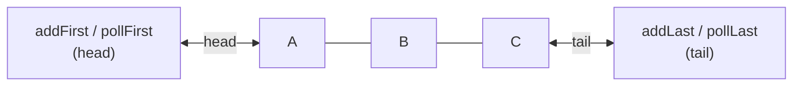
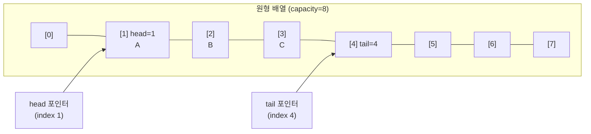

## 정의

**`java.util.Deque<E>`** (Double-Ended Queue) 는 [[Queue]] 의 확장 인터페이스. **양쪽 끝 (head, tail) 모두에서** add/remove/examine 이 가능한 자료구조.

JDK 1.6 도입. `Queue`, `Stack`, 일반 양 끝 연산을 모두 한 인터페이스로 통합한다.

## 시각화: Deque 구조



- **head**: Stack 의 top, Queue 의 front
- **tail**: Queue 의 back
- 양 방향 모두 O(1) 삽입/삭제 (구현체에 따라 다름)

## 메서드 매트릭스

| 위치 | insert (예외) | insert (특수값) | remove (예외) | remove (특수값) | examine |
|:---|:---|:---|:---|:---|:---|
| **head** | `addFirst(e)` | `offerFirst(e)` | `removeFirst()` | `pollFirst()` | `peekFirst()` |
| **tail** | `addLast(e)` | `offerLast(e)` | `removeLast()` | `pollLast()` | `peekLast()` |
| Queue alias | `add(e)` | `offer(e)` | `remove()` | `poll()` | `peek()` |
| Stack alias | `push(e)` | (= addFirst) | `pop()` | (= removeFirst) | `peek()` |

- `push` / `pop` 은 **head** (앞) 에 동작 → Stack 으로 쓸 때 head 가 top
- `offer` / `poll` 은 **tail 추가, head 제거** → FIFO Queue 동작

## 구현체 선택

| 구현 | 내부 구조 | 특징 |
|:---|:---|:---|
| **[[ArrayDeque]]** | 원형 배열 | **권장 기본**, null 불가, GC 친화 |
| **[[LinkedList]]** | 양방향 연결리스트 | null 허용, 메모리 많이 씀, 중간 삽입 O(1) |
| **[[ConcurrentLinkedDeque]]** | 이중 연결리스트 (lock-free) | thread-safe, non-blocking |
| **`LinkedBlockingDeque`** | 이중 연결리스트 | thread-safe + blocking, bounded 지원 |

> [!IMPORTANT]
> **새 코드의 Stack 은 `Deque<E> stack = new ArrayDeque<>()` 가 권장.** 레거시 `java.util.Stack` 은 `Vector` 상속이라 모든 메서드가 동기화돼 비효율적. 새 코드에서 `Stack` 클래스는 쓰지 말 것.

## 시각화: ArrayDeque 내부 (원형 배열)



- **head**: 다음에 꺼낼 인덱스
- **tail**: 다음에 넣을 인덱스
- `addFirst` 는 head 를 감소 (mod capacity), `addLast` 는 tail 를 증가
- 꽉 차면 2배 배열로 복사 (grow)

## Stack 패턴

```java
import java.util.ArrayDeque;
import java.util.Deque;

Deque<Integer> stack = new ArrayDeque<>();

stack.push(1);     // addFirst(1)
stack.push(2);     // addFirst(2)
stack.push(3);     // addFirst(3)

stack.peek();      // 3 (top, 제거 안 함)
stack.pop();       // 3 (removeFirst)
stack.pop();       // 2
stack.pop();       // 1
stack.pop();       // EmptyStackException 대신 NoSuchElementException

// 비어 있음 확인
boolean empty = stack.isEmpty();
```

## Queue 패턴 (FIFO)

```java
import java.util.ArrayDeque;
import java.util.Deque;
import java.util.Queue;

// Queue 인터페이스로 잡으면 FIFO 만 사용 가능
Queue<Integer> queue = new ArrayDeque<>();
queue.offer(1);
queue.offer(2);
queue.offer(3);

queue.peek();     // 1 (head, 제거 안 함)
queue.poll();     // 1
queue.poll();     // 2

// 또는 Deque 그대로 사용
Deque<Integer> deque = new ArrayDeque<>();
deque.offerLast(1);    // tail 에 추가
deque.offerLast(2);
deque.pollFirst();     // 1 (head 에서 제거)
```

## Palindrome 검사 (양쪽 끝 동시 비교)

```java
import java.util.ArrayDeque;
import java.util.Deque;

boolean isPalindrome(String s) {
    Deque<Character> deque = new ArrayDeque<>();
    for (char c : s.toCharArray()) deque.addLast(c);

    while (deque.size() > 1) {
        if (!deque.pollFirst().equals(deque.pollLast())) return false;
    }
    return true;
}

// 테스트
isPalindrome("racecar");   // true
isPalindrome("hello");     // false
```

## Java 17+ 실전: 슬라이딩 윈도우 최댓값

```java
import java.util.ArrayDeque;
import java.util.Deque;

// 크기 k 의 슬라이딩 윈도우에서 각 위치의 최댓값 (Monotonic Deque)
int[] maxSlidingWindow(int[] nums, int k) {
    int n = nums.length;
    int[] result = new int[n - k + 1];
    // deque 는 인덱스를 저장, 항상 감소 순서 유지
    Deque<Integer> deque = new ArrayDeque<>();

    for (int i = 0; i < n; i++) {
        // 윈도우 범위 밖 인덱스 제거
        while (!deque.isEmpty() && deque.peekFirst() < i - k + 1) {
            deque.pollFirst();
        }
        // 현재 원소보다 작은 후보 제거
        while (!deque.isEmpty() && nums[deque.peekLast()] < nums[i]) {
            deque.pollLast();
        }
        deque.offerLast(i);

        if (i >= k - 1) {
            result[i - k + 1] = nums[deque.peekFirst()];
        }
    }
    return result;
}

// maxSlidingWindow([3,1,4,1,5,9,2,6], 3) = [4,4,5,9,9,9]
```

## Java 17+ 실전: 수식 괄호 검사

```java
import java.util.ArrayDeque;
import java.util.Deque;
import java.util.Map;

boolean isBalanced(String expr) {
    Deque<Character> stack = new ArrayDeque<>();
    Map<Character, Character> pairs = Map.of(')', '(', ']', '[', '}', '{');

    for (char c : expr.toCharArray()) {
        if ("([{".indexOf(c) >= 0) {
            stack.push(c);
        } else if (pairs.containsKey(c)) {
            if (stack.isEmpty() || stack.pop() != pairs.get(c)) return false;
        }
    }
    return stack.isEmpty();
}
```

## ArrayDeque vs LinkedList 성능

```java
// ArrayDeque: 원형 배열 → 캐시 라인 친화, 객체 생성 최소화
Deque<Integer> arrayDeque = new ArrayDeque<>();

// LinkedList: 노드마다 힙 할당 → GC 부담, 캐시 미스
Deque<Integer> linkedList = new java.util.LinkedList<>();
```

| 항목 | ArrayDeque | LinkedList |
|:---|:---:|:---:|
| `addFirst` / `addLast` | amortized O(1) | O(1) |
| `pollFirst` / `pollLast` | O(1) | O(1) |
| 중간 삽입/삭제 | O(n) | O(1) (노드 보유 시) |
| 메모리 per 원소 | 낮음 (배열 슬롯) | 높음 (Node 객체) |
| null 허용 | ✗ | ✓ |
| 캐시 효율 | 높음 | 낮음 |
| 권장 상황 | 대부분 | 중간 삽입 多, null 필요 |

## LinkedBlockingDeque (blocking 패턴)

```java
import java.util.concurrent.LinkedBlockingDeque;

LinkedBlockingDeque<String> bq = new LinkedBlockingDeque<>(100);

// Producer
new Thread(() -> {
    try {
        bq.putLast("work item");    // 꽉 차면 block
    } catch (InterruptedException e) {
        Thread.currentThread().interrupt();
    }
}).start();

// Consumer
new Thread(() -> {
    try {
        String item = bq.takeFirst();   // 비어 있으면 block
        System.out.println("Got: " + item);
    } catch (InterruptedException e) {
        Thread.currentThread().interrupt();
    }
}).start();
```

## 함정

### 1. null 삽입 금지 (ArrayDeque)

```java
Deque<String> deque = new ArrayDeque<>();
deque.push(null);   // NullPointerException

// null 이 필요하면 LinkedList (비권장) 또는 Optional 래핑
```

### 2. Stack 클래스 사용 금지

```java
// 잘못: Stack 은 Vector 상속 (synchronized + 비효율)
java.util.Stack<Integer> stack = new java.util.Stack<>();

// 올바름: Deque 로 Stack 패턴
Deque<Integer> stack = new ArrayDeque<>();
```

### 3. poll vs pop 혼동

```java
Deque<Integer> d = new ArrayDeque<>();
d.push(1);

d.pop();    // 비어 있으면 NoSuchElementException
d.poll();   // 비어 있으면 null (예외 없음)
```

`pop()` 은 Queue/Deque 에서 예외 던지는 버전, `poll()` 은 특수값 반환 버전.

### 4. 동시성 주의

`ArrayDeque` 와 `LinkedList` 는 thread-safe 하지 않다. 동시성이 필요하면 [[ConcurrentLinkedDeque]] 또는 `LinkedBlockingDeque`.

### 5. Deque 를 Queue 로 쓸 때 메서드 혼용

```java
Deque<Integer> deque = new ArrayDeque<>();
deque.offer(1);       // tail 에 추가 (Queue 관행)
deque.addFirst(0);    // head 에 추가 (Deque)
deque.poll();         // head 에서 제거 (Queue = pollFirst)
```

코드 의도를 명확히 하려면 `Queue<E>` 인터페이스 타입으로 선언하거나, Stack/Queue 전용 메서드만 사용.

## 관련 위키

- [[Queue]]
- [[ArrayDeque]]
- [[LinkedList]]
- [[ConcurrentLinkedDeque]]
- [[BlockingQueue]]
- [[Collection]]
- [[Iterable]]
- [[Object]]
