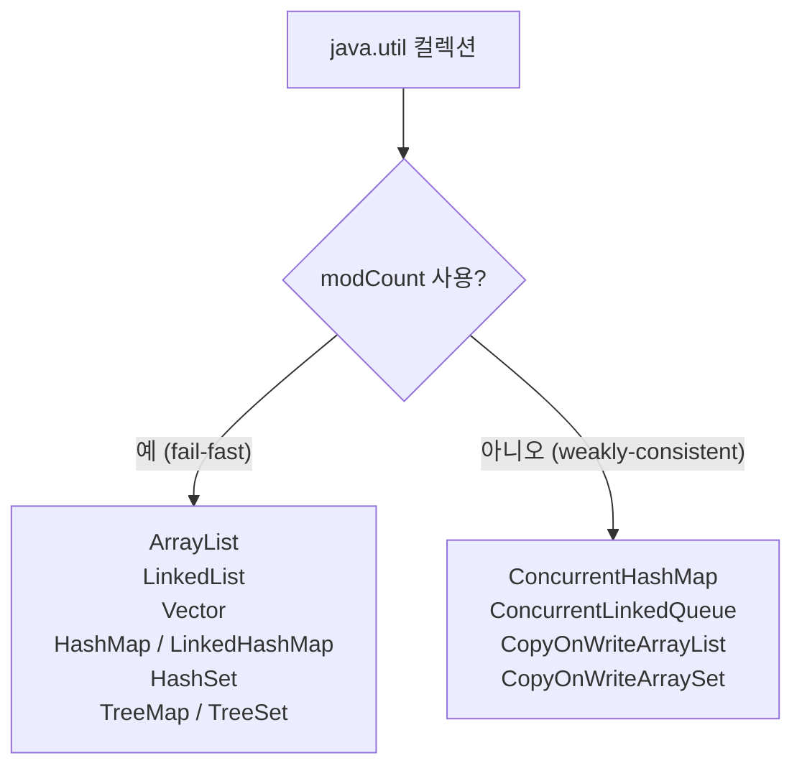
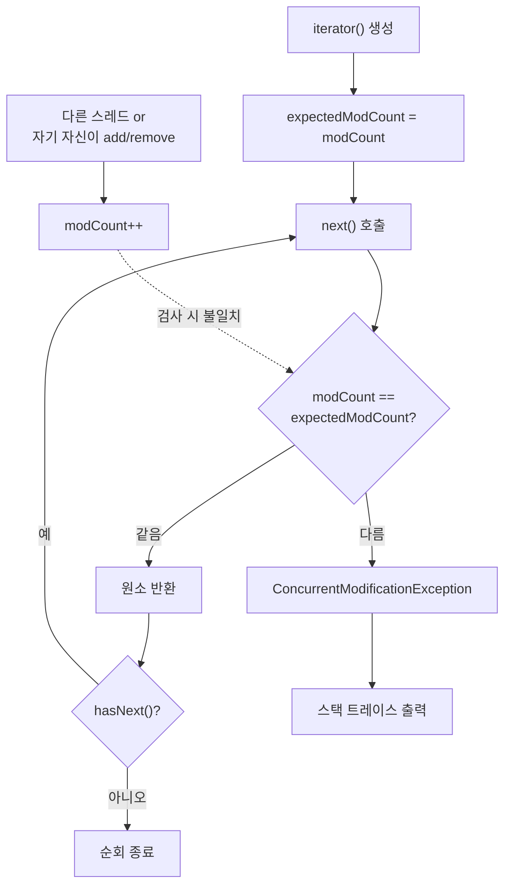

## 정의

**Fail-Fast Iterator** 는 **순회 도중 컬렉션의 구조가 변경되면 즉시 `ConcurrentModificationException` 을 던지는** iterator. [[List]], `Set`, `Map` 등 대부분의 `java.util` 컬렉션의 iterator 가 이 방식.

목적은 단순하다. **나중에 발견되면 디버깅이 끔찍하게 어려울 정합성 위배를, 가능한 가장 이른 시점에 노출** 시키는 것이다. 실패 자체를 빠르게 만든다는 뜻에서 fail-fast.

`java.util.concurrent` 의 컬렉션 ([[CopyOnWriteArrayList]], `ConcurrentHashMap`, `ConcurrentLinkedQueue` 등) 은 일부러 fail-fast 가 아닌 **weakly consistent / snapshot** iterator 를 쓴다.

## 사용 상황

Fail-Fast Iterator 는 직접 선택하는 것이 아니라, `java.util` 컬렉션을 사용할 때 **이미 내장** 되어 있다.

| 상황 | 영향 |
|:---|:---|
| for-each 루프 안에서 컬렉션 수정 | CME 발생 |
| iterator 도중 다른 스레드가 수정 | CME 발생 (best-effort) |
| `Iterator.remove()` 사용 | 안전 (modCount 동기화됨) |
| `Collection.removeIf()` 사용 | 안전 |
| `set()` 으로 값만 교체 | 안전 (구조 변경 아님) |

알아야 하는 이유: 실수로 순회 중 수정하면 CME 가 발생한다. 패턴을 알면 예방 가능.

## 메커니즘: modCount

`AbstractList`, [[ArrayList]], [[LinkedList]], [[Vector]], `HashMap` 등은 내부에 `modCount` 라는 정수 필드를 가진다.

```java
public abstract class AbstractList<E> extends AbstractCollection<E> implements List<E> {
    protected transient int modCount = 0;
    // 구조 변경 메서드마다 modCount++
}
```

- **구조 변경 (structural modification)** 이 일어날 때마다 `modCount++`
- iterator 생성 시 `expectedModCount = modCount` 로 스냅샷
- `next()`, `remove()` 등 호출마다 `expectedModCount == modCount` 검사
- 다르면 `throw new ConcurrentModificationException()`

```java
// ArrayList.Itr (단순화)
private class Itr implements Iterator<E> {
    int cursor;
    int lastRet = -1;
    int expectedModCount = modCount;   // 스냅샷

    public E next() {
        checkForComodification();      // 매번 검사
        // ... return element ...
    }

    final void checkForComodification() {
        if (modCount != expectedModCount)
            throw new ConcurrentModificationException();
    }
}
```

## modCount 사용 컬렉션



`java.util` 컬렉션은 모두 fail-fast, `java.util.concurrent` 컬렉션은 weakly-consistent 또는 snapshot.

## 구조 변경이란

`modCount` 가 증가하는 작업은 **컬렉션의 크기를 바꾸거나 내부 배열을 새로 할당하는** 작업.

- `add(E)`, `add(int, E)`, `addAll(...)`
- `remove(int)`, `remove(Object)`, `removeAll(...)`, `clear()`
- `ArrayList.trimToSize()`, `ensureCapacity(int)`
- `LinkedHashMap` 의 `put()` 으로 새 키 추가

**`set(int, E)` 처럼 기존 원소를 교체만 하는 작업은 구조 변경이 아니다.** 따라서 fail-fast 가 발생하지 않는다.

```java
List<Integer> list = new ArrayList<>(List.of(1, 2, 3));
for (Integer x : list) {
    list.set(0, 99);   // OK, 구조 변경 아님
}
```

## modCount 검사 흐름



## 트리거 예시

### 단일 스레드의 자기 수정

```java
List<Integer> list = new ArrayList<>(List.of(1, 2, 3, 4));
for (Integer x : list) {
    if (x == 2) list.remove(x);   // CME
}
```

순회 중 자기 자신을 수정해도 발생. **멀티스레드만의 문제가 아니다.**

### 안전한 패턴

```java
// 1. Iterator.remove() - modCount 와 expectedModCount 를 함께 갱신
Iterator<Integer> it = list.iterator();
while (it.hasNext()) {
    if (it.next() == 2) it.remove();   // 안전
}

// 2. Java 8+: Collection.removeIf - 내부에서 modCount 정합 유지
list.removeIf(x -> x == 2);

// 3. 복사본 순회 후 원본 수정
for (Integer x : new ArrayList<>(list)) {
    if (x == 2) list.remove(x);
}

// 4. Java 16+ Stream.toList() 로 필터링
List<Integer> filtered = list.stream()
    .filter(x -> x != 2)
    .toList();

// 5. Java 17+ record + stream (불변 처리)
record Item(int id, String name) {}
List<Item> items = new ArrayList<>(...);
List<Item> kept = items.stream()
    .filter(item -> item.id() != targetId)
    .toList();
items = new ArrayList<>(kept);
```

## 멀티스레드에서

다른 스레드가 add/remove 하면 `modCount` 가 증가, 내 iterator 가 다음 `next()` 에서 CME. 단, fail-fast 는 **best-effort 검사**, 절대 보장이 아니다.

> [!CAUTION]
> **fail-fast 가 CME 를 던지지 않는다고 해서 안전한 것은 아니다.** `modCount` 검사는 동기화 없이 수행되므로, 두 스레드가 동시에 수정/순회하면 `modCount` 조차 비정상 상태로 보일 수 있다. CME 가 발생하지 않은 채 잘못된 결과 (배열 인덱스 ArrayIndexOutOfBoundsException, NullPointerException, 무한 루프) 가 나올 수 있다.

진짜 동시성 안전이 필요하면 [[CopyOnWriteArrayList]] / `ConcurrentHashMap` 또는 외부 동기화.

## fail-fast vs weakly consistent vs snapshot

| 종류 | 컬렉션 | 동시 수정 시 동작 | 보는 데이터 |
|:---|:---|:---|:---|
| **fail-fast** | ArrayList, LinkedList, Vector, HashMap | CME 즉시 던짐 (best-effort) | 수정 전 상태 |
| **weakly consistent** | ConcurrentHashMap, ConcurrentLinkedQueue | 예외 없음, 순회 계속 | 일부 수정 반영 가능 |
| **snapshot** | CopyOnWriteArrayList, CopyOnWriteArraySet | 예외 없음, 순회 계속 | iterator 생성 시점 (이후 수정 안 보임) |

## 왜 fail-fast 인가

처음 보면 "왜 일부러 예외를 던지는 것이지?" 싶다. 대안 (silent corruption) 이 훨씬 무서운 디버깅 경험을 만들기 때문이다.

- **CME 가 없다면**: 순회가 무한 루프, 같은 원소 두 번 방문, 잘못된 인덱스 접근 등 진단 불가능한 증상으로 나타난다. 며칠을 디버깅하다 결국 다른 스레드가 컬렉션을 건드린 것을 발견.
- **CME 가 있으면**: 즉시 스택 트레이스로 위치 파악, 수정을 누가 했는지 추적 가능.

> [!IMPORTANT]
> CME 는 적이 아니다, 친구다. **CME 가 발생하면 코드의 동시성 가정이 틀렸다는 신호.** 무시하거나 catch 해서 삼키지 말고, 동시성 컬렉션을 쓰거나 동기화를 추가하라.

## 함정

### 1. Stream 에서 컬렉션 수정

```java
List<String> list = new ArrayList<>(List.of("a", "b", "c"));

// CME: Stream 내부가 iterator 를 사용
list.stream().forEach(s -> {
    if (s.equals("a")) list.remove(s);   // CME
});

// 올바름: removeIf 또는 stream + collect
list.removeIf("a"::equals);
```

### 2. for-each 는 iterator 의 syntactic sugar

```java
// 이것은
for (String s : list) { ... }

// 이것과 같다
Iterator<String> it = list.iterator();
while (it.hasNext()) {
    String s = it.next();   // checkForComodification()
    ...
}
```

`for-each` 안에서 `list.add()` / `list.remove()` 를 호출하면 내부 iterator 가 CME 를 던진다.

### 3. Lambda 로 외부 컬렉션 캡처 후 수정

```java
List<String> result = new ArrayList<>();
List<String> input = new ArrayList<>(List.of("a", "b", "c"));

// CME: forEach 도중 input 을 수정
input.forEach(s -> {
    result.add(s.toUpperCase());
    input.remove(s);   // CME
});
```

순회 중에는 읽기만 해야 한다. 별도 컬렉션에 결과를 모으고, 순회 완료 후 처리.

### 4. subList / entrySet 수정

`list.subList(1, 3)` 은 원본 리스트의 뷰. subList 수정 시 원본 `modCount` 가 증가해 원본 iterator 가 CME.

## AbstractList.modCount 상속 체계

`modCount` 는 `AbstractList` 에 정의되어 있고, 이를 상속하는 모든 컬렉션이 함께 사용한다.

```java
// AbstractList
protected transient int modCount = 0;

// ArrayList 의 add 구현 (단순화)
public boolean add(E e) {
    modCount++;           // 구조 변경 기록
    add(e, elementData, size);
    return true;
}

// LinkedList, Vector, HashMap 의 iterator 도 동일한 패턴
// TreeMap 은 AbstractMap 경유지만 비슷한 modCount 로직 보유
```

`HashMap.entrySet().iterator()`, `HashSet.iterator()` 도 내부적으로 `HashMap.modCount` 를 관찰한다. `HashMap` 에 put/remove 하는 동안 `entrySet` 을 순회하면 CME.

## Java 21 Sequenced Collections

Java 21 에서 도입된 `SequencedCollection` 인터페이스는 순서가 있는 컬렉션에 `reversed()` 뷰를 제공한다.

```java
// Java 21+
SequencedCollection<String> seq = new ArrayList<>(List.of("a", "b", "c"));
SequencedCollection<String> rev = seq.reversed();

// reversed() 는 원본의 live view, 원본 수정 시 반영됨
// 단, reversed() 를 순회하는 도중 원본 수정 -> CME
for (String s : rev) {
    seq.add("x");   // CME
}
```

`reversed()` 뷰의 iterator 도 fail-fast 다.

## 관련 위키

- [[ConcurrentModificationException]]
- [[List]]
- [[ArrayList]]
- [[LinkedList]]
- [[Vector]]
- [[CopyOnWriteArrayList]]
- Joshua Bloch, *Effective Java* (3rd ed.), Item 80
- Brian Goetz, *Java Concurrency in Practice*, §5.1.2 Iterators and ConcurrentModificationException
