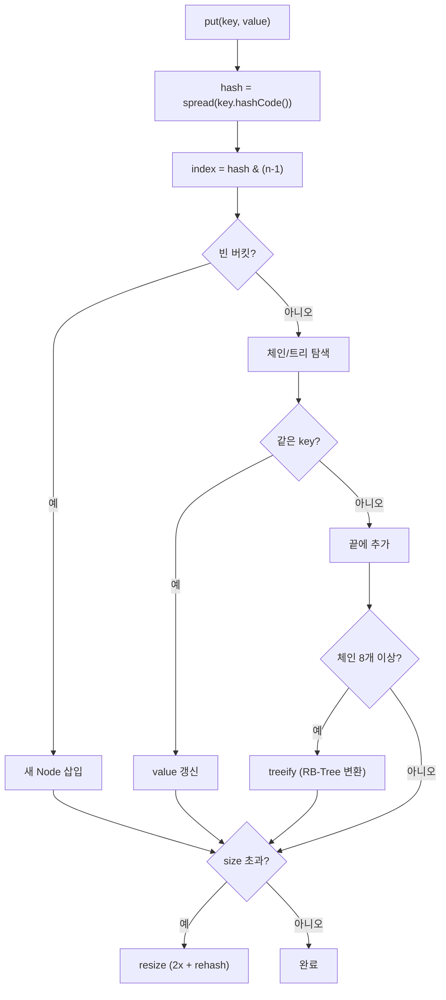

## 정의

**`java.util.HashMap<K,V>`** 는 **해시 테이블** 로 구현된 [[Map]]. 평균 O(1) 의 put/get/remove 를 보장하고 단일 스레드 환경의 사실상 표준.

JDK 1.2 도입, Java 8 에서 **충돌 시 linked list → red-black tree 로 자동 변환** 하는 큰 개선이 있었다.

## 시각화

```anim:java-hashmap-chaining
{}
```

## 내부 구조

```java
public class HashMap<K,V> extends AbstractMap<K,V>
    implements Map<K,V>, Cloneable, Serializable {

    transient Node<K,V>[] table;          // 버킷 배열
    transient int size;
    int threshold;                         // capacity * loadFactor
    final float loadFactor;                // 기본 0.75

    static class Node<K,V> implements Map.Entry<K,V> {
        final int hash;
        final K key;
        V value;
        Node<K,V> next;                    // chaining (linked list)
    }
}
```

- **`table`**: 버킷 배열, 기본 길이 16, 2^n 형태로 grow
- **`Node`**: linked list 의 노드
- **Java 8+**: 한 버킷의 노드가 **8 개 이상** 이면 `TreeNode` (red-black tree) 로 변환 → **64 미만** 이면 다시 list

## put 의 흐름

1. `hash = key.hashCode()` 후 spread (상위 16비트 XOR)
2. `index = (table.length - 1) & hash`
3. 버킷이 비어 있으면 → 새 Node 삽입
4. 같은 key 가 있으면 → 값 교체
5. 충돌 → linked list 끝에 append (또는 tree 에 insert)
6. `size > threshold` → resize (2x grow + rehash)

```java
public V put(K key, V value) {
    int h = spread(key.hashCode());
    int i = (table.length - 1) & h;
    Node<K,V> first = table[i];
    if (first == null) {
        table[i] = new Node<>(h, key, value, null);
    } else {
        // chain 순회, 같은 key 발견 시 교체
        // 끝에 도달하면 append, 8 개 이상이면 treeify
    }
    if (++size > threshold) resize();
    return null;
}
```

## put 흐름 다이어그램



## 충돌 처리, chaining 과 treeify

같은 버킷에 여러 key 가 매핑되면 (해시 충돌):

- **TREEIFY_THRESHOLD = 8**: 한 버킷에 8 노드 이상이면 tree 로 변환 (단, table 크기가 64 이상일 때만)
- **UNTREEIFY_THRESHOLD = 6**: tree 가 6 노드 이하로 줄면 다시 list
- **MIN_TREEIFY_CAPACITY = 64**: table 이 작을 때는 resize 가 우선

tree 로 변환되면 그 버킷의 최악 검색이 O(log n). 악의적 hash collision (수많은 입력이 같은 hash) 으로부터 보호.

## 복잡도

| 작업 | 평균 | 최악 (Java 8+) | 최악 (Java 7 이전) |
|:---|:---:|:---:|:---:|
| `get`, `put`, `remove` | O(1) | O(log n) | O(n) |
| `containsValue` | O(n) | O(n) | O(n) |
| iterator 순회 | O(n + capacity) | 같음 | 같음 |

`containsKey` 의 평균이 O(1) 인 이유는 해시 충돌이 적기 때문. 충돌이 폭주하지 않으려면 `equals`/`hashCode` 가 잘 분포해야 한다.

## load factor 와 resize

- **`loadFactor`** (기본 0.75): `size / capacity` 가 이를 초과하면 resize
- **`resize()`**: table 길이를 2 배로 늘리고 모든 entry 를 새 위치로 rehash. **O(n)** 비용.

생성 시 초기 capacity 지정으로 미리 줄일 수 있다.

```java
// 1000 개 entry 예상 → capacity 가 1000 / 0.75 ≈ 1334 보다 커야 resize 안 함
Map<String, Integer> map = new HashMap<>(2048);
```

## null 허용

`HashMap` 은 **key 와 value 모두 null 허용**. key 가 null 이면 항상 버킷 0 에 매핑.

```java
map.put(null, 1);              // OK
map.put("a", null);            // OK
map.get(null);                 // 1
```

[[ConcurrentHashMap]] 과의 가장 큰 차이.

## hashCode 품질이 성능에 미치는 영향

`spread()` 함수 (`h ^ (h >>> 16)`) 는 hashCode 의 상위 비트를 하위로 섞어 충돌을 줄이지만, **key 의 hashCode 자체가 잘 분포**해야 최적이다.

```java
// 나쁜 예: 같은 접두사를 가진 String 이 한 버킷에 몰릴 수 있음
// → Effective Java Item 11 의 hashCode 구현 원칙 따르기

// Java 17+ record 는 자동으로 필드 기반 hashCode 생성
record Point(int x, int y) {}  // hashCode = Objects.hash(x, y) 와 유사
```

의심스러우면 `map.entrySet().stream().collect(Collectors.groupingBy(..., Collectors.counting()))` 으로 버킷 분포 직접 확인.

## Java 8+ 개선: forEach, replaceAll, computeIfAbsent

```java
Map<String, List<String>> groups = new HashMap<>();

// 기존 방식 (verbose)
if (!groups.containsKey(key)) groups.put(key, new ArrayList<>());
groups.get(key).add(value);

// Java 8+ computeIfAbsent (원자적)
groups.computeIfAbsent(key, k -> new ArrayList<>()).add(value);

// merge: 키가 없으면 값 삽입, 있으면 함수 적용
Map<String, Integer> counter = new HashMap<>();
counter.merge("word", 1, Integer::sum);   // 단어 카운터

// replaceAll: 모든 값에 함수 적용
counter.replaceAll((k, v) -> v * 2);
```

> [!IMPORTANT]
> `computeIfAbsent` 의 람다는 **해당 엔트리가 없을 때만** 실행. `putIfAbsent(key, expensiveObj())` 와 달리 비용이 발생하지 않는다.

## 실전 패턴

### 단어 빈도 카운터

```java
// Java 17+
String[] words = text.split("\\s+");
Map<String, Long> freq = Arrays.stream(words)
    .collect(Collectors.groupingBy(w -> w, Collectors.counting()));
```

### 그룹핑 (multimap)

```java
record Person(String name, String dept) {}

Map<String, List<Person>> byDept = new HashMap<>();
people.forEach(p ->
    byDept.computeIfAbsent(p.dept(), k -> new ArrayList<>()).add(p)
);
```

### 캐시 (단일 스레드)

```java
private final Map<String, Data> cache = new HashMap<>();

Data getData(String key) {
    return cache.computeIfAbsent(key, this::loadFromDb);
}
```

멀티스레드 환경이라면 [[ConcurrentHashMap]] 의 `computeIfAbsent` 사용.

## 함정

### 1. 가변 객체를 key 로 쓰면 안 됨

```java
Map<List<Integer>, String> map = new HashMap<>();
List<Integer> key = new ArrayList<>(List.of(1, 2));
map.put(key, "v");
key.add(3);                      // hashCode 변경
map.get(key);                    // null! (다른 버킷으로 가게 됨)
```

**불변 객체** (String, Integer, Long, Enum, record) 를 key 로 사용 권장.

### 2. equals 만 override 하고 hashCode 안 함

[[Object]] 의 규약 위반. HashMap 이 조용히 잘못 동작.

### 3. 동시 수정

`HashMap` 은 thread-safe 가 아니다. 동시 put 으로 **무한 루프** 가 발생한 사례가 유명 (특히 Java 7 의 resize 중 chain 역전 버그). [[ConcurrentHashMap]] 사용.

### 4. iterator 는 [[fail-fast iterator]]

순회 중 수정 → [[ConcurrentModificationException]].

### 5. 초기 capacity 계산 실수

```java
// 잘못: capacity = 1000 은 실제로 약 750개 entry 에 resize 발생
Map<String, String> map = new HashMap<>(1000);

// 올바름: entry 수 / loadFactor 를 올림
int expectedSize = 1000;
Map<String, String> map2 = new HashMap<>((int)(expectedSize / 0.75f) + 1);
```

## JMM 와 동시성

`HashMap` 은 스레드 안전하지 않다. JMM 관점에서:

- 한 스레드가 `put` 하는 동안 다른 스레드가 `get` 하면 **부분 쓰기** 상태를 볼 수 있음
- 특히 `resize()` 중 `table` 배열 교체가 non-atomic 이라 **다른 스레드가 새 table / 구 table 섞인 view** 를 볼 수 있음
- Java 7 의 resize 버그: 링크드 리스트 역전으로 **무한 루프** 가능 (Java 8 에서 수정됐으나 여전히 unsafe)

## HashMap vs Hashtable vs ConcurrentHashMap

| 항목 | HashMap | Hashtable | ConcurrentHashMap |
|:---|:---:|:---:|:---:|
| Thread-safe | ✗ | ✓ (메서드) | ✓ (bin-level) |
| null key/value | ✓ | ✗ | ✗ |
| 도입 | JDK 1.2 | JDK 1.0 (legacy) | JDK 1.5 |
| 성능 | 가장 빠름 | 느림 (전체 락) | 동시성 최적 |
| 권장 | 단일 스레드 | 절대 X | 동시성 |

## 관련 위키

- [[Object]]
- [[Iterable]]
- [[Collection]]
- [[Map]]
- [[LinkedHashMap]]
- [[TreeMap]]
- [[ConcurrentHashMap]]
- [[fail-fast iterator]]
- [[ConcurrentModificationException]]
- Joshua Bloch, *Effective Java* (3rd ed.), Items 10-11 (equals, hashCode)
