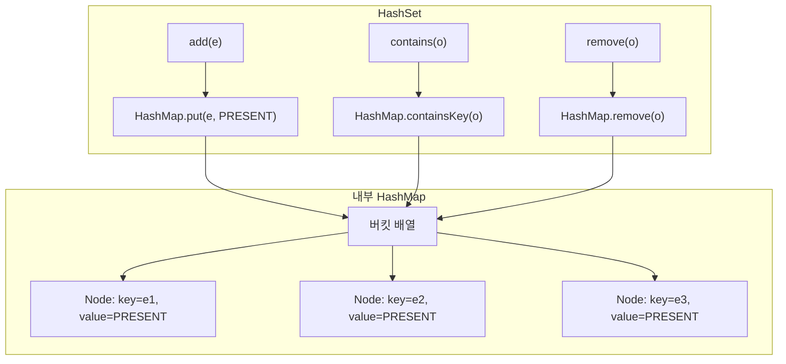

## 정의

**`java.util.HashSet<E>`** 는 [[HashMap]] 을 백킹으로 사용하는 [[Set]] 구현. 내부적으로 모든 원소를 `HashMap` 의 key 로 저장하고, value 는 dummy 상수 `PRESENT` 로 채운다.

- 평균 O(1) 의 `add`/`remove`/`contains`
- 순서 보장 없음 (삽입 순서, 정렬 순서 모두 아님)
- null 원소 하나 허용
- thread-safe 하지 않음

JDK 1.2 도입. Java 컬렉션 프레임워크에서 가장 흔히 쓰이는 Set 구현.

## 언제 쓰나

- **중복 제거**: 리스트에서 중복 원소를 빠르게 제거할 때
- **멤버십 검사**: "이 값이 집합에 있는가?" 를 O(1) 로 확인
- **집합 연산**: 교집합, 합집합, 차집합 (단일 스레드)
- **방문 여부 추적**: BFS/DFS 에서 방문한 노드 기록
- 순서가 필요 없고 빠른 조회가 우선일 때

## 시각화: HashMap 기반 구조



## 내부 구조

```java
public class HashSet<E> extends AbstractSet<E>
        implements Set<E>, Cloneable, Serializable {

    private transient HashMap<E, Object> map;

    // 모든 원소의 value 로 사용되는 dummy 객체
    private static final Object PRESENT = new Object();

    public HashSet() {
        map = new HashMap<>();
    }

    // 초기 capacity 와 loadFactor 지정 가능
    public HashSet(int initialCapacity, float loadFactor) {
        map = new HashMap<>(initialCapacity, loadFactor);
    }

    public boolean add(E e) {
        return map.put(e, PRESENT) == null;
        // map.put 이 null 반환 = 새로 삽입됨 = true
        // map.put 이 PRESENT 반환 = 이미 있었음 = false
    }

    public boolean contains(Object o) {
        return map.containsKey(o);
    }

    public boolean remove(Object o) {
        return map.remove(o) == PRESENT;
    }

    public Iterator<E> iterator() {
        return map.keySet().iterator();
    }

    public int size() {
        return map.size();
    }
}
```

`HashMap` 의 모든 동작과 성능 특성을 그대로 물려받는다. capacity/loadFactor, treeify 같은 내용은 [[HashMap]] 참고.

## 복잡도

| 작업 | 평균 | 최악 (Java 8+) |
|:---|:---:|:---:|
| `add(e)` | O(1) | O(log n) |
| `contains(o)` | O(1) | O(log n) |
| `remove(o)` | O(1) | O(log n) |
| 순회 | O(n + capacity) | 같음 |
| `size()` | O(1) | O(1) |

최악 O(log n) 은 Java 8 에서 도입된 treeify (버킷 내 노드 8개 이상 시 red-black tree 변환) 덕분. Java 7 이전은 최악 O(n).

## equals / hashCode 규약

`HashSet` 의 정확한 동작은 원소의 `equals` 와 `hashCode` 구현에 달려 있다.

**규약**: `a.equals(b)` 이면 반드시 `a.hashCode() == b.hashCode()`.

```java
// Java 17+ record: equals/hashCode 자동 생성
record Point(int x, int y) {}

Set<Point> points = new HashSet<>();
points.add(new Point(1, 2));
points.add(new Point(1, 2));   // 중복 → 추가 안 됨
points.size();                  // 1

// 일반 클래스: 직접 구현 필요
class BadPoint {
    int x, y;
    BadPoint(int x, int y) { this.x = x; this.y = y; }
    // equals/hashCode 없음 → 참조 동등성 사용
}

Set<BadPoint> bad = new HashSet<>();
bad.add(new BadPoint(1, 2));
bad.add(new BadPoint(1, 2));   // 다른 참조 → 중복 허용됨
bad.size();                     // 2 (기대: 1)
```

> [!IMPORTANT]
> `equals` 만 override 하고 `hashCode` 를 override 하지 않으면 `HashSet` 이 잘못 동작한다. 두 객체가 `equals` 로 같아도 `hashCode` 가 다르면 다른 버킷에 들어가 중복 허용.

## null 허용

원소 하나는 null 가능 (`HashMap` 의 null key 처럼).

```java
Set<String> s = new HashSet<>();
s.add(null);                     // OK
s.add(null);                     // false (이미 있음)
s.contains(null);                // true
s.remove(null);                  // true

// Set.of() 는 null 비허용
Set<String> immutable = Set.of("a", null);   // NullPointerException
```

## Java 17+ 실전: 중복 제거

```java
import java.util.HashSet;
import java.util.List;
import java.util.Set;

// 리스트에서 중복 제거 (순서 무관)
List<String> words = List.of("apple", "banana", "apple", "cherry", "banana");
Set<String> unique = new HashSet<>(words);
// unique = {apple, banana, cherry} (순서 불정)

// Stream 으로 중복 제거 후 리스트 반환
List<String> deduped = words.stream()
    .distinct()
    .toList();   // Java 16+
```

## Java 17+ 실전: 집합 연산

```java
import java.util.HashSet;
import java.util.Set;

Set<Integer> a = new HashSet<>(List.of(1, 2, 3, 4));
Set<Integer> b = new HashSet<>(List.of(3, 4, 5, 6));

// 합집합 (union)
Set<Integer> union = new HashSet<>(a);
union.addAll(b);           // {1, 2, 3, 4, 5, 6}

// 교집합 (intersection)
Set<Integer> inter = new HashSet<>(a);
inter.retainAll(b);        // {3, 4}

// 차집합 (difference)
Set<Integer> diff = new HashSet<>(a);
diff.removeAll(b);         // {1, 2}

// 대칭 차집합 (symmetric difference)
Set<Integer> symDiff = new HashSet<>(union);
symDiff.removeAll(inter);  // {1, 2, 5, 6}
```

## Java 17+ 실전: BFS 방문 추적

```java
import java.util.*;

// 그래프 BFS (방문 여부 O(1) 확인)
List<Integer> bfs(Map<Integer, List<Integer>> graph, int start) {
    Set<Integer> visited = new HashSet<>();
    Queue<Integer> queue = new ArrayDeque<>();
    List<Integer> order = new ArrayList<>();

    queue.add(start);
    visited.add(start);

    while (!queue.isEmpty()) {
        int node = queue.poll();
        order.add(node);
        for (int neighbor : graph.getOrDefault(node, List.of())) {
            if (visited.add(neighbor)) {   // add 가 true = 처음 방문
                queue.add(neighbor);
            }
        }
    }
    return order;
}
```

## LinkedHashSet: 삽입 순서 유지

`LinkedHashSet` 은 `HashSet` 의 서브클래스로, 내부적으로 [[LinkedHashMap]] 을 사용해 **삽입 순서를 유지**한다.

```java
import java.util.LinkedHashSet;
import java.util.Set;

Set<String> linked = new LinkedHashSet<>();
linked.add("banana");
linked.add("apple");
linked.add("cherry");
linked.add("apple");   // 중복, 무시

System.out.println(linked);   // [banana, apple, cherry] (삽입 순서)

// HashSet 은 순서 불정
Set<String> hash = new HashSet<>(linked);
System.out.println(hash);     // [apple, banana, cherry] 또는 다른 순서
```

`LinkedHashSet` 의 성능은 `HashSet` 과 거의 동일하지만, 이중 연결 리스트 유지 비용으로 약간의 메모리/시간 오버헤드가 있다.

## HashSet vs LinkedHashSet vs TreeSet

| 항목 | HashSet | LinkedHashSet | TreeSet |
|:---|:---:|:---:|:---:|
| 백킹 구조 | HashMap | LinkedHashMap | TreeMap |
| 순서 | 없음 | 삽입 순서 | 정렬 순서 |
| `add`/`contains` | O(1) avg | O(1) avg | O(log n) |
| null 허용 | ✓ | ✓ | ✗ |
| Range 쿼리 | ✗ | ✗ | ✓ |
| Thread-safe | ✗ | ✗ | ✗ |
| 메모리 | 기준 | 약간 더 | 더 많음 |

## 초기 capacity 최적화

```java
// 1000 개 원소 예상 → capacity 가 1000 / 0.75 ≈ 1334 보다 커야 resize 안 함
Set<String> set = new HashSet<>(2048);

// Guava 스타일 (Java 표준 없음)
// int capacity = (int)(expectedSize / 0.75f) + 1;
Set<String> optimized = new HashSet<>((int)(1000 / 0.75f) + 1);
```

## 함정

### 1. 가변 객체를 원소로

```java
Set<List<Integer>> set = new HashSet<>();
List<Integer> key = new ArrayList<>(List.of(1, 2));
set.add(key);
key.add(3);                  // hashCode 변경
set.contains(key);           // false! (다른 버킷으로 이동)
set.size();                  // 1 이지만 찾을 수 없음
```

**불변 객체** (String, Integer, record) 를 원소로 사용 권장.

### 2. equals 만 override, hashCode 미구현

[[Object]] 의 규약 위반. `HashSet` 이 조용히 잘못 동작.

### 3. thread-safe 가 아님

동시 수정 시 데이터 손상. 동시성 필요 시:

```java
// 옵션 1: Collections.synchronizedSet (복합 연산은 외부 동기화 필요)
Set<String> sync = Collections.synchronizedSet(new HashSet<>());

// 옵션 2: ConcurrentHashMap.newKeySet (권장)
Set<String> concurrent = ConcurrentHashMap.newKeySet();
```

### 4. iterator 는 [[fail-fast iterator]]

```java
Set<Integer> set = new HashSet<>(Set.of(1, 2, 3));
for (Integer x : set) {
    set.add(4);   // ConcurrentModificationException
}
```

순회 중 수정은 `removeIf` 또는 별도 컬렉션에 모아 처리.

### 5. 순회 비용: O(n + capacity)

```java
// 초기 capacity 가 크면 순회 비용 증가
Set<String> set = new HashSet<>(1_000_000);
set.add("only-one");
// iterator 는 1,000,000 개 버킷을 모두 스캔
```

원소가 적고 capacity 가 크면 순회가 느리다. `trimToSize()` 에 해당하는 메서드는 없으므로 처음부터 적절한 capacity 를 지정.

## 관련 위키

- [[Set]]
- [[HashMap]]
- [[LinkedHashMap]]
- [[TreeSet]]
- [[Collection]]
- [[Iterable]]
- [[Object]]
- [[ConcurrentHashMap]]
- [[fail-fast iterator]]
- [[ConcurrentModificationException]]
