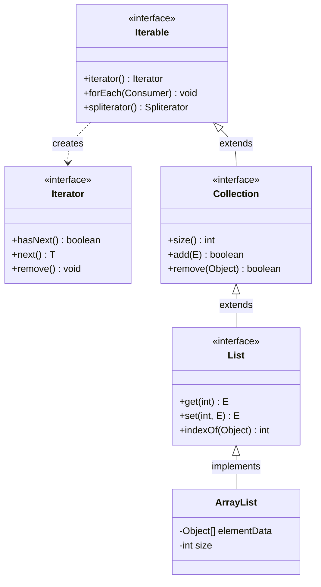

## 정의

**`java.lang.Iterable<T>`** 는 **`for-each` 루프로 순회 가능한 모든 타입의 최상위 인터페이스**. 단 하나의 추상 메서드, `iterator()` 를 정의한다.

```java
public interface Iterable<T> {
    Iterator<T> iterator();

    default void forEach(Consumer<? super T> action) { ... }
    default Spliterator<T> spliterator() { ... }
}
```

[[Collection]] 인터페이스가 `Iterable` 을 extends 하므로 [[ArrayList]], [[LinkedList]], `HashSet`, `LinkedList` 등 모든 컬렉션이 자동으로 `for-each` 대상이 된다. **컬렉션이 아닌 사용자 정의 타입** 도 `Iterable` 만 구현하면 같은 문법으로 순회 가능.

## for-each 문의 desugaring

```java
for (String s : myIterable) {
    System.out.println(s);
}
```

위 코드는 컴파일 시 아래로 변환된다.

```java
Iterator<String> $it = myIterable.iterator();
while ($it.hasNext()) {
    String s = $it.next();
    System.out.println(s);
}
```

즉 `for-each` 는 **단순히 `iterator()` 호출 + `hasNext()` / `next()` 패턴의 문법 설탕**. 배열의 경우는 컴파일러가 인덱스 기반 `for` 로 변환 (배열은 `Iterable` 이 아님, 특별 케이스).

## Iterator 인터페이스

`Iterable.iterator()` 가 반환하는 객체는 `Iterator<E>` 를 구현해야 한다.

```java
public interface Iterator<E> {
    boolean hasNext();         // 다음 원소가 있는가
    E next();                  // 다음 원소를 반환, 커서 전진
    default void remove() { ... }  // 마지막에 반환한 원소를 삭제 (선택)
    default void forEachRemaining(Consumer<? super E> action) { ... }
}
```

3가지 약속:
1. **`hasNext()` 가 true 인 동안에만 `next()` 호출 가능**, 아니면 `NoSuchElementException`
2. **`remove()` 는 직전 `next()` 호출이 있어야** 호출 가능, 아니면 `IllegalStateException`
3. **`remove()` 두 번 연속 호출 금지**, 다음 `next()` 가 있어야 다시 가능

## 계층 구조

`Iterable` 이 최상위에 있고 `Collection`, `List`, 구체 클래스 순으로 상속된다.



`Iterable` 자체는 컬렉션이 아니다. 크기(`size()`), 추가(`add()`), 삭제(`remove()`) 를 정의하는 것은 `Collection` 부터다. 따라서 커스텀 타입이 순회만 필요하다면 `Iterable` 만 구현해도 충분하다.

## 사용자 정의 Iterable

`Iterable` 구현은 매우 간단하다. 예: 1 부터 N 까지 정수를 순회하는 타입.

```java
public class Range implements Iterable<Integer> {
    private final int end;

    public Range(int end) { this.end = end; }

    @Override
    public Iterator<Integer> iterator() {
        return new Iterator<>() {
            int i = 1;
            @Override public boolean hasNext() { return i <= end; }
            @Override public Integer next() {
                if (!hasNext()) throw new NoSuchElementException();
                return i++;
            }
        };
    }
}

// 사용
for (int x : new Range(5)) {
    System.out.println(x);   // 1, 2, 3, 4, 5
}
```

## 기본 메서드 두 가지

### `forEach(Consumer)`

Java 8 부터 추가. 람다와 함께 더 간결.

```java
list.forEach(System.out::println);
list.forEach(x -> log.info("item: {}", x));
```

내부적으로 `iterator()` 사용. 따라서 [[fail-fast iterator]] 의 영향을 받는다 (수정 중이면 CME).

### `spliterator()`

Java 8 부터 추가. Stream / 병렬 처리를 위해 컬렉션을 분할 가능한 형태로 노출.

```java
list.spliterator();          // 단일 spliterator
list.stream();               // Stream API 의 입구
list.parallelStream();       // 병렬 Stream
```

대부분의 사용자가 직접 `spliterator()` 를 호출할 일은 없다. Stream API 가 알아서 사용.

## Iterable vs Collection vs Stream

| | Iterable | Collection | Stream |
|:---|:---|:---|:---|
| **크기 알 수 있나** | 보장 안 됨 | `size()` 있음 | 보장 안 됨 |
| **재사용 가능한가** | ✓ (여러 번 iterator 생성 가능) | ✓ | ✗ (1회 소비) |
| **수정 가능한가** | 정의 안 함 | add/remove 정의 | ✗ (불변 파이프라인) |
| **무한 가능한가** | ✓ | ✗ | ✓ |
| **상위 관계** | 최상위 | extends Iterable | 별도 인터페이스 |

> [!IMPORTANT]
> **`Iterable` 은 크기와 무한성에 대한 약속이 없다.** 무한 시퀀스를 `Iterable` 로 모델링해도 합법. 다만 `for-each` 가 영원히 안 끝나니 break 가 필요. 대안으로 `Stream` 의 `limit(n)` / `takeWhile` 이 더 명확.

## 무한 Iterable 의 예

피보나치 수열을 무한 시퀀스로:

```java
public class Fibonacci implements Iterable<Long> {
    @Override
    public Iterator<Long> iterator() {
        return new Iterator<>() {
            long a = 0, b = 1;
            @Override public boolean hasNext() { return true; }  // 무한
            @Override public Long next() {
                long r = a;
                long next = a + b;
                a = b; b = next;
                return r;
            }
        };
    }
}

// 사용
for (long x : new Fibonacci()) {
    if (x > 1000) break;
    System.out.println(x);
}
```

`Iterable` 의 강점은 이런 lazy / 무한 시퀀스도 자연스럽게 표현되는 점.

## Iterable 조합 패턴

### 여러 컬렉션 이어 순회

두 `List` 를 이어서 순회하는 `ConcatIterable`:

```java
public class ConcatIterable<T> implements Iterable<T> {
    private final Iterable<T> first;
    private final Iterable<T> second;

    public ConcatIterable(Iterable<T> first, Iterable<T> second) {
        this.first = first;
        this.second = second;
    }

    @Override
    public Iterator<T> iterator() {
        return new Iterator<>() {
            final Iterator<T> a = first.iterator();
            final Iterator<T> b = second.iterator();

            @Override public boolean hasNext() { return a.hasNext() || b.hasNext(); }
            @Override public T next() {
                if (a.hasNext()) return a.next();
                return b.next();
            }
        };
    }
}

// 사용
Iterable<String> all = new ConcatIterable<>(list1, list2);
for (String s : all) { System.out.println(s); }
```

### 필터 순회

조건을 만족하는 원소만 순회하는 `FilterIterable`:

```java
public class FilterIterable<T> implements Iterable<T> {
    private final Iterable<T> source;
    private final Predicate<T> pred;

    public FilterIterable(Iterable<T> source, Predicate<T> pred) {
        this.source = source;
        this.pred = pred;
    }

    @Override
    public Iterator<T> iterator() {
        return new Iterator<>() {
            final Iterator<T> it = source.iterator();
            T next = null;
            boolean found = false;

            private void advance() {
                while (it.hasNext()) {
                    T v = it.next();
                    if (pred.test(v)) { next = v; found = true; return; }
                }
                found = false;
            }

            { advance(); }  // 초기화 블록

            @Override public boolean hasNext() { return found; }
            @Override public T next() {
                T r = next; advance(); return r;
            }
        };
    }
}
```

> [!NOTE]
> `Stream.filter()` 가 같은 역할을 더 간결하게 수행하지만, `Iterable` 구현체는 `for-each` 루프에서 직접 쓸 수 있고 `Stream` 처럼 1회 소비 제한이 없다는 장점이 있다.

## Stream 으로 변환

`Iterable` 을 `Stream` 으로 바꾸는 표준 방법:

```java
Iterable<String> it = ...;
Stream<String> stream = StreamSupport.stream(it.spliterator(), false);
```

`false` 는 순차 스트림, `true` 는 병렬. Iterable 이 spliterator() 의 기본 구현을 갖고 있어 가능.

## 자주 만나는 함정

### 1. iterator() 가 매번 새 인스턴스를 반환해야 함

```java
// ❌ 잘못된 구현 - iterator 를 캐시
public class BadIterable<T> implements Iterable<T> {
    private final Iterator<T> it;  // 단 하나 보관
    @Override public Iterator<T> iterator() { return it; }
}
// → for-each 두 번 돌리면 두 번째에서 hasNext() == false
```

매 `iterator()` 호출이 새 인스턴스를 반환해야 다회 순회가 가능.

### 2. `for-each` 안에서 수정 → CME

```java
List<Integer> list = new ArrayList<>(List.of(1, 2, 3));
for (Integer x : list) {
    list.add(4);  // ❌ ConcurrentModificationException
}
```

[[ConcurrentModificationException]] 참조.

### 3. `next()` 의 결과를 두 번 부르면 두 원소가 진행됨

```java
Iterator<Integer> it = list.iterator();
if (it.next() > 0 || it.next() > 0) { ... }
//   ^^^^^^^^^^      ^^^^^^^^^^
//   첫 원소         두 번째 원소 (의도와 다를 수 있음)
```

`it.next()` 는 부수효과 (커서 전진) 가 있다. 한 번만 부르고 변수에 저장하라.

## 참고

- [[Object]]
- [[Collection]]
- [[List]]
- [[fail-fast iterator]]
- [[ConcurrentModificationException]]
