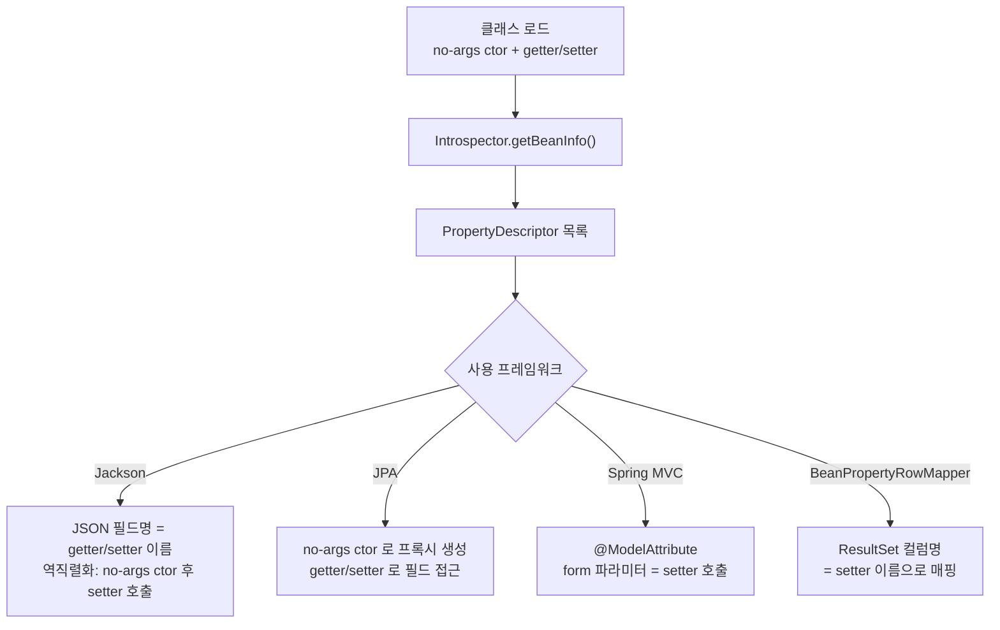

## 정의

**JavaBean** 은 다음 세 가지 규약을 만족하는 클래스:

1. **public no-args constructor** (인자 없는 public 생성자)
2. **프로퍼티 접근자**: `getX()`/`setX()` 명명 규칙
3. **Serializable** 구현 (선택, 일부 컨텍스트에서 필수)

원래는 1996 년 데스크톱 컴포넌트 모델용이었지만, 지금은 **reflection 기반 framework 가 객체 상태에 접근하는 표준 인터페이스** 로 살아남았다. Jackson, JPA/Hibernate, Spring Data Binding, Bean Validation 등이 이 규약에 의존.

**POJO (Plain Old Java Object)** 는 더 느슨한 개념. 특정 framework 인터페이스를 상속하지 않은 평범한 객체. JavaBean 은 POJO 의 한 종류.

## 명명 규칙

```java
public class User implements Serializable {
    private String name;
    private int age;
    private boolean active;

    public User() {}                              // no-args ctor

    public String getName() { return name; }      // getter
    public void setName(String name) { this.name = name; }  // setter

    public int getAge() { return age; }
    public void setAge(int age) { this.age = age; }

    public boolean isActive() { return active; }  // boolean 은 is- prefix
    public void setActive(boolean active) { this.active = active; }
}
```

- `getX()` / `setX(T)`: 일반 프로퍼티
- `isX()` / `setX(boolean)`: boolean 프로퍼티 (`getX()` 도 허용되나 `isX()` 가 관례)
- property 이름은 메서드명에서 prefix 제거 후 **첫 글자만 소문자** : `getURL()` → `URL`, `getFirstName()` → `firstName`
- `getXxx()` 만 있고 `setXxx()` 없으면 **read-only property**

## Introspector

`java.beans.Introspector` 가 reflection 으로 메서드를 스캔해 `BeanInfo` 를 만든다:

```java
BeanInfo info = Introspector.getBeanInfo(User.class);
for (PropertyDescriptor pd : info.getPropertyDescriptors()) {
    System.out.println(pd.getName() + " : " + pd.getPropertyType());
}
// active : boolean
// age : int
// name : String
// class : Class  ← Object.getClass() 도 잡힘
```

Spring 의 `BeanWrapper`, Jackson 의 `ObjectMapper`, JPA 의 `EntityManager` 모두 내부적으로 이 메커니즘을 변형해 사용.

<CodeWithOutput
  language="java"
  outputLanguage="text"
  code={`import java.beans.BeanInfo;
import java.beans.Introspector;
import java.beans.PropertyDescriptor;

public class IntrospectDemo {
    public static class User {
        private String name;
        private boolean active;
        public String getName() { return name; }
        public void setName(String n) { this.name = n; }
        public boolean isActive() { return active; }
        public void setActive(boolean a) { this.active = a; }
    }

    public static void main(String[] args) throws Exception {
        BeanInfo info = Introspector.getBeanInfo(User.class, Object.class);
        for (PropertyDescriptor pd : info.getPropertyDescriptors()) {
            System.out.printf("%-10s %s%n", pd.getName(), pd.getPropertyType().getSimpleName());
        }
    }
}`}
  output={`active     boolean
name       String`}
/>

`Introspector` 가 `getXxx`/`setXxx`/`isXxx` 메서드를 스캔해 property 로 인식.

## no-args constructor 의 이유

framework 는 객체를 **두 단계** 로 생성:

1. `Class.newInstance()` 로 빈 객체 생성 (no-args ctor 필요)
2. setter 로 필드 채우기

DB row → entity, JSON → DTO, form → command object 같은 변환 패턴. JPA 는 `@Entity` 에 no-args ctor 를 명시적으로 요구한다.

이게 **불변 객체와 충돌**. 필드를 final 로 만들고 ctor 에서만 set 하려면 no-args ctor 가 불가능. 해결책 두 가지:

### @ConstructorProperties

```java
public class User {
    private final String name;
    private final int age;

    @ConstructorProperties({"name", "age"})
    public User(String name, int age) {
        this.name = name;
        this.age = age;
    }

    public String getName() { return name; }
    public int getAge() { return age; }
}
```

Jackson 이 `@ConstructorProperties` 를 보고 ctor 인자명 → JSON 키 매핑. JPA 는 인식 안 함 (proxy 생성을 위해 no-args 가 여전히 필요).

### record (JDK 14+)

```java
public record User(String name, int age) {}
```

자동 생성:
- private final 필드
- 모든 필드를 받는 canonical constructor
- `name()`, `age()` accessor (`getName()` 아님 주의)
- `equals/hashCode/toString`

대부분 modern framework 가 record 를 직접 지원 (Jackson 2.12+, Spring Boot 2.6+). JPA 는 아직 entity 로는 부적합 (mutable 필요).

**record 와 JavaBean 의 차이**: accessor 이름이 `name()` 이지 `getName()` 이 아님. JavaBean 규약을 따르지 않으므로 일부 레거시 framework 는 record 인식 못 함.

## Lombok 과의 관계

```java
@Data  // = @Getter + @Setter + @ToString + @EqualsAndHashCode + @RequiredArgsConstructor
@NoArgsConstructor
public class User {
    private String name;
    private int age;
}
```

Lombok 은 컴파일 타임에 JavaBean 보일러플레이트를 자동 생성. JavaBean 규약을 매뉴얼하게 지키는 것과 동등.

다만 `@Data` 는 mutable + `equals/hashCode` 자동 구현 둘 다 들어가서 JPA entity 에 쓰면 양방향 연관관계에서 무한 루프 / 영속성 컨텍스트 문제 발생. JPA entity 에는 `@Getter` + `@Setter` 정도만 권장.

## framework 별 의존

| Framework | 요구사항 | 비고 |
|---|---|---|
| JPA / Hibernate | no-args ctor (public 또는 protected), getter/setter | proxy 생성을 위해 |
| Jackson | no-args ctor 또는 `@JsonCreator` / `@ConstructorProperties` | record 도 지원 |
| Spring `@ConfigurationProperties` | setter (또는 record) | 환경 변수 → 객체 binding |
| Bean Validation | getter | 필드/메서드 어디든 어노테이션 가능 |
| Spring MVC (`@ModelAttribute`) | no-args ctor + setter | form binding |
| Spring `JdbcTemplate` + `BeanPropertyRowMapper` | no-args ctor + setter (또는 record) | RowMapper 가 reflection 사용 |

## 베스트 프랙티스

- **API 응답 / 요청 DTO**: record 우선
- **JPA entity**: 클래스 + `@Getter` + `protected` no-args ctor (Lombok `@NoArgsConstructor(access = PROTECTED)`)
- **@ConfigurationProperties**: JDK 16+ 에선 record 권장 (`spring.application.name` 같은 단순 binding)
- **불변 DTO 가 필요한데 record 가 안 맞을 때**: `@ConstructorProperties` 또는 builder pattern

## 프레임워크 바인딩 흐름



## PropertyEditor / ConversionService

Spring 은 `PropertyEditor` (구식) 와 `ConversionService` (신식) 로 문자열 바인딩 시 타입 변환을 지원한다.

```java
// 사용자 정의 PropertyEditor
public class LocalDateEditor extends PropertyEditorSupport {
    @Override
    public void setAsText(String text) {
        setValue(LocalDate.parse(text));
    }
}

// 컨트롤러에서 등록
@InitBinder
protected void initBinder(WebDataBinder binder) {
    binder.registerCustomEditor(LocalDate.class, new LocalDateEditor());
}
```

신규 코드에서는 `ConversionService` + `@Component` 로 구현한 `Converter<S, T>` 가 권장된다:

```java
@Component
public class StringToLocalDateConverter implements Converter<String, LocalDate> {
    @Override
    public LocalDate convert(String source) {
        return LocalDate.parse(source);
    }
}
```

## BeanWrapper

Spring 의 `BeanWrapper` 는 리플렉션 없이 JavaBean 프로퍼티를 읽고 쓸 수 있게 하는 저수준 API다.

```java
User user = new User();
BeanWrapper bw = new BeanWrapperImpl(user);

bw.setPropertyValue("name", "Alice");
bw.setPropertyValue("age", "30");   // 문자열 자동 변환

System.out.println(bw.getPropertyValue("name")); // Alice
System.out.println(user.getAge());               // 30
```

`BeanPropertyRowMapper`, `DataBinder`, `@ConfigurationProperties` 가 내부적으로 `BeanWrapper` 를 활용한다.

## JavaBean 규약을 지키지 않을 때의 문제

```java
// 잘못된 getter 이름: get 이 아니라 fetch
public String fetchName() { return name; }

// → Jackson, BeanPropertyRowMapper, @ConfigurationProperties 모두 "name" 프로퍼티 미인식
// → JSON {"name": "Alice"} 역직렬화 실패
```

이름 규약을 지키지 않으면 리플렉션 기반 프레임워크가 필드를 찾지 못한다. 예외적으로 `@JsonProperty`, `@Column` 같은 어노테이션으로 직접 지정하면 우회 가능.

## 불변 객체와 no-args ctor 충돌 해결 전략

| 전략 | JPA 호환 | Jackson 호환 | 불변성 | 비고 |
|---|:---:|:---:|:---:|---|
| no-args + setter | ✓ | ✓ | ✗ | 전통적 JavaBean |
| `@ConstructorProperties` | ✗ | ✓ | ✓ | Jackson 전용 |
| `record` | ✗ | ✓ | ✓ | JPA entity 불가 |
| `protected` no-args + `@Getter` | ✓ | ✓ | 부분 | JPA entity 권장 패턴 |
| Builder + Jackson `@JsonDeserialize` | ✗ | ✓ | ✓ | 복잡한 DTO |

JPA entity 에는 `public` 보다 `protected` no-args ctor 를 선호한다. 외부에서 빈 생성자를 호출하는 것을 막으면서 JPA 프록시 생성 요구사항은 충족.

## 테스트 팁

JavaBean 규약이 실제로 지켜지는지 검증하는 단위 테스트:

```java
@Test
void javaBeanConventionIsFollowed() throws Exception {
    BeanInfo info = Introspector.getBeanInfo(User.class, Object.class);
    var props = Arrays.stream(info.getPropertyDescriptors())
                      .map(PropertyDescriptor::getName)
                      .collect(Collectors.toSet());

    assertThat(props).contains("name", "age", "active");
}
```

또는 Apache Commons BeanUtils 의 `BeanUtils.copyProperties()` 로 round-trip 을 검증하는 방법도 있다.

## 관련 위키

- [[java-reflection]]
- [[spring-data-jpa]]
- [[spring-jdbc-template]]
- [[spring-validation]]
- [[spring-ioc-di]]
- [[spring-mvc]]
