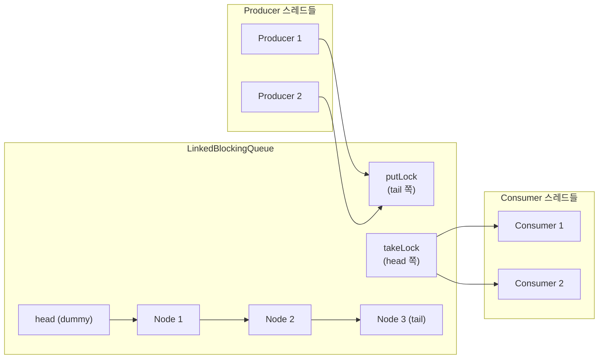
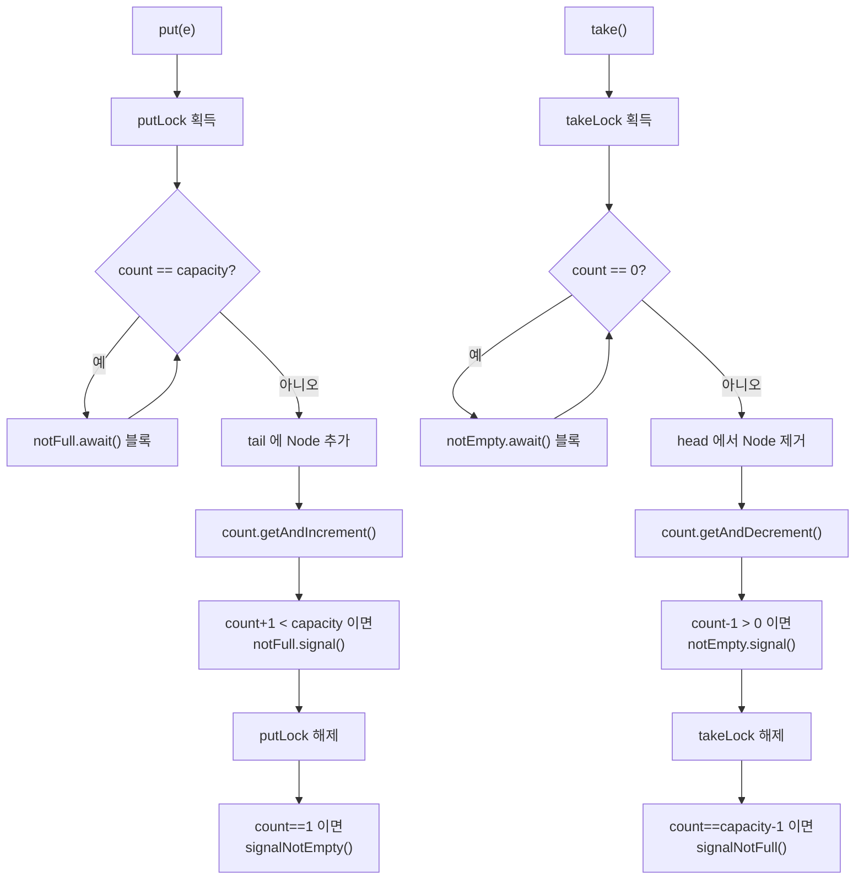

## 정의

**`java.util.concurrent.LinkedBlockingQueue<E>`** 는 linked list 기반의 [[BlockingQueue]]. 기본 unbounded (`Integer.MAX_VALUE`) 이지만 생성 시 capacity 지정 가능.

**Two-Lock Queue 알고리즘** 으로 producer 와 consumer 가 **서로 다른 락** 을 사용 → [[ArrayBlockingQueue]] 보다 높은 throughput.

JDK 1.5 도입. `Executors.newFixedThreadPool()` 과 `newSingleThreadExecutor()` 의 기본 큐.

## 언제 쓰나

- **생산자-소비자 패턴**: 생산 속도와 소비 속도가 다를 때 버퍼 역할
- **스레드 풀 작업 큐**: `ThreadPoolExecutor` 의 작업 큐
- **파이프라인 단계 간 버퍼**: 처리 단계 사이에 데이터를 임시 저장
- **이벤트 큐**: 이벤트를 순서대로 처리할 때
- **고처리량 생산자-소비자**: `ArrayBlockingQueue` 보다 처리량이 중요할 때

> [!IMPORTANT]
> 기본 생성자 `new LinkedBlockingQueue<>()` 는 용량이 `Integer.MAX_VALUE`. producer 가 빠르면 OOM 위험. **반드시 bounded capacity 지정 권장**.

## 시각화: Two-Lock 구조



put 과 take 가 **서로 다른 끝** (tail/head) 을 다루므로 동시에 진행 가능.

## 시각화: put/take 흐름



## 내부 구조

```java
public class LinkedBlockingQueue<E> extends AbstractQueue<E>
        implements BlockingQueue<E>, Serializable {

    private final int capacity;
    private final AtomicInteger count = new AtomicInteger();

    transient Node<E> head;          // dummy head (head.item == null)
    private transient Node<E> last;  // tail

    // 두 개의 독립적인 락
    private final ReentrantLock takeLock = new ReentrantLock();
    private final Condition notEmpty = takeLock.newCondition();

    private final ReentrantLock putLock = new ReentrantLock();
    private final Condition notFull = putLock.newCondition();

    static class Node<E> {
        E item;
        Node<E> next;
        Node(E x) { item = x; }
    }
}
```

핵심: **takeLock 과 putLock 이 분리**. take 와 put 이 동시에 진행 가능 (다른 끝을 다루므로).

`count` 는 `AtomicInteger`, 두 락 모두에서 안전하게 갱신.

## 두 락의 협력

```java
public void put(E e) throws InterruptedException {
    int c = -1;
    Node<E> node = new Node<>(e);
    final ReentrantLock putLock = this.putLock;
    final AtomicInteger count = this.count;
    putLock.lockInterruptibly();
    try {
        while (count.get() == capacity)
            notFull.await();
        enqueue(node);
        c = count.getAndIncrement();
        if (c + 1 < capacity)
            notFull.signal();   // 다음 put 대기자 깨움
    } finally {
        putLock.unlock();
    }
    if (c == 0)
        signalNotEmpty();   // take 대기자 깨움 (putLock 밖에서)
}

public E take() throws InterruptedException {
    E x;
    int c = -1;
    final AtomicInteger count = this.count;
    final ReentrantLock takeLock = this.takeLock;
    takeLock.lockInterruptibly();
    try {
        while (count.get() == 0)
            notEmpty.await();
        x = dequeue();
        c = count.getAndDecrement();
        if (c > 1)
            notEmpty.signal();   // 다음 take 대기자 깨움
    } finally {
        takeLock.unlock();
    }
    if (c == capacity)
        signalNotFull();   // put 대기자 깨움 (takeLock 밖에서)
    return x;
}
```

## 복잡도 및 동시성

| 작업 | 시간 | 동시성 |
|:---|:---:|:---|
| `put`/`offer` | O(1) | putLock 직렬 |
| `take`/`poll` | O(1) | takeLock 직렬 |
| `put` + `take` 동시 | O(1) | **병렬** (다른 락) |
| `size()` | O(1) | AtomicInteger |
| `remove(Object)` | O(n) | 두 락 모두 획득 |
| `contains(Object)` | O(n) | 두 락 모두 획득 |

## Java 17+ 실전: 생산자-소비자 파이프라인

```java
import java.util.concurrent.*;

// bounded 큐로 backpressure 구현
class DataPipeline {
    private final BlockingQueue<String> queue = new LinkedBlockingQueue<>(100);
    private volatile boolean done = false;

    void startProducer(List<String> data) {
        Thread.ofVirtual().start(() -> {
            try {
                for (String item : data) {
                    queue.put(item);   // 큐가 가득 차면 블록 (backpressure)
                }
            } catch (InterruptedException e) {
                Thread.currentThread().interrupt();
            } finally {
                done = true;
            }
        });
    }

    void startConsumer() {
        Thread.ofVirtual().start(() -> {
            try {
                while (!done || !queue.isEmpty()) {
                    String item = queue.poll(100, TimeUnit.MILLISECONDS);
                    if (item != null) process(item);
                }
            } catch (InterruptedException e) {
                Thread.currentThread().interrupt();
            }
        });
    }
}
```

## Java 17+ 실전: ThreadPoolExecutor 커스텀 큐

```java
import java.util.concurrent.*;

// 작업 큐 크기를 제한한 스레드 풀
ThreadPoolExecutor executor = new ThreadPoolExecutor(
    4,                                    // corePoolSize
    8,                                    // maximumPoolSize
    60L, TimeUnit.SECONDS,               // keepAliveTime
    new LinkedBlockingQueue<>(200),       // bounded 큐
    new ThreadPoolExecutor.CallerRunsPolicy()  // 큐 가득 차면 호출자 스레드에서 실행
);

// 작업 제출
executor.submit(() -> processTask());
executor.shutdown();
executor.awaitTermination(30, TimeUnit.SECONDS);
```

## Java 17+ 실전: 이벤트 처리 시스템

```java
import java.util.concurrent.*;

sealed interface AppEvent permits LoginEvent, LogoutEvent, ErrorEvent {}
record LoginEvent(String userId, long timestamp) implements AppEvent {}
record LogoutEvent(String userId, long timestamp) implements AppEvent {}
record ErrorEvent(String message, Throwable cause) implements AppEvent {}

class EventProcessor {
    private final BlockingQueue<AppEvent> eventQueue =
        new LinkedBlockingQueue<>(1000);

    EventProcessor() {
        // 이벤트 처리 스레드
        Thread.ofVirtual().start(() -> {
            try {
                while (!Thread.currentThread().isInterrupted()) {
                    AppEvent event = eventQueue.take();
                    switch (event) {
                        case LoginEvent e -> handleLogin(e);
                        case LogoutEvent e -> handleLogout(e);
                        case ErrorEvent e -> handleError(e);
                    }
                }
            } catch (InterruptedException e) {
                Thread.currentThread().interrupt();
            }
        });
    }

    // 여러 스레드에서 안전하게 이벤트 발행
    boolean publish(AppEvent event) {
        return eventQueue.offer(event);   // 큐 가득 차면 false 반환
    }
}
```

## LinkedBlockingQueue vs ArrayBlockingQueue

| 항목 | LinkedBlockingQueue | [[ArrayBlockingQueue]] |
|:---|:---:|:---:|
| 내부 구조 | linked list | 배열 |
| 기본 용량 | `Integer.MAX_VALUE` | **필수 지정** |
| 락 구조 | **두 개 (put/take 분리)** | 하나 |
| 처리량 | **높음** | 낮음 |
| 메모리 | 노드 객체 오버헤드 | **예측 가능** |
| GC 압력 | 높음 (노드 생성/소멸) | 낮음 |
| 공정성 옵션 | ✗ | ✓ |

high throughput 이 필요하면 LinkedBlockingQueue, 메모리 예측이 중요하면 ArrayBlockingQueue.

## 함정

### 1. unbounded 가 기본

```java
// 위험: 기본 용량 Integer.MAX_VALUE → OOM 가능
BlockingQueue<Task> q = new LinkedBlockingQueue<>();

// 올바름: bounded capacity 지정
BlockingQueue<Task> q = new LinkedBlockingQueue<>(1000);
```

### 2. 노드 객체 GC 압력

각 원소가 `Node` 객체로 감싸진다. 짧은 시간에 수만 개가 들어왔다 나가는 워크로드에서는 GC 영향이 보일 수 있다. 이 경우 `ArrayBlockingQueue` 가 더 적합.

### 3. remove(Object) 는 두 락 모두 획득

```java
// 위험: remove(Object) 는 putLock + takeLock 모두 획득 → 처리량 저하
queue.remove(specificItem);   // O(n) + 두 락

// 취소가 빈번하면 취소 플래그 패턴 사용
record Task(String id, volatile boolean cancelled) {}
```

### 4. 인터럽트 처리

```java
try {
    queue.put(item);
} catch (InterruptedException e) {
    Thread.currentThread().interrupt();   // 인터럽트 상태 복원 필수
    // 적절한 정리 작업
}
```

`put`/`take` 는 `InterruptedException` 을 던진다. 반드시 처리해야 한다.

## 관련 위키

- [[BlockingQueue]]
- [[ArrayBlockingQueue]]
- [[SynchronousQueue]]
- [[PriorityBlockingQueue]]
- [[ReentrantLock]]
- [[Blocking]]
- [[Collection]]
- [[Queue]]
