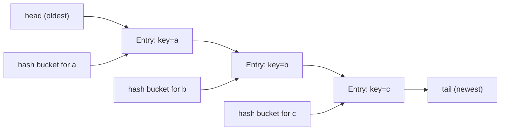

## 정의

**`java.util.LinkedHashMap<K,V>`** 는 [[HashMap]] 을 상속해 **삽입 순서 (또는 접근 순서) 를 유지** 하는 Map. 모든 [[HashMap]] 의 평균 O(1) 성능을 유지하면서 추가로 순회 순서가 일관된다.

핵심: **이중 연결 리스트 (doubly-linked list)** 가 모든 entry 를 삽입 순서대로 엮어 둔다.

## 사용 상황

| 상황 | 이유 |
|:---|:---|
| 삽입 순서가 중요한 캐시 | API 응답 JSON 키 순서 보존 |
| LRU 캐시 구현 | `accessOrder=true` + `removeEldestEntry` |
| 최근 N 개 항목 유지 | eldest 제거 조건 설정 |
| 설정값 순서 보존 | 사람이 읽는 출력의 일관성 |

단순 O(1) map 이 필요하고 순서가 필요 없다면 [[HashMap]] 을 쓴다.

## 시각화

```anim:java-linkedhashmap-lru
{}
```

## 내부 구조: 두 가지 자료구조가 공존



각 entry 는 **해시 버킷 chain** 과 **이중 연결 리스트** 두 군데에 동시에 속한다.

```java
static class Entry<K,V> extends HashMap.Node<K,V> {
    Entry<K,V> before, after;     // ← 추가된 두 포인터
}

// LinkedHashMap 의 추가 필드
transient LinkedHashMap.Entry<K,V> head;    // 가장 오래된 entry
transient LinkedHashMap.Entry<K,V> tail;    // 가장 최근 entry
final boolean accessOrder;                   // false = 삽입 순서, true = 접근 순서
```

## 두 가지 순회 순서

### 삽입 순서 (기본)

```java
LinkedHashMap<String, Integer> map = new LinkedHashMap<>();
map.put("a", 1); map.put("b", 2); map.put("c", 3);
map.put("a", 99);                // 기존 key 갱신, 순서 유지

map.forEach((k, v) -> System.out.println(k + "=" + v));
// a=99, b=2, c=3
```

### 접근 순서 (LRU 캐시용)

```java
Map<String, Integer> lru = new LinkedHashMap<>(16, 0.75f, true);
//                                                    ^^^^ accessOrder

lru.put("a", 1); lru.put("b", 2); lru.put("c", 3);
lru.get("a");                    // "a" 가 가장 최근 접근
lru.forEach((k, v) -> System.out.print(k + " "));
// b c a  (가장 오래된 것부터 출력)
```

`accessOrder = true` 면 `get`, `put` 마다 entry 가 linked list 의 끝으로 이동.

## LRU 캐시 구현

`removeEldestEntry` 를 override 하면 손쉽게 LRU 캐시를 만들 수 있다.

```java
class LRUCache<K, V> extends LinkedHashMap<K, V> {
    private final int capacity;

    public LRUCache(int capacity) {
        super(capacity, 0.75f, true);       // accessOrder = true
        this.capacity = capacity;
    }

    @Override
    protected boolean removeEldestEntry(Map.Entry<K, V> eldest) {
        return size() > capacity;            // 초과 시 가장 오래된 항목 제거
    }
}

// 사용
Map<String, String> cache = new LRUCache<>(3);
cache.put("a", "1"); cache.put("b", "2"); cache.put("c", "3");
cache.get("a");          // "a" 를 가장 최근으로 이동
cache.put("d", "4");     // capacity 초과 → "b" (eldest) 제거
// cache: {c=3, a=1, d=4}
```

> [!IMPORTANT]
> 단일 스레드 LRU 라면 LinkedHashMap 이 매우 깔끔하다. 동시성이 필요하면 [Spring] ConcurrentLruCache 또는 Caffeine 같은 외부 라이브러리.

## Thread-safe LRU

단순히 `Collections.synchronizedMap` 으로 감싸면 메서드 단위 동기화가 된다.

```java
Map<String, String> syncLru = Collections.synchronizedMap(
    new LRUCache<>(100)
);

// 순회할 때는 맵 자체를 동기화해야 함
synchronized (syncLru) {
    syncLru.forEach((k, v) -> process(k, v));
}
```

고성능 동시성 LRU 캐시가 필요하면 Caffeine 의 Window TinyLFU 알고리즘이 훨씬 효율적이다.

## API 응답 필드 순서 보존 (실전 예시)

```java
// JSON 직렬화 라이브러리가 Map 순서를 보존한다고 가정할 때
Map<String, Object> response = new LinkedHashMap<>();
response.put("id", 123);
response.put("name", "Alice");
response.put("email", "alice@example.com");
response.put("createdAt", "2026-01-01");

// ObjectMapper (Jackson) 는 LinkedHashMap 의 삽입 순서를 그대로 직렬화
// {"id":123,"name":"Alice","email":"alice@example.com","createdAt":"2026-01-01"}
```

`HashMap` 을 쓰면 키 순서가 JVM 마다, 실행마다 달라질 수 있다.

## HashMap vs LinkedHashMap vs TreeMap 비교

| 항목 | HashMap | LinkedHashMap | TreeMap |
|:---|:---:|:---:|:---:|
| 내부 구조 | 해시 테이블 | 해시 + 이중 연결 리스트 | Red-Black Tree |
| 순회 순서 | 불정 | 삽입 순서 (or 접근 순서) | 키 오름차순 |
| `get` / `put` | O(1) avg | O(1) avg | O(log n) |
| `firstKey` / `lastKey` | 없음 | 없음 | O(log n) |
| 메모리 | 기준 | + 2 포인터/entry | + tree node |
| null key | ✓ (1개) | ✓ (1개) | ✗ |

순서 보장이 필요하면 LinkedHashMap, 정렬된 키 순서가 필요하면 [[TreeMap]], 그 외에는 [[HashMap]].

## 실전: FIFO 캐시 (삽입 순서 oldest 제거)

accessOrder 없이 삽입 순서로 eldest 제거하는 FIFO 캐시:

```java
class FIFOCache<K, V> extends LinkedHashMap<K, V> {
    private final int maxSize;

    public FIFOCache(int maxSize) {
        super(maxSize, 0.75f, false);   // accessOrder = false (삽입 순서)
        this.maxSize = maxSize;
    }

    @Override
    protected boolean removeEldestEntry(Map.Entry<K, V> eldest) {
        return size() > maxSize;
    }
}

FIFOCache<String, Integer> cache = new FIFOCache<>(3);
cache.put("a", 1); cache.put("b", 2); cache.put("c", 3);
cache.get("a");         // FIFO 이므로 "a" 순서 변동 없음
cache.put("d", 4);      // "a" (첫 번째 삽입) 제거
// cache: {b=2, c=3, d=4}
```

## 복잡도

[[HashMap]] 과 동일.

| 작업 | 평균 | 최악 |
|:---|:---:|:---:|
| `get`, `put`, `remove` | O(1) | O(log n) |
| 순회 | O(n) (linked list 따라가므로 빠름) | 같음 |

> 순회는 **HashMap 보다 빠르다**. HashMap 은 빈 버킷도 모두 거쳐야 하지만, LinkedHashMap 은 linked list 만 따라간다.

## 메모리

각 entry 가 `before`/`after` 두 포인터를 추가로 가지므로 [[HashMap]] 대비 **per-entry 메모리가 ~16-32 바이트 더** 든다. 큰 map 에서는 무시 못 한다.

## 함정

### 1. accessOrder 가 동시성 문제 증폭

`accessOrder = true` 일 때 `get()` 도 구조 변경 (linked list 재정렬). 이는 modCount 를 증가시키지는 않지만, 동시 환경에서 **iterator 와 충돌** 할 수 있다. 동기화 필요.

### 2. removeEldestEntry 가 매 put 후 호출

대용량 데이터를 부어 넣는 경우 매 put 마다 호출되는 비용이 누적된다.

### 3. thread-safe 가 아니다

[[HashMap]] 처럼 단일 스레드 전용.

> [!WARNING]
> `accessOrder = true` 인 LinkedHashMap 을 멀티스레드 환경에서 공유하면 `get()` 자체가 내부 구조를 변경하므로, `Collections.synchronizedMap` 으로 감싸도 순회 중 별도 동기화 블록이 필수.

## entrySet 순회로 최근 N 개 추출

```java
// LinkedHashMap 에서 최근 삽입된 N 개만 가져오기
LinkedHashMap<String, Integer> map = new LinkedHashMap<>();
// ... 100 개 삽입 ...

int n = 5;
List<Map.Entry<String, Integer>> recent = new ArrayList<>(map.entrySet())
    .subList(Math.max(0, map.size() - n), map.size());
// 마지막 5 개 entry 반환 (삽입 순서 기준)
```

`entrySet()` 의 iterator 는 linked list 를 따라 삽입 순서대로 방문하므로, `subList` 로 tail 을 잘라내면 최근 항목을 O(n) 에 추출할 수 있다.

## 관련 위키

- [[Map]]
- [[LinkedList]]
- [[HashSet]]
- [[HashMap]]
- [[TreeMap]]
- [[ConcurrentHashMap]]
- [[Collection]]
- [[Iterable]]
