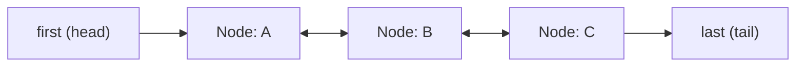

## 정의

**`java.util.LinkedList`** 는 **양방향 연결 리스트 (doubly linked list)** 로 구현된 [[List]] 이자 `java.util.Deque`. 각 원소는 `prev` 와 `next` 포인터를 가진 노드로 보관된다.

[[ArrayList]] 와 같은 List 이지만, **메모리 레이아웃과 연산 비용 특성이 정반대**. 인덱스 접근은 느리지만 노드 참조가 있으면 삽입·삭제가 O(1) 이다.

## 시각화

```anim:java-linkedlist-ops
{}
```

## 구조 다이어그램



각 노드는 `prev`, `item`, `next` 세 필드를 가진다. `first` 와 `last` 포인터로 양 끝에 O(1) 접근.

## 내부 구조

```java
public class LinkedList<E>
    extends AbstractSequentialList<E>
    implements List<E>, Deque<E>, Cloneable, java.io.Serializable {

    transient int size = 0;
    transient Node<E> first;     // head
    transient Node<E> last;      // tail

    private static class Node<E> {
        E item;
        Node<E> next;
        Node<E> prev;
    }
}
```

- **`first`**, **`last`**: head, tail 포인터
- **`Node<E>`**: 각 원소를 감싸는 박스. 데이터 외에 `prev`, `next` 두 개의 참조를 갖는다
- **`size`**: 원소 개수

### 노드 객체 오버헤드

각 원소마다 별도의 `Node` 객체가 만들어진다. 그래서 같은 데이터를 담아도 [[ArrayList]] 대비 **메모리가 2-3 배** 소모된다.

```text
ArrayList<Integer>:  Integer 객체 + Object[] 슬롯 (4-8B)
LinkedList<Integer>: Integer 객체 + Node 객체 (헤더 16B + item 4B + prev 4B + next 4B = ~32B)
```

또한 노드들이 힙 곳곳에 흩어져 있어 **캐시 적중률이 낮다**. 순회조차 같은 알고리즘 복잡도 (O(n)) 에서 ArrayList 보다 느릴 때가 많다.

## 주요 연산 비용

| 메서드 | 시간 | 설명 |
|:---|:---:|:---|
| `getFirst()`, `getLast()` | **O(1)** | head/tail 직접 접근 |
| `addFirst(E)`, `addLast(E)` | **O(1)** | 새 노드 + 포인터 갱신 4 개 |
| `removeFirst()`, `removeLast()` | **O(1)** | 포인터 갱신 |
| `get(int i)` | **O(n)** | head 또는 tail 에서 walk (i < size/2 면 head 쪽) |
| `add(int i, E e)` | **O(n)** | 인덱스로 노드 찾는 비용 + O(1) 삽입 |
| `remove(int i)` | **O(n)** | 같은 이유 |
| `remove(Object o)` | **O(n)** | 선형 검색 |
| `iterator().next()` | **O(1)** | 현재 노드의 next 참조 |

### 인덱스 접근 최적화

`get(i)` 는 head 와 tail 중 **i 와 가까운 쪽에서 출발** 한다.

```java
Node<E> node(int index) {
    if (index < (size >> 1)) {
        Node<E> x = first;
        for (int i = 0; i < index; i++) x = x.next;
        return x;
    } else {
        Node<E> x = last;
        for (int i = size - 1; i > index; i--) x = x.prev;
        return x;
    }
}
```

그래도 최악은 O(n/2) = O(n).

## Deque 로서의 LinkedList

`LinkedList` 는 `Deque` 인터페이스도 구현하므로 **스택과 큐 모두로** 쓸 수 있다.

```java
Deque<Integer> stack = new LinkedList<>();
stack.push(1); stack.push(2); stack.push(3);
stack.pop();  // 3

Deque<Integer> queue = new LinkedList<>();
queue.offer(1); queue.offer(2); queue.offer(3);
queue.poll();  // 1
```

다만 `ArrayDeque` 가 일반적으로 더 빠르다. Deque 가 필요하면 LinkedList 보다 ArrayDeque 가 권장된다.

## 삽입·삭제는 정말 O(1) 인가

**노드 참조를 들고 있을 때만** 진짜 O(1). 인덱스로 위치를 찾는다면 그 비용이 O(n) 이라 결국 O(n) 이다.

```java
// O(1)
LinkedList<Integer> list = new LinkedList<>();
list.addFirst(1);
list.addLast(2);
list.removeFirst();

// 사실상 O(n) (인덱스로 찾기 때문)
list.add(50, 999);
list.remove(50);

// O(1) (ListIterator 가 노드 참조를 들고 있음)
ListIterator<Integer> it = list.listIterator();
while (it.hasNext()) {
    if (it.next() == 999) it.remove();  // O(1) 삭제
}
```

> [!CAUTION]
> "LinkedList 가 중간 삽입 O(1)" 이라는 통념은 **노드 참조가 있을 때의 얘기**. for 루프와 인덱스로 접근하는 일반적 코드에서는 [[ArrayList]] 가 거의 항상 더 빠르다.

## ArrayList 와의 비교

| 항목 | ArrayList | LinkedList |
|:---|:---|:---|
| 내부 구조 | 동적 배열 | 양방향 연결 리스트 |
| `get(i)` | **O(1)** | O(n) |
| `add(E)` (끝) | amortized O(1) | **O(1)** |
| `addFirst(E)` | O(n) | **O(1)** |
| 메모리 | 작음 (slot 만) | 큼 (Node 객체) |
| 캐시 친화 | ✓ 인접 메모리 | ✗ 포인터 점프 |
| 실측 속도 (일반) | 빠름 | 느림 |
| Deque 가능 | ✗ (별도 ArrayDeque) | ✓ |

> [!IMPORTANT]
> 실무에서 LinkedList 를 명시적으로 선택해야 할 경우는 매우 드물다. **Joshua Bloch 도 *Effective Java* 에서 "LinkedList 는 거의 쓸 일이 없다"** 고 언급한다. List 가 필요하면 ArrayList, Deque 가 필요하면 ArrayDeque.

## 함정

### 1. 인덱스 기반 순회는 함정

```java
// ❌ O(n²)
for (int i = 0; i < list.size(); i++) {
    process(list.get(i));  // 매 get 이 O(n)
}

// ✅ O(n)
for (Integer x : list) {  // iterator 사용
    process(x);
}
```

`for (int i = ...)` 패턴이 ArrayList 에서는 자연스럽지만 LinkedList 에는 치명적.

### 2. thread-safe 가 아니다

ArrayList 와 동일. 동시 수정 시 노드 포인터가 꼬여 데이터 손상이나 무한 루프가 발생할 수 있다.

### 3. `Stack` 의존도

`Stack<E>` 클래스는 레거시 (Vector 상속). 새 코드에서는 `Deque<E> stack = new ArrayDeque<>()` 가 권장. LinkedList 도 가능하지만 `ArrayDeque` 가 더 빠르다.

## 언제 LinkedList 가 적절한가

- **양 끝 (head / tail) 만 다룬다**, 인덱스 접근 거의 없음 → 그래도 `ArrayDeque` 가 보통 더 빠름
- **ListIterator 로 중간 노드를 들고 다니며 삽입·삭제**
- **List + Deque 가 동시에 필요한 매우 좁은 경우**

이 셋 모두 해당이 아니면 [[ArrayList]] 를 쓰자.

## 실제 사용 사례

### 1. ListIterator 로 중간 삽입 (진짜 O(1))

```java
LinkedList<Integer> list = new LinkedList<>(List.of(1, 2, 3, 4, 5));
ListIterator<Integer> it = list.listIterator();

while (it.hasNext()) {
    int val = it.next();
    if (val == 3) {
        it.add(99);   // 3 뒤에 99 삽입, O(1)
    }
}
// [1, 2, 3, 99, 4, 5]
```

### 2. 작업 큐 (FIFO)

```java
Queue<Runnable> taskQueue = new LinkedList<>();
taskQueue.offer(() -> System.out.println("task1"));
taskQueue.offer(() -> System.out.println("task2"));

while (!taskQueue.isEmpty()) {
    taskQueue.poll().run();
}
```

> [!TIP]
> 실무에서는 `ArrayDeque` 가 더 빠르다. `LinkedList` 를 큐로 쓰는 코드는 레거시일 가능성이 높다.

### 3. 양 끝 스택 (Deque 활용)

```java
Deque<String> history = new LinkedList<>();
history.push("page1");
history.push("page2");
history.push("page3");

String current = history.pop();   // page3 (LIFO)
```

## 성능 비교 (실측 기준)

| 작업 | ArrayList | LinkedList | 승자 |
|:---|:---:|:---:|:---:|
| 순차 읽기 (for-each) | 빠름 | 느림 | ArrayList |
| 인덱스 접근 `get(i)` | O(1) | O(n) | ArrayList |
| 끝에 추가 `add(E)` | amortized O(1) | O(1) | 비슷 |
| 앞에 추가 `addFirst(E)` | O(n) | O(1) | LinkedList |
| 중간 삽입 (인덱스) | O(n) | O(n) | ArrayList (캐시) |
| 메모리 사용 | 적음 | 많음 | ArrayList |

> [!CAUTION]
> 벤치마크 결과는 JVM 버전, 데이터 크기, 캐시 상태에 따라 다르다. 실제 코드에서 측정하는 것이 원칙.

## 스레드 안전 대안

```java
// 동기화된 LinkedList (성능 낮음)
List<String> syncList = Collections.synchronizedList(new LinkedList<>());

// 동시성 큐 (권장)
Queue<String> concurrentQueue = new ConcurrentLinkedQueue<>();
Deque<String> concurrentDeque = new ConcurrentLinkedDeque<>();
```

[[java-concurrentlinkedqueue]], [[java-concurrentlinkeddeque]] 참조.

## 참고

- [[java-object]]
- [[java-iterable]]
- [[java-collection]]
- [[java-list]]
- [[java-arraylist]]
- [[java-fail-fast-iterator]]
- [[java-concurrent-modification-exception]]
- [[java-concurrentlinkedqueue]]
- [[java-concurrentlinkeddeque]]
- Joshua Bloch, *Effective Java* (3rd ed.), Item 28
