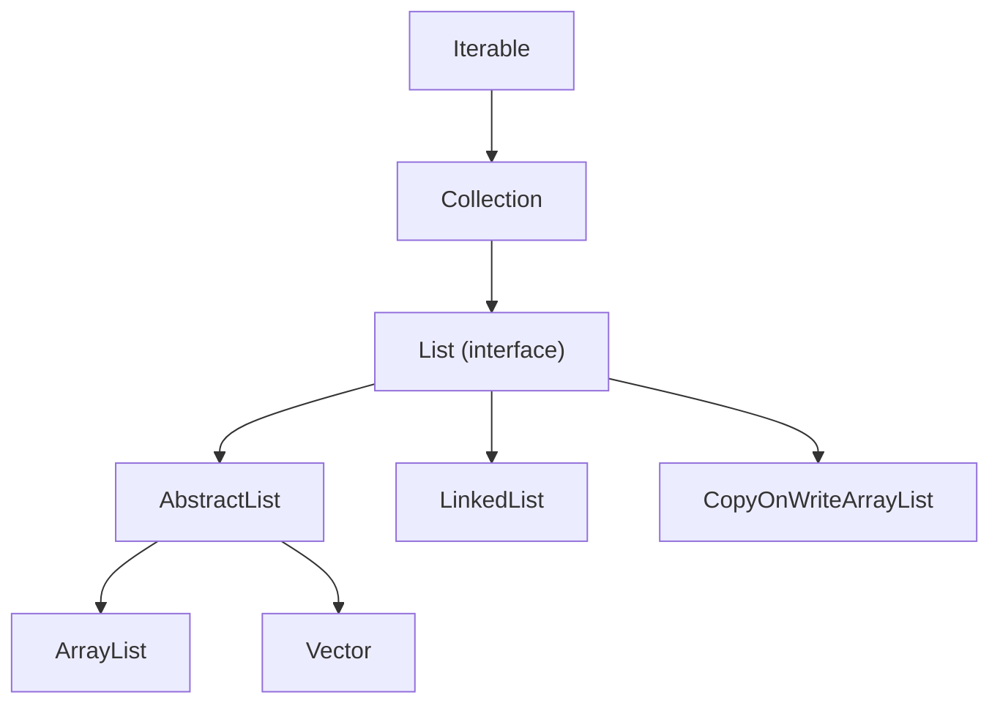

## 정의

**`java.util.List`** 는 **순서가 있고 중복이 허용** 되는 컬렉션을 표현하는 인터페이스. 각 원소는 0 부터 시작하는 정수 인덱스로 접근 가능.

`Collection` 인터페이스를 확장하며, `Iterable` 의 모든 성질을 물려받는다. 대표 구현체로 [[ArrayList]], [[LinkedList]], [[Vector]], [[CopyOnWriteArrayList]] 가 있다.

## 사용 상황

| 상황 | 이유 |
|:---|:---|
| 순서가 있는 데이터 보관 | 인덱스 기반 접근 |
| 중복이 허용되는 컬렉션 | [[Set]] 이 아닌 List |
| 순차 순회 | Iterator / for-each |
| 정렬 및 이진 검색 | `Collections.sort`, `binarySearch` |
| Stream 파이프라인 시작점 | `list.stream()` |
| 배치 처리, 임시 버퍼 | 동적 크기 조정 |

## 시각화

```anim:java-list-overview
{}
```

## 상속 계층



## 핵심 메서드

| 메서드 | 의미 | 일반적 비용 |
|:---|:---|:---|
| `get(int i)` | i 번째 원소 반환 | 구현체 의존 |
| `set(int i, E e)` | i 번째 원소를 e 로 교체, 이전 값 반환 | 구현체 의존 |
| `add(E e)` | 끝에 추가, true 반환 | 보통 O(1) |
| `add(int i, E e)` | i 위치에 삽입 | 구현체 의존 |
| `remove(int i)` | i 번째 원소 삭제, 그 값 반환 | 구현체 의존 |
| `remove(Object o)` | 첫 번째로 발견된 o 삭제 | O(n) |
| `indexOf(Object o)` | 첫 등장 인덱스, 없으면 -1 | O(n) |
| `size()` | 원소 개수 | O(1) |
| `iterator()`, `listIterator()` | 순회 | O(1) 생성 |
| `subList(int from, int to)` | 부분 뷰 (백킹 리스트 공유) | O(1) |

## 구현체별 특징 한눈에

| 구현체 | 내부 구조 | random access | 끝에 add | 앞/중간 삽입 | thread-safe |
|:---|:---|:---:|:---:|:---:|:---:|
| **[[ArrayList]]** | 동적 배열 | O(1) | amortized O(1) | O(n) | ✗ |
| **[[LinkedList]]** | 양방향 연결 리스트 | O(n) | O(1) | O(1) (노드 있을 때) / O(n) (인덱스) | ✗ |
| **[[Vector]]** | 동적 배열 + 메서드 동기화 | O(1) | amortized O(1) | O(n) | ✓ (메서드 단위) |
| **[[CopyOnWriteArrayList]]** | 불변 배열 + 쓰기 시 복사 | O(1) | O(n) (전체 복사) | O(n) | ✓ |

> [!IMPORTANT]
> **거의 모든 실무 코드에서 ArrayList 가 기본 선택**. LinkedList 가 더 빠를 것 같은 상황 (앞 삽입) 도 실측하면 ArrayList 가 빠를 때가 많다. 캐시 친화성 차이 때문.

## 기본 사용

```java
List<String> users = new ArrayList<>();
users.add("Alice");                    // [Alice]
users.add("Bob");                      // [Alice, Bob]
users.add(0, "Charlie");               // [Charlie, Alice, Bob]
users.set(1, "Dave");                  // [Charlie, Dave, Bob]
String first = users.get(0);           // "Charlie"
boolean has = users.contains("Bob");   // true
users.remove("Charlie");               // [Dave, Bob]

for (String u : users) {               // for-each (iterator)
    System.out.println(u);
}
```

## 정렬

`List.sort()` 와 `Collections.sort()` 모두 내부적으로 TimSort (O(n log n)) 를 사용한다.

```java
List<Integer> nums = new ArrayList<>(List.of(5, 2, 8, 1, 9));

// 자연 순서 오름차순
nums.sort(Comparator.naturalOrder());         // [1, 2, 5, 8, 9]

// 역순
nums.sort(Comparator.reverseOrder());         // [9, 8, 5, 2, 1]

// 커스텀: 길이 오름차순, 동점이면 사전 순
List<String> words = new ArrayList<>(List.of("banana", "fig", "apple"));
words.sort(Comparator.comparingInt(String::length)
                     .thenComparing(Comparator.naturalOrder()));
// [fig, apple, banana]

// 이진 검색 (정렬 선행 필수)
Collections.sort(nums);
int idx = Collections.binarySearch(nums, 5);  // 인덱스 반환
```

## Stream API 와 함께

```java
List<String> names = List.of("Alice", "Bob", "Charlie", "Dave");

// 필터 + 변환 + 수집
List<String> result = names.stream()
    .filter(n -> n.length() > 3)
    .map(String::toUpperCase)
    .sorted()
    .collect(Collectors.toList());
// [ALICE, CHARLIE, DAVE]

// 합계
int totalLen = names.stream()
    .mapToInt(String::length)
    .sum();   // 18

// 그룹화: Map<길이, 이름 리스트>
Map<Integer, List<String>> byLen = names.stream()
    .collect(Collectors.groupingBy(String::length));
// {3=[Bob], 4=[Dave], 5=[Alice], 7=[Charlie]}

// 플랫맵: 중첩 List 펼치기
List<List<Integer>> nested = List.of(List.of(1, 2), List.of(3, 4));
List<Integer> flat = nested.stream()
    .flatMap(Collection::stream)
    .collect(Collectors.toList());   // [1, 2, 3, 4]
```

## Collections 유틸리티

```java
List<Integer> nums = new ArrayList<>(List.of(3, 1, 4, 1, 5));

Collections.reverse(nums);          // [5, 1, 4, 1, 3]
Collections.shuffle(nums);          // 무작위 섞기
int min = Collections.min(nums);    // 최솟값
int max = Collections.max(nums);    // 최댓값
Collections.fill(nums, 0);          // [0, 0, 0, 0, 0]

// nCopies: 같은 원소 n 개로 채운 불변 리스트
List<String> zeros = Collections.nCopies(5, "x");  // [x, x, x, x, x]
```

## 불변 (Immutable) List

Java 9 부터 `List.of(...)` 정적 메서드가 추가됐다.

```java
List<Integer> primes = List.of(2, 3, 5, 7, 11);
primes.add(13);  // UnsupportedOperationException

// 기존 리스트의 불변 복사본
List<String> copy = List.copyOf(original);
```

`List.of` 는 null 원소도 허용하지 않는다. `Arrays.asList` 와 달리 크기 변경도 불가.

## fail-fast 와 동시 수정

`ArrayList`, `LinkedList`, `Vector` 의 iterator 는 **순회 중 구조가 변경되면 [[ConcurrentModificationException]] 을 던진다** ([[fail-fast iterator]]). 단일 스레드 안에서도 발생한다.

```java
List<Integer> list = new ArrayList<>(List.of(1, 2, 3, 4));
for (Integer x : list) {
    if (x % 2 == 0) list.remove(x);  // ConcurrentModificationException
}

// Iterator.remove() 만 안전
Iterator<Integer> it = list.iterator();
while (it.hasNext()) {
    if (it.next() % 2 == 0) it.remove();
}

// Java 8+: removeIf (가장 간결)
list.removeIf(x -> x % 2 == 0);
```

[[CopyOnWriteArrayList]] 만 예외, snapshot iterator 라 `CME` 가 발생하지 않는다.

## 함정

### 1. `remove(int)` vs `remove(Object)` 오버로드 혼동

```java
List<Integer> list = new ArrayList<>(List.of(1, 2, 3));
list.remove(1);                      // int 오버로드: 인덱스 1 삭제 → [1, 3]
list.remove(Integer.valueOf(1));     // Object 오버로드: 값 1 삭제 → [2, 3]
```

> [!WARNING]
> `List<Integer>` 에서 `remove(1)` 은 **값 1이 아닌 인덱스 1** 을 삭제한다. 값을 제거하려면 `remove(Integer.valueOf(x))` 또는 `removeIf(v -> v == x)`.

### 2. `subList` 는 원본을 공유

```java
List<String> full = new ArrayList<>(List.of("a", "b", "c", "d"));
List<String> sub = full.subList(1, 3);   // [b, c] (뷰)
sub.clear();                              // full = [a, d]
```

`subList()` 반환값을 수정하면 원본도 바뀐다. 독립 복사본이 필요하면 `new ArrayList<>(sub)`.

### 3. `Arrays.asList` 는 크기 고정

```java
List<String> fixed = Arrays.asList("x", "y", "z");
fixed.set(0, "X");   // OK: 원소 교체 가능
fixed.add("w");      // UnsupportedOperationException: 크기 변경 불가
```

`List.of` 와 달리 원소 교체는 가능하지만 `add` / `remove` 는 불가.

### 4. `Collections.sort` 는 in-place, Stream.sorted 는 새 리스트

```java
List<Integer> a = new ArrayList<>(List.of(3, 1, 2));
List<Integer> b = a.stream().sorted().collect(Collectors.toList());
// a 는 그대로 [3, 1, 2], b 는 [1, 2, 3]

Collections.sort(a);
// a 는 [1, 2, 3] (in-place 정렬)
```

## 어떤 구현체를 골라야 하나

| 상황 | 권장 |
|:---|:---|
| **기본**, 의심스러우면 | [[ArrayList]] |
| **앞/뒤 빈번 삽입/삭제**, Deque 로도 쓰고 싶다 | [[LinkedList]] (인덱스 접근 거의 없을 때) |
| **레거시 코드 호환** | [[Vector]] (새 코드에서는 피한다) |
| **읽기 多 / 쓰기 거의 없음**, 동시성 | [[CopyOnWriteArrayList]] |
| **불변 데이터** | `List.of(...)`, `List.copyOf(...)` |
| **일반적 동시성** | `Collections.synchronizedList(new ArrayList<>())` |

## 관련 위키

- [[Collection]]
- [[Iterable]]
- [[ArrayList]]
- [[LinkedList]]
- [[Vector]]
- [[CopyOnWriteArrayList]]
- [[fail-fast iterator]]
- [[ConcurrentModificationException]]
- [[Set]]
- Joshua Bloch, *Effective Java* (3rd ed.), Item 28 (배열보다 리스트)
