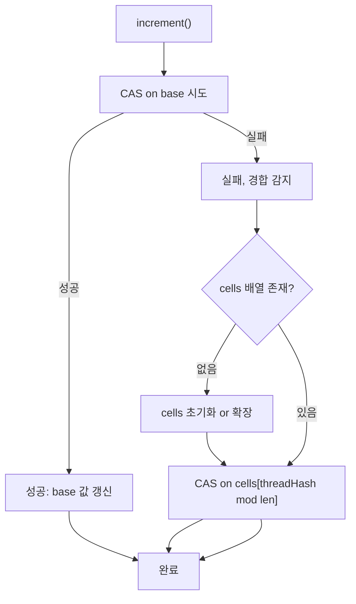

## 정의

**`java.util.concurrent.atomic.LongAdder`** 는 **고경합 카운터** 를 위한 자료구조. JDK 1.8 도입. `AtomicLong` 보다 동시 증가 throughput 이 압도적으로 높다.

원리는 **striped counter (분산 누적)**. 여러 cell 에 나누어 누적하고, 합산할 때 모두 더한다. CAS 충돌이 발생하면 다른 cell 을 시도 → 거의 모든 increment 가 무경합.

## 사용 상황

| 상황 | 이유 |
|:---|:---|
| HTTP 요청 수 카운터 | 수십 스레드가 동시에 increment |
| 에러율 / 처리량 메트릭 | eventual consistency 허용 |
| 키별 빈도 집계 | `ConcurrentHashMap + LongAdder` 조합 |
| 이벤트 누적 (로그, 알림) | 높은 throughput 필요 |

AtomicLong 을 쓰면 되는 상황 (단일/저경합, 현재값이 즉시 필요) 에는 오히려 오버헤드.

## 시각화

```anim:java-long-adder-striped
{}
```

## increment 흐름



처음에는 단일 `base` 필드에 CAS 를 시도한다. 경합이 생기는 순간 `Striped64` 가 cells 배열을 초기화하고, 이후 각 스레드는 자신의 threadLocalRandom 해시로 고유 cell 을 골라 누적한다.

## 내부 구조 (Striped64)

`LongAdder` 는 `Striped64` 를 상속한다.

```java
abstract class Striped64 extends Number {
    transient volatile Cell[] cells;   // null 이면 base 만 사용
    transient volatile long base;      // 경합 없을 때 직접 CAS
    transient volatile int cellsBusy; // cells 배열 resize 락
}

@sun.misc.Contended              // false sharing 방지 (캐시 라인 패딩)
static final class Cell {
    volatile long value;
    // CAS 메서드 포함
}
```

`@Contended` 어노테이션이 각 Cell 을 별도 캐시 라인에 배치해 **false sharing** 을 방지. 이것이 성능 향상의 핵심 중 하나.

## 동작

```java
LongAdder count = new LongAdder();

count.increment();         // ++count
count.add(5);
count.sum();               // 모든 cell 합산, 추정값
count.longValue();         // == sum()
count.reset();
```

`AtomicLong.incrementAndGet()` 처럼 새 값을 반환하지는 않는다. **누적 결과만 보장**.

## 왜 AtomicLong 보다 빠른가

[[AtomicInteger]] / `AtomicLong` 의 CAS 루프는 다음과 같다.

```text
스레드 N 개가 동시에 increment:
  T1: CAS(0, 1) 성공
  T2: CAS(0, 1) 실패 → 재시도 → CAS(1, 2) 성공
  T3: CAS(0, 1) 실패 → 재시도 → CAS(1, 2) 실패 → 재시도 → CAS(2, 3) 성공
  ...
```

경합이 심하면 거의 모든 스레드가 여러 번 CAS 실패. 성능이 락보다 떨어질 수 있다.

LongAdder 는.

```text
스레드 N 개가 동시에 increment:
  T1 → cell[hash(T1) % cells.length].add(1)
  T2 → cell[hash(T2) % cells.length].add(1)
  T3 → cell[hash(T3) % cells.length].add(1)
  ... (각자 다른 cell 에 누적, 충돌 거의 없음)
```

cells 배열의 크기가 동적으로 늘어나면서 경합이 분산된다.

## sum 의 약점

```java
long total = adder.sum();   // 모든 cell 의 합
```

**합산 시점에 다른 스레드가 add 중이면 그 값은 반영 안 될 수 있다.** "순간 정확한 카운트" 는 보장 안 됨.

워크로드 통계, request count 같이 **eventual consistency** 가 허용되는 카운터에 적합.

## 사용 예

### request 카운터

```java
class Metrics {
    private final LongAdder requests = new LongAdder();
    private final LongAdder errors = new LongAdder();

    public void onRequest() { requests.increment(); }
    public void onError() { errors.increment(); }

    public long requestCount() { return requests.sum(); }
    public long errorCount() { return errors.sum(); }
}
```

### Map 의 값으로

```java
ConcurrentMap<String, LongAdder> counts = new ConcurrentHashMap<>();
counts.computeIfAbsent(key, k -> new LongAdder()).increment();
```

이 패턴이 흔한 idiom. [[ConcurrentHashMap]] + LongAdder 조합으로 키별 카운트.

### rate limiter 에서 슬라이딩 윈도우 카운터

```java
class RateLimiter {
    private final LongAdder counter = new LongAdder();
    private final long maxPerSecond;
    private volatile long windowStart = System.currentTimeMillis();

    public boolean tryAcquire() {
        long now = System.currentTimeMillis();
        if (now - windowStart >= 1000) {
            counter.reset();
            windowStart = now;
        }
        counter.increment();
        return counter.sum() <= maxPerSecond;
    }
}
```

정밀한 rate limiting 은 외부 라이브러리 (Bucket4j, Resilience4j) 를 쓰는 게 낫지만, 로컬 카운터에 LongAdder 가 적합하다.

## DoubleAdder, LongAccumulator, DoubleAccumulator

- **`DoubleAdder`**: 같은 패턴의 double 버전
- **`LongAccumulator`**: 일반화, 임의의 람다 `(prev, x) -> next` 로 누적
- **`DoubleAccumulator`**: double 버전

```java
LongAccumulator max = new LongAccumulator(Long::max, Long.MIN_VALUE);
max.accumulate(42);
max.accumulate(100);
max.get();   // 100

// 실전: 처리된 최대 배치 크기 추적
LongAccumulator maxBatch = new LongAccumulator(Long::max, 0);
// 각 스레드에서:
maxBatch.accumulate(batchSize);
// 나중에:
long peak = maxBatch.get();
```

## 함정

### 1. sum() 은 일관성 보장 없음

```java
LongAdder adder = new LongAdder();
// 스레드 A: adder.add(100)
// 스레드 B: long v = adder.sum()  // 0 또는 100 중 어느 쪽이든 가능
```

> [!WARNING]
> `sum()` 은 스냅샷이 아니다. 합산 도중에도 다른 스레드가 add 할 수 있어 결과가 과거값이 될 수 있다. 트랜잭션 합계 같이 정확한 일관성이 필요한 곳에는 쓰지 않는다.

### 2. reset() 은 원자적이지 않다

```java
adder.reset();
// reset() 직후 다른 스레드가 increment() 하면 그 값은 날아감
```

카운터를 읽고 초기화하는 패턴은 `sumThenReset()` 을 쓴다. 단, 이것도 완전 원자적이지 않으므로 주의.

### 3. 현재값 반환이 없다

`AtomicLong.incrementAndGet()` 처럼 증가 후 즉시 현재값을 받을 방법이 없다. "지금 몇 번째 요청인지" 가 필요하다면 `AtomicLong` 을 써야 한다.

## 성능 참고

아래는 대략적인 경향이다 (실제 수치는 JVM / CPU 코어 수에 따라 다름).

| 조건 | AtomicLong ops/s | LongAdder ops/s |
|:---|:---:|:---:|
| 1 스레드 | ~500M | ~300M (오버헤드 있음) |
| 8 스레드 | ~150M | ~1,200M |
| 32 스레드 | ~80M | ~3,000M |

스레드가 많아질수록 LongAdder 의 이점이 지수적으로 커진다. 단일 스레드에서는 오히려 AtomicLong 이 빠르다.

## AtomicLong vs LongAdder 의 선택

| 시나리오 | 권장 |
|:---|:---|
| 단일 스레드 / 저경합 | [[AtomicInteger]] / `AtomicLong` |
| 고경합 + sum 만 필요 | **LongAdder** |
| 고경합 + 매 갱신마다 결과 필요 | `AtomicLong` (CAS 비용 감수) |
| custom accumulation | `LongAccumulator` |

## 초기화 시점 주의

`LongAdder` 는 생성 직후부터 사용 가능하고 초기값은 0. `reset()` 이나 `sumThenReset()` 도 별도 동기화 없이 호출할 수 있다. 다만 **reset 과 읽기 사이에 race** 가 있을 수 있으므로, 정확한 snapshot 이 필요하다면 외부에서 별도 동기화를 추가해야 한다.

```java
// 1초마다 카운터를 읽고 초기화
long delta = counter.sumThenReset();   // 읽고 즉시 reset
metrics.record(delta);
```

## 관련 위키

- [[AtomicInteger]]
- [[ConcurrentHashMap]]
- [[Non-Blocking]]
