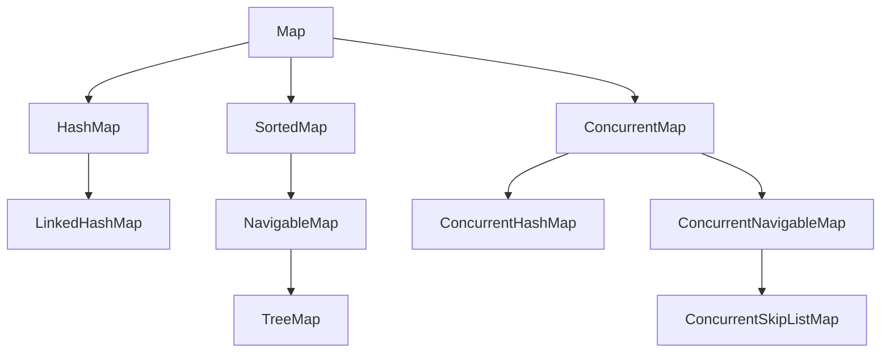

## 정의

**`java.util.Map<K,V>`** 는 **key 와 value 의 쌍으로 데이터를 저장** 하는 자료구조의 인터페이스. **하나의 key 에는 하나의 value 만 매핑**, 중복 key 는 허용하지 않는다.

`Map` 은 [[Collection]] 을 extends 하지 **않는다** (key-value 쌍 의미가 단일 원소와 다르므로). 그래도 `keySet()`, `values()`, `entrySet()` 을 통해 `Collection` 인터페이스의 view 를 제공.

## 언제 쓰나

- **key-value 매핑**: 이름 -> 나이, ID -> 객체 등 연관 관계 저장
- **빠른 조회**: key 로 O(1) 또는 O(log n) 에 value 를 찾을 때
- **그룹핑**: 카테고리별 항목 목록 (`Map<String, List<T>>`)
- **카운팅**: 단어 빈도, 이벤트 횟수 (`Map<String, Integer>`)
- **캐시**: 계산 결과를 key 로 저장해 재사용

## 시각화: Map 구현체 계층



## 핵심 메서드

| 메서드 | 의미 |
|:---|:---|
| `put(K, V)` | 매핑 추가 또는 갱신, 이전 값 반환 |
| `get(Object)` | key 로 value 조회, 없으면 null |
| `getOrDefault(Object, V)` | 없으면 기본값 반환 |
| `containsKey(Object)` | key 존재 여부 |
| `containsValue(Object)` | value 존재 여부 (보통 O(n)) |
| `remove(Object)` | key 제거, 이전 값 반환 |
| `size()`, `isEmpty()` | 크기 |
| `keySet()` | key 집합 (Set view) |
| `values()` | value 컬렉션 (Collection view) |
| `entrySet()` | key-value 쌍 집합 (Set view) |

### Java 8+ 기본 메서드

```java
// 없으면 삽입, 있으면 무시
map.putIfAbsent(key, value);

// 없으면 람다 실행 후 삽입 (비용 절약)
map.computeIfAbsent(key, k -> new ArrayList<>());

// 있으면 람다로 갱신
map.computeIfPresent(key, (k, v) -> v + 1);

// 없으면 초기값, 있으면 함수 적용
map.compute(key, (k, v) -> v == null ? 1 : v + 1);

// 없으면 value 삽입, 있으면 remappingFunction 적용
map.merge(key, 1, Integer::sum);

// 조건부 교체
map.replace(key, oldVal, newVal);

// 모든 값에 함수 적용
map.replaceAll((k, v) -> v.toUpperCase());

// 람다로 순회
map.forEach((k, v) -> System.out.println(k + "=" + v));
```

## 구현체 비교

| 구현 | 순서 | thread-safe | null key | null value | 백킹 |
|:---|:---|:---:|:---:|:---:|:---|
| **[[HashMap]]** | 없음 | ✗ | ✓ (1개) | ✓ | 해시 테이블 |
| **[[LinkedHashMap]]** | 삽입/접근 순서 | ✗ | ✓ (1개) | ✓ | 해시 + linked list |
| **[[TreeMap]]** | 정렬 | ✗ | ✗ | ✓ | Red-Black Tree |
| **`Hashtable`** (legacy) | 없음 | ✓ (메서드) | ✗ | ✗ | 해시 |
| **[[ConcurrentHashMap]]** | 없음 | ✓ (bin-level) | ✗ | ✗ | 해시 + CAS |
| **`EnumMap`** | enum 선언 순서 | ✗ | ✗ | ✓ | 배열 |
| **`WeakHashMap`** | 없음 | ✗ | ✓ | ✓ | key 약참조 |

## 불변 Map (Java 9+)

```java
// Map.of: 불변, null 비허용, 중복 key 시 IllegalArgumentException
Map<String, Integer> ages = Map.of("Alice", 30, "Bob", 25);

// 10개 이상이거나 일관성 있게 표현하려면 ofEntries
Map<String, Integer> more = Map.ofEntries(
    Map.entry("a", 1),
    Map.entry("b", 2),
    Map.entry("c", 3)
);

// Map.copyOf: 기존 Map 을 불변으로 복사
Map<String, Integer> copy = Map.copyOf(mutableMap);

// Collections.unmodifiableMap: 불변 뷰 (원본 변경 반영)
Map<String, Integer> view = Collections.unmodifiableMap(mutableMap);
```

> [!IMPORTANT]
> `Map.of` 는 **순서를 보장하지 않는다**. 반복 순서가 실행마다 다를 수 있다. 순서가 필요하면 `LinkedHashMap` 또는 `TreeMap` 사용.

## entrySet 순회가 가장 효율적

```java
// 비효율: key 로 다시 get (해시 lookup 2번)
for (String k : map.keySet()) {
    System.out.println(k + "=" + map.get(k));
}

// 효율: entrySet 직접 순회 (해시 lookup 1번)
for (Map.Entry<String, Integer> e : map.entrySet()) {
    System.out.println(e.getKey() + "=" + e.getValue());
}

// Java 8+ forEach (가장 간결)
map.forEach((k, v) -> System.out.println(k + "=" + v));
```

## Java 17+ 실전: 단어 빈도 카운터

```java
import java.util.*;
import java.util.stream.*;

// merge 로 단어 카운팅
String text = "apple banana apple cherry banana apple";
Map<String, Integer> freq = new HashMap<>();
for (String word : text.split("\\s+")) {
    freq.merge(word, 1, Integer::sum);
}
// {apple=3, banana=2, cherry=1}

// Stream 으로 동일 결과
Map<String, Long> freqStream = Arrays.stream(text.split("\\s+"))
    .collect(Collectors.groupingBy(w -> w, Collectors.counting()));
```

## Java 17+ 실전: 그룹핑 (multimap)

```java
import java.util.*;

record Person(String name, String dept) {}

List<Person> people = List.of(
    new Person("Alice", "Engineering"),
    new Person("Bob", "Marketing"),
    new Person("Carol", "Engineering")
);

// computeIfAbsent 로 그룹핑
Map<String, List<Person>> byDept = new HashMap<>();
people.forEach(p ->
    byDept.computeIfAbsent(p.dept(), k -> new ArrayList<>()).add(p)
);

// Stream groupingBy (더 간결)
Map<String, List<Person>> byDeptStream = people.stream()
    .collect(Collectors.groupingBy(Person::dept));
```

## Java 17+ 실전: LRU 캐시 (LinkedHashMap)

```java
import java.util.*;

// LinkedHashMap 의 accessOrder=true + removeEldestEntry 로 LRU 캐시
class LruCache<K, V> extends LinkedHashMap<K, V> {
    private final int maxSize;

    LruCache(int maxSize) {
        super(maxSize, 0.75f, true);   // accessOrder=true
        this.maxSize = maxSize;
    }

    @Override
    protected boolean removeEldestEntry(Map.Entry<K, V> eldest) {
        return size() > maxSize;
    }
}

LruCache<String, String> cache = new LruCache<>(3);
cache.put("a", "1");
cache.put("b", "2");
cache.put("c", "3");
cache.get("a");        // a 를 최근 사용으로 이동
cache.put("d", "4");   // b 가 제거됨 (가장 오래된 미사용)
```

## Java 17+ 실전: 계단식 요금 룩업 (TreeMap)

```java
import java.util.TreeMap;

// 1000원 미만: 0%, 1000원 이상: 5%, 5000원 이상: 10%, 10000원 이상: 15%
TreeMap<Integer, Integer> discountTable = new TreeMap<>();
discountTable.put(0,     0);
discountTable.put(1000,  5);
discountTable.put(5000,  10);
discountTable.put(10000, 15);

int getDiscount(int amount) {
    return discountTable.floorEntry(amount).getValue();
}

getDiscount(3000);   // 5%
getDiscount(9999);   // 10%
getDiscount(10000);  // 15%
```

## 동기화 옵션

```java
// 옵션 1: Collections.synchronizedMap (복합 연산은 외부 동기화 필요)
Map<K, V> sync = Collections.synchronizedMap(new HashMap<>());
synchronized (sync) {
    if (!sync.containsKey(key)) sync.put(key, value);   // check-then-act
}

// 옵션 2: ConcurrentHashMap (권장, 복합 연산도 원자적)
Map<K, V> concurrent = new ConcurrentHashMap<>();
concurrent.putIfAbsent(key, value);   // 원자적

// 옵션 3: 정렬 + 동시성
Map<K, V> sortedConcurrent = new java.util.concurrent.ConcurrentSkipListMap<>();
```

[[ConcurrentHashMap]] 이 거의 항상 `synchronizedMap` 보다 빠르다.

## 함정

### 1. null key/value 구현체별 차이

```java
HashMap<String, String> hm = new HashMap<>();
hm.put(null, "v");    // OK
hm.put("k", null);    // OK

TreeMap<String, String> tm = new TreeMap<>();
tm.put(null, "v");    // NullPointerException (compareTo(null))

ConcurrentHashMap<String, String> chm = new ConcurrentHashMap<>();
chm.put(null, "v");   // NullPointerException
chm.put("k", null);   // NullPointerException
```

### 2. entrySet/keySet/values 는 live view

```java
Map<String, Integer> map = new HashMap<>(Map.of("a", 1, "b", 2));
Set<String> keys = map.keySet();
map.put("c", 3);
keys.contains("c");   // true (live view)

// 순회 중 map 수정 → ConcurrentModificationException
for (String k : map.keySet()) {
    map.remove(k);   // ConcurrentModificationException
}

// 안전한 제거
map.entrySet().removeIf(e -> e.getValue() < 2);
```

### 3. getOrDefault vs computeIfAbsent 혼동

```java
// getOrDefault: 기본값 반환만, map 에 추가 안 함
map.getOrDefault("missing", new ArrayList<>());   // map 에 추가 안 됨

// computeIfAbsent: 없으면 람다 실행 후 map 에 추가
map.computeIfAbsent("missing", k -> new ArrayList<>());   // map 에 추가됨
```

### 4. Map.of 중복 key 예외

```java
// 컴파일은 되지만 런타임 예외
Map<String, Integer> bad = Map.of("a", 1, "a", 2);   // IllegalArgumentException
```

## 관련 위키

- [[Collection]]
- [[HashMap]]
- [[LinkedHashMap]]
- [[TreeMap]]
- [[ConcurrentHashMap]]
- [[fail-fast iterator]]
- [[ConcurrentModificationException]]
- [[Iterable]]
- [[Object]]
