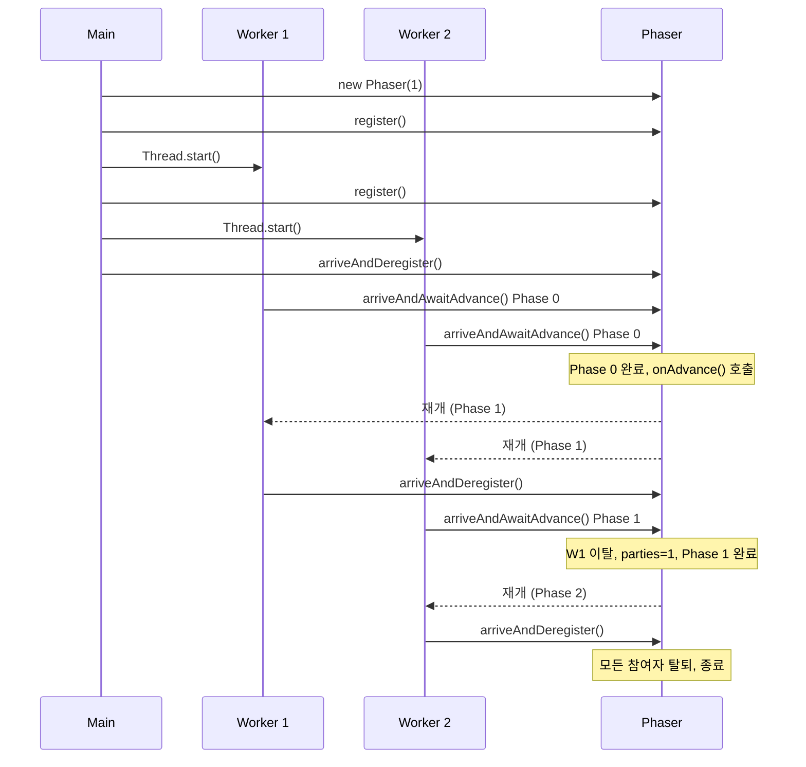

## 정의

**`java.util.concurrent.Phaser`** 는 [[CyclicBarrier]] 의 확장. **참여자 수가 동적으로 변할 수 있는** 단계별 동기화. JDK 1.7 도입.

## 시각화

```anim:java-phaser-dynamic
{}
```

## 핵심 메서드

```java
Phaser phaser = new Phaser(N);

phaser.arriveAndAwaitAdvance();    // 도착 + 다른 참여자 대기
phaser.arrive();                    // 도착만 (대기 안 함)
phaser.awaitAdvance(phase);         // 특정 phase 까지 대기
phaser.register();                  // 참여자 추가
phaser.arriveAndDeregister();       // 도착 + 자신 제거

phaser.getPhase();                  // 현재 phase 번호
phaser.getRegisteredParties();      // 등록된 참여자 수
phaser.getArrivedParties();         // 이미 도착한 참여자 수
phaser.getUnarrivedParties();       // 아직 도착 안 한 참여자 수
phaser.isTerminated();              // phaser 종료 여부
```

## 동적 참여 예

```java
Phaser phaser = new Phaser(1);   // 시작 시 main 만 등록

for (int i = 0; i < workers; i++) {
    phaser.register();           // worker 추가
    new Thread(() -> {
        while (running) {
            doPhaseWork();
            phaser.arriveAndAwaitAdvance();   // 다른 worker 대기
        }
        phaser.arriveAndDeregister();         // 종료 시 deregister
    }).start();
}

phaser.arriveAndDeregister();   // main 도 제거
```

worker 가 도중에 추가/종료될 수 있는 경우 [[CyclicBarrier]] 로는 표현 어렵다.

## onAdvance 콜백

```java
Phaser phaser = new Phaser() {
    @Override
    protected boolean onAdvance(int phase, int registered) {
        System.out.println("phase " + phase + " done");
        return phase >= 10 || registered == 0;   // true 면 종료
    }
};
```

각 phase 가 끝날 때 호출. `true` 반환하면 phaser 종료.

## CountDownLatch / CyclicBarrier / Phaser 비교

| 기능 | CountDownLatch | CyclicBarrier | Phaser |
|:---|:---:|:---:|:---:|
| 재사용 | ✗ | ✓ | ✓ |
| 참여자 동적 변경 | ✗ | ✗ | ✓ |
| 한 명만 도착 (대기 안 함) | ✗ | ✗ | ✓ (`arrive`) |
| 콜백 | ✗ | barrier action | onAdvance |
| 트리 구조 (계층) | ✗ | ✗ | ✓ (parent phaser) |

가장 유연하지만 그만큼 복잡. 단순 N → 0 은 CountDownLatch, 고정 N 반복은 CyclicBarrier 가 더 간단.

## 다단계 배리어 흐름



각 phase 마다 도착해야 하는 참여자 수가 달라질 수 있음을 보여준다.

## 내부 구조 (분산 카운터)

`Phaser` 는 단일 `long` 필드 (`state`) 에 여러 값을 비트 패킹한다.

```
state = [unarrived (16b)] [parties (16b)] [phase (31b)] [terminated (1b)]
```

- `unarrived`: 아직 arrive 하지 않은 참여자 수
- `parties`: 등록된 총 참여자 수
- `phase`: 현재 phase 번호 (0 ~  Integer.MAX_VALUE 순환)
- `terminated`: phaser 종료 여부

모든 상태 전이는 `Unsafe.compareAndSwapLong` (CAS) 으로 이루어진다. [[CyclicBarrier]] 처럼 전역 락이 없고, **arrive 는 lock-free** 다. 단, 대기 중인 스레드의 park/unpark 는 내부 큐로 관리.

계층적 Phaser (parent 지정 시) 는 마지막 `unarrived` 가 0 이 되면 **자동으로 parent 에 arrive** 를 위임한다.

## forceTermination

```java
phaser.forceTermination();
```

진행 중인 모든 phase 를 중단하고 phaser 를 즉시 종료 상태로 만든다. `awaitAdvance()` 로 대기 중이던 스레드는 음수 phase (terminated marker) 를 받으며 깨어난다.

```java
// 취소 신호 처리 패턴
void cancelAll(Phaser phaser) {
    phaser.forceTermination();
    // 이후 isTerminated() == true
    // getPhase() 반환값이 음수가 됨
}

// 종료 감지
int phase = phaser.arriveAndAwaitAdvance();
if (phase < 0) {
    // phaser 가 terminated, 정리 작업
}
```

## 계층적 Phaser (parent 지정)

대규모 병렬 작업에서 단일 Phaser 의 CAS 경합이 심해질 때, **트리 구조의 Phaser** 로 분산시킬 수 있다.

```java
// 1024개 스레드: 32개 그룹, 각 32 스레드
Phaser root = new Phaser();

List<Phaser> children = new ArrayList<>();
for (int g = 0; g < 32; g++) {
    Phaser child = new Phaser(root, 32);  // parent = root, parties = 32
    children.add(child);
}

// 각 그룹의 스레드는 child phaser 를 사용
// 그룹 내 32명이 모두 도착하면 root 에 arrive 전달
// root 에서 32개 그룹 전체가 도착해야 phase 전환
```

이 방식으로 O(스레드 수) CAS 경합을 O(log 스레드 수) 수준으로 줄일 수 있다. ForkJoinPool 의 병렬 처리와 유사한 트리 분할.

## 실전 예시: 다단계 ETL 파이프라인

```java
// Java 17+
record Worker(int id, List<String> data) implements Runnable {

    @Override
    public void run() {
        Phaser phaser = PipelineContext.phaser();

        // Phase 0: 데이터 추출
        var extracted = extract(data);
        phaser.arriveAndAwaitAdvance();

        // Phase 1: 변환 (모든 worker 의 추출이 끝난 뒤)
        var transformed = transform(extracted);
        phaser.arriveAndAwaitAdvance();

        // Phase 2: 적재
        load(transformed);
        phaser.arriveAndDeregister();  // 완료, 참여 종료
    }
}

// 메인
Phaser etlPhaser = new Phaser(1) {
    @Override
    protected boolean onAdvance(int phase, int registered) {
        System.out.printf("[ETL] Phase %d 완료, 참여자=%d%n", phase, registered);
        return registered == 0;   // 모두 deregister 되면 종료
    }
};

for (int i = 0; i < WORKER_COUNT; i++) {
    etlPhaser.register();
    new Thread(new Worker(i, chunks.get(i))).start();
}
etlPhaser.arriveAndDeregister();   // main thread 제거
```

## JMM 보장

- `arriveAndAwaitAdvance()` 반환 이후에는 이전 phase 에서 다른 모든 스레드가 쓴 값이 **visible**
- arrive 시 CAS (내부 `Unsafe.compareAndSwapLong`) 가 happens-before fence 역할
- phase 경계를 넘으면 공유 상태의 안전한 가시성이 보장됨

## 성능 특성

| 항목 | 특성 |
|:---|:---|
| arrive (lock-free) | CAS 기반, 경합 없을 때 매우 빠름 |
| 대기 (awaitAdvance) | park 기반, CPU 낭비 없음 |
| 확장성 | 단일 Phaser: 수백 스레드까지 양호, 이상이면 계층 구조 권장 |
| state 필드 | 단일 long 비트 패킹, 원자 갱신 |

## 함정

### 1. arrive 와 await 는 별개

`arrive()` 는 도착 신호만 보내고 **대기하지 않는다**. `awaitAdvance(phaser.getPhase())` 를 별도로 호출해야 다음 phase 시작을 기다릴 수 있다.

### 2. unarrived 가 0 이 돼야 phase 전환

```java
Phaser phaser = new Phaser(2);
phaser.arrive();        // parties=2, unarrived=1, phase=0
// phase 는 아직 0! 두 번째 arrive 가 있어야 phase 1 로 전환
phaser.arrive();        // 이제 phase=1
```

### 3. onAdvance 에서 예외 발생 시 종료

`onAdvance` 에서 unchecked exception 이 발생하면 phaser 가 **즉시 terminated** 된다. 예외 처리를 onAdvance 내부에서 완결해야 한다.

### 4. register 없이 arrive 시 IllegalStateException

```java
Phaser phaser = new Phaser(0);  // 참여자 0
phaser.arrive();                 // IllegalStateException: parties=0
```

arrive 전에 반드시 `register()` 또는 생성자 인자로 parties 를 등록해야 한다.

## 관련 위키

- [[CountDownLatch]] - 일회용 래치
- [[CyclicBarrier]] - 고정 참여자 재사용 배리어
- [[Semaphore]] - 허가 기반 동시성 제어
- [[Blocking]] - 블로킹 동기화 패턴
