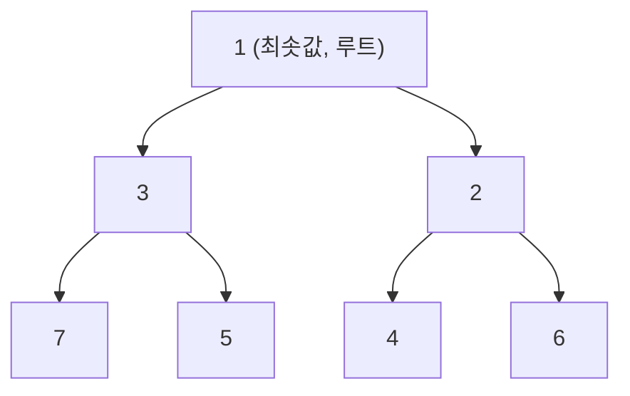
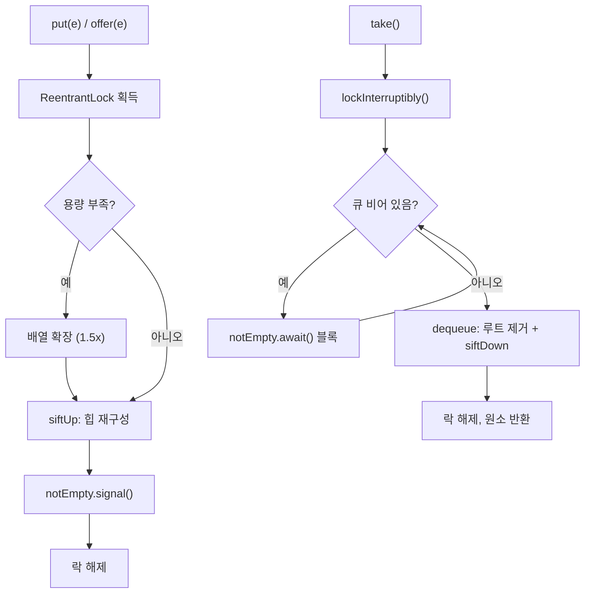

## 정의

**`java.util.concurrent.PriorityBlockingQueue<E>`** 는 [[PriorityQueue]] 의 동시성 + blocking 버전. **unbounded** 힙 기반 [[BlockingQueue]].

- 원소는 `Comparable` (자연 순서) 또는 생성자에 전달한 `Comparator` 로 정렬
- `put` 은 절대 블록하지 않음 (unbounded 이므로 항상 공간 있음)
- `take` 는 큐가 비어 있을 때만 블록
- 단일 [[ReentrantLock]] 으로 보호
- null 원소 불허

JDK 1.5 도입.

## 언제 쓰나

- **우선순위 기반 작업 스케줄러**: 긴급 작업을 일반 작업보다 먼저 처리
- **이벤트 처리 시스템**: 중요도에 따라 이벤트 순서 결정
- **멀티스레드 다익스트라/A\***: 우선순위 큐를 여러 스레드가 공유
- **타임아웃 관리**: 만료 시간 기준으로 정렬, 가장 빨리 만료되는 것부터 처리

## 시각화: 힙 구조



최소 힙 (min-heap) 기반. `poll`/`take` 는 항상 루트 (최솟값) 를 반환하고 힙을 재구성한다.

## 시각화: put/take 흐름



## 내부 구조

```java
public class PriorityBlockingQueue<E> extends AbstractQueue<E>
        implements BlockingQueue<E>, Serializable {

    private transient Object[] queue;       // 힙 배열
    private transient int size;
    private transient Comparator<? super E> comparator;
    private final ReentrantLock lock = new ReentrantLock();
    private final Condition notEmpty = lock.newCondition();

    // put 은 절대 블록 안 함 (unbounded)
    public void put(E e) {
        offer(e);
    }

    public boolean offer(E e) {
        if (e == null) throw new NullPointerException();
        final ReentrantLock lock = this.lock;
        lock.lock();
        try {
            int i = size;
            if (i >= queue.length)
                tryGrow(queue, i);   // 배열 확장
            siftUp(i, e, queue, comparator);
            size = i + 1;
            notEmpty.signal();
            return true;
        } finally {
            lock.unlock();
        }
    }

    public E take() throws InterruptedException {
        final ReentrantLock lock = this.lock;
        lock.lockInterruptibly();
        try {
            E result;
            while ((result = dequeue()) == null)
                notEmpty.await();   // 큐가 빌 때만 블록
            return result;
        } finally {
            lock.unlock();
        }
    }

    public E poll() {
        final ReentrantLock lock = this.lock;
        lock.lock();
        try {
            return dequeue();   // 비어 있으면 null 반환 (블록 없음)
        } finally {
            lock.unlock();
        }
    }
}
```

## 복잡도

| 작업 | 시간 | 비고 |
|:---|:---:|:---|
| `offer`/`put` | O(log n) | siftUp |
| `take`/`poll` | O(log n) | siftDown |
| `peek` | O(1) | 루트 반환 |
| `remove(o)` | O(n) | 선형 검색 + siftDown |
| `contains(o)` | O(n) | 선형 검색 |
| 순회 | O(n) | 정렬 순서 보장 안 됨 |

## Comparator 사용

```java
import java.util.concurrent.PriorityBlockingQueue;
import java.util.Comparator;

// 자연 순서 (Comparable 구현 필요)
record Task(int priority, String name) implements Comparable<Task> {
    @Override
    public int compareTo(Task other) {
        return Integer.compare(this.priority, other.priority);
    }
}

PriorityBlockingQueue<Task> naturalOrder = new PriorityBlockingQueue<>();
naturalOrder.put(new Task(3, "low"));
naturalOrder.put(new Task(1, "high"));
naturalOrder.put(new Task(2, "medium"));
naturalOrder.take();   // Task(1, "high") - 우선순위 낮은 숫자가 먼저

// Comparator 로 역순 (높은 숫자 = 높은 우선순위)
PriorityBlockingQueue<Task> reversed = new PriorityBlockingQueue<>(
    11,
    Comparator.comparingInt(Task::priority).reversed()
);
reversed.put(new Task(3, "low"));
reversed.put(new Task(1, "high"));
reversed.take();   // Task(3, "low") - 숫자 큰 것이 먼저
```

## Java 17+ 실전: 우선순위 작업 스케줄러

```java
import java.util.concurrent.*;

sealed interface Priority {
    record Urgent() implements Priority {}
    record Normal() implements Priority {}
    record Low() implements Priority {}
}

record WorkItem(Priority priority, String payload, long createdAt)
        implements Comparable<WorkItem> {

    private static int priorityRank(Priority p) {
        return switch (p) {
            case Priority.Urgent u -> 0;
            case Priority.Normal n -> 1;
            case Priority.Low l -> 2;
        };
    }

    @Override
    public int compareTo(WorkItem other) {
        int cmp = Integer.compare(priorityRank(this.priority), priorityRank(other.priority));
        // 같은 우선순위면 먼저 들어온 것 우선 (FIFO)
        return cmp != 0 ? cmp : Long.compare(this.createdAt, other.createdAt);
    }
}

class PriorityWorkerPool {
    private final PriorityBlockingQueue<WorkItem> queue =
        new PriorityBlockingQueue<>();
    private final ExecutorService workers;

    PriorityWorkerPool(int threadCount) {
        workers = Executors.newFixedThreadPool(threadCount);
        for (int i = 0; i < threadCount; i++) {
            workers.submit(this::workerLoop);
        }
    }

    private void workerLoop() {
        try {
            while (!Thread.currentThread().isInterrupted()) {
                WorkItem item = queue.take();   // 우선순위 높은 것부터
                process(item);
            }
        } catch (InterruptedException e) {
            Thread.currentThread().interrupt();
        }
    }

    public void submit(Priority priority, String payload) {
        queue.put(new WorkItem(priority, payload, System.nanoTime()));
    }

    private void process(WorkItem item) {
        System.out.printf("[%s] %s%n", item.priority().getClass().getSimpleName(), item.payload());
    }

    public void shutdown() {
        workers.shutdownNow();
    }
}
```

## Java 17+ 실전: 타임아웃 관리 (DelayQueue 대안)

```java
import java.util.concurrent.*;
import java.time.Instant;

// 만료 시간 기준 정렬
record TimedTask(Instant deadline, Runnable action)
        implements Comparable<TimedTask> {
    @Override
    public int compareTo(TimedTask other) {
        return this.deadline.compareTo(other.deadline);
    }
}

class TimeoutManager {
    private final PriorityBlockingQueue<TimedTask> tasks =
        new PriorityBlockingQueue<>();

    TimeoutManager() {
        Thread.ofVirtual().start(this::checkLoop);
    }

    public void schedule(Instant deadline, Runnable action) {
        tasks.put(new TimedTask(deadline, action));
    }

    private void checkLoop() {
        try {
            while (!Thread.currentThread().isInterrupted()) {
                TimedTask task = tasks.peek();
                if (task == null) {
                    Thread.sleep(10);
                    continue;
                }
                long delay = Instant.now().until(task.deadline(),
                    java.time.temporal.ChronoUnit.MILLIS);
                if (delay <= 0) {
                    tasks.poll();
                    task.action().run();
                } else {
                    Thread.sleep(Math.min(delay, 100));
                }
            }
        } catch (InterruptedException e) {
            Thread.currentThread().interrupt();
        }
    }
}
```

## PriorityQueue vs PriorityBlockingQueue

| 항목 | PriorityQueue | PriorityBlockingQueue |
|:---|:---:|:---:|
| Thread-safe | ✗ | ✓ |
| `put` 블록 | N/A | 절대 블록 안 함 |
| `take` 블록 | N/A | 비어 있을 때 블록 |
| null 허용 | ✗ | ✗ |
| unbounded | ✓ | ✓ |
| 도입 | JDK 1.5 | JDK 1.5 |
| 용도 | 단일 스레드 | 멀티스레드 |

## 함정

### 1. unbounded → OOM

```java
// 위험: producer 가 빠르고 consumer 가 느리면 메모리 무한 증가
PriorityBlockingQueue<Task> queue = new PriorityBlockingQueue<>();
// producer 가 초당 1000개 추가, consumer 가 초당 100개 처리
// → 큐가 계속 증가 → OOM

// 해결: 외부 backpressure 또는 bounded 큐 사용
// bounded 가 필요하면 ArrayBlockingQueue 사용
```

### 2. 순회 순서는 정렬 순서가 아님

```java
PriorityBlockingQueue<Integer> q = new PriorityBlockingQueue<>();
q.addAll(List.of(5, 1, 3, 2, 4));

// iterator 는 힙 배열 순서 (정렬 아님)
for (int x : q) {
    System.out.print(x + " ");   // 1 2 3 5 4 (힙 내부 순서)
}

// 정렬된 결과가 필요하면 모두 poll
List<Integer> sorted = new ArrayList<>();
while (!q.isEmpty()) sorted.add(q.poll());
// sorted = [1, 2, 3, 4, 5]
```

### 3. remove(Object) 는 O(n)

```java
PriorityBlockingQueue<Task> q = new PriorityBlockingQueue<>();
// 특정 작업 취소
q.remove(specificTask);   // O(n) 선형 검색 + 힙 재구성
```

취소가 빈번하면 `DelayQueue` 또는 취소 플래그 패턴 고려.

### 4. Comparator 와 equals 불일치

`PriorityBlockingQueue` 는 `Comparator` 가 0 을 반환해도 중복을 허용한다 ([[TreeSet]] 과 다름). 하지만 `remove(Object)` 는 `equals` 로 검색하므로 불일치 시 예상치 못한 동작.

### 5. 인터럽트 처리

```java
try {
    E item = queue.take();
} catch (InterruptedException e) {
    Thread.currentThread().interrupt();   // 인터럽트 상태 복원 필수
    return;
}
```

## 관련 위키

- [[BlockingQueue]]
- [[PriorityQueue]]
- [[ReentrantLock]]
- [[LinkedBlockingQueue]]
- [[ArrayBlockingQueue]]
- [[Collection]]
- [[Queue]]
- [[TreeSet]]
