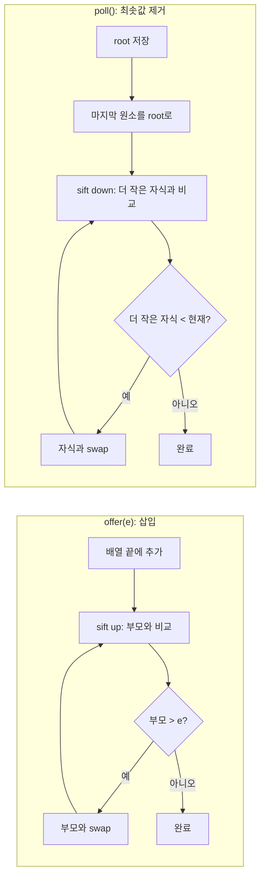

## 정의

**`java.util.PriorityQueue<E>`** 는 **이진 힙 (binary heap)** 기반의 [[Queue]] 구현. FIFO 가 아닌 **우선순위 순서** 로 원소를 꺼낸다.

기본은 **min-heap**, `Comparable` 의 자연 순서나 `Comparator` 로 우선순위 결정. 가장 작은 (또는 highest-priority) 원소가 head.

## 사용 상황

| 상황 | 이유 |
|:---|:---|
| Top-K 원소 추출 | O(n log k), 전체 정렬보다 효율적 |
| 작업 스케줄러 | 우선순위별 실행 순서 보장 |
| Dijkstra / A* 최단경로 | 최소 비용 노드를 O(log n) 에 꺼냄 |
| Merge K sorted lists | 각 리스트 head 를 힙에 유지 |
| 이벤트 드리븐 시뮬레이션 | 타임스탬프 기반 정렬 |

## 시각화

```anim:java-priorityqueue-heap
{}
```

## 내부 구조

```java
public class PriorityQueue<E> extends AbstractQueue<E> ... {
    transient Object[] queue;      // 힙을 표현하는 배열
    private int size;
    private final Comparator<? super E> comparator;
}
```

배열로 이진 힙을 표현. 인덱스 i 일 때:
- 부모: `(i - 1) / 2`
- 왼쪽 자식: `2i + 1`
- 오른쪽 자식: `2i + 2`

```text
배열: [1, 3, 2, 6, 5, 8, 7]
힙:        1
         /   \
        3     2
       / \   / \
      6   5 8   7
```

`peek` (= queue[0]) 가 항상 최솟값.

## offer / poll 흐름



## 복잡도

| 작업 | 시간 |
|:---|:---:|
| `offer(e)` (add) | **O(log n)** (sift up) |
| `poll()` (remove min) | **O(log n)** (sift down) |
| `peek()` | **O(1)** |
| `contains` | O(n) |
| `remove(Object)` | O(n) (선형 검색 + sift) |

## 사용 예

### 최솟값 N 개 (Top-K)

```java
PriorityQueue<Integer> minHeap = new PriorityQueue<>();
for (int x : data) {
    minHeap.offer(x);
    if (minHeap.size() > k) minHeap.poll();   // k 보다 크면 제거
}
// minHeap 에는 최대 k 개의 가장 큰 값들이 들어있음
```

`O(n log k)` 로 Top-K 해결. 전체 정렬 `O(n log n)` 보다 효율적.

### max-heap 만들기

```java
// Comparator.reverseOrder() 로 max-heap 구현
PriorityQueue<Integer> maxHeap = new PriorityQueue<>(Comparator.reverseOrder());
maxHeap.offer(3);
maxHeap.offer(1);
maxHeap.offer(5);
maxHeap.poll();   // 5 (가장 큰 값)
```

### 작업 스케줄러

```java
PriorityQueue<Task> scheduler = new PriorityQueue<>(
    Comparator.comparingInt(Task::priority).reversed()   // 우선순위 높은 게 먼저
);
scheduler.offer(new Task(...));
Task next = scheduler.poll();
```

### Dijkstra 알고리즘

```java
PriorityQueue<int[]> pq = new PriorityQueue<>(
    (a, b) -> Integer.compare(a[1], b[1])   // [node, distance]
);
pq.offer(new int[]{start, 0});
int[] dist = new int[n];
Arrays.fill(dist, Integer.MAX_VALUE);
dist[start] = 0;

while (!pq.isEmpty()) {
    int[] cur = pq.poll();
    int node = cur[0], d = cur[1];
    if (d > dist[node]) continue;          // 이미 더 짧은 경로 처리됨
    for (int[] edge : graph[node]) {
        int next = edge[0], cost = edge[1];
        if (dist[node] + cost < dist[next]) {
            dist[next] = dist[node] + cost;
            pq.offer(new int[]{next, dist[next]});
        }
    }
}
```

### K 개의 정렬된 배열 병합

```java
// int[][] arrays = 정렬된 k 개의 배열
PriorityQueue<int[]> pq = new PriorityQueue<>((a, b) -> a[0] - b[0]);
// [값, 배열인덱스, 원소인덱스]
for (int i = 0; i < arrays.length; i++) {
    if (arrays[i].length > 0) {
        pq.offer(new int[]{arrays[i][0], i, 0});
    }
}

List<Integer> result = new ArrayList<>();
while (!pq.isEmpty()) {
    int[] cur = pq.poll();
    result.add(cur[0]);
    int ai = cur[1], ei = cur[2];
    if (ei + 1 < arrays[ai].length) {
        pq.offer(new int[]{arrays[ai][ei + 1], ai, ei + 1});
    }
}
// O(n log k), n = 전체 원소 수
```

## 힙 정렬 (Heap Sort)

PriorityQueue 를 이용한 O(n log n) 정렬. 실용적이진 않지만 동작 원리를 이해하는 데 좋다.

```java
static int[] heapSort(int[] arr) {
    PriorityQueue<Integer> minHeap = new PriorityQueue<>();
    for (int x : arr) minHeap.offer(x);

    int[] result = new int[arr.length];
    for (int i = 0; i < arr.length; i++) {
        result[i] = minHeap.poll();
    }
    return result;   // 오름차순 정렬
}
```

> 실무에서는 `Arrays.sort()` 가 dual-pivot quicksort 를 써서 캐시 효율이 훨씬 좋다. 이 패턴은 알고리즘 이해용.

## 함정

### 1. 순회 순서가 정렬 순서가 아니다

```java
PriorityQueue<Integer> pq = new PriorityQueue<>(List.of(5, 3, 8, 1));
for (Integer x : pq) System.out.print(x + " ");   // 1 3 8 5 (힙 배열 순서)
```

원소를 정렬된 순서로 보려면 `poll()` 을 반복하거나 별도 정렬 필요.

### 2. null 비허용

```java
pq.offer(null);   // NullPointerException
```

### 3. thread-safe 가 아님

[[PriorityBlockingQueue]] 가 동시성 버전.

### 4. remove(Object) 는 O(n)

힙에서 임의 원소를 빠르게 찾는 방법이 없다. 빠른 remove 가 필요하면 `TreeSet` 또는 외부 인덱싱 자료구조.

> [!CAUTION]
> `Comparator` 가 `equals` 와 일치하지 않으면 `remove(Object)` 가 동작하지 않을 수 있다. `Comparator` 가 두 원소를 "같다" 고 보더라도 `equals` 가 false 면 다른 객체로 취급.

### 5. 초기 용량과 정렬 모드

```java
// 힙 생성 시 초기 용량 + Comparator 지정
PriorityQueue<String> pq = new PriorityQueue<>(100, Comparator.reverseOrder());
```

초기 용량은 힌트. 자동 grow 되지만, 대량 삽입이 예상되면 미리 지정해 reallocation 방지.

## 초기 데이터 일괄 삽입

```java
// Collection 을 넘기면 O(n) heapify 로 힙 구성 (개별 offer 의 O(n log n) 보다 빠름)
List<Integer> data = List.of(5, 3, 8, 1, 9, 2);
PriorityQueue<Integer> pq = new PriorityQueue<>(data);
// pq.poll() = 1 (최솟값)

// size 힌트 없이 만들어도 내부에서 배열 grow 처리
PriorityQueue<Integer> pq2 = new PriorityQueue<>(data.size(), Comparator.reverseOrder());
pq2.addAll(data);
// pq2.poll() = 9 (최댓값)
```

## 관련 위키

- [[Queue]]
- [[ArrayDeque]]
- [[PriorityBlockingQueue]]
- [[Collection]]
- [[Iterable]]
