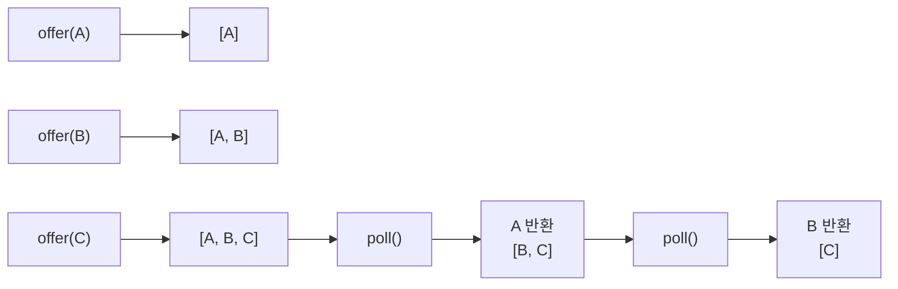
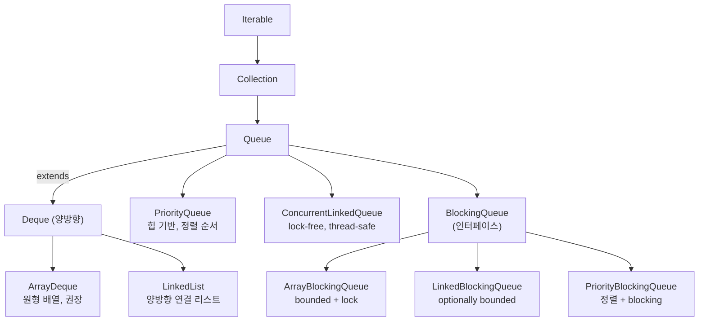

## 정의

**`java.util.Queue<E>`** 는 **FIFO (First-In, First-Out)** 처리 순서를 가진 [[Collection]] 인터페이스. 한쪽 끝 (tail) 에 추가하고 반대쪽 (head) 에서 제거하는 자료구조.

`PriorityQueue` 처럼 다른 순서 (heap) 인 구현체도 있지만, 인터페이스 자체는 "원소를 꺼내는 순서를 정의" 정도의 추상화다.

## 시각화: FIFO 큐 동작



head 에서 꺼내고 tail 에 넣는 단방향 흐름.

## 두 그룹의 메서드

각 동작마다 **예외를 던지는 버전** 과 **특수값을 반환하는 버전** 이 존재한다.

| 동작 | 예외 throw | 특수값 반환 |
|:---|:---|:---|
| insert | `add(e)` | `offer(e)` |
| remove | `remove()` | `poll()` |
| examine | `element()` | `peek()` |

- **`add(e)`**: 용량 초과 시 `IllegalStateException`
- **`offer(e)`**: 용량 초과 시 `false` 반환 (bounded 큐에서 실용적)
- **`remove()`**: 비어 있으면 `NoSuchElementException`
- **`poll()`**: 비어 있으면 `null` 반환
- **`element()`**: 비어 있으면 `NoSuchElementException`
- **`peek()`**: 비어 있으면 `null` 반환

> [!IMPORTANT]
> 대부분의 코드에서는 **`offer` / `poll` / `peek` (특수값 버전) 이 안전**하다. `add` 가 던지는 예외는 bounded 큐를 쓸 때가 아니면 처리하기 어렵다.

## 시각화: 구현체 계층



## 구현체 선택 가이드

| 구현 | 백킹 | 특징 | 언제 |
|:---|:---|:---|:---|
| **[[ArrayDeque]]** | 원형 배열 | 빠름, null 불가, 권장 FIFO | 기본 선택 |
| **[[LinkedList]]** | 양방향 연결리스트 | 가장 단순, null 허용, 메모리 多 | 단순 코드 |
| **[[PriorityQueue]]** | 이진 힙 | 우선순위 순 꺼냄, 정렬 아님 | 우선순위 처리 |
| **[[ConcurrentLinkedQueue]]** | 연결리스트 (lock-free) | thread-safe, unbounded | 비동기 파이프라인 |
| **[[BlockingQueue]] 구현체** | 다양 | 가득/비어 있으면 block | producer-consumer |

## 기본 사용법

```java
import java.util.Queue;
import java.util.ArrayDeque;

Queue<String> queue = new ArrayDeque<>();

// 삽입
queue.offer("first");
queue.offer("second");
queue.offer("third");

// 들여다보기 (제거 안 함)
String head = queue.peek();       // "first", 큐 변화 없음

// 제거
String polled = queue.poll();     // "first"

// 비어 있는지 확인
boolean empty = queue.isEmpty();  // false

// FIFO 순회
while (!queue.isEmpty()) {
    System.out.println(queue.poll());
}
// 출력: second, third
```

## PriorityQueue: 우선순위 큐

```java
import java.util.PriorityQueue;
import java.util.Queue;
import java.util.Comparator;

// 자연 순서 (숫자 오름차순)
Queue<Integer> pq = new PriorityQueue<>();
pq.offer(30); pq.offer(10); pq.offer(20);
pq.poll();  // 10 (가장 작은 값 먼저)

// Comparator 로 내림차순 (큰 값 우선)
Queue<Integer> maxHeap = new PriorityQueue<>(Comparator.reverseOrder());
maxHeap.offer(10); maxHeap.offer(30); maxHeap.offer(20);
maxHeap.poll();  // 30

// 커스텀 객체
record Task(String name, int priority) {}

Queue<Task> tasks = new PriorityQueue<>(
    Comparator.comparingInt(Task::priority)
);
tasks.offer(new Task("low", 5));
tasks.offer(new Task("high", 1));
tasks.poll();  // Task("high", 1) 먼저
```

## Java 17+ 실전: BFS (너비 우선 탐색)

```java
import java.util.*;

// 그래프 BFS
Map<Integer, List<Integer>> graph = Map.of(
    1, List.of(2, 3),
    2, List.of(4),
    3, List.of(4, 5),
    4, List.of(),
    5, List.of()
);

List<Integer> bfs(int start) {
    Queue<Integer> queue = new ArrayDeque<>();
    Set<Integer> visited = new HashSet<>();
    List<Integer> order = new ArrayList<>();

    queue.offer(start);
    visited.add(start);

    while (!queue.isEmpty()) {
        int node = queue.poll();
        order.add(node);
        for (int neighbor : graph.getOrDefault(node, List.of())) {
            if (!visited.contains(neighbor)) {
                visited.add(neighbor);
                queue.offer(neighbor);
            }
        }
    }
    return order;   // [1, 2, 3, 4, 5]
}
```

## Java 17+ 실전: 작업 스케줄링 (PriorityQueue)

```java
import java.util.PriorityQueue;
import java.util.Queue;

record Job(int id, int priority, Runnable task)
        implements Comparable<Job> {
    @Override
    public int compareTo(Job other) {
        return Integer.compare(this.priority, other.priority);
    }
}

class Scheduler {
    private final Queue<Job> queue = new PriorityQueue<>();

    void submit(Job job) {
        queue.offer(job);
    }

    void runAll() {
        while (!queue.isEmpty()) {
            Job job = queue.poll();
            System.out.printf("Running job %d (priority %d)%n",
                job.id(), job.priority());
            job.task().run();
        }
    }
}
```

## Java 17+ 실전: LinkedList vs ArrayDeque 성능

```java
// LinkedList: 각 원소마다 Node 객체 할당 → GC 부담, 캐시 미스
Queue<Integer> linked = new LinkedList<>();
for (int i = 0; i < 100_000; i++) linked.offer(i);

// ArrayDeque: 배열 기반 원형 버퍼 → 캐시 친화적, 메모리 효율
Queue<Integer> array = new ArrayDeque<>(100_000);
for (int i = 0; i < 100_000; i++) array.offer(i);
```

벤치마크상 **ArrayDeque 가 LinkedList 보다 약 2-4배 빠름** (특히 GC 압력이 높을 때).

## offer vs add

```java
// add: 용량 초과 시 IllegalStateException
// ArrayDeque 처럼 unbounded 에서는 사실상 같지만, 아래 경우 차이남
Queue<Integer> bounded = new java.util.concurrent.ArrayBlockingQueue<>(3);
bounded.add(1); bounded.add(2); bounded.add(3);
bounded.add(4);    // IllegalStateException: Queue full

Queue<Integer> bounded2 = new java.util.concurrent.ArrayBlockingQueue<>(3);
bounded2.offer(1); bounded2.offer(2); bounded2.offer(3);
boolean ok = bounded2.offer(4);   // false, 예외 없음
```

## Deque 와의 관계

[[Deque]] 는 `Queue` 의 확장 인터페이스로 양 끝 모두 연산이 가능하다. `Queue<E> q = new ArrayDeque<>()` 처럼 인터페이스 타입을 `Queue` 로 잡으면 FIFO 의 약속만 사용할 수 있다.

```java
// 타입을 Queue 로 제한 → FIFO 의미만 사용
Queue<Integer> fifo = new ArrayDeque<>();
fifo.offer(1);
fifo.poll();   // 1

// 타입을 Deque 로 사용 → 양방향 가능
Deque<Integer> deque = new ArrayDeque<>();
deque.offerFirst(0);   // head 에 삽입
deque.offerLast(1);    // tail 에 삽입
```

## 함정

### 1. null 반환과 비어 있음 혼동

```java
Queue<String> q = new ArrayDeque<>();
String item = q.poll();    // null
if (item == null) {        // 비어 있는 것이지, null 원소가 아님
    // 비어 있음
}
```

`LinkedList` 는 null 원소를 허용하므로 `poll()` 이 `null` 을 반환해도 비어 있는 건지 null 원소인지 구분할 수 없다. **`ArrayDeque` 는 null 불허** 로 이 혼란을 피한다.

### 2. PriorityQueue 는 FIFO 가 아님

```java
Queue<Integer> pq = new PriorityQueue<>();
pq.offer(3); pq.offer(1); pq.offer(2);
pq.poll();  // 1 (힙 최솟값), NOT 3 (삽입 순서 첫 원소)
```

`for-each` 로 순회해도 정렬 순서를 보장하지 않는다. 순서 보장이 필요하면 `poll()` 로 꺼내야 한다.

### 3. Thread-safe 가 아닌 구현체

`ArrayDeque`, `LinkedList`, `PriorityQueue` 는 thread-safe 하지 않다. 동시성이 필요하면 `ConcurrentLinkedQueue` 또는 `BlockingQueue` 구현체를 사용.

### 4. iterator 는 fail-fast (일부 구현체)

`ArrayDeque` 의 iterator 는 순회 중 구조적 수정 시 `ConcurrentModificationException`.

## 관련 위키

- [[Collection]]
- [[Deque]]
- [[ArrayDeque]]
- [[LinkedList]]
- [[PriorityQueue]]
- [[ConcurrentLinkedQueue]]
- [[BlockingQueue]]
- [[Iterable]]
- [[Object]]
