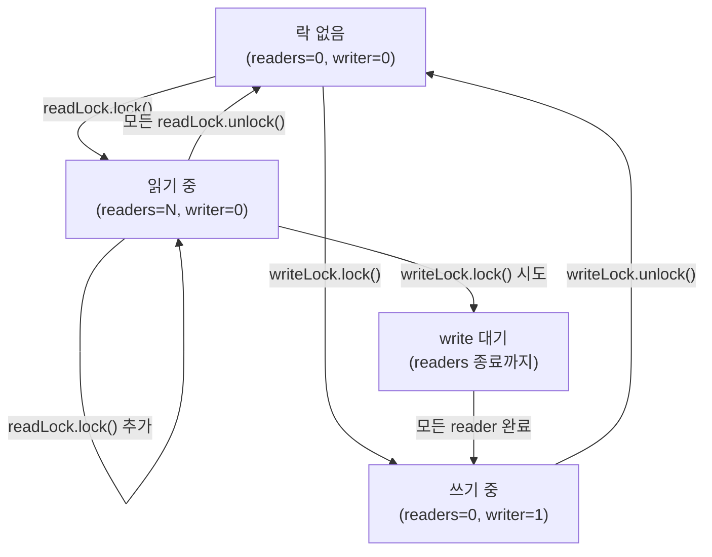

## 정의

**`java.util.concurrent.locks.ReentrantReadWriteLock`** 는 **읽기 락과 쓰기 락을 분리** 한 [[java-reentrant-lock|ReentrantLock]] 의 확장.

핵심 규칙:
- **여러 reader 가 동시에 read lock 획득 가능** (병렬 읽기)
- **writer 는 배타적**: write lock 잡혀 있으면 reader 도 새 writer 도 대기
- **재진입 가능** (같은 스레드)

## 사용 상황

읽기 비율이 압도적으로 높고 쓰기가 드문 자료구조에 적합.

- 설정 캐시: 수천 번 읽고 드물게 reload
- 인메모리 인덱스: 검색은 병렬, 갱신은 배타
- 참조 데이터 테이블: 국가 코드, 환율 등 거의 변하지 않는 테이블

쓰기 비율이 높으면 오히려 [[java-reentrant-lock|ReentrantLock]] 단일 락보다 느리다.

## 시각화: 락 상태 전이



## 사용

```java
ReentrantReadWriteLock rrw = new ReentrantReadWriteLock();
Lock readLock = rrw.readLock();
Lock writeLock = rrw.writeLock();

// Reader: 여러 스레드가 동시에 실행 가능
readLock.lock();
try {
    return data.get();
} finally {
    readLock.unlock();
}

// Writer: 배타적 실행
writeLock.lock();
try {
    data.update();
} finally {
    writeLock.unlock();
}
```

## 내부 구조: AQS 기반

`ReentrantReadWriteLock` 은 `AbstractQueuedSynchronizer` (AQS) 의 단일 int `state` 를 두 영역으로 분리해 사용한다.

```
state (32bit)
┌─────────────────┬──────────────────┐
│  상위 16bit     │  하위 16bit      │
│  read lock 수   │  write lock 수   │
└─────────────────┴──────────────────┘
```

```java
// JDK 소스 발췌 (단순화)
static final int SHARED_SHIFT   = 16;
static final int SHARED_UNIT    = (1 << SHARED_SHIFT);
static final int MAX_COUNT      = (1 << SHARED_SHIFT) - 1;  // 65535
static final int EXCLUSIVE_MASK = (1 << SHARED_SHIFT) - 1;

static int sharedCount(int c)    { return c >>> SHARED_SHIFT; }
static int exclusiveCount(int c) { return c & EXCLUSIVE_MASK; }
```

read lock 하나 획득 = `state += SHARED_UNIT`, write lock 하나 획득 = `state += 1`.

## 언제 유리한가

**읽기 >> 쓰기** 인 시나리오. 여러 reader 가 동시에 읽을 수 있으니 throughput 이 향상.

**쓰기가 잦으면 오히려 손해**. ReentrantLock 보다 오버헤드가 크고, write lock 대기로 reader 도 같이 멈춘다.

```text
Read 80%, Write 20% 이상 -> ReentrantLock 이 더 빠를 가능성
Read 99%, Write 1% -> ReentrantReadWriteLock 유리
```

## 공정성

```java
ReentrantReadWriteLock fair = new ReentrantReadWriteLock(true);
```

- **non-fair (기본)**: writer starvation 가능 (계속 reader 가 들어와 writer 가 기다림)
- **fair**: FIFO, writer 기아 방지하지만 throughput 저하

## downgrading 과 upgrading

### 락 다운그레이드 (write → read): 가능

```java
writeLock.lock();
try {
    data.update();
    readLock.lock();      // write 락 유지한 채 read 락도 획득
} finally {
    writeLock.unlock();   // write 만 풀어 reader 로 강등
}
try {
    return data.get();    // 이제 read 락만 잡고 있음
} finally {
    readLock.unlock();
}
```

다운그레이드 패턴의 이점: 갱신 후 결과를 읽는 동안 다른 writer 가 끼어들지 못하게 한다.

### 락 업그레이드 (read → write): 직접 불가

```java
readLock.lock();
writeLock.lock();    // ❌ deadlock 발생 가능
```

두 reader 가 동시에 업그레이드를 시도하면 서로가 상대방의 read lock 을 기다려 deadlock. 해결책은 read lock 을 풀고 write lock 을 새로 잡는 것 (그 사이 상태 변경 가능성 고려 필요).

## 실전 코드: 캐시 패턴

```java
// Java 17+ 패턴
public class ConfigCache {
    private final Map<String, String> cache = new HashMap<>();
    private final ReentrantReadWriteLock rwLock = new ReentrantReadWriteLock();
    private final Lock readLock = rwLock.readLock();
    private final Lock writeLock = rwLock.writeLock();

    public String get(String key) {
        readLock.lock();
        try {
            return cache.get(key);
        } finally {
            readLock.unlock();
        }
    }

    public void reload(Map<String, String> newConfig) {
        writeLock.lock();
        try {
            cache.clear();
            cache.putAll(newConfig);
        } finally {
            writeLock.unlock();
        }
    }

    // 쓰기 후 바로 읽기: 다운그레이드 패턴
    public String putAndGet(String key, String value) {
        writeLock.lock();
        try {
            cache.put(key, value);
            readLock.lock();          // 다운그레이드 준비
        } finally {
            writeLock.unlock();       // write 락 해제 (read 락은 유지)
        }
        try {
            return cache.get(key);
        } finally {
            readLock.unlock();
        }
    }
}
```

## StampedLock 과의 비교

[[java-stamped-lock|StampedLock]] (JDK 1.8) 은 추가로 **optimistic read** 를 지원. read lock 없이 시도 후 검증. 변경 가능성이 낮을 때 더 빠르다.

| 항목 | ReentrantReadWriteLock | [[java-stamped-lock|StampedLock]] |
|:---|:---|:---|
| 재진입 | ✓ | ✗ |
| 조건 변수 | ✓ | ✗ |
| optimistic read | ✗ | ✓ |
| 인터럽트 응답 | ✓ | 메서드별 다름 |
| 도입 | JDK 1.5 | JDK 1.8 |
| 코드 복잡도 | 단순 | 복잡 |

## 함정

### 1. writer starvation (non-fair 기본)

```java
// non-fair 모드: reader 가 계속 들어오면 writer 가 영원히 못 잡음
// 해결: new ReentrantReadWriteLock(true) 또는 쓰기 빈도 재검토
```

> [!WARNING]
> non-fair 기본 설정에서 읽기 비율이 매우 높으면 writer 가 starve 될 수 있다. 실제 서비스 환경에서 관찰된 경우에만 fair 모드로 전환.

### 2. 읽기 Condition 미지원

read lock 에는 `Condition` 을 만들 수 없다. write lock 에만 가능.

```java
Condition cond = rwLock.writeLock().newCondition();  // ✓
Condition cond = rwLock.readLock().newCondition();   // ❌ UnsupportedOperationException
```

### 3. 재진입 횟수 상한

read lock 의 재진입 횟수는 65535 회. 이를 초과하면 `Error` 발생. 실무에서 도달하기 어렵지만 재귀 깊이 관리 필요.

> [!CAUTION]
> 읽기/쓰기 비율 80/20 이하 시나리오에서는 단일 `ReentrantLock` 이나 `synchronized` 가 더 빠른 경우가 많다. 반드시 프로파일링 후 도입.

## 성능 가이드라인

```
읽기 비율   쓰기 비율   추천
≥ 99%      ≤ 1%       StampedLock optimistic read
≥ 90%      ≤ 10%      ReentrantReadWriteLock
≥ 70%      ≤ 30%      ReentrantLock or synchronized
< 70%                  synchronized (단순, JVM 최적화)
```

프로파일링 없이 최적화 도구를 선택하지 말 것. `synchronized` 는 JVM 이 biased-locking, adaptive spinning 등으로 최적화하므로 실측 우선.

> [!TIP]
> JDK 15+ 에서 biased-locking 이 deprecated 되었고 JDK 21 에서 제거됐다. 저경합 시나리오에서 `synchronized` 성능이 이전보다 약간 달라졌으므로 측정 환경의 JDK 버전도 확인할 것.

## 관련 위키

- [[java-reentrant-lock|ReentrantLock]]
- [[java-stamped-lock|StampedLock]]
- [[java-volatile|volatile]]
- [[java-copyonwritearraylist|CopyOnWriteArrayList]]
- [[java-concurrent-hashmap|ConcurrentHashMap]]
- [[java-atomic-reference|AtomicReference]]
