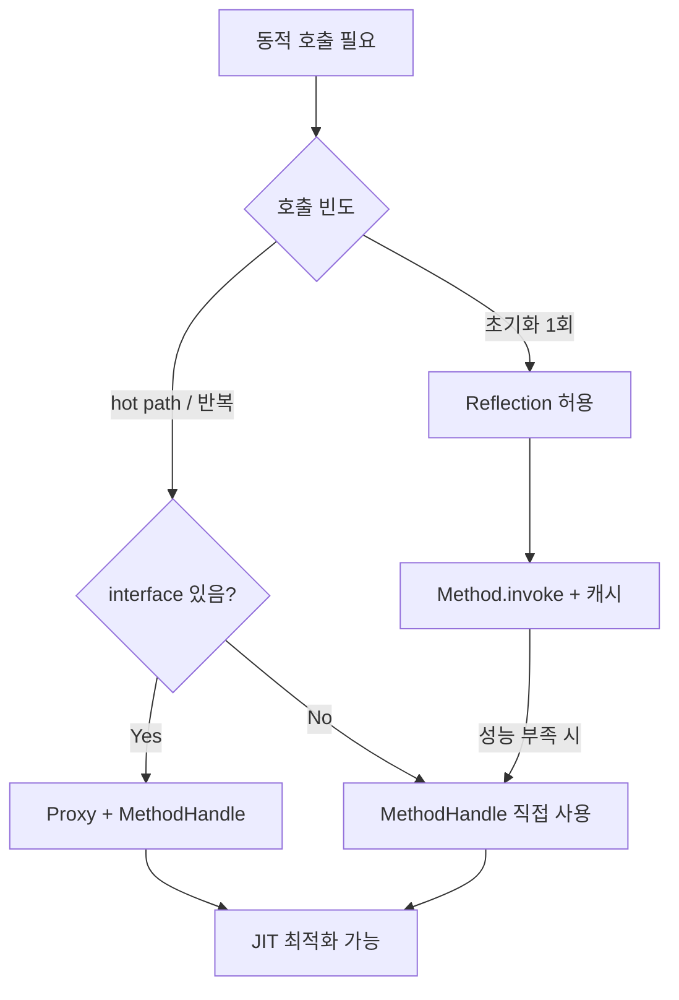

## 정의

**Reflection** 은 런타임에 클래스 메타데이터 (필드, 메서드, 어노테이션, 생성자) 를 조회하고, 컴파일 타임에 알 수 없는 객체를 생성/조작할 수 있게 해 주는 Java API. `java.lang.reflect.*` 패키지.

Spring 의 DI, Jackson 의 직렬화, JPA 의 entity 매핑, JUnit 의 테스트 메서드 호출 모두 reflection 위에서 동작. 단, 성능 비용 + 캡슐화 위반 + JVM 최적화 방해 같은 단점이 있어 일반 코드에서는 피하고 framework 가 대신 써 준다.

## 사용 상황

| 상황 | 접근 |
|:---|:---|
| 클래스 이름이 런타임에 결정됨 | `Class.forName` |
| private 필드 읽기/쓰기 (테스트) | `getDeclaredField + setAccessible` |
| 어노테이션 기반 처리기 구현 | `getDeclaredMethods + getAnnotation` |
| interface 기반 AOP 프록시 | `Proxy.newProxyInstance` |
| hot path 동적 호출 | `MethodHandle` |
| 플러그인/DI 프레임워크 내부 | reflection + cache |

## Reflection vs MethodHandle 선택



## Class 객체 얻기

```java
Class<String> c1 = String.class;                           // 컴파일 타임 알 때
Class<?> c2 = "hello".getClass();                          // 인스턴스에서
Class<?> c3 = Class.forName("com.example.User");           // 런타임 이름으로
Class<?> c4 = ClassLoader.getSystemClassLoader().loadClass("com.example.User");
```

`Class.forName` 은 클래스를 로드하고 static initializer 실행. JDBC driver 등록 같은 부수효과가 있는 코드에 사용 (`Class.forName("org.postgresql.Driver")`).

## 메타데이터 조회

<CodeWithOutput
  language="java"
  outputLanguage="text"
  outputLabel="stdout"
  code={`import java.lang.reflect.*;

public class MetaDemo {
    static class User {
        private String name;
        public int age;
        public User() {}
        public String greet(String prefix) { return prefix + " " + name; }
        private void secret() {}
    }

    public static void main(String[] args) {
        Class<?> c = User.class;
        System.out.println("declared fields:");
        for (Field f : c.getDeclaredFields()) {
            System.out.printf("  %s %s%n", Modifier.toString(f.getModifiers()), f.getName());
        }
        System.out.println("declared methods:");
        for (Method m : c.getDeclaredMethods()) {
            System.out.printf("  %s %s(%d)%n",
                Modifier.toString(m.getModifiers()), m.getName(), m.getParameterCount());
        }
    }
}`}
  output={`declared fields:
  private name
  public age
declared methods:
  public greet(1)
  private secret(0)`}
/>

`getDeclaredX()` 는 private 포함 직접 선언만. `getX()` 는 public + 상속받은 것. 이름이 헷갈리니 주의.

## 동적 호출

```java
Class<?> c = Class.forName("com.example.User");
Object instance = c.getDeclaredConstructor().newInstance();      // no-args ctor

Method greet = c.getMethod("greet", String.class);
String result = (String) greet.invoke(instance, "Hello,");        // greet("Hello,")

Field name = c.getDeclaredField("name");
name.setAccessible(true);                                         // private 우회
name.set(instance, "Alice");
```

`setAccessible(true)` 는 캡슐화 우회. JDK 9 모듈 시스템 도입 후 `--add-opens` JVM 옵션이 없으면 외부 모듈에는 적용 안 됨.

## 어노테이션 처리

<CodeWithOutput
  language="java"
  outputLanguage="text"
  outputLabel="stdout"
  code={`import java.lang.annotation.*;
import java.lang.reflect.*;

@Retention(RetentionPolicy.RUNTIME)
@Target(ElementType.METHOD)
@interface Cached { int ttlSeconds() default 60; }

class UserService {
    @Cached(ttlSeconds = 300)
    public String findById(Long id) { return "user:" + id; }

    public void update(Long id) {}
}

public class AnnoDemo {
    public static void main(String[] args) {
        for (Method m : UserService.class.getDeclaredMethods()) {
            Cached a = m.getAnnotation(Cached.class);
            if (a != null) {
                System.out.printf("%s cached ttl=%d%n", m.getName(), a.ttlSeconds());
            }
        }
    }
}`}
  output={`findById cached ttl=300`}
/>

`@Retention(RUNTIME)` 가 필수. SOURCE / CLASS 로 선언된 어노테이션은 reflection 으로 조회 불가.

## 동적 프록시

interface 기반 프록시 생성 (AOP 의 기본):

```java
interface Greeter {
    String greet(String name);
}

Greeter proxy = (Greeter) Proxy.newProxyInstance(
    Greeter.class.getClassLoader(),
    new Class<?>[] { Greeter.class },
    (p, method, args) -> {
        System.out.println("→ " + method.getName());
        return "Hello, " + args[0];
    }
);

System.out.println(proxy.greet("World"));
// → greet
// Hello, World
```

interface 가 아닌 클래스를 프록시하려면 CGLIB / ByteBuddy 같은 바이트코드 라이브러리 필요. Spring 의 `@Configuration` proxy 가 그 예.

## MethodHandle (JDK 7+, 현대적 대안)

`java.lang.invoke.MethodHandle` 은 reflection 보다 빠르고 JIT 친화적:

```java
MethodHandles.Lookup lookup = MethodHandles.lookup();

MethodHandle greet = lookup.findVirtual(
    User.class,
    "greet",
    MethodType.methodType(String.class, String.class)
);

String result = (String) greet.invoke(user, "Hi,");
```

특징:
- **JIT 최적화 가능**: 반복 호출이 reflection 보다 훨씬 빠름 (거의 native call 수준)
- **MethodType 으로 정확한 시그니처 명시**
- **VarHandle**: 필드 접근의 MethodHandle 대응 (atomic, volatile semantics)
- **Lookup 의 권한**: 호출한 클래스의 접근 권한이 그대로 적용 (캡슐화 보존)

라이브러리 (Jackson 신버전, ByteBuddy) 가 reflection 대신 MethodHandle 로 전환 중.

## 성능 비용

```
직접 호출:        1x  (baseline)
MethodHandle:    2-3x
Reflection:      30-100x  (cache 안 했을 때)
Reflection (cached): 5-10x
```

framework 들이 Method 객체를 캐싱해 두는 이유. 매번 `getMethod()` 호출은 절대 금물.

JDK 17 이후 JIT 가 많이 개선돼 cached reflection 의 차이는 줄었지만 여전히 hot path 에서는 피하는 게 좋다.

## Record 와 Reflection (JDK 16+)

`record` 는 컴포넌트 정보를 직접 조회하는 API 제공:

```java
record Point(int x, int y) {}

Class<?> c = Point.class;

// record 컴포넌트 조회
RecordComponent[] comps = c.getRecordComponents();
for (RecordComponent rc : comps) {
    System.out.printf("%s: %s%n", rc.getName(), rc.getType().getSimpleName());
}
// x: int
// y: int

// 역직렬화 패턴
Constructor<?> ctor = c.getDeclaredConstructor(int.class, int.class);
Object p = ctor.newInstance(3, 4);

Method xMethod = c.getMethod("x");
System.out.println(xMethod.invoke(p));  // 3
```

Jackson, Gson 같은 직렬화 라이브러리가 Record 지원에 이 API 활용.

## GraalVM Native Image 와 Reflection

GraalVM AOT 컴파일 시 reflection 사용 클래스는 미리 힌트 등록 필요:

```json
// src/main/resources/META-INF/native-image/reflect-config.json
[
  {
    "name": "com.example.User",
    "allDeclaredFields": true,
    "allDeclaredMethods": true,
    "allDeclaredConstructors": true
  }
]
```

```java
// Spring + GraalVM: @RegisterReflectionForBinding 어노테이션
@RegisterReflectionForBinding(User.class)
@Configuration
public class AppConfig { }
```

미등록 클래스를 런타임에 reflection 으로 접근하면 `MissingReflectionRegistrationError` 발생.
`-agentlib:native-image-agent` 로 실행하면 자동 힌트 파일 생성 가능.

## 함정과 베스트 프랙티스

- **JDK 9+ 모듈 시스템**: `setAccessible(true)` 가 외부 모듈에 막힘. `--add-opens java.base/java.lang=ALL-UNNAMED` 같은 JVM 옵션 필요
- **`getName()` vs `getCanonicalName()` vs `getSimpleName()`**: inner class / array 에서 결과 다름
- **`isAssignableFrom` 방향 주의**: `Animal.class.isAssignableFrom(Dog.class)` 는 true (반대로 안 됨)
- **Generic type erasure**: 런타임에 `List<String>` 의 `String` 정보 없음. `ParameterizedType` 으로 super class / field declaration 에서만 추출 가능 (Spring 의 `ResolvableType` 활용)
- **`Class.forName`** 의 static 초기화 부수효과 주의
- **GraalVM Native Image**: reflection 사용 클래스는 미리 `reflect-config.json` 에 등록 필요
- **JIT 친화적이려면 MethodHandle** 사용

## 관련 위키

- [[java-javabean]]
- [[spring-reflection]]
- [[spring-aop]]
- [[spring-bean-post-processor]]
- [[spring-ioc-di]]
