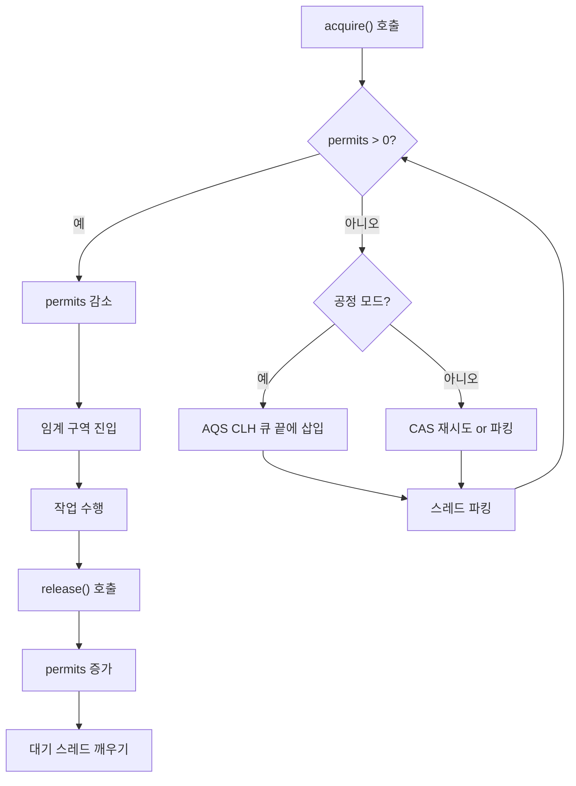
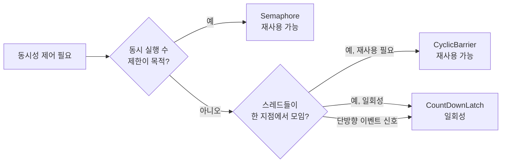

## 정의

**`java.util.concurrent.Semaphore`** 는 **N 개의 permit (허가) 을 발급/회수** 하는 synchronizer. permit 이 있으면 진행, 없으면 [[Blocking]] 또는 즉시 실패.

자원 풀, rate limiting, 동시 접근 수 제한 같은 패턴의 표준 도구. 내부적으로 `AbstractQueuedSynchronizer (AQS)` 를 기반으로 구현되어 있다.

## 사용 상황

| 상황 | 예시 |
|:---|:---|
| 외부 API 동시 요청 제한 | 동시 5 요청만 허용하는 외부 결제 API |
| 자원 풀 접근 제어 | DB connection pool, thread pool |
| Rate limiting | 처리량 상한 설정 |
| 섹션 간 흐름 제어 | 생산자-소비자 버퍼 크기 제한 |
| 단방향 신호 | permit 1개를 다른 스레드에서 release |

`Semaphore` 는 **"동시에 N 개 진행"** 이라는 제약이 필요한 모든 곳에 사용. 재사용 가능한 synchronizer 라는 점에서 [[CountDownLatch]] (단방향, 재사용 불가) 와 구분된다.

## 시각화

```anim:java-semaphore-permits
{}
```

## 핵심 메서드

```java
Semaphore s = new Semaphore(10);          // 10 permit 발급

// 획득
s.acquire();                               // 1 permit 획득, 없으면 block
s.acquire(3);                              // 3 permit 동시 획득
s.tryAcquire();                            // 즉시 시도, 실패 시 false
s.tryAcquire(500, TimeUnit.MILLISECONDS);  // 최대 500ms 대기 후 false

// 반환
s.release();                               // 1 permit 반환
s.release(3);                              // 3 permit 동시 반환

// 조회/제어
s.availablePermits();                      // 현재 남은 permit 수
s.hasQueuedThreads();                      // 대기 중인 스레드 존재 여부
s.getQueueLength();                        // 대기 중인 스레드 수 (추정)
s.drainPermits();                          // 남은 permit 전부 획득 후 개수 반환
```

## permit 획득 흐름



## 가장 흔한 세 가지 패턴

### 1. 동시 접근 제한 (concurrency limiter)

```java
Semaphore limiter = new Semaphore(5);   // 동시 5 요청만 허용

public void callExpensiveApi() throws InterruptedException {
    limiter.acquire();
    try {
        externalApi.call();
    } finally {
        limiter.release();   // 반드시 finally
    }
}
```

외부 API 가 동시 5 요청까지만 허용한다면 이렇게 제한. `finally` 에 `release()` 가 없으면 permit 이 영구 소실된다.

### 2. 자원 풀

```java
// Java 17+ record 활용
record ConnectionPool(Semaphore semaphore, Queue<Connection> pool) {

    static ConnectionPool create(int size) {
        return new ConnectionPool(
            new Semaphore(size),
            createConnections(size)
        );
    }

    public Connection acquire() throws InterruptedException {
        semaphore.acquire();
        return pool.poll();   // semaphore 가 보장하므로 null 불가
    }

    public void release(Connection c) {
        pool.offer(c);
        semaphore.release();
    }
}
```

`pool.poll()` 이 항상 non-null 인 이유: semaphore permit 수 = pool 크기. permit 을 획득했다는 것은 pool 에 반드시 자원이 하나 있다는 뜻.

### 3. tryAcquire 로 비차단 패턴

```java
public Optional<Result> tryProcess(Request req) {
    if (!semaphore.tryAcquire()) {
        return Optional.empty();   // 즉시 거부, 큐잉하거나 fallback
    }
    try {
        return Optional.of(process(req));
    } finally {
        semaphore.release();
    }
}
```

대기 없이 즉시 성공/실패를 결정해야 하는 경우 (예: API rate limiting 에서 초과 시 429 반환).

## binary semaphore (= mutex 와 비슷)

```java
Semaphore mutex = new Semaphore(1);
mutex.acquire();
try {
    // 상호 배제 구역
} finally {
    mutex.release();
}
```

`ReentrantLock` / `synchronized` 와 비슷하지만 핵심 차이.

| 특성 | binary Semaphore | ReentrantLock |
|:---|:---|:---|
| 소유권 추적 | 없음 (누구든 release 가능) | 있음 (획득 스레드만 release) |
| 재진입 | 불가 (self-deadlock) | 가능 |
| 일반적 용도 | 크로스 스레드 신호 | 일반 mutual exclusion |

mutex 용도라면 [[ReentrantLock]] 또는 `synchronized` 를 사용하고, Semaphore 는 **permit 수 제어** 가 필요한 경우에만 사용.

## 공정성 옵션

```java
Semaphore fair = new Semaphore(5, true);   // FIFO 순서 보장
```

`true` 이면 FIFO: 대기 큐에 가장 오래된 스레드부터 permit 할당.
`false` (기본) 이면 경쟁: 새로 도착한 스레드가 대기 중인 스레드보다 먼저 획득 가능.

> [!NOTE]
> `tryAcquire()` (timeout 없는 버전) 는 공정 모드에서도 큐를 무시하고 즉시 barging. 공정성이 필요하면 `tryAcquire(0, NANOSECONDS)` 를 사용.

## Semaphore vs CountDownLatch vs CyclicBarrier



| 특성 | Semaphore | CountDownLatch | CyclicBarrier |
|:---|:---:|:---:|:---:|
| 목적 | 자원 수 제한 | 이벤트 대기 | 집결 후 출발 |
| 재사용 | ✓ | ✗ | ✓ |
| 방향 | 양방향 (acquire/release) | 단방향 (count down) | 양방향 (await/trip) |
| 일반 패턴 | 접근 제어 | 초기화 완료 대기 | 페이즈 동기화 |

## AQS 내부 구조

`Semaphore` 는 `AbstractQueuedSynchronizer (AQS)` 를 위임 받아 구현. permit 수는 AQS 의 `state` 정수에 저장된다.

```java
// Semaphore 내부 (단순화)
abstract static class Sync extends AbstractQueuedSynchronizer {

    Sync(int permits) {
        setState(permits);   // AQS state = permit 수
    }

    final int nonfairTryAcquireShared(int acquires) {
        for (;;) {
            int available = getState();
            int remaining = available - acquires;
            if (remaining < 0 || compareAndSetState(available, remaining))
                return remaining;   // 음수면 큐에 파킹
        }
    }

    protected final boolean tryReleaseShared(int releases) {
        for (;;) {
            int current = getState();
            int next = current + releases;
            if (compareAndSetState(current, next))
                return true;   // 파킹된 스레드 깨우기 트리거
        }
    }
}
```

permit 이 0 이 되면 AQS 의 CLH 큐에 스레드가 LockSupport.park() 로 파킹된다. `release()` 시 CLH 큐에서 꺼내 `LockSupport.unpark()`.

## Java 17+ 활용 예

```java
// Java 17+ record + Semaphore 로 간단한 rate limiter 빌더
record RateLimitedExecutor(Semaphore semaphore) {

    static RateLimitedExecutor of(int concurrency) {
        return new RateLimitedExecutor(new Semaphore(concurrency));
    }

    <T> T execute(Callable<T> task) throws Exception {
        semaphore.acquire();
        try {
            return task.call();
        } finally {
            semaphore.release();
        }
    }

    <T> Optional<T> tryExecute(Callable<T> task) throws Exception {
        if (!semaphore.tryAcquire()) return Optional.empty();
        try {
            return Optional.of(task.call());
        } finally {
            semaphore.release();
        }
    }
}
```

## 함정

### 1. release 빠뜨리면 permit 영구 소실

```java
limiter.acquire();
doWork();             // 예외 시 release 안 됨
limiter.release();    // 도달하지 않을 수 있음
```

반드시 `try/finally` 패턴.

### 2. acquire 없이 release 하면 permit 수가 늘어남

`release()` 가 `acquire()` 보다 많이 호출되면 permit 이 초기값보다 늘어난다. `Semaphore` 는 이를 막지 않는다. acquire/release 쌍이 항상 균형을 이뤄야 한다.

### 3. tryAcquire() 와 tryAcquire(0, NANOSECONDS) 의 차이

`tryAcquire()` 는 공정 모드에서도 큐를 무시하고 barging (새치기). 공정한 비차단 시도가 필요하면 `tryAcquire(0, TimeUnit.NANOSECONDS)` 사용.

### 4. InterruptedException 처리

`acquire()` 는 `InterruptedException` 을 던진다. 인터럽트를 캐치만 하고 무시하면 신호가 소실된다.

```java
try {
    semaphore.acquire();
} catch (InterruptedException e) {
    Thread.currentThread().interrupt();   // 신호 복원
    return;   // 혹은 상위로 전파
}
```

### 5. 복합 연산의 원자성

```java
// 잘못: availablePermits() 확인과 acquire() 사이에 다른 스레드가 끼어들 수 있음
if (semaphore.availablePermits() > 0) {
    semaphore.acquire();   // CME 아닌 논리 오류
}

// 올바름: tryAcquire() 가 원자적으로 확인 + 획득
if (semaphore.tryAcquire()) { ... }
```

## 관련 위키

- [[CountDownLatch]]
- [[CyclicBarrier]]
- [[ReentrantLock]]
- [[Blocking]]
- [[BlockingQueue]]
- [[Phaser]]
- Brian Goetz, *Java Concurrency in Practice*, §14 Building Custom Synchronizers
