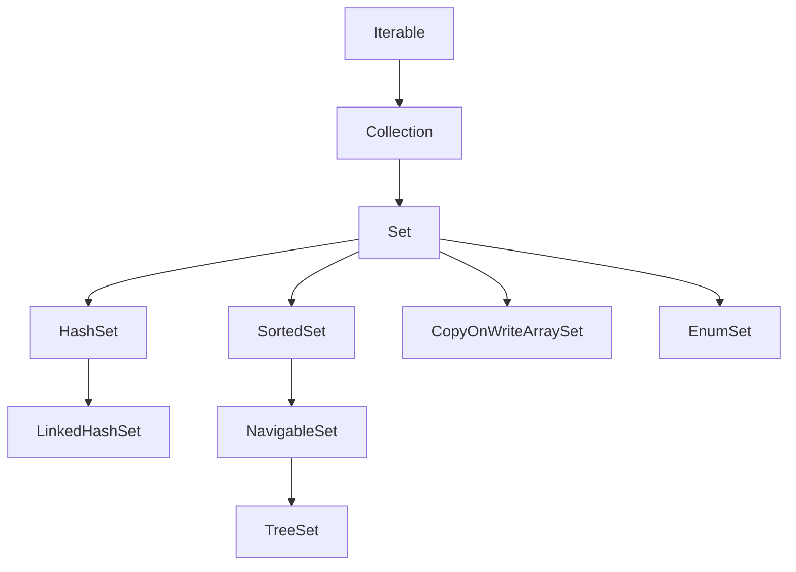

## 정의

**`java.util.Set<E>`** 는 **중복을 허용하지 않는** [[Collection]]. 수학의 집합 (set) 에 대응. 같은 원소를 두 번 추가하면 두 번째는 무시된다.

`Collection` 인터페이스의 모든 메서드를 그대로 사용하면서, `equals` 와 `hashCode` (또는 `compareTo`) 로 중복 판단.

```java
Set<String> s = new HashSet<>();
s.add("apple");
s.add("banana");
s.add("apple");   // 중복, 무시
s.size();         // 2
```

## 언제 쓰나

- **중복 제거**: 컬렉션에서 유일한 원소만 남길 때
- **멤버십 검사**: "이 값이 집합에 있는가?" 를 빠르게 확인
- **집합 연산**: 교집합, 합집합, 차집합
- **방문 여부 추적**: 그래프 탐색에서 방문한 노드 기록
- **고유 ID 관리**: 중복 없는 식별자 집합 유지

## 시각화: Set 구현체 계층



## 핵심 메서드

| 메서드 | 반환 | 의미 |
|:---|:---:|:---|
| `add(E e)` | boolean | 추가, 이미 있으면 false |
| `remove(Object o)` | boolean | 제거, 없으면 false |
| `contains(Object o)` | boolean | 포함 여부 |
| `size()` | int | 원소 개수 |
| `isEmpty()` | boolean | 비어 있는지 |
| `iterator()` | Iterator | 순회 |
| `addAll(Collection)` | boolean | 합집합 (in-place) |
| `retainAll(Collection)` | boolean | 교집합 (in-place) |
| `removeAll(Collection)` | boolean | 차집합 (in-place) |
| `containsAll(Collection)` | boolean | 부분집합 여부 |

추가/조회/삭제의 시간 복잡도는 **구현체에 따라** 다르다.

## 구현체 비교

| 구현 | 백킹 구조 | `add`/`contains` | 순서 | null | Thread-safe |
|:---|:---|:---:|:---|:---:|:---:|
| [[HashSet]] | HashMap | O(1) avg | 없음 | ✓ (1개) | ✗ |
| `LinkedHashSet` | LinkedHashMap | O(1) avg | 삽입 순서 | ✓ (1개) | ✗ |
| [[TreeSet]] | TreeMap | O(log n) | 정렬 | ✗ | ✗ |
| `CopyOnWriteArraySet` | CopyOnWriteArrayList | O(n) | 삽입 순서 | ✓ | ✓ |
| `ConcurrentSkipListSet` | ConcurrentSkipListMap | O(log n) | 정렬 | ✗ | ✓ |
| `EnumSet` | bit vector | O(1) | enum 선언 순서 | ✗ | ✗ |

대부분의 Set 구현은 **내부적으로 Map 을 사용**, key 만 노출하고 value 는 dummy 상수.

## 불변 Set (Set.of)

Java 9+ 에서 도입된 팩토리 메서드.

```java
// Set.of: 불변, null 비허용, 중복 인자 시 IllegalArgumentException
Set<Integer> primes = Set.of(2, 3, 5, 7, 11);
primes.add(13);      // UnsupportedOperationException
primes.add(null);    // NullPointerException

// 중복 인자 → 예외
Set<String> bad = Set.of("a", "a");   // IllegalArgumentException

// Set.copyOf: 기존 컬렉션을 불변 Set 으로 복사
List<String> list = List.of("x", "y", "z");
Set<String> copy = Set.copyOf(list);   // 불변

// Collections.unmodifiableSet: 기존 Set 의 불변 뷰 (원본 변경 반영)
Set<String> mutable = new HashSet<>(Set.of("a", "b"));
Set<String> view = Collections.unmodifiableSet(mutable);
mutable.add("c");
view.contains("c");   // true (원본 변경 반영)
```

> [!IMPORTANT]
> `Set.of` 는 **순서를 보장하지 않는다**. 반복 순서가 실행마다 다를 수 있다. 순서가 필요하면 `LinkedHashSet` 또는 `TreeSet` 사용.

## 집합 연산

```java
Set<Integer> a = new HashSet<>(List.of(1, 2, 3, 4));
Set<Integer> b = new HashSet<>(List.of(3, 4, 5, 6));

// 합집합 (union): a ∪ b
Set<Integer> union = new HashSet<>(a);
union.addAll(b);           // {1, 2, 3, 4, 5, 6}

// 교집합 (intersection): a ∩ b
Set<Integer> inter = new HashSet<>(a);
inter.retainAll(b);        // {3, 4}

// 차집합 (difference): a \ b
Set<Integer> diff = new HashSet<>(a);
diff.removeAll(b);         // {1, 2}

// 대칭 차집합 (symmetric difference): (a ∪ b) \ (a ∩ b)
Set<Integer> symDiff = new HashSet<>(union);
symDiff.removeAll(inter);  // {1, 2, 5, 6}

// 부분집합 여부
a.containsAll(inter);      // true (inter ⊆ a)
```

`addAll`, `retainAll`, `removeAll` 의 비용은 인자의 `contains` 가 빠를수록 좋다. 인자로 `HashSet` 을 전달하면 O(n), `ArrayList` 를 전달하면 O(n*m).

## Java 17+ 실전: 중복 제거

```java
import java.util.*;
import java.util.stream.*;

// 리스트에서 중복 제거 (순서 무관)
List<String> words = List.of("apple", "banana", "apple", "cherry", "banana");
Set<String> unique = new HashSet<>(words);

// 삽입 순서 유지
Set<String> ordered = new LinkedHashSet<>(words);
// [apple, banana, cherry]

// Stream.distinct() (내부적으로 LinkedHashSet 유사 동작)
List<String> deduped = words.stream().distinct().toList();

// 정렬된 고유 원소
Set<String> sorted = new TreeSet<>(words);
// [apple, banana, cherry] (알파벳 순)
```

## Java 17+ 실전: EnumSet 활용

```java
import java.util.EnumSet;

enum Permission { READ, WRITE, EXECUTE, DELETE }

// EnumSet: bit vector 기반, 가장 빠른 Set 구현
EnumSet<Permission> adminPerms = EnumSet.allOf(Permission.class);
EnumSet<Permission> readOnly = EnumSet.of(Permission.READ);
EnumSet<Permission> readWrite = EnumSet.of(Permission.READ, Permission.WRITE);

// 집합 연산
EnumSet<Permission> extra = EnumSet.copyOf(readWrite);
extra.add(Permission.EXECUTE);   // {READ, WRITE, EXECUTE}

// 여집합
EnumSet<Permission> complement = EnumSet.complementOf(readOnly);
// {WRITE, EXECUTE, DELETE}

boolean canWrite = adminPerms.contains(Permission.WRITE);   // true
```

## Java 17+ 실전: 권한 검사 시스템

```java
import java.util.*;

record User(String name, Set<String> roles) {}

class AccessControl {
    private final Map<String, Set<String>> rolePermissions = new HashMap<>();

    void grantPermission(String role, String permission) {
        rolePermissions.computeIfAbsent(role, k -> new HashSet<>()).add(permission);
    }

    // 사용자가 특정 권한을 가지는지 확인
    boolean hasPermission(User user, String permission) {
        return user.roles().stream()
            .anyMatch(role -> {
                Set<String> perms = rolePermissions.getOrDefault(role, Set.of());
                return perms.contains(permission);
            });
    }

    // 사용자의 모든 권한 (합집합)
    Set<String> allPermissions(User user) {
        Set<String> result = new HashSet<>();
        user.roles().forEach(role ->
            result.addAll(rolePermissions.getOrDefault(role, Set.of()))
        );
        return Collections.unmodifiableSet(result);
    }
}
```

## 동기화

```java
// 옵션 1: Collections.synchronizedSet (복합 연산은 외부 동기화 필요)
Set<Integer> sync = Collections.synchronizedSet(new HashSet<>());
synchronized (sync) {
    if (!sync.contains(x)) sync.add(x);   // check-then-act 원자적으로
}

// 옵션 2: ConcurrentHashMap.newKeySet (권장, 복합 연산도 원자적)
Set<Integer> concurrent = ConcurrentHashMap.newKeySet();
concurrent.add(x);   // 내부적으로 putIfAbsent

// 옵션 3: CopyOnWriteArraySet (읽기 多, 쓰기 少)
Set<String> cow = new CopyOnWriteArraySet<>();

// 옵션 4: ConcurrentSkipListSet (정렬 + 동시성)
Set<Integer> skipList = new ConcurrentSkipListSet<>();
```

## equals / hashCode 규약

`Set` 의 `equals` 는 두 집합이 같은 원소를 가지면 true.

```java
Set<Integer> s1 = new HashSet<>(List.of(1, 2, 3));
Set<Integer> s2 = new TreeSet<>(List.of(1, 2, 3));
s1.equals(s2);   // true (구현체 달라도 원소 같으면 같음)

// Set 의 hashCode = 원소 hashCode 의 합
s1.hashCode() == s2.hashCode();   // true
```

원소의 `equals`/`hashCode` 가 잘못 구현되면 `HashSet`/`LinkedHashSet` 이 잘못 동작한다.

## 함정

### 1. 가변 객체를 원소로

```java
Set<List<Integer>> set = new HashSet<>();
List<Integer> elem = new ArrayList<>(List.of(1, 2));
set.add(elem);
elem.add(3);                 // hashCode 변경
set.contains(elem);          // false! (다른 버킷)
set.size();                  // 1 이지만 찾을 수 없음
```

**불변 객체** (String, Integer, record) 를 원소로 사용 권장.

### 2. equals 만 override, hashCode 미구현

[[Object]] 의 규약 위반. `HashSet`, `LinkedHashSet` 이 잘못 동작.

```java
class Point {
    int x, y;
    @Override public boolean equals(Object o) {
        if (!(o instanceof Point p)) return false;
        return x == p.x && y == p.y;
    }
    // hashCode 없음 → Object.hashCode() 사용 (참조 기반)
}

Set<Point> set = new HashSet<>();
set.add(new Point(1, 2));
set.contains(new Point(1, 2));   // false! (hashCode 다름)
```

### 3. Set.of 의 순서 불정

```java
Set<String> s = Set.of("a", "b", "c");
// 반복 순서가 실행마다 다를 수 있음
// 순서가 필요하면 LinkedHashSet 또는 TreeSet 사용
```

### 4. iterator 는 [[fail-fast iterator]] (HashSet, TreeSet)

```java
Set<Integer> set = new HashSet<>(Set.of(1, 2, 3));
for (Integer x : set) {
    set.add(4);   // ConcurrentModificationException
}

// 안전한 제거
set.removeIf(x -> x % 2 == 0);
```

### 5. TreeSet 에 null 추가

```java
TreeSet<String> ts = new TreeSet<>();
ts.add(null);   // NullPointerException (compareTo(null) 호출)
```

null 이 필요하면 `HashSet` 또는 null-friendly `Comparator` 를 명시.

## 관련 위키

- [[Collection]]
- [[HashSet]]
- [[TreeSet]]
- [[CopyOnWriteArrayList]]
- [[ConcurrentHashMap]]
- [[ConcurrentSkipListSet]]
- [[Map]]
- [[Iterable]]
- [[Object]]
- [[fail-fast iterator]]
- [[ConcurrentModificationException]]
