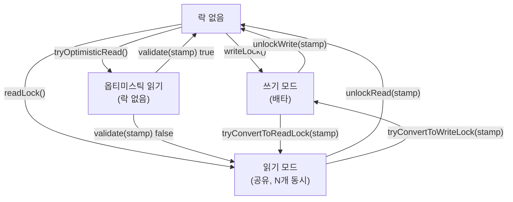

## 정의

**`java.util.concurrent.locks.StampedLock`** 는 JDK 1.8 도입의 새 락. 세 가지 모드 제공.

1. **Write lock** (배타)
2. **Read lock** (공유)
3. **Optimistic read** (락 없이 시도, 변경 감지 시 retry)

`stamp` 라는 long 토큰으로 락 상태를 추적. acquire 시 stamp 반환, release 시 stamp 전달.

## 사용 상황

- **읽기가 압도적으로 많고** 쓰기는 거의 없는 자료구조
- **짧은 읽기 연산**: 두세 필드 읽는 수준, 긴 연산은 optimistic retry 비용이 누적
- [[java-reentrant-readwrite-lock|ReentrantReadWriteLock]] 으로도 부족할 때의 차선책
- 재진입이 필요 없는 단순 락 시나리오

## 시각화: 세 가지 모드 전이



## 핵심 메서드

```java
StampedLock lock = new StampedLock();

// Write lock
long stamp = lock.writeLock();
try { ... } finally { lock.unlockWrite(stamp); }

// Read lock
long stamp = lock.readLock();
try { ... } finally { lock.unlockRead(stamp); }

// Optimistic read
long stamp = lock.tryOptimisticRead();
int value = data.get();                       // 락 없이 읽기
if (!lock.validate(stamp)) {                  // 변경 발생?
    stamp = lock.readLock();                  // 폴백: read lock
    try {
        value = data.get();
    } finally {
        lock.unlockRead(stamp);
    }
}
```

## Optimistic Read 의 사상

writer 가 거의 없을 것이라 가정하고 **락 없이 일단 읽는다**. 끝나고 "내가 읽는 동안 write 가 있었나?" 를 `validate(stamp)` 로 검사. 없었다면 데이터 일관, 있었다면 read lock 으로 폴백.

[[java-volatile|volatile]] read 한 번 정도의 비용으로 끝나는 best case.

## stamp 내부 구조

stamp 는 단순 long 이 아니라 **버전 카운터 + 모드 비트** 가 인코딩된 값.

```
stamp (64bit long)
┌──────────────────────────────────────────────────────────┐
│  상위 57bit: 버전 카운터 (write 발생마다 증가)             │
│  하위 7bit: 락 모드 (RUNIT=0000001, WBIT=10000000 등)     │
└──────────────────────────────────────────────────────────┘
```

`validate(stamp)` 는 현재 stamp 와 저장된 stamp 의 버전 비트가 같은지 비교. write 가 발생하면 버전이 증가하므로 mismatch 가 된다.

## 실전 패턴: Point 클래스

```java
// Java 17+: StampedLock Point 패턴
class Point {
    private double x, y;
    private final StampedLock lock = new StampedLock();

    // 쓰기: 배타 락
    public void move(double dx, double dy) {
        long stamp = lock.writeLock();
        try {
            x += dx;
            y += dy;
        } finally {
            lock.unlockWrite(stamp);
        }
    }

    // 읽기: optimistic first, read lock fallback
    public double distanceFromOrigin() {
        long stamp = lock.tryOptimisticRead();
        double cx = x, cy = y;                // 락 없이 스냅샷
        if (!lock.validate(stamp)) {           // write 발생?
            stamp = lock.readLock();
            try {
                cx = x; cy = y;
            } finally {
                lock.unlockRead(stamp);
            }
        }
        return Math.sqrt(cx * cx + cy * cy);
    }
}
```

`Point` 의 두 필드를 atomic 하게 읽기 위해 락 없이 시도, 변경 발생 시 폴백.

## tryConvertToWriteLock: 조건부 업그레이드

`readLock` 에서 조건에 따라 write lock 으로 전환할 수 있다.

```java
// 읽고, 조건 충족 시 쓰기 (업그레이드 시도)
public void updateIfAbsent(int newValue) {
    long stamp = lock.readLock();
    try {
        if (data != 0) return;     // 이미 있음

        // read -> write 업그레이드 시도
        long ws = lock.tryConvertToWriteLock(stamp);
        if (ws != 0) {             // 성공
            stamp = ws;
            data = newValue;
        } else {
            // 업그레이드 실패 (다른 reader 있음), write lock 명시 획득
            lock.unlockRead(stamp);
            stamp = lock.writeLock();
            data = newValue;
        }
    } finally {
        lock.unlock(stamp);
    }
}
```

`lock.unlock(stamp)` 은 stamp 모드에 따라 읽기/쓰기 unlock 을 자동 선택.

## 제약사항

- **재진입 불가**: 같은 스레드가 write lock 을 두 번 잡으면 deadlock
- **Condition 미지원**: wait/notify 같은 조건 변수 사용 불가
- **인터럽트 처리 메서드별 다름**: 모두 인터럽트에 응답하지는 않음
- **upgrading / downgrading**: `tryConvertToWriteLock`, `tryConvertToReadLock` 으로 가능 (다른 stamp 발급)

## 언제 적절한가

**읽기 압도적으로 많고, 쓰기는 거의 없으며, 짧은 읽기** 인 경우.

긴 read 작업이라면 optimistic read 도중 변경 발생 가능성이 높아 폴백 비용이 누적된다.

```
읽기 짧음 + 쓰기 극히 드묾 -> StampedLock optimistic read
읽기 길거나 쓰기 가끔 있음 -> ReentrantReadWriteLock
재진입 / Condition 필요   -> ReentrantReadWriteLock
단순 mutex               -> synchronized 또는 ReentrantLock
```

## ReentrantReadWriteLock vs StampedLock

| 항목 | [[java-reentrant-readwrite-lock|ReentrantReadWriteLock]] | StampedLock |
|:---|:---|:---|
| 재진입 | ✓ | ✗ |
| 조건 변수 | ✓ | ✗ |
| optimistic read | ✗ | ✓ |
| 코드 복잡도 | 단순 | 복잡 |
| 성능 (read 99%) | 좋음 | **더 좋음** |
| 성능 (read 50%) | 비슷 | 비슷 또는 더 나쁨 |

## 함정

### 1. 재진입 deadlock

```java
// ❌ 같은 스레드가 두 번 write lock
long s1 = lock.writeLock();
long s2 = lock.writeLock();  // deadlock: 자기 자신이 먼저 release 해야 하는데 block 됨
```

> [!WARNING]
> StampedLock 은 재진입을 허용하지 않는다. 재귀 함수나 콜백 체인에서 같은 lock 을 두 번 잡으면 즉시 deadlock. 재진입이 필요하면 `ReentrantReadWriteLock` 을 사용.

### 2. stamp 0 반환

`tryOptimisticRead()` 가 0 을 반환하는 경우: write lock 이 잡혀 있을 때. 이때 validate 는 항상 false.

```java
long stamp = lock.tryOptimisticRead();
if (stamp == 0) {
    // write lock 잡혀 있음, optimistic 불가
    stamp = lock.readLock();
    try { ... } finally { lock.unlockRead(stamp); }
    return;
}
```

### 3. optimistic read 범위 밖에서 validate

```java
// ❌ validate 를 읽기 완료 전에 호출
long stamp = lock.tryOptimisticRead();
if (!lock.validate(stamp)) { ... }
// validate 후에 읽으면 의미 없음: validate 사이에 write 가 또 올 수 있음
int value = data.get();
```

> [!CAUTION]
> validate 는 **읽기 완료 후** 호출해야 한다. 읽기 범위 전체를 `stamp` 발급과 `validate` 사이에 두는 것이 올바른 패턴.

## 인터럽트 응답 메서드 정리

일부 메서드만 인터럽트에 응답한다.

| 메서드 | 인터럽트 응답 |
|:---|:---:|
| `writeLock()` | ✗ (block) |
| `writeLockInterruptibly()` | ✓ |
| `readLock()` | ✗ (block) |
| `readLockInterruptibly()` | ✓ |
| `tryOptimisticRead()` | N/A (락 없음) |
| `tryWriteLock()` | N/A (즉시 반환) |
| `tryReadLock()` | N/A (즉시 반환) |

인터럽트가 필요한 시나리오에서는 `*Interruptibly()` 버전을 사용할 것.

> [!CAUTION]
> `writeLock()` 은 인터럽트를 무시하고 락이 해제될 때까지 대기한다. 스레드를 종료해야 하는 shutdownNow 등의 상황에서는 반드시 `writeLockInterruptibly()` 를 사용.

## 관련 위키

- [[java-reentrant-lock|ReentrantLock]]
- [[java-reentrant-readwrite-lock|ReentrantReadWriteLock]]
- [[java-volatile|volatile]]
- [[java-atomic-integer|AtomicInteger]]
- [[java-concurrent-hashmap|ConcurrentHashMap]]
- [[java-copyonwritearraylist|CopyOnWriteArrayList]]
