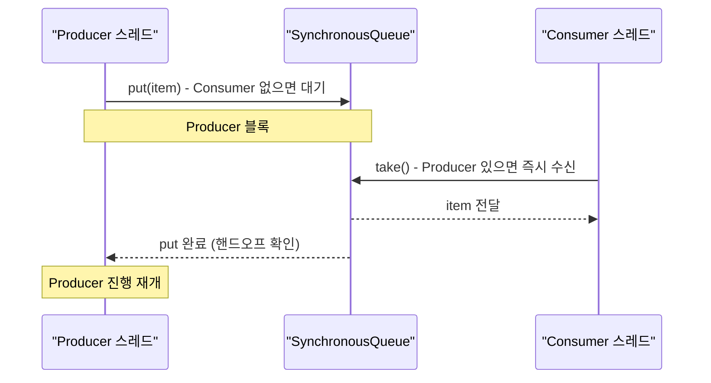
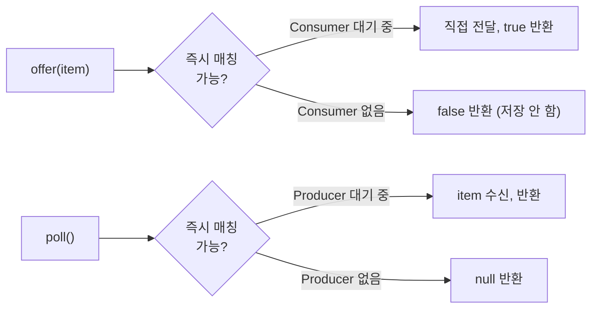

## 정의

**`java.util.concurrent.SynchronousQueue<E>`** 는 **용량 0 의 [[BlockingQueue]]**. 저장 공간이 없다. `put` 은 매칭되는 `take` 가 있어야 진행하고, 반대도 마찬가지.

**직접 핸드오프 (direct handoff)** 또는 **랑데부 (rendezvous)** 패턴: producer 와 consumer 가 서로를 정확히 한 명씩 기다린다. 데이터가 큐에 저장되지 않고 producer 에서 consumer 로 직접 전달된다.

JDK 1.5 도입. `java.util.concurrent.Executors.newCachedThreadPool()` 의 내부 큐로 사용된다.

## 언제 쓰나

- **직접 핸드오프**: producer 가 consumer 의 수신을 확인하고 진행해야 할 때
- **`Executors.newCachedThreadPool()`**: idle thread 가 있으면 즉시 전달, 없으면 새 thread 생성
- **파이프라인 단계 간 동기화**: 앞 단계가 뒷 단계의 처리 완료를 기다려야 할 때
- **스레드 풀 작업 분배**: 작업이 큐에 쌓이지 않고 즉시 처리되어야 할 때

## 시각화: rendezvous 흐름



## 시각화: offer/poll 비블로킹 동작



## 특수한 동작

```java
SynchronousQueue<String> q = new SynchronousQueue<>();

// 크기 관련 메서드는 항상 0/true/null
q.size();                   // 항상 0
q.isEmpty();                // 항상 true
q.peek();                   // 항상 null
q.iterator().hasNext();     // 항상 false
q.remainingCapacity();      // 항상 0

// 블로킹 메서드
q.put("x");    // Consumer 가 없으면 블록
q.take();      // Producer 가 없으면 블록

// 비블로킹 메서드
q.offer("x");                          // Consumer 없으면 false 반환
q.poll();                              // Producer 없으면 null 반환
q.offer("x", 1, TimeUnit.SECONDS);    // 1초 대기 후 실패 시 false
q.poll(1, TimeUnit.SECONDS);          // 1초 대기 후 실패 시 null
```

## 내부 구현: transfer 메커니즘

`SynchronousQueue` 는 내부적으로 두 가지 구현을 가진다.

- **비공정 (unfair, 기본)**: `TransferStack` (LIFO 스택 기반)
- **공정 (fair)**: `TransferQueue` (FIFO 큐 기반)

```java
// 핵심 추상 메서드
abstract static class Transferer<E> {
    // put 이면 e != null, take 이면 e == null
    abstract E transfer(E e, boolean timed, long nanos);
}
```

`transfer` 메서드 하나로 put 과 take 를 모두 처리한다.

- `put(e)` → `transfer(e, false, 0)` (무한 대기)
- `take()` → `transfer(null, false, 0)` (무한 대기)
- `offer(e)` → `transfer(e, true, 0)` (즉시 반환)
- `poll()` → `transfer(null, true, 0)` (즉시 반환)

```java
// TransferStack (비공정) 단순화
E transfer(E e, boolean timed, long nanos) {
    SNode s = null;
    int mode = (e == null) ? REQUEST : DATA;

    for (;;) {
        SNode h = head;
        if (h == null || h.mode == mode) {
            // 같은 모드 → 스택에 push 하고 대기
            if (timed && nanos <= 0) return null;
            s = new SNode(e);
            casHead(h, s);
            s.awaitFulfill(timed, nanos);
            return s.match;
        } else {
            // 반대 모드 → 매칭, 핸드오프
            SNode m = h;
            if (casHead(m, m.next)) {
                m.match = e;
                LockSupport.unpark(m.waiter);
                return (E) m.item;
            }
        }
    }
}
```

## 공정성 옵션

```java
// 비공정 (기본): LIFO, 마지막에 온 스레드가 먼저 매칭될 수 있음
SynchronousQueue<String> unfair = new SynchronousQueue<>();

// 공정: FIFO, 가장 오래 기다린 스레드부터 매칭
SynchronousQueue<String> fair = new SynchronousQueue<>(true);
```

공정 모드는 기아 (starvation) 를 방지하지만 처리량이 약간 낮다.

## Executors.newCachedThreadPool() 연계

```java
// newCachedThreadPool 내부 (단순화)
public static ExecutorService newCachedThreadPool() {
    return new ThreadPoolExecutor(
        0,                          // corePoolSize: 항상 0
        Integer.MAX_VALUE,          // maximumPoolSize: 무제한
        60L, TimeUnit.SECONDS,      // keepAliveTime
        new SynchronousQueue<>()    // 큐: 용량 0
    );
}
```

동작 원리:

1. 새 작업 도착 → `SynchronousQueue.offer(task)` 시도
2. idle thread 가 `take()` 대기 중이면 즉시 전달 (핸드오프)
3. idle thread 없으면 `offer` 실패 → 새 thread 생성
4. thread 가 60초 동안 idle 이면 종료

```java
ExecutorService pool = Executors.newCachedThreadPool();

// 작업이 큐에 쌓이지 않고 즉시 thread 에 전달
for (int i = 0; i < 10; i++) {
    final int taskId = i;
    pool.submit(() -> {
        System.out.println("Task " + taskId + " on " + Thread.currentThread().getName());
    });
}
pool.shutdown();
```

## Java 17+ 실전: 직접 핸드오프 파이프라인

```java
import java.util.concurrent.*;

// 두 단계 파이프라인: 파싱 → 처리
// SynchronousQueue 로 단계 간 동기화
class Pipeline {
    private final SynchronousQueue<String> channel = new SynchronousQueue<>();

    void run() throws InterruptedException {
        // 파싱 스레드 (Producer)
        Thread parser = Thread.ofVirtual().start(() -> {
            try {
                String[] lines = {"line1", "line2", "line3"};
                for (String line : lines) {
                    channel.put(line);   // 처리 스레드가 받을 때까지 대기
                    System.out.println("Parsed and handed off: " + line);
                }
                channel.put("DONE");
            } catch (InterruptedException e) {
                Thread.currentThread().interrupt();
            }
        });

        // 처리 스레드 (Consumer)
        Thread processor = Thread.ofVirtual().start(() -> {
            try {
                String item;
                while (!(item = channel.take()).equals("DONE")) {
                    System.out.println("Processing: " + item);
                    Thread.sleep(100);   // 처리 시뮬레이션
                }
            } catch (InterruptedException e) {
                Thread.currentThread().interrupt();
            }
        });

        parser.join();
        processor.join();
    }
}
```

## Java 17+ 실전: 작업 분배기

```java
import java.util.concurrent.*;

// 단일 Producer, 다중 Consumer
// SynchronousQueue 로 작업을 idle Consumer 에게 직접 전달
class WorkDispatcher {
    private final SynchronousQueue<Runnable> queue = new SynchronousQueue<>(true);
    private final int workerCount;

    WorkDispatcher(int workerCount) {
        this.workerCount = workerCount;
        for (int i = 0; i < workerCount; i++) {
            Thread.ofVirtual().start(() -> {
                try {
                    while (!Thread.currentThread().isInterrupted()) {
                        Runnable task = queue.take();
                        task.run();
                    }
                } catch (InterruptedException e) {
                    Thread.currentThread().interrupt();
                }
            });
        }
    }

    // 작업 제출: idle worker 가 없으면 블록
    void dispatch(Runnable task) throws InterruptedException {
        queue.put(task);
    }

    // 타임아웃 있는 제출
    boolean tryDispatch(Runnable task, long timeout, TimeUnit unit)
            throws InterruptedException {
        return queue.offer(task, timeout, unit);
    }
}
```

## SynchronousQueue vs 다른 BlockingQueue

| 항목 | SynchronousQueue | [[LinkedBlockingQueue]] | [[ArrayBlockingQueue]] |
|:---|:---:|:---:|:---:|
| 용량 | 0 (저장 없음) | 무제한 또는 bounded | bounded |
| `put` 블록 조건 | Consumer 없을 때 | 용량 초과 시 | 용량 초과 시 |
| `take` 블록 조건 | Producer 없을 때 | 비어 있을 때 | 비어 있을 때 |
| 처리량 | 낮음 (1:1 동기화) | 높음 | 높음 |
| 용도 | 직접 핸드오프 | 일반 생산자-소비자 | 고정 버퍼 |

## 함정

### 1. drainTo 는 항상 0 반환

```java
SynchronousQueue<String> q = new SynchronousQueue<>();
List<String> list = new ArrayList<>();
q.drainTo(list);   // 항상 0 (저장된 원소 없음)
```

### 2. 처리량 병목

producer 와 consumer 속도가 다르면 빠른 쪽이 계속 블록된다. 버퍼링이 필요하면 [[LinkedBlockingQueue]] 사용.

### 3. newCachedThreadPool 의 OOM 위험

```java
ExecutorService pool = Executors.newCachedThreadPool();
// 작업이 폭발적으로 증가하면 thread 수가 Integer.MAX_VALUE 까지 증가 가능
// → OOM 또는 시스템 과부하
// 프로덕션에서는 maximumPoolSize 를 제한한 ThreadPoolExecutor 직접 사용 권장
```

### 4. 인터럽트 처리

```java
try {
    q.put(item);
} catch (InterruptedException e) {
    Thread.currentThread().interrupt();   // 인터럽트 상태 복원
    // 적절한 정리 작업
}
```

`put`/`take` 는 `InterruptedException` 을 던진다. 반드시 처리해야 한다.

## 관련 위키

- [[BlockingQueue]]
- [[LinkedBlockingQueue]]
- [[ArrayBlockingQueue]]
- [[ReentrantLock]]
- [[Collection]]
- [[Queue]]
