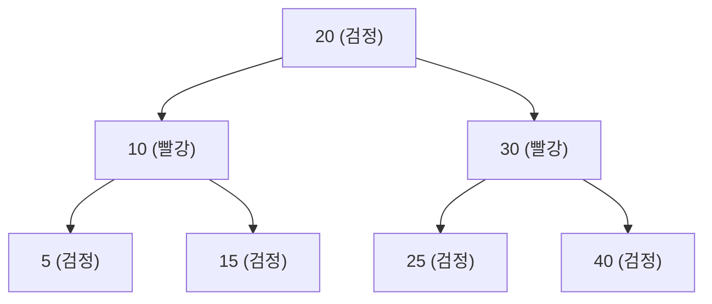

## 정의

**`java.util.TreeMap<K,V>`** 는 **Red-Black Tree** 기반의 정렬된 [[java-map|Map]]. `NavigableMap` (확장 인터페이스) 을 구현해 **범위 쿼리, floor/ceiling, sub-map** 같은 정렬 기반 연산을 제공한다.

key 는 자연 순서 (`Comparable`) 또는 생성 시 지정한 `Comparator` 로 정렬된다.

## 사용 상황

- **정렬된 순회** 가 필요한 경우: 알파벳 순, 날짜 순 나열
- **범위 쿼리**: "X 이상 Y 미만" 항목 검색
- **floor / ceiling 조회**: 특정 값 이상/이하에서 가장 가까운 key 찾기
- **우선순위 큐 대안**: 다음 이벤트 시각 찾기, 스케줄 범위 조회

단순 key-value 저장이라면 [[java-hashmap|HashMap]] 평균 O(1) 이 훨씬 빠르다.

## 시각화: Red-Black Tree



Red-Black Tree 속성:
1. 노드는 빨강 또는 검정
2. 루트는 검정
3. 빨강 노드의 자식은 검정 (연속 빨강 없음)
4. 모든 경로의 검정 노드 수 동일 (Black-height)

이 속성 덕에 트리 높이가 `2 log(n+1)` 이하로 보장, O(log n) 확정.

## 핵심 메서드 (NavigableMap)

```java
TreeMap<Integer, String> tm = new TreeMap<>();
tm.put(10, "a"); tm.put(20, "b"); tm.put(30, "c");

tm.firstKey();           // 10
tm.lastKey();            // 30
tm.floorKey(15);         // 10  (15 이하 중 가장 큰 key)
tm.ceilingKey(15);       // 20  (15 이상 중 가장 작은 key)
tm.higherKey(20);        // 30  (20 초과 중 가장 작은 key)
tm.lowerKey(20);         // 10  (20 미만 중 가장 큰 key)

tm.subMap(10, 30);       // [10, 30) 의 뷰
tm.headMap(20);          // 20 미만의 뷰
tm.tailMap(20);          // 20 이상의 뷰
tm.descendingMap();      // 역순 뷰
```

이런 정렬 기반 연산이 필요할 때 TreeMap. 그 외에는 [[java-hashmap|HashMap]] 이 빠르다.

## 복잡도

Red-Black Tree 의 성질.

| 작업 | 시간 |
|:---|:---:|
| `get`, `put`, `remove` | **O(log n)** |
| `containsKey` | O(log n) |
| `firstKey`, `lastKey` | O(log n) |
| `floorKey`, `ceilingKey` | O(log n) |
| 순회 | O(n), 정렬 순서 |

[[java-hashmap|HashMap]] 의 평균 O(1) 보다 느리지만 **최악도 O(log n)** 으로 보장된다는 점이 강점.

## Comparator 사용

```java
// 역순 정렬
TreeMap<String, Integer> reverse = new TreeMap<>(Comparator.reverseOrder());

// 사람 나이 기준 정렬
record Person(String name, int age) {}
TreeMap<Person, String> byAge = new TreeMap<>(
    Comparator.comparingInt(Person::age)
              .thenComparing(Person::name)
);
```

Comparator 가 일관되지 않으면 (transitive 위반 등) tree 가 깨진다.

## null key 비허용

`HashMap` 과 달리 **key 에 null 을 넣으면 `NullPointerException`** (자연 순서 비교를 할 수 없음). Comparator 가 null 을 처리하도록 만들면 가능하지만 보통 안 한다.

## 실전 코드: 범위 쿼리

### 시간 범위 이벤트 조회

```java
// Java 17+: 이벤트 스케줄러
record Event(String name) {}

TreeMap<Instant, Event> schedule = new TreeMap<>();
schedule.put(Instant.parse("2026-07-16T09:00:00Z"), new Event("일일 스탠드업"));
schedule.put(Instant.parse("2026-07-16T14:00:00Z"), new Event("기술 리뷰"));
schedule.put(Instant.parse("2026-07-16T17:00:00Z"), new Event("코드 리뷰"));

Instant from = Instant.parse("2026-07-16T10:00:00Z");
Instant to   = Instant.parse("2026-07-16T16:00:00Z");

// 10시~16시 사이 이벤트만
NavigableMap<Instant, Event> afternoon = schedule.subMap(from, true, to, false);
afternoon.forEach((t, e) -> System.out.println(t + " - " + e.name()));
// 2026-07-16T14:00:00Z - 기술 리뷰
```

### 가격 구간 할인율 찾기

```java
// floor lookup: 기준 이하에서 가장 가까운 구간 찾기
TreeMap<Integer, Double> discounts = new TreeMap<>();
discounts.put(0,    0.00);   // 0원 이상: 할인 없음
discounts.put(10000, 0.05);  // 1만 이상: 5%
discounts.put(50000, 0.10);  // 5만 이상: 10%
discounts.put(100000, 0.15); // 10만 이상: 15%

int price = 75000;
Map.Entry<Integer, Double> tier = discounts.floorEntry(price);
// tier.getKey() = 50000, tier.getValue() = 0.10
double discount = tier != null ? tier.getValue() : 0.0;
```

### 자동완성 prefix 검색

```java
TreeMap<String, Object> trie = new TreeMap<>();
trie.put("apple", 1); trie.put("app", 2); trie.put("application", 3);
trie.put("banana", 4);

String prefix = "app";
// "app" 이상 ~ "app" + 최대 Unicode 코드포인트 미만
NavigableMap<String, Object> matches = trie.subMap(prefix, prefix + "\uffff");
matches.forEach((k, v) -> System.out.println(k));
// app, apple, application
```

## ConcurrentSkipListMap 과의 비교

| 항목 | TreeMap | [[java-concurrentskiplistmap|ConcurrentSkipListMap]] |
|:---|:---|:---|
| 백킹 | Red-Black Tree | Skip List |
| Thread-safe | ✗ | ✓ |
| 단일 스레드 성능 | 빠름 | 약간 느림 |
| 동시성 | 외부 동기화 필요 | lock-free 읽기 |
| 메모리 | 작음 | 더 큼 |

멀티스레드 환경의 정렬 Map 이 필요하면 [[java-concurrentskiplistmap|ConcurrentSkipListMap]] 을 사용. `Collections.synchronizedSortedMap(new TreeMap<>())` 은 전 메서드에 lock 걸어서 처리량이 낮다.

## 함정

### 1. Comparator 와 equals 의 불일치

TreeMap 은 **`equals` 가 아니라 `compareTo`/`Comparator.compare` 로 동등성** 을 판단한다. 두 key 가 `equals` 는 false 인데 `compare` 가 0 을 반환하면 같은 key 로 취급.

```java
TreeMap<BigDecimal, String> tm = new TreeMap<>();
tm.put(new BigDecimal("1.0"), "a");
tm.put(new BigDecimal("1.00"), "b");
// tm.size() == 1, "b" 가 "a" 를 덮어씀
// BigDecimal.compareTo 는 scale 을 무시하기 때문
```

> [!WARNING]
> `TreeMap` 에 사용하는 key 의 `compareTo` 와 `equals` 는 반드시 일관되게 구현해야 한다. `SortedMap` 계약(contract)에 의해 `equals` 가 아니라 `compareTo == 0` 을 기준으로 동등성을 판단한다.

### 2. 동시 수정

TreeMap 은 thread-safe 하지 않다. 동시 수정 시 `ConcurrentModificationException` 또는 내부 트리 구조 오염이 발생할 수 있다.

```java
// ❌ 멀티스레드에서 공유
Map<String, String> unsafe = new TreeMap<>();

// ✓ 외부 동기화 (단순, 처리량 낮음)
Map<String, String> safe = Collections.synchronizedSortedMap(new TreeMap<>());

// ✓ 동시성 전용 (처리량 높음)
ConcurrentNavigableMap<String, String> concurrent = new ConcurrentSkipListMap<>();
```

### 3. subMap 뷰는 live view

`subMap`, `headMap`, `tailMap` 은 새 복사본이 아니라 **원본 맵의 뷰**다. 뷰를 통한 수정은 원본에 즉시 반영되고, 범위를 벗어난 key 를 넣으면 예외.

```java
NavigableMap<Integer, String> sub = tm.subMap(10, 20);
sub.put(15, "ok");   // ✓ 원본에도 반영
sub.put(25, "err");  // ❌ IllegalArgumentException: key out of range
```

## 실전 코드: 슬라이딩 윈도우 통계

```java
// 최근 N개의 측정값에서 범위 통계 계산
// TreeMap<Long timestamp, Double value>
TreeMap<Long, Double> window = new TreeMap<>();
long windowMs = 60_000L;  // 1분 윈도우

public void add(long ts, double value) {
    window.put(ts, value);
    // 오래된 항목 제거
    Long cutoff = ts - windowMs;
    window.headMap(cutoff).clear();  // headMap 은 live view, clear() 가 원본 수정
}

public DoubleSummaryStatistics stats() {
    return window.values().stream().mapToDouble(Double::doubleValue).summaryStatistics();
}

public Map.Entry<Long, Double> latestBefore(long ts) {
    return window.floorEntry(ts);  // ts 이하에서 가장 가까운 항목
}
```

## 직렬화와 NavigableMap

`TreeMap` 은 `Serializable` 을 구현. 단, Comparator 도 직렬화 가능해야 한다.

```java
// ❌ 람다 Comparator 는 직렬화 불가
TreeMap<String, Integer> broken = new TreeMap<>((a, b) -> b.compareTo(a));

// ✓ Serializable 구현 또는 Comparator.reverseOrder() 사용
TreeMap<String, Integer> ok = new TreeMap<>(Comparator.reverseOrder());
// Comparator.reverseOrder() 는 enum 기반으로 Serializable
```

## 관련 위키

- [[java-map|Map]]
- [[java-hashmap|HashMap]]
- [[java-linkedhashmap|LinkedHashMap]]
- [[java-concurrentskiplistmap|ConcurrentSkipListMap]]
- [[java-treeset|TreeSet]]
- [[java-priorityqueue|PriorityQueue]]
- [[java-collection|Collection]]
