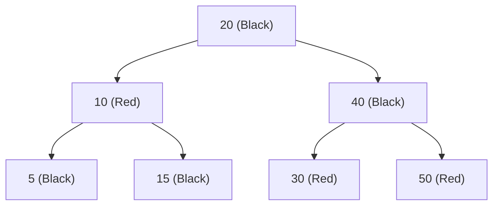
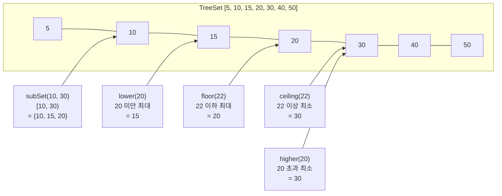

## 정의

**`java.util.TreeSet<E>`** 는 [[TreeMap]] 을 백킹으로 사용하는 **정렬된 [[Set]]**. `NavigableSet` 인터페이스를 구현해 정렬 기반 연산 (`floor`, `ceiling`, `subSet` 등) 을 제공한다.

- JDK 1.2 도입
- 내부: **Red-Black Tree** (자가 균형 이진 탐색 트리)
- 원소는 `Comparable` (자연 순서) 또는 생성자에 전달한 `Comparator` 로 정렬
- 중복 없음, null 불허

## 언제 쓰나

- **정렬 순서를 자동 유지** 해야 할 때 (삽입마다 직접 정렬 불필요)
- **range 쿼리**: "60 이상 80 미만 점수의 학생", "특정 날짜 이전 이벤트"
- `floor` / `ceiling` / `higher` / `lower` 로 **인접 값 조회**
- K-번째 크거나 작은 값 탐색 (`subSet` + `size()` 조합)
- 중복 없이 정렬된 상태가 필요한 우선순위 처리

## 시각화: Red-Black Tree 구조



- **Black-height 균형**: 루트에서 임의의 리프까지 Black 노드 수 동일
- **삽입/삭제 후 회전(rotation) + 색 변경** 으로 균형 복구
- 최악 높이: `2 * log2(n+1)` → 탐색 항상 O(log n)

## 시각화: floor/ceiling/subSet 동작



## 핵심 NavigableSet 메서드

```java
import java.util.TreeSet;
import java.util.NavigableSet;

TreeSet<Integer> ts = new TreeSet<>(java.util.List.of(10, 20, 30, 40, 50));

// 경계값 조회
ts.first();              // 10 (최솟값)
ts.last();               // 50 (최댓값)

// 인접 원소 탐색
ts.floor(25);            // 20 (25 이하 최대)
ts.ceiling(25);          // 30 (25 이상 최소)
ts.lower(20);            // 10 (20 미만 최대, 20 제외)
ts.higher(20);           // 30 (20 초과 최소, 20 제외)

// 범위 view (live view, 원본 변경 반영)
NavigableSet<Integer> sub = ts.subSet(10, true, 30, false);   // [10, 30)
NavigableSet<Integer> head = ts.headSet(30, false);           // < 30
NavigableSet<Integer> tail = ts.tailSet(30, true);            // >= 30

// 역순 view
NavigableSet<Integer> desc = ts.descendingSet();              // [50, 40, 30, 20, 10]
```

## 내부 구조 (TreeMap 위임)

```java
public class TreeSet<E> extends AbstractSet<E>
        implements NavigableSet<E>, Cloneable, Serializable {

    private transient NavigableMap<E, Object> m;
    private static final Object PRESENT = new Object();

    // TreeMap 에 key=원소, value=PRESENT 로 저장
    public boolean add(E e) {
        return m.put(e, PRESENT) == null;
    }

    public boolean contains(Object o) {
        return m.containsKey(o);
    }

    // floor, ceiling 등은 TreeMap.floorKey, TreeMap.ceilingKey 위임
    public E floor(E e) {
        return m.floorKey(e);
    }
}
```

`TreeSet` 자체에 트리 로직은 없다. 모두 [[TreeMap]] 에 위임.

## 복잡도

| 작업 | 시간 |
|:---|:---:|
| `add`, `remove`, `contains` | **O(log n)** |
| `first`, `last` | O(log n) |
| `floor`, `ceiling`, `lower`, `higher` | O(log n) |
| `subSet`, `headSet`, `tailSet` | O(log n) (view 생성) |
| 순회 (iterator) | O(n), 정렬 순서 |
| `size` | O(1) |

## Comparator 사용

```java
import java.util.Comparator;
import java.util.TreeSet;

// 내림차순 정렬
TreeSet<Integer> descSet = new TreeSet<>(Comparator.reverseOrder());
descSet.add(30); descSet.add(10); descSet.add(20);
descSet.first();   // 30 (내림차순에서 "최솟값" = 실제 최댓값)

// 커스텀 객체: 길이 오름차순, 동일 길이면 사전순
record Word(String value) {}

TreeSet<Word> wordSet = new TreeSet<>(
    Comparator.comparingInt((Word w) -> w.value().length())
              .thenComparing(w -> w.value())
);
wordSet.add(new Word("banana"));
wordSet.add(new Word("apple"));
wordSet.add(new Word("kiwi"));
// 순서: kiwi(4), apple(5), banana(6)
```

## Java 17+ 실전: 성적 구간 조회

```java
import java.util.TreeSet;
import java.util.NavigableSet;

class ScoreBoard {
    private final TreeSet<Integer> scores = new TreeSet<>();

    void addScore(int score) {
        scores.add(score);
    }

    // 80점 이상 학생 수
    long countHighScorers() {
        return scores.tailSet(80).size();
    }

    // [60, 80) 구간 학생
    NavigableSet<Integer> midRange() {
        return scores.subSet(60, true, 80, false);
    }

    // 특정 점수와 가장 가까운 점수
    int nearest(int target) {
        Integer lo = scores.floor(target);
        Integer hi = scores.ceiling(target);
        if (lo == null) return hi;
        if (hi == null) return lo;
        return (target - lo <= hi - target) ? lo : hi;
    }
}
```

## Java 17+ 실전: 이벤트 타임라인 관리

```java
import java.util.TreeSet;
import java.util.NavigableSet;
import java.time.LocalDateTime;

record Event(LocalDateTime time, String name)
        implements Comparable<Event> {
    @Override
    public int compareTo(Event other) {
        int cmp = time.compareTo(other.time);
        return cmp != 0 ? cmp : name.compareTo(other.name);
    }
}

class Timeline {
    private final TreeSet<Event> events = new TreeSet<>();

    void add(Event e) { events.add(e); }

    // 특정 시점 이후 이벤트 (live view)
    NavigableSet<Event> after(LocalDateTime from) {
        return events.tailSet(new Event(from, ""), true);
    }

    // 다음 이벤트
    Event next(LocalDateTime now) {
        return events.higher(new Event(now, "\uFFFF"));
    }
}
```

## Java 17+ 실전: 할인율 구간 룩업 (계단식 요금)

```java
import java.util.TreeMap;

// TreeMap 의 floorEntry 패턴 (TreeSet 대안)
// 1000원 미만: 0%, 1000원 이상: 5%, 5000원 이상: 10%, 10000원 이상: 15%
TreeMap<Integer, Integer> discountTable = new TreeMap<>();
discountTable.put(0,     0);
discountTable.put(1000,  5);
discountTable.put(5000,  10);
discountTable.put(10000, 15);

int getDiscount(int amount) {
    return discountTable.floorEntry(amount).getValue();
}

getDiscount(3000);   // 5%
getDiscount(9999);   // 10%
getDiscount(10000);  // 15%
```

> [!TIP]
> 계단식 룩업에서는 `TreeSet` 보다 `TreeMap.floorEntry()` 가 더 직관적이다. `TreeSet` 은 key 만 저장하므로 매핑이 필요하면 `TreeMap` 이 더 적합.

## HashSet vs TreeSet vs LinkedHashSet

| 항목 | HashSet | TreeSet | LinkedHashSet |
|:---|:---:|:---:|:---:|
| 순서 | ✗ | 정렬 순서 | 삽입 순서 |
| `add/contains` | O(1) 평균 | O(log n) | O(1) 평균 |
| null 허용 | ✓ | ✗ | ✓ |
| Range 쿼리 | ✗ | ✓ | ✗ |
| Thread-safe | ✗ | ✗ | ✗ |
| 동시성 대안 | `ConcurrentHashMap.newKeySet()` | [[ConcurrentSkipListSet]] | - |

## 함정

### 1. null 원소 NullPointerException

```java
TreeSet<String> ts = new TreeSet<>();
ts.add(null);   // NullPointerException

// Comparator 기반도 마찬가지 (compareTo(null) 호출 → NPE)
```

null 이 필요하면 `HashSet` 또는 null-friendly `Comparator` 를 명시해야 한다.

### 2. Comparator 와 equals 불일치

`Comparator` 가 0 을 반환하면 같은 원소로 취급. `equals` 와 일치하지 않으면 집합 계약 위반.

```java
// 위험: String 길이만 비교하면 "abc" 와 "def" 가 "같은" 원소로 처리됨
TreeSet<String> ts = new TreeSet<>(Comparator.comparingInt(String::length));
ts.add("abc");
ts.add("def");   // 추가 안 됨! Comparator 가 0 반환 → 중복 취급
ts.size();       // 1 (기대: 2)

// 올바름: 길이 동점이면 사전순으로 tie-break
TreeSet<String> ts2 = new TreeSet<>(
    Comparator.comparingInt(String::length).thenComparing(Comparator.naturalOrder())
);
```

### 3. subSet view 범위 밖 추가

```java
NavigableSet<Integer> sub = ts.subSet(10, 30);
sub.add(50);   // IllegalArgumentException
```

view 에서 범위 밖 원소를 추가하면 예외.

### 4. 동시성 주의

`TreeSet` 은 thread-safe 하지 않다. 동시 수정 시 `ConcurrentModificationException` (iterator 사용 시) 또는 데이터 손상. 동시성 환경에서는 [[ConcurrentSkipListSet]] 사용.

### 5. 성능: 대용량 데이터

`TreeSet` 은 O(log n) 이 보장되지만 `HashSet` 의 O(1) 보다 느리다. 정렬이 필요 없다면 `HashSet` 이 훨씬 빠르다.

```java
// 정렬이 필요 없다면
Set<String> fast = new HashSet<>();   // O(1) 평균

// 정렬이 필요하다면
Set<String> sorted = new TreeSet<>();  // O(log n)
```

## 관련 위키

- [[Set]]
- [[TreeMap]]
- [[ConcurrentSkipListSet]]
- [[HashSet]]
- [[Collection]]
- [[Iterable]]
- [[Object]]
