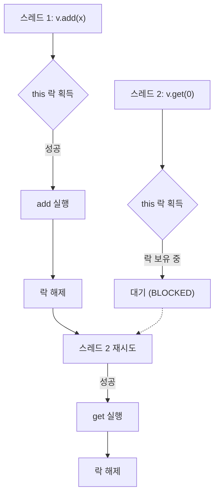
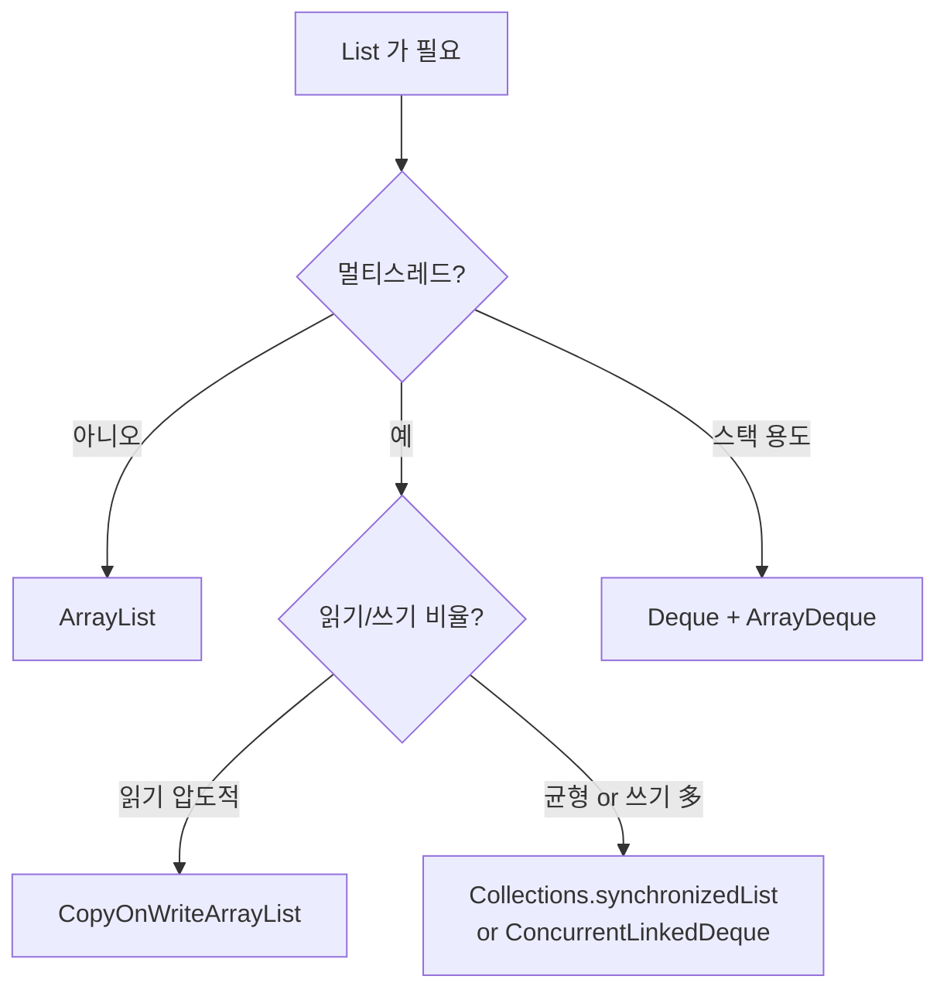

## 정의

**`java.util.Vector`** 는 [[ArrayList]] 와 거의 동일한 동적 배열 기반 [[List]] 이지만, **모든 public 메서드가 `synchronized`** 로 묶여 있다. Java 1.0 (1996) 부터 존재하는 레거시 컬렉션.

JDK 1.2 의 Collections Framework 도입 시 `List` 인터페이스에 retrofit 됐으며, 같은 인터페이스를 구현하는 [[ArrayList]] 가 등장했다. **새 코드에서는 거의 쓰지 않는다.**

## 사용 상황

Vector 는 **새 코드에서 쓰지 않는다.** 하지만 다음 상황에서 마주치게 된다.

| 상황 | 비고 |
|:---|:---|
| 레거시 코드 유지보수 | JDK 1.0-1.1 시절 코드, 90년대 후반 ~ 2000년대 초 |
| `Stack<E>` 사용 코드 | `Stack` 이 `Vector` 를 상속 |
| AWT/Swing API 내부 | `JTable`, `JList` 모델 일부가 Vector 사용 |
| API 반환값 | 서드파티 라이브러리가 반환하는 경우 |

이 파일은 Vector 를 왜 쓰지 않는지, 그리고 마주쳤을 때 어떻게 처리하는지를 이해하기 위한 것이다.

## 시각화

```anim:java-vector-sync
{}
```

## 내부 구조

```java
public class Vector<E> extends AbstractList<E>
    implements List<E>, RandomAccess, Cloneable, java.io.Serializable {

    protected Object[] elementData;
    protected int elementCount;
    protected int capacityIncrement;   // 0 이면 두 배씩 증가

    public synchronized boolean add(E e) { ... }
    public synchronized E get(int index) { ... }
    public synchronized E remove(int index) { ... }
    public synchronized int size() { ... }
    // 거의 모든 메서드에 synchronized
}
```

[[ArrayList]] 와의 두 가지 구조적 차이.

1. **`capacityIncrement`**: 0 일 때 **두 배씩** 확장 (ArrayList 는 1.5 배). 양수로 지정하면 그 값만큼 고정 증가.
2. **모든 메서드가 `synchronized`**: 메서드 호출마다 `this` 의 모니터 락을 획득. `size()` 조차 락을 건다.

## 주요 연산 비용

복잡도 자체는 [[ArrayList]] 와 동일. **매 호출마다 락 acquire/release** 가 더해진다.

| 메서드 | 시간 | 추가 비용 |
|:---|:---:|:---|
| `get(int i)` | O(1) | 락 acquire/release |
| `add(E e)` | amortized O(1) | 락 acquire/release |
| `add(int i, E e)` | O(n) | 락 acquire/release |
| `remove(int i)` | O(n) | 락 acquire/release |
| `size()` | O(1) | 락 acquire/release |

단일 스레드 환경이라면 락은 무경합 (uncontended) 이라 비용이 매우 작지만, ArrayList 대비 측정 가능한 오버헤드가 있다. 멀티스레드 경합 시 모니터 진입 비용이 크다.

## synchronized 메서드 락 흐름



각 메서드가 `this` 모니터를 잠근다. `add` 와 `get` 도 동시에 실행 불가.

## 메서드별 동기화의 한계

각 메서드 호출은 atomic 하지만, **복합 연산** 은 race condition 의 여지가 그대로 남는다.

```java
Vector<Integer> v = new Vector<>();

// 각 메서드는 atomic 이지만 두 호출 사이에 다른 스레드가 끼어들 수 있음
if (!v.contains(42)) {
    v.add(42);   // 다른 스레드가 그 사이에 42 를 넣었을 수 있음
}

// 외부에서 명시적 락으로 묶어야 안전
synchronized (v) {
    if (!v.contains(42)) {
        v.add(42);
    }
}
```

> [!CAUTION]
> **"Vector 가 thread-safe 하다" 는 오해다.** 단일 메서드는 thread-safe 지만, 두 개 이상의 메서드를 묶는 일관성은 호출자가 따로 보장해야 한다. 진정한 동시성 컬렉션은 [[CopyOnWriteArrayList]] 또는 `ConcurrentHashMap` 같은 `java.util.concurrent` 의 컬렉션.

## iterator 의 fail-fast

Vector 의 iterator 도 [[fail-fast iterator]]. 순회 도중 다른 스레드가 add/remove 하면 [[ConcurrentModificationException]]. 락으로 외부 동기화를 해야 안전한 순회가 가능하다.

```java
synchronized (v) {
    for (Integer x : v) {
        process(x);   // 이 블록 안에서는 다른 스레드 진입 불가
    }
}
```

락 없이 순회하면 CME 가 발생할 수 있다. `v.get(i)` 인덱스 순회도 size 가 변하면 AIOOBE.

## Stack 과의 관계

**`java.util.Stack<E>`** 는 `Vector<E>` 를 **상속** 한다. 레거시 코드에서 Stack 을 발견하면 Vector 의 모든 동작이 함께 온다는 뜻이다.

```java
// 레거시: Stack은 Vector를 상속, 모든 List 메서드 노출됨
Stack<Integer> stack = new Stack<>();
stack.push(1);
stack.pop();
stack.get(0);    // 인덱스 접근도 가능 (스택의 의도와 다름)
stack.add(0, 99);  // 스택 중간에 삽입도 가능!

// Java 현대 권장: Deque 인터페이스 + ArrayDeque 구현
Deque<Integer> stack2 = new ArrayDeque<>();
stack2.push(1);
stack2.pop();
// stack2.get(0);  컴파일 에러, Deque 는 인덱스 접근 없음
```

`ArrayDeque` 기반 Deque 가 Stack 역할을 더 명확하게 표현하고 성능도 우수하다.

## ArrayList vs Vector

| 항목 | ArrayList | Vector |
|:---|:---|:---|
| 동기화 | 없음 | 모든 메서드에 synchronized |
| 도입 시점 | JDK 1.2 (1998) | JDK 1.0 (1996) |
| 용량 증가 | 1.5 배 | 2 배 (또는 `capacityIncrement`) |
| 메서드 호출 비용 | 작음 | + 락 비용 |
| 복합 연산 안전성 | 외부 동기화 필요 | **여전히 외부 동기화 필요** |
| 새 코드 권장 | ✓ | ✗ |

## 왜 새 코드에서 쓰지 않는가

1. **단일 스레드** 라면 락이 불필요한데도 비용을 낸다.
2. **다중 스레드** 라도 메서드별 락만으로는 복합 연산이 안전하지 않다. 결국 외부 동기화가 필요하다.
3. **진짜 동시성 컬렉션** ([[CopyOnWriteArrayList]], `ConcurrentLinkedQueue` 등) 이 훨씬 우수하다.
4. **레거시 설계 잔재**: JDK 가 retrofit 했으나 이상적인 컬렉션 설계가 아니다.

## 대안: 상황별 선택



| 의도 | 대안 |
|:---|:---|
| 단일 스레드 List | [[ArrayList]] |
| 외부 동기화 List | `Collections.synchronizedList(new ArrayList<>())` |
| 읽기 多, 쓰기 거의 없음 | [[CopyOnWriteArrayList]] |
| 동시 큐/덱 | `ConcurrentLinkedDeque`, `LinkedBlockingDeque` |
| 스택 | `Deque<E> stack = new ArrayDeque<>()` |

## 레거시 Vector 마이그레이션

레거시 코드에서 Vector 를 마주쳤을 때 점진 교체 전략.

```java
// 기존 레거시
Vector<String> v = new Vector<>();
v.add("a");
String s = v.get(0);

// 1단계: 변수 타입을 List 로 추상화 (컴파일 체크)
List<String> list = new Vector<>();   // 구현체는 그대로

// 2단계: 실제 구현체 교체 (단일 스레드라면)
List<String> list2 = new ArrayList<>();

// 3단계: 멀티스레드라면 상황에 맞는 concurrent 컬렉션으로
// 읽기 多: CopyOnWriteArrayList
// 쓰기 多: Collections.synchronizedList(new ArrayList<>()) + 복합연산 외부 락
```

## capacityIncrement 의 미묘한 차이

[[ArrayList]] 는 grow 할 때 현재 크기의 **1.5 배** 로 늘리지만, Vector 는 `capacityIncrement` 가 0 이면 **두 배** 로 늘린다.

```java
// capacityIncrement = 0 (기본)
Vector<Integer> v1 = new Vector<>();          // 초기 capacity 10, 초과 시 20으로
Vector<Integer> v2 = new Vector<>(10, 5);     // 초기 10, 초과 시 5씩 증가

// ArrayList: 초기 10, 초과 시 15 -> 22 -> 33 ... (1.5배)
ArrayList<Integer> a = new ArrayList<>();
```

두 배 성장은 메모리 낭비가 클 수 있고, 고정 증가(capacityIncrement > 0)는 잦은 재할당이 발생할 수 있다. [[ArrayList]] 의 1.5 배 전략이 일반적으로 더 균형 잡혀 있다.

## Enumeration: Vector 전용 레거시 API

Vector 는 `iterator()` 외에 레거시 `Enumeration<E>` 도 지원한다.

```java
Vector<String> v = new Vector<>(List.of("a", "b", "c"));

// 레거시 API (JDK 1.0)
Enumeration<String> e = v.elements();
while (e.hasMoreElements()) {
    System.out.println(e.nextElement());
}

// 현대 방식
for (String s : v) { ... }
v.forEach(System.out::println);
```

`Enumeration` 은 fail-fast 가 아니다. 순회 중 수정해도 CME 가 발생하지 않고, 대신 정의되지 않은 동작이 일어날 수 있다. 레거시 Enumeration 코드를 유지보수할 때 주의.

## 관련 위키

- [[Object]]
- [[Iterable]]
- [[Collection]]
- [[List]]
- [[ArrayList]]
- [[CopyOnWriteArrayList]]
- [[ConcurrentHashMap]]
- [[fail-fast iterator]]
- [[ConcurrentModificationException]]
- [[ReentrantLock]]
- Brian Goetz, *Java Concurrency in Practice*, §5 Building Blocks
