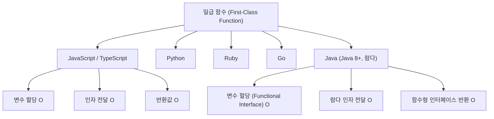

## 정의

**일급 함수 (First-Class Function)**: 함수를 숫자, 문자열, 객체처럼 값으로 다룰 수 있는 언어의 특성.

다음 세 가지가 모두 가능하면 그 언어의 함수는 일급이다.

| 조건 | 설명 | 예 |
|:---|:---|:---|
| 변수에 할당 | 함수를 변수나 데이터 구조에 저장 | `const fn = function() {}` |
| 인자로 전달 | 다른 함수의 매개변수로 함수를 넘김 | `arr.map(fn)` |
| 반환값으로 사용 | 함수가 함수를 돌려줌 | `const add = a => b => a + b` |

> 일급 함수는 함수를 값처럼 다룰 수 있는 권한이고, [[고차 함수]] 는 그 권한을 이용해 다른 함수를 인자로 받거나 반환하는 함수다. (모든 고차 함수는 일급 함수를 기반으로 만들어진다.)

## 사용 상황

- [[js-callback|콜백]] 패턴: 이벤트 핸들러, 타이머, 비동기 처리
- [[고차 함수]]: `map`, `filter`, `reduce`, 커링, 데코레이터
- 함수 합성 (composition): 여러 작은 함수를 조립해 복잡한 로직 구성
- 의존성 주입: 테스트 가능한 코드 작성
- 모듈화: 전략 패턴, 플러그인 시스템

## 시각화

언어별 일급 함수 지원 여부:



## 기본 사용법

### 1. 변수에 함수 할당

```javascript
// 함수 표현식: 함수를 값으로 변수에 저장
const greet = function(name) {
  return `안녕, ${name}!`;
};

// 화살표 함수도 동일
const greetArrow = name => `안녕, ${name}!`;

// 배열에 함수 저장
const operations = [
  (a, b) => a + b,
  (a, b) => a - b,
  (a, b) => a * b,
];

operations[0](3, 2);  // 5
operations[1](3, 2);  // 1
operations[2](3, 2);  // 6

// 객체 프로퍼티로 저장
const math = {
  add: (a, b) => a + b,
  sub: (a, b) => a - b,
};
math.add(3, 4);  // 7
```

### 2. 함수를 인자로 전달

```javascript
// 고차 함수: 함수를 매개변수로 받음
function applyTwice(fn, x) {
  return fn(fn(x));
}

const double = x => x * 2;
applyTwice(double, 3);  // 12 (3*2=6, 6*2=12)

// 배열 메서드: 콜백을 인자로 받음
[1, 2, 3].map(x => x * 2);        // [2, 4, 6]
[1, 2, 3].filter(x => x > 1);     // [2, 3]
[1, 2, 3].forEach(x => console.log(x));

// 이벤트 핸들러 등록
document.addEventListener('click', (e) => {
  console.log('클릭:', e.target);
});

// setTimeout
setTimeout(() => console.log('1초 후'), 1000);
```

### 3. 함수를 반환값으로 사용

```javascript
// 함수를 반환하는 팩토리 함수
function makeAdder(n) {
  return function(x) {
    return x + n;
  };
}

const add10 = makeAdder(10);
const add20 = makeAdder(20);

add10(5);   // 15
add20(5);   // 25

// 커리드 화살표 함수
const multiply = a => b => a * b;
const double = multiply(2);
[1, 2, 3].map(double);  // [2, 4, 6]
```

## 실전 예시

### 전략 패턴 (Strategy Pattern)

```javascript
// 정렬 전략을 함수로 주입
function sortBy(arr, compareFn) {
  return [...arr].sort(compareFn);
}

const people = [
  { name: '홍길동', age: 30 },
  { name: '이순신', age: 45 },
  { name: '강감찬', age: 28 },
];

const byAge  = (a, b) => a.age - b.age;
const byName = (a, b) => a.name.localeCompare(b.name);

sortBy(people, byAge);   // 나이 순
sortBy(people, byName);  // 이름 순

// 정렬 방향도 HOF 로 추상화
const descending = fn => (a, b) => fn(b, a);
sortBy(people, descending(byAge));  // 나이 역순
```

### 의존성 주입으로 테스트 가능한 코드

```javascript
// fetcher 를 외부에서 주입 (테스트 시 Mock 으로 교체)
function createApiService(fetcher = fetch) {
  return {
    async getUser(id) {
      const res = await fetcher(`/users/${id}`);
      return res.json();
    },
    async createPost(data) {
      const res = await fetcher('/posts', {
        method: 'POST',
        body: JSON.stringify(data),
      });
      return res.json();
    },
  };
}

// 실제 사용
const api = createApiService();

// 테스트: fetch 를 Mock 으로 교체
const mockFetch = (url) => Promise.resolve({
  json: () => ({ id: 1, name: '테스트 유저' }),
});
const testApi = createApiService(mockFetch);
```

### 함수 합성으로 유효성 검사

```javascript
const validators = [
  str => str.length >= 8 || '8자 이상이어야 합니다',
  str => /[A-Z]/.test(str) || '대문자가 포함되어야 합니다',
  str => /[0-9]/.test(str) || '숫자가 포함되어야 합니다',
];

function validate(value, rules) {
  return rules
    .map(rule => rule(value))
    .filter(result => typeof result === 'string');
}

validate('abc', validators);
// ['8자 이상이어야 합니다', '대문자가 포함되어야 합니다', '숫자가 포함되어야 합니다']
validate('Abc12345', validators);
// []
```

## 언어별 비교

| 언어 | 변수 할당 | 인자 전달 | 반환값 | 비고 |
|:---|:---:|:---:|:---:|:---|
| JavaScript | O | O | O | 함수 자체가 일급 객체 |
| Python | O | O | O | `def` / `lambda` 모두 일급 |
| Ruby | O | O | O | `Proc`, `lambda`, 블록 |
| Go | O | O | O | 함수형 프로그래밍 지원 |
| Java (8+) | O | O | O | Functional Interface 필요 |
| C (함수 포인터) | O | O | O | 포인터 문법 필요, 클로저 없음 |

### Python 비교

```python
# 1. 변수에 함수 할당
double = lambda x: x * 2

# 2. 함수를 인자로 전달
result = list(map(double, [1, 2, 3]))  # [2, 4, 6]

# 3. 함수를 반환값으로 사용
def make_adder(n):
    return lambda x: x + n

add5 = make_adder(5)
add5(3)  # 8
```

Python 의 `lambda` 는 표현식만 허용. 여러 줄 함수는 `def` 후 반환해야 한다.

### Java 비교

```java
// Java 8+ 람다: Functional Interface 를 통해 일급 함수 흉내
import java.util.function.*;

// 1. 변수에 할당
Function<Integer, Integer> double_ = x -> x * 2;

// 2. 인자로 전달
List<Integer> result = List.of(1, 2, 3).stream()
    .map(double_)
    .collect(Collectors.toList());  // [2, 4, 6]

// 3. 함수를 반환
Function<Integer, Function<Integer, Integer>> add = a -> b -> a + b;
Function<Integer, Integer> add5 = add.apply(5);
add5.apply(3);  // 8
```

Java 는 함수가 일급 객체가 아니라 인터페이스 구현체다. 타입 명시가 장황해지는 단점이 있다.

## 함정

> [!WARNING]
> **`function` 선언문과 `const fn = function` 의 차이**: 선언문은 호이스팅되어 정의 전에 호출 가능, 표현식은 TDZ 에 걸린다.

```javascript
// ✅ 선언문: 호이스팅
console.log(add(2, 3));  // 5
function add(a, b) { return a + b; }

// ❌ 표현식: 정의 전 호출 불가
console.log(sub(2, 3));  // ReferenceError: Cannot access 'sub' before initialization
const sub = (a, b) => a - b;
```

> [!WARNING]
> **`typeof class === 'function'`**: 클래스도 함수처럼 취급되어 혼동 여지가 있다.

```javascript
typeof function() {}  // 'function'
typeof (() => {})     // 'function'
typeof class Foo {}   // 'function'  (!)
```

클래스는 `new` 없이 호출하면 `TypeError` 가 발생하지만, `typeof` 는 구분하지 못한다.

> [!CAUTION]
> **함수를 배열/객체에 저장할 때 `this` 손실**: 메서드를 꺼내서 콜백으로 사용하면 `this` 가 사라진다.

```javascript
const obj = {
  value: 42,
  getValue() { return this.value; },
};

const fn = obj.getValue;
fn();            // undefined (this 손실)
fn.call(obj);   // 42 (명시적 바인딩)

// 화살표 함수로 래핑
const safeFn = () => obj.getValue();
safeFn();        // 42
```

## 관련 위키

- [[고차 함수]] - 일급 함수를 기반으로 구현
- [[js-closure|클로저]] - 반환된 함수가 외부 변수를 캡처
- [[js-arrow-function|화살표 함수]] - ES6 일급 함수 표현식
- [[js-function|function]] - 함수 선언 / 표현 방식 전반
- [[js-callback|콜백]] - 함수를 인자로 전달하는 패턴
- [[js-hoisting|호이스팅]] - 선언문 vs 표현식 차이
- [[js-this-binding|this 바인딩]] - 메서드 분리 시 this 손실
