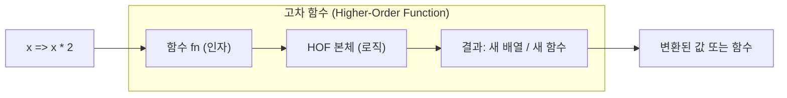

## 정의

**고차 함수 (Higher-Order Function, HOF)**: 다음 조건 중 하나 이상을 만족하는 함수.

1. 함수를 인자로 받는다.
2. 함수를 반환한다.

[[일급 함수]] 특성이 있어야만 가능한 패턴이다. 함수를 값처럼 다룰 수 있기 때문에 함수를 조립하거나 추상화하는 강력한 도구가 된다.

| 조건 | 예 |
|:---|:---|
| 함수를 인자로 받는다 | `Array.prototype.map(fn)` |
| 함수를 반환한다 | `const multiply = x => y => x * y` |
| 둘 다 | `pipe(f, g)` |

## 사용 상황

- 배열 변환: `map`, `filter`, `reduce`
- 함수 합성 (function composition): 여러 함수를 조립해 새 함수 생성
- 커링 (currying): 다중 인자 함수를 단일 인자 함수 체인으로 분해
- 데코레이터 패턴: 기존 함수에 캐싱, 로깅, 재시도 등을 덧씌움
- 추상화: 반복 로직을 HOF 로 분리해 DRY 원칙 실현

## 시각화

HOF 가 함수를 받아 새 함수 또는 결과를 내보내는 구조:



함수 합성 (pipe) 흐름: 입력이 각 함수를 차례로 통과한다.


## 기본 사용법

### map, filter, reduce

JavaScript 내장 배열 메서드가 가장 흔한 HOF 예시다.

```javascript
const numbers = [1, 2, 3, 4, 5];

// map: 각 원소를 변환한 새 배열 반환
const doubled = numbers.map(x => x * 2);
// [2, 4, 6, 8, 10]

// filter: 조건에 맞는 원소만 새 배열로
const evens = numbers.filter(x => x % 2 === 0);
// [2, 4]

// reduce: 배열을 하나의 값으로 누적
const sum = numbers.reduce((acc, x) => acc + x, 0);
// 15

// 체이닝: filter -> map -> reduce
const result = numbers
  .filter(x => x % 2 !== 0)  // [1, 3, 5]
  .map(x => x ** 2)            // [1, 9, 25]
  .reduce((a, b) => a + b, 0); // 35
```

### 함수를 반환하는 패턴

```javascript
// multiplier 는 숫자를 받아 함수를 반환하는 HOF
function multiplier(factor) {
  return (num) => num * factor;
}

const double = multiplier(2);
const triple = multiplier(3);

console.log(double(5));   // 10
console.log(triple(5));   // 15

// 배열 메서드와 함께
const numbers = [1, 2, 3];
console.log(numbers.map(double));  // [2, 4, 6]
console.log(numbers.map(triple));  // [3, 6, 9]
```

## 실전 예시

### 함수 합성: compose / pipe

```javascript
// compose: 오른쪽 -> 왼쪽 순서로 적용
const compose = (...fns) => x =>
  fns.reduceRight((v, f) => f(v), x);

// pipe: 왼쪽 -> 오른쪽 순서로 적용 (compose 반대)
const pipe = (...fns) => x =>
  fns.reduce((v, f) => f(v), x);

const trim    = str => str.trim();
const toLower = str => str.toLowerCase();
const split   = str => str.split(' ');

const process = pipe(trim, toLower, split);
process('  Hello World  ');
// ['hello', 'world']
```

### 커링 (Currying)

```javascript
// 2인자 함수를 커리드 버전으로
const add = a => b => a + b;

const add5 = add(5);
add5(3);   // 8
add5(10);  // 15

// 실용 예: 로거 생성기
const withPrefix = prefix => message =>
  `[${prefix}] ${message}`;

const logError = withPrefix('ERROR');
const logInfo  = withPrefix('INFO');

logError('서버 연결 실패');  // [ERROR] 서버 연결 실패
logInfo('서버 시작됨');      // [INFO] 서버 시작됨
```

### 메모이제이션 데코레이터

```javascript
function memoize(fn) {
  const cache = new Map();
  return function (...args) {
    const key = JSON.stringify(args);
    if (cache.has(key)) return cache.get(key);
    const result = fn.apply(this, args);
    cache.set(key, result);
    return result;
  };
}

function slowFib(n) {
  if (n <= 1) return n;
  return slowFib(n - 1) + slowFib(n - 2);
}

const fib = memoize(slowFib);
fib(40);  // 빠름 (중복 계산 없음)
fib(40);  // 즉시 반환 (캐시 히트)
```

### 재시도 HOF

```javascript
function withRetry(fn, retries = 3, backoff = 300) {
  return async function (...args) {
    for (let attempt = 0; attempt < retries; attempt++) {
      try {
        return await fn(...args);
      } catch (err) {
        if (attempt === retries - 1) throw err;
        const delay = backoff * Math.pow(2, attempt);
        await new Promise(r => setTimeout(r, delay));
        console.warn(`재시도 ${attempt + 1}/${retries}`);
      }
    }
  };
}

const fetchWithRetry = withRetry(fetch, 3);
const res = await fetchWithRetry('/api/data');
```

### reduce 로 pipeline 구성

```javascript
const pipeline = (...fns) => data =>
  fns.reduce((value, fn) => fn(value), data);

const process = pipeline(
  data => data.filter(x => x > 0),
  data => data.map(x => x * 2),
  data => data.reduce((sum, x) => sum + x, 0),
);

process([-1, 2, 3, -4, 5]);
// 양수만 필터 [2, 3, 5] -> 2배 [4, 6, 10] -> 합산 20
```

### 고차 함수로 전략 주입

```javascript
// 정렬 전략을 함수로 주입
function sortBy(arr, compareFn) {
  return [...arr].sort(compareFn);
}

const people = [
  { name: '홍길동', age: 30 },
  { name: '이순신', age: 45 },
  { name: '강감찬', age: 28 },
];

const byAge  = (a, b) => a.age - b.age;
const byName = (a, b) => a.name.localeCompare(b.name);

sortBy(people, byAge);   // 나이 순 정렬
sortBy(people, byName);  // 이름 순 정렬
```

## 클로저와의 관계

고차 함수가 함수를 반환할 때, 반환된 함수는 종종 외부 변수를 캡처하는 [[js-closure|클로저]]가 된다.

```javascript
function counter(start = 0) {
  let count = start;  // 클로저로 캡처되는 변수
  return {
    increment: () => ++count,
    decrement: () => --count,
    value:     () => count,
  };
}

const c = counter(10);
c.increment();  // 11
c.increment();  // 12
c.decrement();  // 11
c.value();      // 11
```

`counter` 는 객체를 반환하는 HOF. 반환된 세 메서드가 `count` 를 클로저로 공유한다.

## 함정

> [!WARNING]
> **this 컨텍스트 손실**: `function` 키워드 콜백에서는 `this` 가 호출 시 재결정된다. 메서드를 HOF 에 넘길 때 주의.

```javascript
const obj = {
  multiplier: 3,
  values: [1, 2, 3],
  compute() {
    // ❌ function 콜백: this 가 undefined (strict mode)
    return this.values.map(function(v) {
      return v * this.multiplier;  // TypeError
    });
  },
  computeOk() {
    // ✅ 화살표 함수: this 를 lexical 로 캡처
    return this.values.map(v => v * this.multiplier);
  },
};

obj.computeOk();  // [3, 6, 9]
```

> [!WARNING]
> **reduce 의 빈 배열 + 초기값 미지정**: `TypeError` 가 발생한다.

```javascript
// ❌ 초기값 없으면 빈 배열에서 TypeError
[].reduce((a, b) => a + b);

// ✅ 항상 초기값 명시
[].reduce((a, b) => a + b, 0);  // 0
```

> [!CAUTION]
> **과도한 커링**: 커링 단계가 3단계를 넘으면 타입 추론이 어렵고 디버깅이 힘들어진다. 명시적 함수로 풀어쓰는 편이 낫다.

```javascript
// ❌ 너무 많은 커링 단계
const f = a => b => c => d => a + b + c + d;

// ✅ 명시적 매개변수
const f = (a, b, c, d) => a + b + c + d;
```

## 관련 위키

- [[일급 함수]] - HOF 의 전제 조건
- [[js-closure|클로저]] - HOF 반환 함수와 깊이 연결
- [[js-array|Array]] - map / filter / reduce
- [[js-arrow-function|화살표 함수]] - HOF 콜백으로 자주 쓰임
- [[js-callback|콜백]] - 함수를 인자로 전달하는 패턴
- [[js-async-await|async/await]] - 비동기 HOF 패턴
