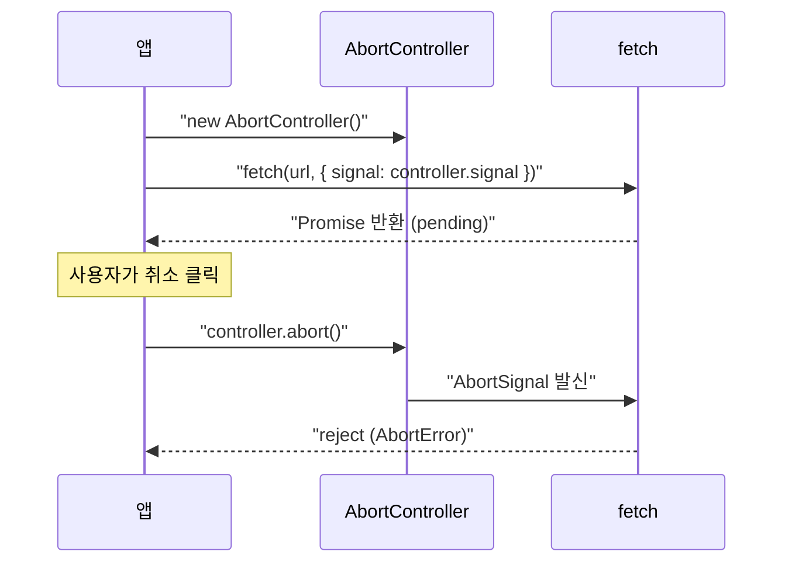
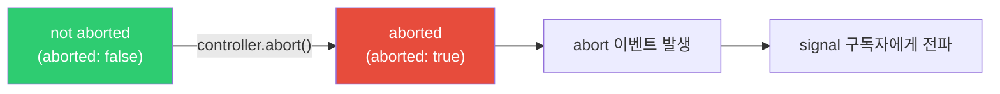

## 정의

**`AbortController`** 는 비동기 작업 (fetch, event listener, 커스텀 Promise 등) 을 **취소** 하기 위한 표준 Web API 인터페이스.

| 인터페이스 | 역할 |
|:---|:---|
| `AbortController` | 취소 신호를 발송하는 쪽 (컨트롤러) |
| `AbortSignal` | 취소 신호를 수신하는 쪽 (읽기 전용 신호 객체) |

`controller.signal` 을 비동기 API 에 전달하고, `controller.abort()` 를 호출하면 해당 작업이 취소된다.

## 사용 상황

- HTTP 요청 취소: 사용자가 페이지를 떠나거나, 검색어를 바꾸거나, 중복 요청 방지
- 이벤트 리스너 일괄 해제: `removeEventListener` 없이 한 번에 정리
- React 컴포넌트 언마운트: `useEffect` cleanup 에서 진행 중인 fetch 취소
- 타임아웃: 일정 시간 초과 시 자동 취소
- 사용자 취소 + 타임아웃 조합: 둘 중 먼저 발동하는 쪽으로 취소

## 시각화



AbortSignal 의 상태 전이:



## 기본 사용법

```javascript
const controller = new AbortController();

fetch('/api/slow', { signal: controller.signal })
  .then(r => r.json())
  .then(data => console.log(data))
  .catch(err => {
    if (err.name === 'AbortError') {
      console.log('요청이 취소됨');
    } else {
      throw err;
    }
  });

// 5초 후 취소
setTimeout(() => controller.abort(), 5000);
```

### async/await 방식

```javascript
async function fetchData(url, timeoutMs = 5000) {
  const controller = new AbortController();
  const timerId = setTimeout(() => controller.abort(), timeoutMs);

  try {
    const res = await fetch(url, { signal: controller.signal });
    if (!res.ok) throw new Error(`HTTP ${res.status}`);
    return await res.json();
  } catch (err) {
    if (err.name === 'AbortError') {
      console.log('타임아웃으로 취소됨');
      return null;
    }
    throw err;
  } finally {
    clearTimeout(timerId);  // 성공 시 타이머 정리
  }
}
```

## 이벤트 리스너 취소

같은 `signal` 을 여러 리스너에 공유해 한 번에 정리:

```javascript
const controller = new AbortController();
const { signal } = controller;

// 여러 이벤트를 한 signal 로 묶음
window.addEventListener('scroll',  onScroll,  { signal });
window.addEventListener('resize',  onResize,  { signal });
window.addEventListener('keydown', onKeyDown, { signal });
document.addEventListener('click', onClick,   { signal });

// 정리: 위 4개 리스너가 모두 한 번에 해제됨
controller.abort();
```

`removeEventListener` 를 4번 호출하는 것보다 훨씬 간결하다.

## AbortSignal.timeout (ES2022+)

타이머 + AbortController 를 한 줄로:

```javascript
// 5000ms 후 자동 취소
fetch('/api/data', { signal: AbortSignal.timeout(5000) });
```

내부적으로 `setTimeout` + `controller.abort()` 를 대신 처리한다. Node.js 18+ 에서도 지원.

## AbortSignal.any (ES2024+)

여러 signal 중 하나라도 abort 되면 취소:

```javascript
const userController = new AbortController();      // 사용자 취소
const timeoutSignal  = AbortSignal.timeout(5000);  // 5초 타임아웃

// 둘 중 먼저 발동하는 쪽이 이김
const signal = AbortSignal.any([
  userController.signal,
  timeoutSignal,
]);

fetch('/api/data', { signal });
```

## 실전 예시

### React useEffect cleanup

```javascript
function UserProfile({ userId }) {
  const [user, setUser] = useState(null);

  useEffect(() => {
    const controller = new AbortController();

    fetch(`/api/users/${userId}`, { signal: controller.signal })
      .then(r => r.json())
      .then(data => setUser(data))
      .catch(err => {
        if (err.name !== 'AbortError') {
          console.error('Fetch 실패:', err);
        }
        // AbortError 는 정상 취소이므로 무시
      });

    // userId 가 바뀌거나 컴포넌트가 언마운트되면 이전 fetch 취소
    return () => controller.abort();
  }, [userId]);

  return user ? <div>{user.name}</div> : <div>Loading...</div>;
}
```

### 검색 디바운스 + 취소

```javascript
let searchController = null;

async function search(query) {
  // 이전 요청 취소
  if (searchController) {
    searchController.abort();
  }
  searchController = new AbortController();

  try {
    const res = await fetch(`/api/search?q=${encodeURIComponent(query)}`, {
      signal: searchController.signal,
    });
    const results = await res.json();
    renderResults(results);
  } catch (err) {
    if (err.name !== 'AbortError') {
      showError(err);
    }
    // AbortError 는 무시 (이전 요청이 취소된 것)
  }
}

// 입력마다 호출 (디바운스와 함께 사용)
searchInput.addEventListener('input', (e) => search(e.target.value));
```

### 커스텀 Promise 에 abort 지원 추가

```javascript
function delay(ms, signal) {
  return new Promise((resolve, reject) => {
    const timer = setTimeout(resolve, ms);

    // signal 이 이미 abort 된 경우 즉시 거부
    if (signal?.aborted) {
      clearTimeout(timer);
      return reject(new DOMException('delay aborted', 'AbortError'));
    }

    signal?.addEventListener('abort', () => {
      clearTimeout(timer);
      reject(new DOMException('delay aborted', 'AbortError'));
    }, { once: true });
  });
}

const controller = new AbortController();
setTimeout(() => controller.abort(), 1000);

await delay(5000, controller.signal);  // 1초 후 AbortError
```

### 사용자 취소 + 타임아웃 조합

```javascript
async function fetchWithBothCancels(url, timeoutMs) {
  const userController = new AbortController();
  const signal = AbortSignal.any([
    userController.signal,
    AbortSignal.timeout(timeoutMs),
  ]);

  // UI 버튼으로 사용자 취소 가능
  const cancelBtn = document.getElementById('cancel');
  cancelBtn.onclick = () => userController.abort();

  try {
    const res = await fetch(url, { signal });
    return await res.json();
  } catch (err) {
    if (err.name === 'AbortError') {
      if (signal.reason instanceof DOMException &&
          signal.reason.name === 'TimeoutError') {
        throw new Error(`${timeoutMs}ms 타임아웃`);
      }
      throw new Error('사용자 취소');
    }
    throw err;
  }
}
```

### abort 이유 (reason) 전달

```javascript
const controller = new AbortController();

// 이유를 담아 abort
controller.abort(new Error('사용자가 페이지를 이탈함'));

// signal.reason 으로 이유 확인
fetch('/api/data', { signal: controller.signal })
  .catch(err => {
    if (err.name === 'AbortError') {
      console.log('취소 이유:', controller.signal.reason);
      // Error: 사용자가 페이지를 이탈함
    }
  });
```

## 브라우저 / 런타임 지원

| 기능 | Chrome | Firefox | Safari | Node.js |
|:---|:---:|:---:|:---:|:---:|
| `AbortController` | 66+ | 57+ | 11.1+ | 15+ |
| `AbortSignal.timeout` | 103+ | 100+ | 15.4+ | 18+ |
| `AbortSignal.any` | 116+ | 124+ | 17.4+ | 20+ |
| `signal.reason` | 98+ | 97+ | 15.4+ | 17.3+ |

## 함정

> [!WARNING]
> **한 번 abort 된 controller 는 재사용 불가.** 새 요청마다 새 `AbortController` 를 생성해야 한다.

```javascript
// ❌ 잘못된 패턴: 재사용 시도
const controller = new AbortController();
controller.abort();

fetch('/api/data', { signal: controller.signal });
// 즉시 AbortError 로 reject (이미 aborted 상태)

// ✅ 올바른 패턴: 매번 새로 생성
async function request(url) {
  const controller = new AbortController();
  return fetch(url, { signal: controller.signal });
}
```

> [!WARNING]
> **AbortError 를 무조건 무시하지 말 것**: `err.name === 'AbortError'` 일 때도 의도하지 않은 취소 (버그) 일 수 있다. 로깅은 남기는 편이 디버깅에 유리하다.

```javascript
.catch(err => {
  if (err.name === 'AbortError') {
    // 개발 환경에서는 로깅
    if (process.env.NODE_ENV === 'development') {
      console.debug('요청 취소됨:', err);
    }
    return null;
  }
  throw err;
});
```

> [!CAUTION]
> **fetch 외 API 에서는 signal 지원 여부 확인 필요**: `fetch` 는 기본 지원하지만, 커스텀 라이브러리나 오래된 API 는 `signal` 을 무시할 수 있다. 이 경우 `signal.addEventListener('abort', ...)` 로 직접 처리해야 한다.

## 관련 위키

- [[js-fetch|fetch]] - 가장 대표적인 AbortController 사용처
- [[js-async-await|async/await]] - 비동기 취소와 함께 사용
- [[Promise]] - AbortController 와 Promise 연동
- [[콜백 지옥]] - 취소가 어려운 구 방식
- [[js-event-loop|이벤트 루프]] - 비동기 실행 메커니즘
- [[js-promise-methods|Promise.all / race / any]] - 병렬 비동기 처리
