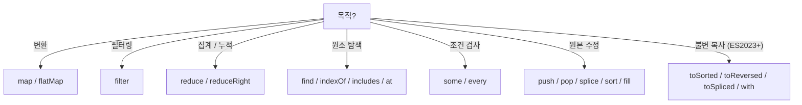

## 정의

JavaScript 의 **`Array`** 는 순서 있는 객체. 정수 키 + `length`. 풍부한 메서드 (map/filter/reduce/...) 가 함수형 스타일을 지원.

```javascript
const arr = [1, 2, 3];
typeof arr           // 'object'
Array.isArray(arr)   // true ✓ (typeof 로는 구분 안 됨)
```

## 생성

```javascript
const a = [1, 2, 3];
const b = new Array(3);          // length 3, sparse
const c = new Array(1, 2, 3);    // [1, 2, 3]
const d = Array.of(3);           // [3] (단일 인자도 안전)
const e = Array.from('abc');     // ['a', 'b', 'c']
const f = Array.from({ length: 3 }, (_, i) => i * 2);  // [0, 2, 4]
const g = [...iterable];         // spread
```

## 핵심 메서드 (반복)

| 메서드 | 반환 | mutates |
|:---|:---|:---:|
| `forEach(fn)` | undefined | ✗ |
| `map(fn)` | 새 배열 (같은 길이) | ✗ |
| `filter(fn)` | 새 배열 | ✗ |
| `reduce(fn, init)` | accumulator | ✗ |
| `reduceRight(fn, init)` | 같음 (역방향) | ✗ |
| `find(fn)` | 첫 매칭 원소 | ✗ |
| `findIndex(fn)` | 첫 매칭 인덱스 | ✗ |
| `findLast(fn)` | 마지막 매칭 | ✗ |
| `some(fn)` | 하나라도 true 면 true | ✗ |
| `every(fn)` | 모두 true | ✗ |
| `flat(depth)` | 평탄화 | ✗ |
| `flatMap(fn)` | map + flat(1) | ✗ |

```javascript
[1,2,3].map(x => x * 2)              // [2, 4, 6]
[1,2,3,4].filter(x => x % 2 === 0)   // [2, 4]
[1,2,3].reduce((a, b) => a + b, 0)   // 6
[1,2,3].find(x => x > 1)              // 2
[1,2,3].some(x => x > 2)              // true
[1,2,3].every(x => x > 0)             // true
[[1, 2], [3, 4]].flat()               // [1, 2, 3, 4]
[1, 2, 3].flatMap(x => [x, x * 2])    // [1, 2, 2, 4, 3, 6]
```

## 변경 (mutates)

| 메서드 | 효과 |
|:---|:---|
| `push(...)` | 끝에 추가, 새 length |
| `pop()` | 끝에서 제거, 반환 |
| `shift()` | 앞에서 제거 |
| `unshift(...)` | 앞에 추가 |
| `splice(start, deleteCount, ...items)` | 임의 위치 add/remove |
| `sort(cmp)` | 정렬 (in-place!) |
| `reverse()` | 뒤집기 (in-place!) |
| `fill(value, start, end)` | 값으로 채움 |
| `copyWithin(target, start, end)` | 내부 복사 |

```javascript
const a = [1, 2, 3];
a.push(4)                    // a = [1, 2, 3, 4]
a.pop()                      // 4, a = [1, 2, 3]
a.splice(1, 1)               // [2] 제거, a = [1, 3]
a.splice(1, 0, 'x')          // 1 위치에 'x' 삽입
a.sort((x, y) => x - y)      // 숫자 정렬
```

## 검색

| 메서드 | 의미 |
|:---|:---|
| `indexOf(v)` | 첫 위치 (없으면 -1) |
| `lastIndexOf(v)` | 마지막 위치 |
| `includes(v)` | 포함 여부 |
| `at(i)` | i 번째 (음수 OK) |

```javascript
[1, 2, 3].indexOf(2)     // 1
[1, 2, 3].includes(2)    // true
[1, 2, 3].at(-1)          // 3 (마지막)
```

## 슬라이스 / 결합

```javascript
arr.slice(start, end)        // 부분 (end 미포함)
arr.slice()                   // 전체 복사
arr.concat([4, 5])            // 결합
[...arr1, ...arr2]            // spread (선호)
```

## 정렬 함정

```javascript
[10, 1, 2].sort()                  // [1, 10, 2]  ⚠️ 문자열 비교
[10, 1, 2].sort((a, b) => a - b)   // [1, 2, 10]  ✓
```

기본 sort 는 **문자열 변환 후 사전순**. 숫자는 항상 비교 함수 명시.

### stable sort

ES2019+ 모든 엔진이 stable sort 보장.

```javascript
arr.sort((a, b) => a.priority - b.priority)
// 같은 priority 의 원소는 원래 순서 유지
```

## 새 (불변) vs 변경 메서드 (ES2023)

```javascript
arr.sort()       // 원본 변경
arr.toSorted()   // 새 배열 반환 (ES2023+)

arr.reverse()    // 원본 변경
arr.toReversed() // 새 배열

arr.splice(...)
arr.toSpliced(...)

arr[0] = 99      // ...
arr.with(0, 99)  // 새 배열, [0] = 99
```

이런 새 메서드들이 불변 패턴을 더 자연스럽게.

## reduce 의 강력함

```javascript
// 합
[1,2,3].reduce((a, b) => a + b, 0)

// 객체로 그룹화
data.reduce((acc, item) => {
    (acc[item.category] ??= []).push(item);
    return acc;
}, {});

// pipeline
[fn1, fn2, fn3].reduce((acc, fn) => fn(acc), initialValue)

// max
arr.reduce((max, cur) => cur > max ? cur : max, -Infinity)
```

## sparse 배열

```javascript
const a = new Array(3);   // [empty × 3]
a[5] = 99;                 // [empty × 5, 99]
a.length                   // 6
a.forEach(x => console.log(x))  // empty 는 skip
```

빈 슬롯이 있는 배열. 일반적으로 피하는 것이 좋음.

## Array-like → Array

```javascript
Array.from(arguments)
Array.from(document.querySelectorAll('div'))
Array.from({ length: 5 }, (_, i) => i)   // [0, 1, 2, 3, 4]
[...nodeList]                              // spread
```

## 함정

### 1. typeof 로 배열 검사 불가

```javascript
typeof []           // 'object'
Array.isArray([])   // ✓
```

### 2. length 변경

```javascript
const a = [1, 2, 3];
a.length = 1;
a            // [1] (잘림)
a.length = 5;
a            // [1, empty × 4]
```

### 3. splice 의 인자

```javascript
arr.splice(1)        // 1 부터 끝까지 제거
arr.splice(1, 0, 'x')  // 1 에 'x' 삽입 (제거 X)
arr.splice(1, 1, 'x')  // 1 에서 1개 제거, 'x' 삽입
```

## 메서드 선택 가이드



## 성능 특성

| 연산 | 시간복잡도 | 비고 |
|:---|:---|:---|
| `arr[i]` 인덱스 접근 | O(1) | 밀집 배열 |
| `push` / `pop` | O(1) amortized | 끝 |
| `shift` / `unshift` | O(N) | 앞 삽입/제거, 전체 재색인 |
| `splice(0, ...)` | O(N) | shift 와 동일 |
| `indexOf` / `includes` | O(N) | 선형 검색 |
| `sort` | O(N log N) | V8 TimSort |
| `flat(Infinity)` | O(총 원소 수) | 재귀 평탄화 |

> **실전 팁**: `shift` 가 bottleneck 이면 index pointer 방식으로 O(1) 구현. 수백만 건 아니면 가독성 우선.

## 메모리 레이아웃 (V8 최적화)

V8 은 내부 배열을 원소 타입에 따라 점진적으로 특화:

- `[1, 2, 3]` → `SMI_ELEMENTS` (정수, 가장 빠름)
- `[1, 2, 3.14]` → `PACKED_DOUBLE_ELEMENTS`
- `[1, 'two', true]` → `PACKED_ELEMENTS` (박싱)
- `[1, , 3]` → `HOLEY_ELEMENTS` (느림, JIT 가드 필요)

```javascript
// 좋음: dense + 같은 타입
const nums = [1, 2, 3, 4, 5];         // SMI_ELEMENTS

// 피하기: sparse 생성
const sparse = [];
sparse[100] = 1;                       // HOLEY_ELEMENTS
```

한 번 강등 (`downgrade`) 된 배열은 다시 최적화 타입으로 복귀하지 않음. 타입 일관성 유지가 중요.

## 고급 패턴

### 청크 분할

```javascript
const chunk = (arr, size) =>
    Array.from({ length: Math.ceil(arr.length / size) }, (_, i) =>
        arr.slice(i * size, i * size + size)
    );

chunk([1, 2, 3, 4, 5], 2)   // [[1, 2], [3, 4], [5]]
```

### 중복 제거

```javascript
// 원시값
[...new Set([1, 2, 2, 3])]   // [1, 2, 3]

// 객체 (key 기준)
const unique = [...new Map(arr.map(x => [x.id, x])).values()]
```

### 배열 회전

```javascript
// left rotation by n
const rotate = (arr, n) => [...arr.slice(n), ...arr.slice(0, n)];
rotate([1, 2, 3, 4], 1)   // [2, 3, 4, 1]
```

### zip (여러 배열 합치기)

```javascript
const zip = (...arrs) =>
    arrs[0].map((_, i) => arrs.map(a => a[i]));

zip([1, 2, 3], ['a', 'b', 'c'])   // [[1,'a'], [2,'b'], [3,'c']]
```

## 관련 위키

- [[JS Object]]
- [[JS Spread / Rest]]
- [[JS Destructuring]]
- [[higher-order function]]
