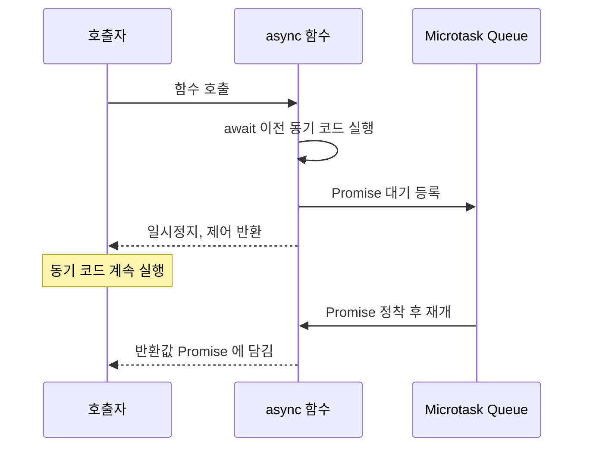

## 정의

**`async` / `await`** 는 [[Promise]] 기반 비동기 코드를 마치 동기 코드처럼 쓸 수 있게 해주는 ES2017 의 문법 설탕. 본질은 Promise 그 자체, 문법만 다르다.

전체 동작 메커니즘은 [[비동기와 타이밍, 콜백부터 async/await까지의 발전사]] 글 참조.

## 세 가지 규칙

1. **`async` 함수는 항상 Promise 를 반환.** `return value` 는 `Promise.resolve(value)` 와 같다.
2. **`await expr` 은 `expr` 이 정착할 때까지 함수 실행을 일시정지.** 함수 밖 동기 코드는 계속 진행.
3. **에러는 `try/catch` 로.** Promise 의 `.catch` 와 동등.

```javascript
async function loadProfile(userId) {
  try {
    const userRes = await fetch(`/users/${userId}`);
    const user = await userRes.json();
    const postsRes = await fetch(`/posts?u=${user.id}`);
    return { user, posts: await postsRes.json() };
  } catch (err) {
    console.error(err);
    throw err;
  }
}
```

## await 실행 흐름



> [!IMPORTANT]
> `await` 이후 코드는 **항상 다음 마이크로태스크 틱에 실행**. 동기 코드보다 늦고, `setTimeout` 보다 빠르다.

## await 의 실제 동작

`await` 는 `.then` 의 문법 설탕이다.

```javascript
// async/await
async function f() {
  const a = await loadA();
  return a + 1;
}

// 동치
function f() {
  return loadA().then((a) => a + 1);
}
```

엔진 내부 동작:
1. 오른쪽 표현식을 평가, Promise 가 아니면 `Promise.resolve` 로 감쌈.
2. 함수 상태를 [[Lexical Environment]] 에 저장.
3. Promise 정착 시 [[Microtask Queue]] 에 "함수 재개" 등록.
4. 마이크로태스크 차례가 오면 함수 이어 실행.

## Promise 체인과의 비교

두 방식은 동등하지만 async/await 가 가독성이 높습니다.

```javascript
// Promise 체인
function loadUser(id) {
    return fetch(`/users/${id}`)
        .then(res => res.json())
        .then(user => fetch(`/posts?u=${user.id}`))
        .then(res => res.json())
        .catch(err => { console.error(err); throw err; });
}

// async/await: 동일한 로직, 읽기 쉬움
async function loadUser(id) {
    try {
        const user = await fetch(`/users/${id}`).then(r => r.json());
        return await fetch(`/posts?u=${user.id}`).then(r => r.json());
    } catch (err) {
        console.error(err);
        throw err;
    }
}
```

체인이 길어질수록, 중간 값을 여러 단계에서 참조해야 할수록 async/await 가 유리합니다.

## 에러 처리 전략

### try/catch

```javascript
async function fetchData(url) {
    try {
        const res = await fetch(url);
        if (!res.ok) throw new Error(`HTTP ${res.status}`);
        return await res.json();
    } catch (err) {
        if (err instanceof TypeError) {
            console.error('네트워크 오류:', err.message);
        } else {
            console.error('서버 오류:', err.message);
        }
        throw err; // 상위로 전파
    }
}
```

### 결과와 에러를 함께 반환하는 패턴

```javascript
// Go-style: [data, error] 튜플 반환
async function safe(promise) {
    try {
        return [await promise, null];
    } catch (err) {
        return [null, err];
    }
}

const [user, userErr] = await safe(fetchUser(id));
if (userErr) { /* 처리 */ }
```

### 에러 무시

```javascript
// 에러를 무시하고 undefined 반환
const data = await fetchData(url).catch(() => undefined);
```

## 함정

### 순차 vs 병렬

```javascript
// 순차 (총 2초)
const a = await fetch('/a'); // 1초
const b = await fetch('/b'); // 1초

// 병렬 (총 1초)
const [a, b] = await Promise.all([fetch('/a'), fetch('/b')]);
```

의존성 없는 작업은 `Promise.all` 로 묶자.

### 반복문 안의 await

```javascript
// 순차 처리 (의도적이라면 OK)
for (const id of ids) {
  await process(id);
}

// 병렬 처리
await Promise.all(ids.map(process));
```

### forEach 안의 await 는 동작 안 함

```javascript
// ❌ forEach 는 async 콜백을 기다리지 않음
ids.forEach(async (id) => await process(id));
console.log('done'); // 아직 process 들이 도는 중에 출력

// ✅ for-of 또는 Promise.all
for (const id of ids) await process(id);
// 또는
await Promise.all(ids.map(process));
```

### Top-level await

ES2022 부터 ES Module 최상위에서 `await` 가능.

```javascript
// app.mjs
const config = await fetch('/config.json').then(r => r.json());
// 이후 코드는 config 가 로드된 후 실행
```

CommonJS 모듈에서는 불가.

## 실전 예시

### 재시도 (Retry with backoff)

```javascript
async function withRetry(fn, { retries = 3, backoff = 300 } = {}) {
    for (let attempt = 0; attempt < retries; attempt++) {
        try {
            return await fn();
        } catch (err) {
            if (attempt === retries - 1) throw err;
            const delay = backoff * Math.pow(2, attempt);
            await new Promise(r => setTimeout(r, delay));
        }
    }
}

const data = await withRetry(() => fetch('/api/data').then(r => r.json()));
```

### 타임아웃

```javascript
async function withTimeout(promise, ms) {
    const timeout = new Promise((_, reject) =>
        setTimeout(() => reject(new Error(`Timeout after ${ms}ms`)), ms)
    );
    return Promise.race([promise, timeout]);
}

const result = await withTimeout(fetchData('/slow'), 5000);
```

### AbortController 로 취소 가능한 fetch

```javascript
async function fetchWithAbort(url) {
    const controller = new AbortController();

    const timeoutId = setTimeout(() => controller.abort(), 5000);

    try {
        const res = await fetch(url, { signal: controller.signal });
        return await res.json();
    } finally {
        clearTimeout(timeoutId);
    }
}
```

### 동시 실행 수 제한

```javascript
async function pLimit(tasks, concurrency) {
    const results = [];
    const running = [];

    for (const task of tasks) {
        const p = Promise.resolve().then(task).then(r => {
            running.splice(running.indexOf(p), 1);
            return r;
        });
        running.push(p);
        results.push(p);

        if (running.length >= concurrency) {
            await Promise.race(running);
        }
    }

    return Promise.all(results);
}
```

## 성능 주의사항

```javascript
// ❌ 불필요한 await - Promise 를 그냥 반환하면 됨
async function getData() {
    return await fetchData(); // 마이크로태스크 1개 추가
}

// ✅ await 불필요
async function getData() {
    return fetchData(); // Promise 그대로 반환
}

// ⚠️ 단, try/catch 안에서는 await 필요
async function getData() {
    try {
        return await fetchData(); // 에러를 catch 하려면 await 필요
    } catch (err) {
        handle(err);
    }
}
```

## 참고

- [[Promise]]
- [[js-promise-methods|Promise.all / race / any / allSettled]]
- [[Microtask Queue]]
- [[이벤트 루프]]
- [[비동기와 타이밍, 콜백부터 async/await까지의 발전사]]
- [[JS Error / try-catch]]
