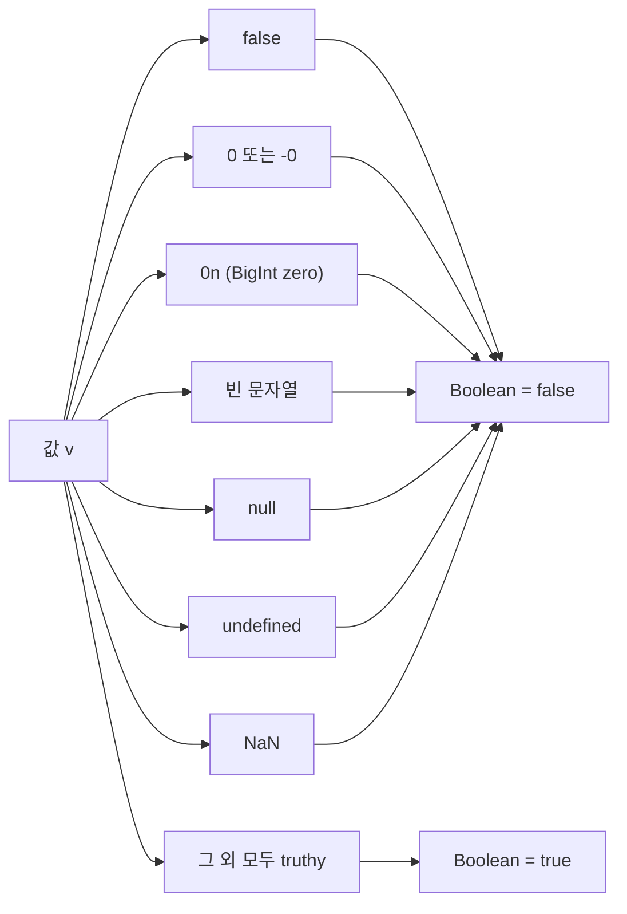

## 정의

JavaScript 의 3 가지 primitive.

- **`boolean`** : `true`, `false`
- **`null`** : 의도적인 "없음"
- **`undefined`** : 자동으로 부여된 "없음" (초기화 안 됨)

## 사용 상황

| 상황 | 권장 값 / 패턴 |
|:---|:---|
| 함수가 값을 반환하지 않을 때 | `undefined` (자동) |
| 의도적으로 비어있음을 표현 | `null` |
| 조건 분기 | `boolean` |
| null/undefined 모두 fallback | `??` (nullish coalescing) |
| null 만 fallback | `=== null` 명시적 검사 |
| 객체 속성 존재 여부 | `in` 연산자 또는 `?.` optional chaining |

## boolean

```javascript
const a = true;
const b = false;

// 연산자
true && false      // false
true || false      // true
!true               // false
```

## falsy / truthy

JavaScript 가 boolean 으로 강제 변환할 때 false 가 되는 값들 (falsy):

```javascript
Boolean(false)        // false
Boolean(0)            // false
Boolean(-0)           // false
Boolean(0n)           // false (BigInt zero)
Boolean('')           // false
Boolean(null)         // false
Boolean(undefined)    // false
Boolean(NaN)          // false

// 나머지 모두 truthy
Boolean([])           // true (빈 배열도!)
Boolean({})           // true (빈 객체도!)
Boolean('false')      // true (문자열 'false' 는 truthy)
```

> [!CAUTION]
> **빈 배열 `[]` 과 빈 객체 `{}` 는 truthy**. 다른 언어와 다르다. 명시적 검사 (`arr.length === 0`) 필요.

## falsy 값 시각화



## null vs undefined

| 특성 | null | undefined |
|:---|:---|:---|
| 의미 | 의도적 비어있음 | 미초기화 |
| 자동 부여 | ✗ (직접 할당) | ✓ |
| `typeof` | `'object'` (역사적 버그) | `'undefined'` |
| `JSON.stringify` | `null` | 키 자체 제외 |
| 기본 함수 매개변수 | 적용 안 됨 | 적용됨 |

```javascript
function foo(x = 10) {
    return x;
}
foo();              // 10 (undefined → default)
foo(undefined);     // 10
foo(null);          // null (default 적용 안 됨)
```

## == 와 === 의 차이

```javascript
null == undefined    // true (특수 케이스)
null === undefined   // false

null == 0            // false
null < 1             // true (관계 연산자는 강제 변환)
null > 0             // false
null >= 0            // true (모순처럼 보임)
```

이런 함정 때문에 **항상 `===`** 권장.

## 비어있음 검사 idiom

```javascript
// 안 좋은 패턴
if (x == null) { ... }       // null 과 undefined 모두 매치 (의도라면 OK)

// 명시적 검사
if (x === null) { ... }
if (x === undefined) { ... }
if (x == null) { ... }       // 둘 다 (== 는 강제 변환)

// nullish coalescing
const value = x ?? 'default';   // null/undefined 만 default

// optional chaining
obj?.prop?.subprop
```

## Nullish Coalescing 과 Optional Chaining 패턴

`??` 와 `?.` 는 null/undefined 를 안전하게 다루는 현대적 패턴.

```javascript
// ?? vs ||
const a = 0 || 'default';    // 'default' (0 은 falsy)
const b = 0 ?? 'default';    // 0 (null/undefined 만 fallback)

const c = '' || 'default';   // 'default' ('' 은 falsy)
const d = '' ?? 'default';   // '' (null/undefined 만 fallback)
```

`??` 는 `0`, `''`, `false` 같은 유효한 falsy 값을 보존한다. `||` 는 모든 falsy 를 fallback 으로 처리.

```javascript
// optional chaining 체이닝
const city = user?.address?.city ?? '알 수 없음';

// 메서드 호출
const len = str?.length ?? 0;
const result = arr?.find(x => x > 0) ?? -1;

// 함수 호출
callback?.();
```

## void 연산자

```javascript
void 0           // undefined
void 'anything'  // undefined
```

`undefined` 를 안전하게 얻는 옛 idiom (옛 JS 에서 `undefined` 는 재할당 가능했음). 모던에선 불필요.

## 명시적 boolean 변환

```javascript
Boolean(x)        // 권장
!!x                // 같음 (NOT NOT)
```

## 타입 강제 변환 전체 표

| 값 | `Boolean()` | `Number()` | `String()` |
|:---|:---:|:---:|:---|
| `true` | `true` | `1` | `'true'` |
| `false` | `false` | `0` | `'false'` |
| `null` | `false` | `0` | `'null'` |
| `undefined` | `false` | `NaN` | `'undefined'` |
| `0` | `false` | `0` | `'0'` |
| `''` | `false` | `0` | `''` |
| `[]` | `true` | `0` | `''` |
| `{}` | `true` | `NaN` | `'[object Object]'` |

[[js-type-coercion|JS 타입 변환]] 에서 전체 강제 변환 규칙 참고.

## 함정

### 1. typeof null

```javascript
typeof null      // 'object'  (역사적 버그)
typeof undefined // 'undefined'
```

null 검사는 `=== null` 사용.

### 2. NaN 의 truthy

```javascript
Boolean(NaN)     // false
NaN == NaN       // false
NaN === NaN      // false
Number.isNaN(NaN)  // true
```

### 3. 빈 문자열의 비교

```javascript
'' == false      // true
'' === false     // false
'' < 1           // true ('' → 0)
```

### 4. 객체의 truthy

```javascript
const obj = {};
if (obj) { ... }    // 항상 true (객체 = truthy)
if (Object.keys(obj).length === 0) { ... }   // 진짜 empty 검사
```

### 5. null 과 관계 연산자의 모순

```javascript
null > 0    // false
null == 0   // false
null >= 0   // true  (모순처럼 보임)
```

`>=` 는 `null` 을 `0` 으로 변환해 비교하지만, `==` 는 특수 케이스로 `null == 0` 을 false 로 처리. 이 불일치가 버그를 만든다.

## 모범 사례

1. **`===`** 와 **`!==`** 만 사용
2. **`??` (nullish coalescing)** 으로 null/undefined 만 fallback
3. **명시적 boolean 검사**, `=== null`, `Array.isArray`, `obj.length === 0` 등
4. **Boolean()** 또는 **`!!`** 로 명시적 변환
5. **`?.`** 로 깊은 속성 접근 시 null 안전하게 처리

## 관련 위키

- [[js-type-coercion|JS 타입 변환]]
- [[js-number|JS Number]]
- [[js-optional-chaining|JS Optional Chaining]]
- [[js-nan-infinity|JS NaN, Infinity]]
