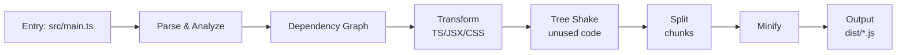

## 정의

**JavaScript 번들링 (Bundling)** 은 여러 소스 파일 (JS, CSS, 이미지, JSON 등) 을 브라우저나 런타임이 효율적으로 실행할 수 있는 **최소한의 결과물** 로 결합/변환하는 과정입니다.

**왜 필요한가**:
- 브라우저는 수천 개 JS 파일을 요청하면 느림 (HTTP 오버헤드)
- CJS/ESM 모듈을 브라우저가 이해 못 하거나 (구형), 최적화 필요 (신형)
- TypeScript, JSX, Sass 등 컴파일 필요
- 미사용 코드 제거 (tree shaking)
- 압축 (minification)

## 번들러의 역할



- **Entry 분석**: main 파일부터 시작
- **Dependency Graph 구축**: import/require 재귀 순회
- **Transform**: TS/JSX/PostCSS 등 각 loader/plugin 실행
- **Tree Shake**: 정적 분석으로 미사용 export 제거
- **Code Split**: 큰 앱을 여러 chunk 로 (lazy loading)
- **Minify**: 공백/변수명 축소
- **Output**: dist/ 에 최종 파일

## 핵심 개념

### Tree Shaking

정적 분석으로 **import 되지 않은 코드 제거**.

```javascript
// utils.js
export function used() { }
export function unused() { }

// main.js
import { used } from './utils';
used();

// bundled: unused() 는 제거됨
```

전제:
- **ESM 문법** (import/export 는 top-level 정적)
- **Side-effect 없음** (`package.json` 의 `sideEffects: false` 힌트)

### Code Splitting

큰 번들을 여러 조각 (chunk) 로.

```javascript
// Dynamic import
const HeavyModule = await import('./heavy');
```

이는 별도 chunk 로 분리 → 사용자가 실제 필요할 때만 로드.

**Vendor split**: `node_modules` 를 별도 chunk (browser cache 활용).

### Hot Module Replacement (HMR)

개발 중 파일 저장 시 **페이지 새로고침 없이** 변경된 모듈만 교체. 컴포넌트 상태 유지.

Vite, Webpack Dev Server, Turbopack 등.

### Source Map

Bundled/minified 코드를 원본 소스와 매핑. 브라우저 dev tools 에서 원본 볼 수 있음.

```javascript
//# sourceMappingURL=main.js.map
```

**주의**: 프로덕션 source map 배포 여부는 논쟁 (디버깅 편의 vs 소스 유출).

## 두 세대의 번들러

### 1세대 (2015-2021): "번들 우선" 시대

브라우저가 ESM 미지원 → **번들이 필수**.

- **Webpack** (2014): 방대한 생태계, 무거움
- **Rollup** (2015): 라이브러리 특화, tree shaking 강함
- **Parcel** (2017): Zero-config
- **Browserify** (2010): CJS 브라우저화 (legacy)

이 시대의 관용: **개발 시에도 번들** (webpack-dev-server 등).

### 2세대 (2021+): "Native ESM 개발" 시대

브라우저가 ESM 지원 (all evergreen). **개발 서버는 번들 없이** 브라우저에게 native ESM 직접 전달. 프로덕션 빌드만 번들.

- **Vite** (2021): ESM dev server + Rollup 프로덕션 빌드
- **esbuild** (2020): Go, 초고속
- **Turbopack** (2022): Rust, Next.js 특화
- **Rspack** (2023): Rust, Webpack 호환 API
- **Rolldown** (2024, beta): Rust, Rollup 호환 (Vite 6+ 프로덕션 백엔드)
- **Bun bundler** (2023): Bun 런타임 통합

## 성능 축

번들러 성능은 세 축.

### 1. Cold start (dev server 시작)

- **Vite**: ESM 직접 서빙 → 즉시
- **esbuild**: 매우 빠름
- **Webpack**: 대규모 앱은 초 단위 ~ 분 단위

### 2. HMR (파일 저장 → 브라우저 갱신)

- **Vite**: 밀리초
- **Turbopack**: 밀리초 (대규모 앱에서 특히 빠름)
- **Webpack**: 대규모 앱은 초 단위

### 3. 프로덕션 빌드

- **esbuild**: 매우 빠름 (Go)
- **Rspack/Rolldown/Turbopack**: 빠름 (Rust)
- **Webpack**: 느림 (JS)

## 언어 선택 (Go/Rust vs JS)

번들러 자체 구현 언어가 성능 좌우:

- **JavaScript**: Webpack, Rollup. 단일 스레드 한계.
- **Go**: esbuild. 병렬성 우수, 컴파일 언어 속도.
- **Rust**: SWC, Turbopack, Rspack, Rolldown, Biome. Go 보다 조금 더 빠르고 wasm 배포.

2024-2026 은 **Rust 번들러의 시대**. Vite 도 Rolldown 으로 백엔드 이전.

## 관용 스택 (2026)

### 앱 개발 (Next.js/React/Vue/Svelte)

- **Vite**: 대부분 프레임워크 기본 (React, Vue, Svelte, Astro, Solid)
- **Next.js**: Turbopack (dev) + Webpack (prod, 이관 중) or Turbopack full
- **Nuxt**: Vite
- **Angular**: esbuild + Angular CLI

### 라이브러리 배포

- **tsup**: esbuild 위에 얹은 zero-config TS 라이브러리 도구
- **Rollup**: 전통적, 여전히 강력
- **Rolldown**: Rollup 후계 (2025+ beta)
- **unbuild**: tsup 유사, Nuxt 팀

### 모노레포

- **Turborepo, Nx**: 빌드 오케스트레이션 (번들러 위 layer)
- **Rush.js**, **pnpm workspaces**

### 서버 사이드

- **Bun**: 자체 번들러 (매우 빠름)
- **Node + tsx**: dev
- **esbuild** dev 통합

## 실전 선택 기준

| 상황 | 권장 |
|:---|:---|
| 새 React/Vue/Svelte 앱 | **Vite** |
| Next.js | **Turbopack** (2025+) |
| Angular | **Angular CLI** (esbuild) |
| TypeScript 라이브러리 | **tsup** or **unbuild** |
| 성숙 웹팩 앱 | **Rspack** (마이그레이션 저비용) |
| 초경량 빌드만 | **esbuild** |
| 라이브러리, ESM+CJS dual | **Rollup** or **Rolldown** |
| Bun 런타임 | **Bun bundler** |

## Loader / Plugin 시스템

번들러는 확장 가능:

- **Webpack**: loader (`babel-loader`, `css-loader`, `ts-loader`) + plugin
- **Vite**: plugin (Rollup 호환)
- **Rollup**: plugin
- **esbuild**: plugin (제한적)

각 파일 유형 (TS, CSS, 이미지, SVG) 을 어떻게 처리할지 정의.

## 브라우저 native ESM 만으로 충분?

**개발 시**: 예. Vite 가 증명.

**프로덕션**: 아직 번들이 유리:
- HTTP/2 개선에도 수백 개 파일 요청 오버헤드
- Tree shaking, minification, 상수 folding
- Legacy 브라우저 대응 (드물지만)

**미래**: HTTP/3 + Import Maps 조합으로 번들 필요성 감소 예상. 아직 시기상조.

## 함정

> [!WARNING]
> **번들러 선택은 오래 유지**. Webpack → Vite 는 큰 리팩터. 초기 선택 신중.

> [!CAUTION]
> **CommonJS dependency**. 라이브러리 중 CJS-only 있으면 번들러가 처리 (interop). 종종 tree shake 못 함.

> [!WARNING]
> **`sideEffects: false` 잘못 표시** 하면 실제 side effect (polyfill import 등) 제거되어 런타임 오류.

> [!IMPORTANT]
> **Source map 프로덕션 배포**. 유용하지만 소스 노출. `hidden-source-map` 으로 Sentry 등에만 업로드.

> [!CAUTION]
> **번들 크기 관리**. Bundle analyzer (webpack-bundle-analyzer, rollup-plugin-visualizer) 로 정기 감사.

## 관련 위키

- [[js-webpack|Webpack]]
- [[js-vite|Vite]]
- [[js-esbuild|esbuild]]
- [[js-rollup|Rollup]]
- [[js-turbopack-rspack|Turbopack & Rspack]]
- [[js-bun-bundler|Bun Bundler]]
- [[js-cjs-vs-esm|CJS vs ESM]]
- [[js-es-modules|ES Modules]]
- [[ts-modules|TypeScript Modules]]
- [[typescript|TypeScript]]
