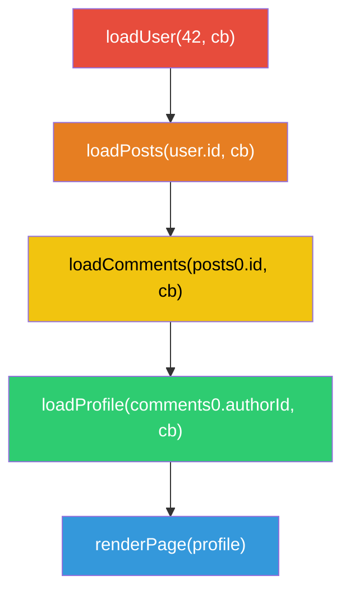

## 정의

**콜백 지옥 (callback hell)** 또는 **둠 피라미드 (pyramid of doom)**: 순차 의존이 있는 비동기 작업을 [[콜백]]으로 연결할 때 들여쓰기가 오른쪽으로 점점 깊어지는 현상.

겉으로는 가독성 문제지만, 실제로 더 심각한 것은 **에러 처리**다.

- 매 단계마다 `if (err) return` 을 빠뜨리면 오류가 그냥 무시됨
- `try/catch` 가 비동기 콜백 내부의 오류를 잡지 못함
- 에러가 어느 단계에서 발생했는지 추적이 어려움
- 중간 값을 다음 단계에서 참조하기 위해 외부 변수가 필요

## 사용 상황

콜백 지옥이 발생하는 전형적인 시나리오:

1. 서버에서 사용자 정보를 가져온 후
2. 그 사용자의 게시물 목록을 가져오고
3. 첫 번째 게시물의 댓글을 가져오고
4. 첫 번째 댓글 작성자 프로필을 가져오는 순차 비동기 체인

각 단계가 이전 단계의 결과에 의존하므로 병렬화가 불가능하다.

## 시각화

순차 의존 비동기 체인의 구조:



들여쓰기 피라미드 구조 (코드 모양):


## 기본 예시: 콜백 지옥

```javascript
// 콜백 지옥의 전형: 각 단계가 안쪽으로 중첩
loadUser(42, (err, user) => {
  if (err) return console.error(err);

  loadPosts(user.id, (err, posts) => {
    if (err) return console.error(err);

    loadComments(posts[0].id, (err, comments) => {
      if (err) return console.error(err);

      loadProfile(comments[0].authorId, (err, profile) => {
        if (err) return console.error(err);

        // 실제 로직은 여기...
        console.log(profile.name);

        // 한 단계 더 들어가면?
        loadAvatar(profile.id, (err, avatar) => {
          if (err) return console.error(err);
          renderPage(user, posts, comments, profile, avatar);
        });
      });
    });
  });
});
```

에러 처리 (`if (err) return`) 를 빠뜨리면 아무 일도 없었던 듯 진행된다.

## 단계별 리팩토링

### 1단계: 콜백을 이름 있는 함수로 분리

구조는 같지만 가독성을 조금 높이는 임시 방편.

```javascript
function handleAvatar(err, avatar) {
  if (err) return console.error(err);
  renderPage(user, posts, comments, profile, avatar);
}

function handleProfile(err, profile) {
  if (err) return console.error(err);
  loadAvatar(profile.id, handleAvatar);
}

function handleComments(err, comments) {
  if (err) return console.error(err);
  loadProfile(comments[0].authorId, handleProfile);
}

function handlePosts(err, posts) {
  if (err) return console.error(err);
  loadComments(posts[0].id, handleComments);
}

loadUser(42, (err, user) => {
  if (err) return console.error(err);
  loadPosts(user.id, handlePosts);
});
```

들여쓰기는 줄었지만 흐름을 역으로 읽어야 하는 문제가 남는다.

### 2단계: Promise 체이닝

```javascript
// 콜백 API 를 Promise 로 wrapping
const loadUserP     = (id) => new Promise((res, rej) =>
  loadUser(id, (e, v) => e ? rej(e) : res(v)));
const loadPostsP    = (id) => new Promise((res, rej) =>
  loadPosts(id, (e, v) => e ? rej(e) : res(v)));
const loadCommentsP = (id) => new Promise((res, rej) =>
  loadComments(id, (e, v) => e ? rej(e) : res(v)));
const loadProfileP  = (id) => new Promise((res, rej) =>
  loadProfile(id, (e, v) => e ? rej(e) : res(v)));

// Promise 체이닝: 평탄한 흐름
let savedUser, savedPosts;

loadUserP(42)
  .then(user => {
    savedUser = user;
    return loadPostsP(user.id);
  })
  .then(posts => {
    savedPosts = posts;
    return loadCommentsP(posts[0].id);
  })
  .then(comments => loadProfileP(comments[0].authorId))
  .then(profile => {
    console.log(profile.name);
  })
  .catch(err => console.error(err));  // 에러 처리 한 곳으로
```

에러 처리가 `.catch` 한 곳으로 모인다. 하지만 중간 값을 다음 단계에서 참조하려면 외부 변수가 필요하다.

### 3단계: async/await (최종)

```javascript
async function loadUserProfile(userId) {
  try {
    const user     = await loadUserP(userId);
    const posts    = await loadPostsP(user.id);
    const comments = await loadCommentsP(posts[0].id);
    const profile  = await loadProfileP(comments[0].authorId);

    console.log(profile.name);
    return { user, posts, comments, profile };
  } catch (err) {
    console.error('로드 실패:', err);
    throw err;
  }
}

const result = await loadUserProfile(42);
```

동기 코드처럼 읽히고, `try/catch` 로 모든 에러를 한 곳에서 처리한다. 중간 값도 같은 스코프에서 자유롭게 참조할 수 있다.

## 실전: 독립 작업의 병렬화

순차로 하면 느린 작업을 `Promise.all` 로 묶어 병렬 실행:

```javascript
async function loadDashboard(userId) {
  // ❌ 순차 실행: 합산 시간 소요
  // const user    = await fetchUser(userId);    // 300ms
  // const posts   = await fetchPosts(userId);   // 200ms
  // const friends = await fetchFriends(userId); // 150ms
  // 총 650ms

  // ✅ 병렬 실행: 가장 느린 것만큼만 소요
  const [user, posts, friends] = await Promise.all([
    fetchUser(userId),    // 300ms
    fetchPosts(userId),   // 200ms
    fetchFriends(userId), // 150ms
  ]);
  // 총 300ms

  return { user, posts, friends };
}
```

의존관계 없는 작업은 항상 병렬로 처리한다.

## 안티패턴: Promise 지옥

Promise 를 쓰더라도 중첩하면 콜백 지옥과 똑같아진다.

```javascript
// ❌ Promise 지옥: then 안에서 또 then 중첩
loadUserP(42)
  .then(user =>
    loadPostsP(user.id)
      .then(posts =>
        loadCommentsP(posts[0].id)
          .then(comments =>
            loadProfileP(comments[0].authorId)
              .then(profile => console.log(profile.name))
          )
      )
  );

// ✅ 평탄하게 체이닝
loadUserP(42)
  .then(user => loadPostsP(user.id))
  .then(posts => loadCommentsP(posts[0].id))
  .then(comments => loadProfileP(comments[0].authorId))
  .then(profile => console.log(profile.name))
  .catch(console.error);
```

## 실전 리팩토링: 파일 처리 파이프라인

```javascript
// Before: 콜백 지옥
function processFile(path, done) {
  fs.readFile(path, 'utf8', (err, raw) => {
    if (err) return done(err);
    parseJSON(raw, (err, data) => {
      if (err) return done(err);
      validate(data, (err, valid) => {
        if (err) return done(err);
        saveToDb(valid, (err, result) => {
          if (err) return done(err);
          done(null, result);
        });
      });
    });
  });
}

// After: async/await
async function processFile(path) {
  const raw   = await fs.promises.readFile(path, 'utf8');
  const data  = await parseJSONAsync(raw);
  const valid = await validateAsync(data);
  return saveToDbAsync(valid);
}
```

## 함정

> [!WARNING]
> **에러 처리 실수**: 콜백 지옥에서는 `if (err) return` 을 빠뜨리면 에러가 무시된다. Promise 에서는 `.catch` 없이 rejected 된 Promise 는 Node.js 에서 `UnhandledPromiseRejection` 경고 (또는 프로세스 종료) 가 발생한다.

```javascript
// ❌ catch 없는 Promise
loadUserP(42)
  .then(user => loadPostsP(user.id))
  .then(profile => console.log(profile.name));
// rejection 발생 시 처리 안 된 Promise rejection 경고

// ✅
loadUserP(42)
  .then(user => loadPostsP(user.id))
  .then(profile => console.log(profile.name))
  .catch(err => console.error('처리:', err));
```

> [!WARNING]
> **중간 값 참조 문제**: Promise 체이닝에서 이전 단계의 값을 나중 단계에서 참조하려면 외부 변수가 필요하다. async/await 는 이 문제를 자연스럽게 해결한다.

```javascript
// ❌ Promise 체이닝에서 중간 값 참조 어색함
let savedUser;
loadUserP(42)
  .then(user => { savedUser = user; return loadPostsP(user.id); })
  .then(posts => renderPage(savedUser, posts));  // savedUser 외부 변수 필요

// ✅ async/await 에서는 자연스럽게
async function render() {
  const user  = await loadUserP(42);
  const posts = await loadPostsP(user.id);
  renderPage(user, posts);  // 같은 스코프에서 참조
}
```

> [!CAUTION]
> **취소 불가**: 콜백 기반 API 는 취소 메커니즘이 없다. [[js-abort-controller|AbortController]] 를 지원하는 최신 API 로 전환하거나 직접 구현해야 한다.

## 관련 위키

- [[콜백]] - 콜백 지옥의 원인
- [[Promise]] - 체이닝으로 평탄화
- [[js-async-await|async/await]] - 동기 코드처럼 작성
- [[js-abort-controller|AbortController]] - 비동기 취소
- [[js-event-loop|이벤트 루프]] - 비동기 실행 메커니즘
- [[js-promise-methods|Promise.all / race / any]] - 병렬 처리
