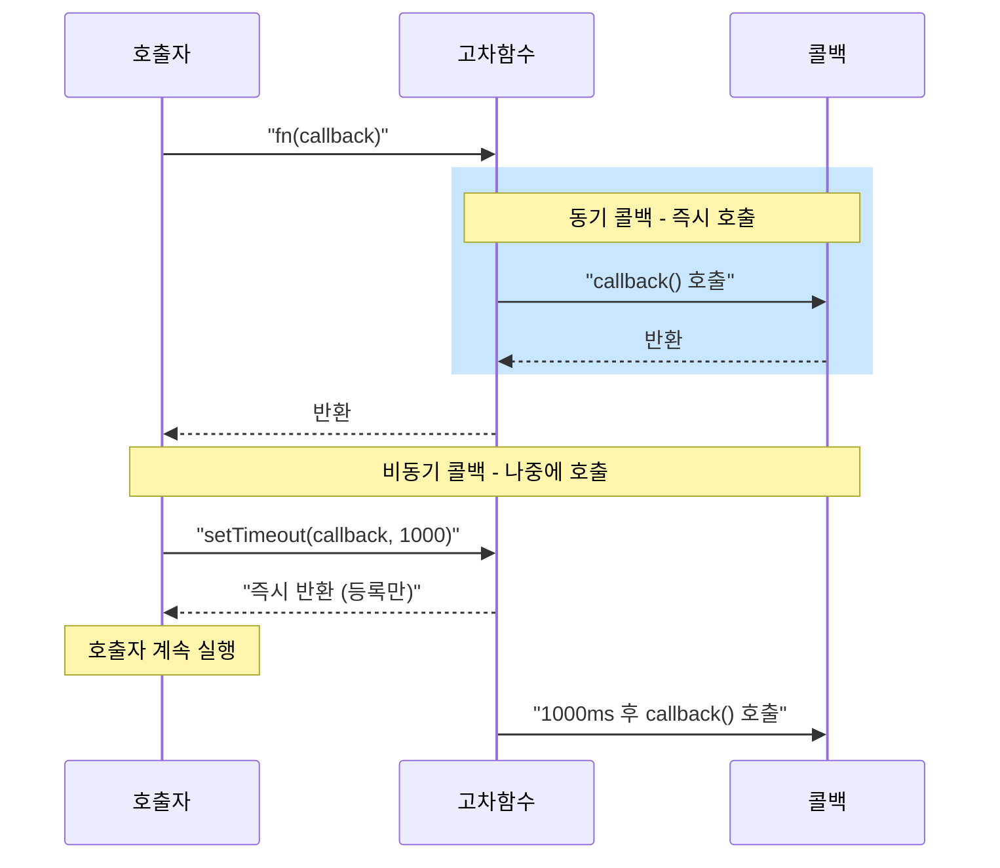

## 정의

**콜백 (callback)**: 다른 함수의 인자로 넘겨져, 받은 쪽(caller)이 적절한 시점에 호출하는 함수.

[[일급 함수]] 특성이 있어야 가능한 패턴이다. JavaScript 에서는 함수를 값으로 넘길 수 있으므로 콜백이 자연스럽다.

```javascript
function greet(name, callback) {
  const message = `안녕, ${name}!`;
  callback(message);  // 받은 함수를 적절한 시점에 호출
}

greet('철수', (msg) => console.log(msg));
// 안녕, 철수!
```

## 사용 상황

- 이벤트 처리: `addEventListener('click', fn)`
- 타이머: `setTimeout(fn, 1000)`, `setInterval(fn, 500)`
- 비동기 I/O: `fs.readFile(path, fn)` (Node.js)
- 배열 변환: `map(fn)`, `filter(fn)`, `sort(fn)` (동기 콜백)
- 제어 흐름 역전 (Inversion of Control): 라이브러리가 호출 시점 결정

## 시각화

동기 콜백과 비동기 콜백의 실행 시점 차이:



## 기본 사용법

### 동기 콜백

배열 메서드의 콜백은 **동기적으로** 즉시 실행된다.

```javascript
const numbers = [1, 2, 3];

// map 의 콜백: 배열 순회 중 즉시 호출
const doubled = numbers.map(x => {
  console.log(`처리 중: ${x}`);
  return x * 2;
});
// 처리 중: 1
// 처리 중: 2
// 처리 중: 3
console.log('map 완료');
// map 완료
// doubled = [2, 4, 6]
```

### 비동기 콜백

타이머나 I/O 콜백은 **나중에** 호출된다.

```javascript
console.log('시작');

setTimeout(() => {
  console.log('타이머 콜백');  // 나중에 실행
}, 1000);

console.log('끝');
// 시작
// 끝
// (1초 후) 타이머 콜백
```

`setTimeout` 은 콜백을 등록만 하고 즉시 반환한다. 콜백은 [[js-event-loop|이벤트 루프]]가 처리한다.

### 에러 우선 콜백 (Error-First Callback)

Node.js 가 정착시킨 관행: 첫 인자는 에러 (없으면 `null`), 두 번째 인자는 결과.

```javascript
const fs = require('fs');

fs.readFile('config.json', 'utf8', (err, data) => {
  if (err) {
    console.error('읽기 실패:', err.message);
    return;  // 반드시 return 으로 이후 코드 실행 방지
  }
  const config = JSON.parse(data);
  console.log(config);
});
```

에러 체크를 빠뜨리면 `data` 가 `undefined` 인 채로 진행되어 조용히 실패한다.

## this 바인딩 문제

콜백에서 `this` 는 호출하는 쪽의 컨텍스트가 되어 예상과 다르게 동작할 수 있다.

### 문제

```javascript
class Timer {
  constructor() {
    this.count = 0;
  }

  start() {
    // ❌ function 콜백: this 가 Timer 인스턴스가 아님
    setInterval(function() {
      this.count++;        // this 는 globalThis 또는 undefined (strict)
      console.log(this.count);  // NaN 또는 TypeError
    }, 1000);
  }
}
```

### 해결 1: 화살표 함수

```javascript
class Timer {
  constructor() {
    this.count = 0;
  }

  start() {
    // ✅ 화살표 함수: this 를 외부(Timer 인스턴스)에서 lexical 로 캡처
    setInterval(() => {
      this.count++;
      console.log(this.count);  // 1, 2, 3, ...
    }, 1000);
  }
}

const timer = new Timer();
timer.start();
```

### 해결 2: bind

```javascript
class Timer {
  constructor() {
    this.count = 0;
    this.tick = this.tick.bind(this);  // 생성자에서 미리 바인딩
  }

  tick() {
    this.count++;
    console.log(this.count);
  }

  start() {
    setInterval(this.tick, 1000);
  }
}
```

### 해결 3: 클로저로 this 저장 (구식)

```javascript
class Timer {
  constructor() {
    this.count = 0;
  }

  start() {
    const self = this;  // this 를 변수에 저장
    setInterval(function() {
      self.count++;
      console.log(self.count);
    }, 1000);
  }
}
```

화살표 함수가 도입된 이후로는 `self = this` 패턴은 거의 쓰지 않는다.

## 실전 예시

### 커스텀 이벤트 시스템

```javascript
class EventEmitter {
  constructor() {
    this.listeners = {};
  }

  on(event, callback) {
    (this.listeners[event] ??= []).push(callback);
    return this;  // 메서드 체이닝 지원
  }

  emit(event, ...args) {
    (this.listeners[event] ?? []).forEach(cb => cb(...args));
  }

  off(event, callback) {
    this.listeners[event] = (this.listeners[event] ?? [])
      .filter(cb => cb !== callback);
  }
}

const emitter = new EventEmitter();

const onData = (data) => console.log('받음:', data);
emitter.on('data', onData);
emitter.on('data', (data) => console.log('로깅:', data));

emitter.emit('data', { id: 1 });
// 받음: { id: 1 }
// 로깅: { id: 1 }

emitter.off('data', onData);
emitter.emit('data', { id: 2 });
// 로깅: { id: 2 }
```

### 병렬 콜백 수집 (Promise 이전 패턴)

여러 비동기 콜백 결과를 모을 때의 고전 패턴:

```javascript
function parallel(tasks, done) {
  const results = [];
  let remaining = tasks.length;

  if (remaining === 0) return done(null, []);

  tasks.forEach((task, i) => {
    task((err, result) => {
      if (err) return done(err);
      results[i] = result;
      if (--remaining === 0) done(null, results);
    });
  });
}

// 사용
parallel(
  [
    cb => setTimeout(() => cb(null, 'A'), 100),
    cb => setTimeout(() => cb(null, 'B'), 200),
    cb => setTimeout(() => cb(null, 'C'), 50),
  ],
  (err, results) => {
    if (err) return console.error(err);
    console.log(results);  // ['A', 'B', 'C'] (순서 보장)
  }
);
```

오늘날에는 `Promise.all` 이 이 역할을 대신한다.

### 콜백을 Promise 로 변환 (promisify)

```javascript
function promisify(fn) {
  return (...args) => new Promise((resolve, reject) => {
    fn(...args, (err, result) => {
      if (err) reject(err);
      else resolve(result);
    });
  });
}

// Node.js 의 콜백 스타일 API 를 Promise 로
const readFile = promisify(require('fs').readFile);

const data = await readFile('config.json', 'utf8');
console.log(data);
```

Node.js 는 `util.promisify` 와 `fs/promises` 모듈로 표준 제공한다.

## 동기 vs 비동기 콜백 비교

| 구분 | 동기 콜백 | 비동기 콜백 |
|:---|:---|:---|
| 호출 시점 | 즉시 (함수 내부에서) | 나중에 (이벤트 루프) |
| 예시 | `map`, `filter`, `sort` | `setTimeout`, `fetch`, `fs.readFile` |
| try/catch | 가능 | 불가 (콜 스택 사라짐) |
| 반환값 활용 | 가능 | 불가 (콜백으로만 전달) |

## 함정

> [!WARNING]
> **Inversion of Control**: 콜백을 외부 라이브러리에 넘기면 호출 시점, 횟수, 에러 처리 방식이 모두 상대방 책임이 된다. 콜백이 여러 번 호출될 수도, 아예 호출 안 될 수도 있다.

> [!WARNING]
> **에러 전파 불가**: 비동기 콜백이 호출되는 시점에는 원래 콜 스택이 이미 사라졌으므로 `try/catch` 로 잡을 수 없다.

```javascript
// ❌ 작동 안 함
try {
  setTimeout(() => {
    throw new Error('콜백 내부 에러');
  }, 100);
} catch (err) {
  console.error(err);  // 잡히지 않음
}

// ✅ 콜백 내부에서 직접 처리
setTimeout(() => {
  try {
    riskyOperation();
  } catch (err) {
    handleError(err);
  }
}, 100);
```

> [!WARNING]
> **콜백 지옥**: 순차 의존 비동기 작업을 콜백으로 연결하면 들여쓰기가 오른쪽 끝까지 깊어진다. ([[콜백 지옥]] 참고)

```javascript
// 콜백 지옥의 시작
loadUser(42, (err, user) => {
  loadPosts(user.id, (err, posts) => {
    loadComments(posts[0].id, (err, comments) => {
      // 점점 깊어짐...
    });
  });
});
```

이 문제들을 풀기 위해 [[Promise]] 가 도입되었다.

## 관련 위키

- [[일급 함수]] - 콜백의 전제 조건
- [[고차 함수]] - 콜백을 받는 함수
- [[콜백 지옥]] - 콜백의 대표 안티패턴
- [[Promise]] - 콜백 지옥의 해결책
- [[js-async-await|async/await]] - Promise 위의 문법 설탕
- [[js-this-binding|this 바인딩]] - 콜백의 this 문제
- [[js-arrow-function|화살표 함수]] - lexical this 해결책
- [[js-event-loop|이벤트 루프]] - 비동기 콜백의 실행 메커니즘
