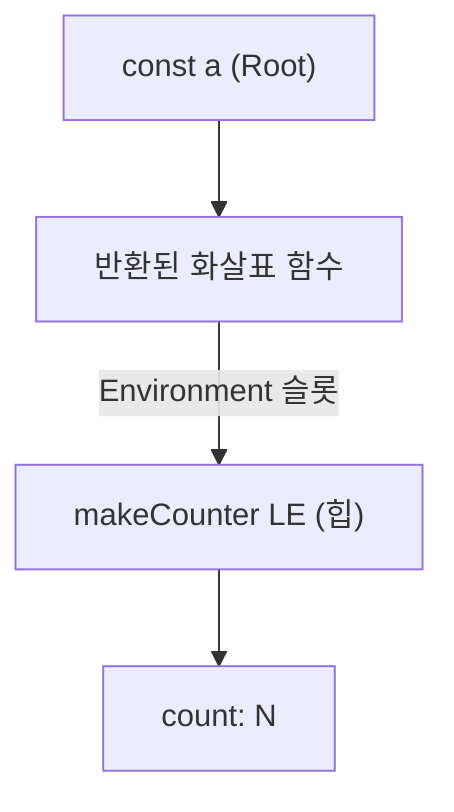

## 정의

**클로저 (Closure)**: 함수가 자신이 *정의된* 시점의 외부 변수들을 계속 참조할 수 있는 성질.

함수가 일급 객체 ([[일급 함수]]) 인 언어의 자연스러운 결과. 메커니즘은 [[Lexical Environment]] + 함수 객체의 `[[Environment]]` 내부 슬롯.

자세한 메커니즘은 [[함수는 끝났는데 변수가 살아있다, Lexical Environment와 클로저의 메커니즘]] 글 참고.

## 시각화: 클로저 메커니즘



> `makeCounter` 의 실행 컨텍스트가 콜 스택에서 사라져도 LE 는 힙에 남음.  
> `const a` 가 반환된 함수를 참조하는 한, 이 사슬은 끊어지지 않는다.

## 핵심 특성

| 측면 | 동작 |
|:---|:---|
| **참조 시점** | 정의 위치 (Lexical), 호출 위치가 아님 |
| **수명** | 클로저 함수가 살아있는 한 외부 변수도 살아있음 |
| **격리** | 호출마다 새 LE → 독립된 상태 |
| **메모리 위치** | 힙 (heap), 콜 스택이 아님 |

## 가장 단순한 예

```javascript
function makeCounter() {
  let count = 0; // 외부 변수
  return () => ++count; // 안쪽 함수가 count 를 "닫아서 들고 다님"
}

const a = makeCounter();
const b = makeCounter();

a(); // 1
a(); // 2
b(); // 1, b 의 count 는 독립
```

`makeCounter()` 가 반환된 뒤에도 `count` 가 살아남는다. 안쪽 함수가 `count` 를 참조하기 때문.

## 왜 GC 되지 않는가

`makeCounter` 의 실행 컨텍스트는 콜 스택에서 사라졌지만, **변수가 실제로 사는 [[Lexical Environment]] 는 힙에 있는 객체**. 누군가 (= 반환된 함수) 가 참조하는 한 살아남는다.

참조 사슬:
```text
const a (Root)
  |
반환된 화살표 함수
  | Environment 슬롯
makeCounter 의 LE
  | Environment Record
count: N
```

이 사슬이 끊어져야 GC 회수.

## 사용 패턴

### 1. 사적 상태 (Private State)

ES Modules 이전부터 정통 패턴.

```javascript
const counter = (function () {
  let count = 0; // 외부에서 절대 접근 불가
  return {
    inc: () => ++count,
    get: () => count,
    reset: () => (count = 0),
  };
})();

counter.inc(); // 1
counter.count; // undefined, 직접 접근 X
```

### 2. 콜백이 외부 컨텍스트 기억

```javascript
function attachLogger(label) {
  return (event) => console.log(`[${label}]`, event);
}

const log = attachLogger('user');
button.onclick = log; // log 는 호출 시 label='user' 를 기억
```

### 3. 이터레이터 / 제너레이터의 상태 보존

```javascript
function naturals() {
  let n = 1;
  return { next: () => ({ value: n++, done: false }) };
}

const it = naturals();
it.next().value; // 1
it.next().value; // 2
```

### 4. 부분 적용 (Partial Application) / 커링

```javascript
const multiply = (a) => (b) => a * b;
const double = multiply(2);
double(5); // 10
```

## 디바운스 구현

클로저로 *타이머 핸들* 을 닫아두는 전형적 패턴.

```javascript
function debounce(fn, delay) {
  let timer = null; // 클로저로 timer 상태 보존
  return function (...args) {
    clearTimeout(timer);
    timer = setTimeout(() => {
      fn.apply(this, args);
    }, delay);
  };
}

const onSearch = debounce((query) => fetchResults(query), 300);
input.addEventListener('input', (e) => onSearch(e.target.value));
```

> 반환된 함수가 `timer` 를 클로저로 들고 다니므로 호출 간 상태 유지.

## React 에서의 클로저: Stale Closure

React hooks 와 클로저의 가장 흔한 함정.

```jsx
function Counter() {
  const [count, setCount] = useState(0);

  useEffect(() => {
    const id = setInterval(() => {
      setCount(count + 1); // count 가 항상 0! stale closure
    }, 1000);
    return () => clearInterval(id);
  }, []); // 의존성 배열 비어있음 → count 가 0 인 클로저를 계속 사용
}
```

해결: 함수형 업데이트 또는 `useRef` 사용.

```jsx
useEffect(() => {
  const id = setInterval(() => {
    setCount((prev) => prev + 1); // prev = 최신 값
  }, 1000);
  return () => clearInterval(id);
}, []);
```

> `useCallback`, `useMemo` 의 의존성 배열도 동일 원리. 클로저가 오래된 값을 "닫아두는" 문제.

## 클로저 vs 클래스

```javascript
// 클로저 방식
function makeStack() {
  const items = [];
  return {
    push: (x) => items.push(x),
    pop: () => items.pop(),
    size: () => items.length,
  };
}

// 클래스 방식
class Stack {
  #items = [];
  push(x) { this.#items.push(x); }
  pop()    { return this.#items.pop(); }
  size()   { return this.#items.length; }
}
```

| 측면 | 클로저 | 클래스 |
|:---|:---|:---|
| 상태 은닉 | 자연스럽게 은닉 | `#private` 필드 필요 |
| 프로토타입 체인 | 없음 (메서드 복사) | 있음 (메서드 공유) |
| 메모리 | 인스턴스마다 함수 복사 | 프로토타입 공유 |
| 가독성 | 함수형 스타일 | OOP 스타일 |

> 수백~수천 인스턴스 생성 시 클래스가 메모리 효율적. 단순 상태 캡슐화는 클로저로 충분.

## 함정

### for + var + 클로저

```javascript
const fns = [];
for (var i = 0; i < 3; i++) {
  fns.push(() => console.log(i));
}
fns[0](); // 3
fns[1](); // 3
fns[2](); // 3
```

`var i` 는 함수 스코프 → LE 가 루프 전체에 하나만. 세 콜백 모두 같은 `i` 를 본다.

`let` 으로 해결:

```javascript
for (let i = 0; i < 3; i++) {
  fns.push(() => console.log(i));
}
// 0, 1, 2
```

스펙상 `for + let` 은 매 iteration 마다 별도 LE 를 만든다 ([ECMA-262 §14.7.4.3](https://tc39.es/ecma262/#sec-for-statement-runtime-semantics-labelledevaluation)).

### 메모리 누수

이벤트 핸들러나 setTimeout 콜백에 클로저를 넣을 때 큰 객체를 무의식 중에 보존할 수 있다.

```javascript
function attachHandler() {
  const hugeData = new Array(1_000_000).fill('x');
  document.getElementById('btn').addEventListener('click', () => {
    console.log('clicked'); // hugeData 안 씀
  });
  // 모던 엔진(V8)은 escape analysis 로 hugeData 회수,
  // 그러나 eval/new Function 가능성이 있으면 LE 통째로 보존
}
```

큰 데이터는 명시적으로 해제 (`data = null`).

## 클로저 vs 익명 함수

흔한 오해. 익명 함수, 화살표 함수, 일반 함수 모두 클로저가 될 수 있고, 안 될 수도 있다.

> 클로저는 **함수 + 그 함수가 정의된 시점의 외부 변수들** 의 묶음.

외부 변수를 참조하지 않으면 단순한 함수일 뿐.

## 참고

- [[Lexical Environment]]
- [[일급 함수]]
- [[고차 함수]]
- [[js-scope-chain]]
- [[함수는 끝났는데 변수가 살아있다, Lexical Environment와 클로저의 메커니즘]]
