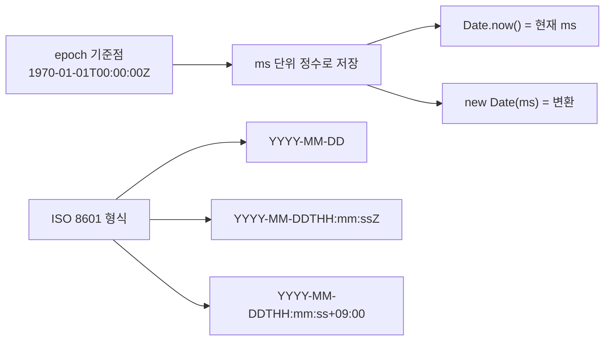
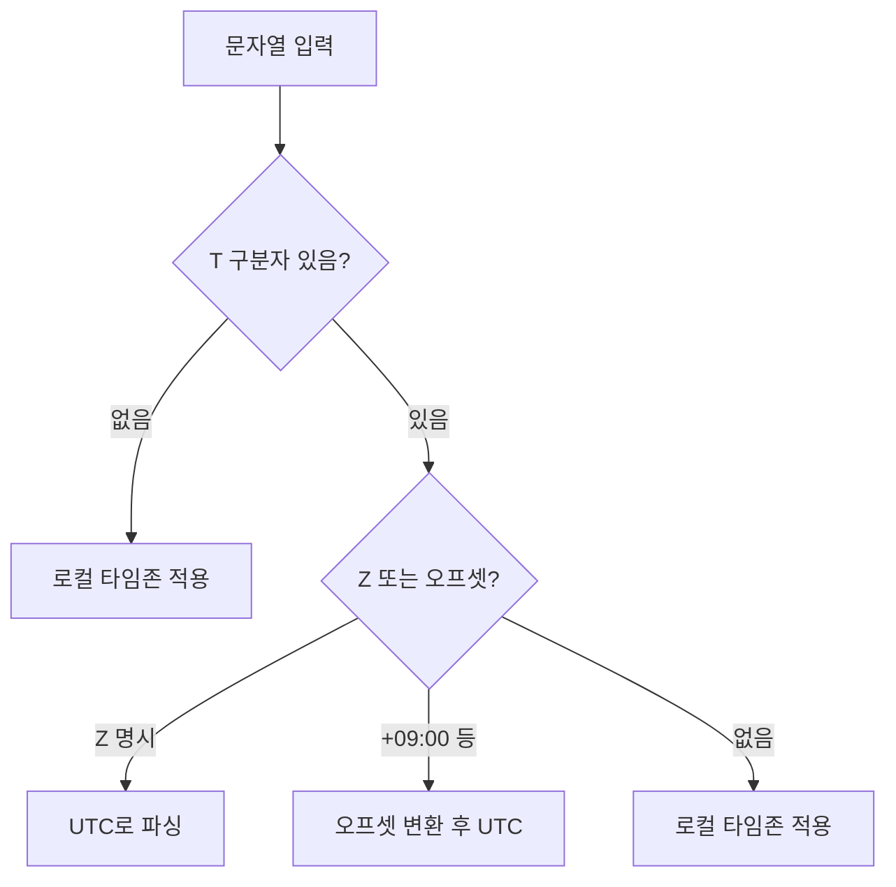

## 정의

JS 의 **`Date`** 객체. 시간을 ms 단위로 (1970-01-01T00:00:00Z 기준) 저장. 매우 오래된 API 라 함정이 많다.

## Date 의 설계 문제

`Date` 는 Brendan Eich 가 1995년 Java 의 `java.util.Date` 를 10일 만에 베껴 만들었습니다. Java 1.1 에서도 이 클래스는 대부분 deprecated 됐지만 JS `Date` 는 하위 호환 때문에 그대로 남아있습니다.

주요 문제:
- 월이 0-base (0=1월, 11=12월)
- 문자열 파싱 동작이 브라우저마다 다름
- timezone 처리가 불편함
- 가변 객체 (모든 setter 가 원본 변경)
- 국제화 지원 부족

## 생성

```javascript
new Date();                              // 현재 시각
new Date('2024-01-15');                  // ISO string
new Date('2024-01-15T09:00:00Z');        // UTC
new Date('2024-01-15T09:00:00+09:00');   // timezone
new Date(2024, 0, 15);                   // 년, 월(0-base!), 일
new Date(1705248000000);                 // unix ms
Date.now();                              // 현재 ms (Date 객체 X)
```

> [!CAUTION]
> 월이 **0-base** (0=1월). 가장 흔한 함정.

## 가져오기

```javascript
const d = new Date('2024-01-15T09:00:00');
d.getFullYear();        // 2024
d.getMonth();           // 0 (1월!)
d.getDate();            // 15 (일)
d.getDay();             // 1 (요일, 0=일요일)
d.getHours();           // 9
d.getMinutes();
d.getSeconds();
d.getMilliseconds();
d.getTime();            // unix ms
d.getTimezoneOffset();  // 분 (UTC 기준)

// UTC 버전
d.getUTCFullYear();
d.getUTCHours();
```

## 출력

```javascript
d.toISOString();         // '2024-01-15T00:00:00.000Z'
d.toJSON();              // 같음
d.toUTCString();         // 'Mon, 15 Jan 2024 00:00:00 GMT'
d.toString();            // 시스템 timezone 문자열
d.toLocaleString();      // '2024. 1. 15. 오전 9:00:00' (ko-KR)
d.toLocaleDateString();
d.toLocaleTimeString();
```

## Intl.DateTimeFormat (권장)

```javascript
const fmt = new Intl.DateTimeFormat('ko-KR', {
    year: 'numeric', month: 'long', day: 'numeric',
    weekday: 'short',
});
fmt.format(d);    // '2024년 1월 15일 (월)'

new Intl.DateTimeFormat('en-US', {
    timeZone: 'America/New_York',
    dateStyle: 'full', timeStyle: 'short',
}).format(d);
```

`Intl` 이 모던 권장. timezone, locale 지원.

## ISO 8601 과 Epoch



```javascript
// epoch 관련 idiom
Date.now()                         // 현재 unix ms
Math.floor(Date.now() / 1000)      // unix timestamp (초)
new Date(0).toISOString()          // '1970-01-01T00:00:00.000Z'

// 성능 측정
const start = performance.now(); // 고해상도 (ms, 소수점)
doWork();
console.log(performance.now() - start + 'ms');
```

## Timezone 이슈

문자열 파싱 시 timezone 추론 규칙이 복잡합니다.



```javascript
// 같은 날짜, 다른 해석
new Date('2024-01-15')              // UTC 자정 (날짜만 있으면 UTC)
new Date('2024-01-15T09:00')        // 로컬 타임존 09:00
new Date('2024-01-15T09:00Z')       // UTC 09:00
new Date('2024-01-15T09:00+09:00')  // KST 09:00 = UTC 00:00

// 안전한 파싱 패턴
function parseDate(str) {
    // 날짜만 있는 경우 UTC 로 파싱
    if (/^\d{4}-\d{2}-\d{2}$/.test(str)) {
        return new Date(str + 'T00:00:00Z');
    }
    return new Date(str);
}
```

> [!WARNING]
> `new Date('2024-01-15')` 은 UTC 자정이지만 `new Date('2024-01-15 09:00')` 은 로컬 타임존입니다. 형식마다 다릅니다.

## 산술

```javascript
const d = new Date();
d.setDate(d.getDate() + 7);          // 7 일 후

// 또는 ms 단위
const future = new Date(d.getTime() + 7 * 24 * 60 * 60 * 1000);

// 차이
const diff = (d2 - d1) / 1000 / 60 / 60 / 24;   // 일 단위
```

## 비교

```javascript
d1 < d2                  // 비교 가능 (ms 변환)
d1.getTime() === d2.getTime()    // 같은 시각 검사
d1 === d2                // 객체 참조, 다르면 false
```

객체 동등성은 `===` 로 비교 안 됨. `.getTime()` 필요.

## 일반적인 함정

> [!WARNING]
> 아래 함정들은 실제 서비스에서 자주 발생합니다.

### 1. 월의 0-base

```javascript
new Date(2024, 1, 15)       // 2024년 2월 15일! (1월 아님)
new Date('2024-02-15')      // 2024년 2월 15일 (ISO 문자열은 1-base)
```

### 2. timezone 추론

```javascript
new Date('2024-01-15')           // UTC 자정 (Z 가정)
new Date('2024-01-15 09:00')     // local timezone
new Date('2024-01-15T09:00')     // local
new Date('2024-01-15T09:00Z')    // UTC
```

명시적 ISO 8601 (`T` + `Z` 또는 `+09:00`) 권장.

### 3. Date 의 가변성

```javascript
const d = new Date();
d.setDate(d.getDate() + 1);    // d 가 변경됨

// 불변 패턴
const tomorrow = new Date(d);
tomorrow.setDate(tomorrow.getDate() + 1);
```

### 4. Invalid Date

```javascript
new Date('invalid')      // Invalid Date
isNaN(d.getTime())       // true
```

명시적 검사 필요.

### 5. 윤년 / 28-31일 차이

```javascript
new Date(2024, 1, 30)      // 2024-02-30 → 자동으로 2024-03-01
```

월에 없는 날짜는 다음 월로 넘어감 (의도 아닐 가능성).

### 6. toISOString 은 항상 UTC

```javascript
const d = new Date('2024-01-15T09:00:00+09:00');
d.toISOString()   // '2024-01-15T00:00:00.000Z' (UTC 로 변환됨)
```

## Temporal API

ECMAScript Temporal 제안. Stage 3 (2024년 기준). 더 명확한 API.

```javascript
// 미래에 표준 (현재는 polyfill 사용)
import { Temporal } from '@js-temporal/polyfill';

// 날짜만
const date = Temporal.PlainDate.from('2024-01-15');
date.year;   // 2024
date.month;  // 1 (1-base!)
date.day;    // 15

// timezone 포함
const zdt = Temporal.ZonedDateTime.from({
    timeZone: 'Asia/Seoul',
    year: 2024, month: 1, day: 15,
    hour: 9, minute: 0,
});

// 날짜 계산 (불변)
const nextWeek = date.add({ days: 7 });

// 현재 시각
Temporal.Now.instant();              // Instant (UTC)
Temporal.Now.plainDateISO();         // '2024-01-15'
Temporal.Now.zonedDateTimeISO();     // ZonedDateTime (로컬)
```

Temporal 의 핵심 개선:
- 월이 1-base
- 불변 객체 (모든 연산이 새 객체 반환)
- PlainDate, PlainTime, ZonedDateTime 등 타입 분리
- timezone 이 일급 시민

## 대안 라이브러리

`Date` 의 함정 때문에 외부 라이브러리가 흔히 쓰인다.

| 라이브러리 | 특징 |
|:---|:---|
| **date-fns** | 함수형, tree-shakable |
| **dayjs** | moment.js 호환, 가벼움 (2KB) |
| **luxon** | timezone / Intl 강화 |
| **Temporal** (ES proposal) | 차세대 표준, 곧 도입 |

```javascript
import { addDays, format, isValid } from 'date-fns';
import dayjs from 'dayjs';
import utc from 'dayjs/plugin/utc';
import timezone from 'dayjs/plugin/timezone';

dayjs.extend(utc);
dayjs.extend(timezone);

// date-fns
addDays(new Date(), 7);
format(new Date(), 'yyyy-MM-dd');
isValid(new Date('invalid'));  // false

// dayjs
dayjs().add(7, 'day').format('YYYY-MM-DD');
dayjs.tz('2024-01-15', 'Asia/Seoul').utc().toISOString();
```

## 자주 쓰는 idiom

```javascript
// 오늘 자정
const today = new Date(); today.setHours(0, 0, 0, 0);

// 이 달 1일
const firstDay = new Date(d.getFullYear(), d.getMonth(), 1);

// 이 달 마지막 날
const lastDay = new Date(d.getFullYear(), d.getMonth() + 1, 0);

// unix timestamp
Math.floor(Date.now() / 1000);

// 날짜 포맷 (빠른 버전)
function formatDate(d) {
    return d.toISOString().slice(0, 10); // 'YYYY-MM-DD'
}

// 두 날짜 사이 일 수
function daysBetween(a, b) {
    const ms = Math.abs(b.getTime() - a.getTime());
    return Math.floor(ms / (1000 * 60 * 60 * 24));
}

// 요일 이름
const days = ['일', '월', '화', '수', '목', '금', '토'];
const dayName = days[new Date().getDay()];
```

## 관련 위키

- [[JS Number]]
- [[JS NaN / Infinity]]
