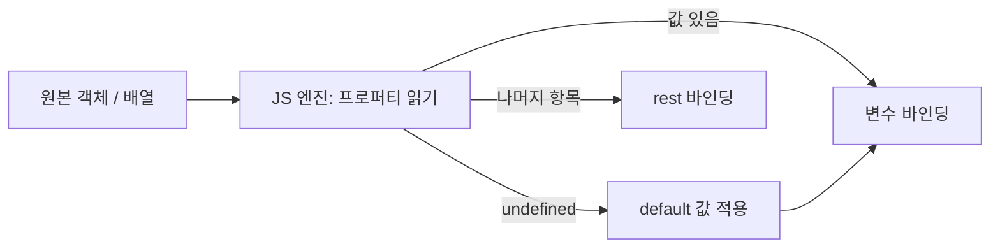

## 정의

**Destructuring** 은 배열 또는 객체의 일부를 변수로 풀어내는 ES6 문법. 코드를 짧고 명시적으로.

## 객체

```javascript
const { name, age } = user;
const { name: userName } = user;          // rename
const { name = 'Anonymous' } = user;       // default
const { name, ...rest } = user;            // rest

// nested
const { address: { city, zip } } = user;
```

## 배열

```javascript
const [a, b, c] = [1, 2, 3];
const [a, , c] = [1, 2, 3];       // 중간 skip
const [a, b = 10] = [1];           // default
const [head, ...tail] = [1, 2, 3]; // rest, head=1 tail=[2,3]

// swap
let x = 1, y = 2;
[x, y] = [y, x];                    // x=2, y=1
```

## 함수 매개변수

```javascript
function greet({ name, age = 18 }) {
    return `${name}, ${age}`;
}
greet({ name: 'Alice', age: 30 });
greet({ name: 'Bob' });             // age=18 default

// 배열 인자
function point([x, y]) {
    return x + y;
}
point([3, 4]);                       // 7
```

## 자주 쓰는 idiom

### API 응답 분해

```javascript
const { data: { users, total }, error } = response;
```

### React props

```javascript
function Card({ title, body, onClick }) {
    return <div onClick={onClick}>{title}: {body}</div>;
}
```

### 옵션 객체

```javascript
function createUser({ name, role = 'user', verified = false } = {}) {
    return { name, role, verified };
}
createUser();                        // {} default 까지 적용
createUser({ name: 'A', role: 'admin' });
```

`= {}` 가 없으면 `createUser()` 호출 시 destructure 실패 (TypeError).

### map 콜백

```javascript
users.map(({ name, age }) => `${name} (${age})`);
```

### return 여러 값

```javascript
function divmod(a, b) {
    return [Math.floor(a / b), a % b];
}
const [quotient, remainder] = divmod(10, 3);

// 객체로
function divmod2(a, b) {
    return { q: Math.floor(a / b), r: a % b };
}
const { q, r } = divmod2(10, 3);
```

## 동적 키

```javascript
const key = 'name';
const { [key]: value } = user;       // user[key] → value
```

## 정렬과 결합

```javascript
const [first, ...rest] = sorted;
const { id, ...others } = obj;
return { ...defaults, ...overrides };
```

## 함정

### 1. default 의 정확한 동작

```javascript
const { a = 1 } = { a: undefined };   // a = 1 (undefined 만 default 적용)
const { a = 1 } = { a: null };         // a = null (null 은 default 무시)
const { a = 1 } = { a: 0 };            // a = 0
```

### 2. nested 의 함정

```javascript
const { a: { b } } = obj;
// obj.a 가 undefined 면 → TypeError

// 안전한 패턴
const { a: { b } = {} } = obj;
// obj.a 가 undefined 면 {} 로 default
```

### 3. 배열의 rest 위치

```javascript
const [a, ...rest, b] = arr;    // ❌ rest 는 마지막만
const [first, ...rest] = arr;    // ✓
```

### 4. 변수명 vs property 명

```javascript
const { name } = user;        // name 변수에 user.name
const { name: alias } = user; // alias 변수에 user.name

// 헷갈리지 말 것: 콜론의 의미가 객체 리터럴과 반대
const obj = { name: 'value' };       // name 이 키, 'value' 가 값
const { name: alias } = obj;          // name 이 키, alias 가 변수
```

### 5. 함수 매개변수의 = {}

```javascript
function fn({ a, b }) { ... }
fn();    // ❌ TypeError (undefined 를 destructure)

function fn({ a, b } = {}) { ... }
fn();    // ✓
```

## 모범 사례

1. **함수 매개변수** 에 적극 사용 (가독성)
2. **default value + `= {}`** 함께 (안전한 함수)
3. **nested 보다 평탄** (1-2 단계까지)
4. **swap idiom** : `[a, b] = [b, a]`

## 구조 분해 흐름 시각화



## TypeScript 와 구조 분해

```typescript
interface User {
    name: string;
    age?: number;
    address: { city: string; zip: string };
}

// 타입 자동 추론
const { name, age = 18 }: User = user;

// nested 타입 보존
const { address: { city, zip } }: User = user;

// rename 시 타입 유지
const { name: userName }: User = user;
// userName 은 string 타입

// 제네릭 함수에서
function pick<T, K extends keyof T>(obj: T, ...keys: K[]): Pick<T, K> {
    return Object.fromEntries(keys.map(k => [k, obj[k]])) as Pick<T, K>;
}

// 함수 매개변수 타입 명시
function greet({ name, age = 18 }: { name: string; age?: number }) {
    return `${name}, ${age}`;
}
```

> [!TIP]
> TypeScript 에서 rename (`{ name: alias }`) 시 타입은 원본 프로퍼티를 따라간다. `alias` 는 `name` 의 타입 그대로.

## Map / Set / Iterator 구조 분해

```javascript
// Map - [key, value] 쌍으로 iterate
const map = new Map([['a', 1], ['b', 2]]);
for (const [key, value] of map) {
    console.log(key, value);   // 'a' 1, 'b' 2
}
const [[firstKey, firstVal]] = map;   // firstKey='a', firstVal=1

// Set - 인덱스 없이 값만
const [first, second] = new Set([10, 20, 30]);   // first=10, second=20

// 문자열 - utf-16 code unit 단위
const [c1, c2, ...rest] = 'hello';
// c1='h', c2='e', rest=['l','l','o']

// Object.entries / Object.keys / Object.values
const obj = { x: 1, y: 2, z: 3 };
for (const [key, value] of Object.entries(obj)) {
    console.log(`${key}: ${value}`);
}

// 커스텀 이터레이터
function* range(start, end) {
    for (let i = start; i < end; i++) yield i;
}
const [a, b, c] = range(5, 10);   // a=5, b=6, c=7
```

## 자주 쓰는 라이브러리 패턴

### React

```javascript
// useState / useReducer
const [count, setCount] = useState(0);
const [state, dispatch] = useReducer(reducer, initialState);

// context
const { user, login, logout } = useContext(AuthContext);

// custom hook
function useUser() {
    const { data, error, isLoading } = useSWR('/api/user');
    return { user: data, error, isLoading };
}
const { user, isLoading } = useUser();
```

### Express / Next.js

```javascript
// Express route
app.get('/users/:id', ({ params, query, body }, res) => {
    const { id } = params;
    const { page = '1', limit = '20' } = query;
    res.json({ id, page, limit });
});

// Next.js API route
export default function handler({ method, body, query }, res) {
    if (method === 'GET') {
        const { id } = query;
        return res.json({ id });
    }
}
```

### 비동기 패턴

```javascript
// Promise.allSettled 결과 분해
const results = await Promise.allSettled([p1, p2, p3]);
for (const { status, value, reason } of results) {
    if (status === 'fulfilled') console.log(value);
    else console.error(reason);
}

// fetch 응답 분해
const { ok, status, headers } = await fetch('/api/data');
const { data, error } = await res.json();
```

## 성능 고려사항

```javascript
// rest 는 얕은 복사 = 새 객체 생성
const { id, ...rest } = bigObject;   // rest 는 새 객체 (메모리 할당)

// 필요한 필드만 추출 (권장)
const { id, name } = bigObject;

// 핫 루프 안 destructuring: V8 이 최적화하므로 걱정 불필요
for (const { name, score } of millionItems) { /* ... */ }
```

- *rest operator 는 얕은 복사*. 중첩 객체는 참조 공유.
- *중첩 2단계 이하* 권장. 그 이상은 별도 변수로 분리.
- *`{ ...defaults, ...overrides }` 패턴*: 매번 새 객체 생성, GC 부담 가능.

## 참고

- [[js-object]]
- [[js-array]]
- [[js-spread-rest]]
- [[js-optional-chaining]]
