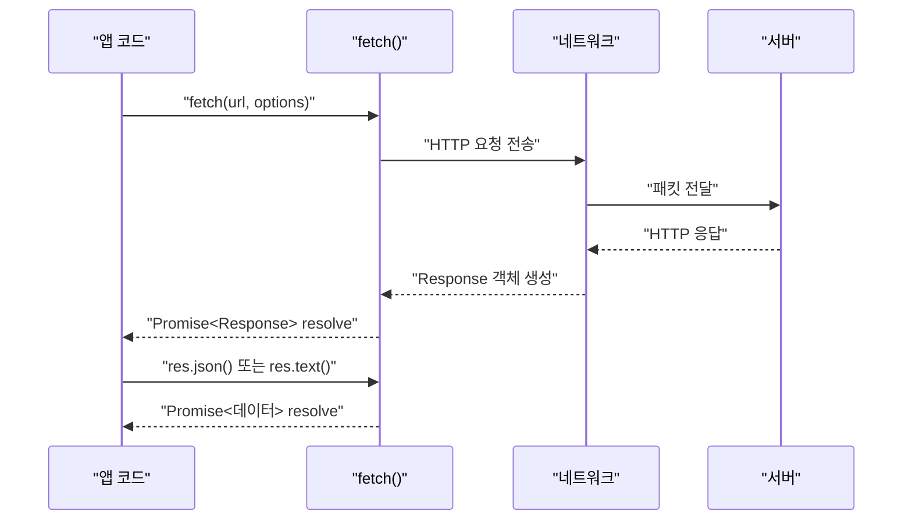

## 정의

**`fetch`** 는 Promise 기반의 표준 HTTP 클라이언트 Web API. ES2015 이후 `XMLHttpRequest (XHR)` 를 실질적으로 대체했다. 브라우저와 Node.js 18+ 에서 기본 지원.

## 언제 쓰나

| 상황 | 선택 |
|:---|:---|
| REST API 호출 | `fetch` 기본 |
| JSON POST | `fetch` + `JSON.stringify` |
| 요청 취소 / 타임아웃 | `AbortController` / `AbortSignal.timeout` |
| 스트리밍 응답 | `res.body` (ReadableStream) |
| 복잡한 인터셉터/재시도 | axios / ky 등 래퍼 라이브러리 |

## 요청/응답 흐름



> [!IMPORTANT]
> `fetch` 는 네트워크 오류 (DNS 실패, 연결 거부 등) 만 reject 한다. **HTTP 4xx / 5xx 는 정상 resolve** 이므로 반드시 `res.ok` 로 확인해야 한다.

## 기본 사용

```js
// GET 요청
const res = await fetch('/api/users');
if (!res.ok) throw new Error(`HTTP ${res.status}`);
const users = await res.json();
```

## options 객체

```js
fetch(url, {
    method: 'POST',              // 기본값: 'GET'
    headers: {
        'Content-Type': 'application/json',
        'Authorization': `Bearer ${token}`,
    },
    body: JSON.stringify({ name: 'Alice' }),

    // CORS 관련
    mode: 'cors',                // 'cors' | 'no-cors' | 'same-origin'
    credentials: 'include',      // 'omit' | 'same-origin' | 'include'

    // 캐싱
    cache: 'no-cache',           // 'default' | 'no-store' | 'reload' | 'force-cache'

    // 리다이렉트
    redirect: 'follow',          // 'follow' | 'error' | 'manual'

    // 취소 신호
    signal: controller.signal,
});
```

### method / headers / body

```js
// POST + JSON
await fetch('/api/users', {
    method: 'POST',
    headers: { 'Content-Type': 'application/json' },
    body: JSON.stringify({ name: 'Alice', age: 30 }),
});

// PUT 업데이트
await fetch(`/api/users/${id}`, {
    method: 'PUT',
    headers: { 'Content-Type': 'application/json' },
    body: JSON.stringify({ name: 'Bob' }),
});

// DELETE
await fetch(`/api/users/${id}`, { method: 'DELETE' });

// 폼 데이터
const form = new FormData();
form.append('file', fileInput.files[0]);
await fetch('/api/upload', { method: 'POST', body: form });
// Content-Type: multipart/form-data 헤더는 자동 설정됨
```

### mode / credentials

```js
// 크로스 오리진 요청에 쿠키 포함
fetch('https://api.example.com/data', {
    mode: 'cors',
    credentials: 'include',   // 쿠키, Authorization 헤더 전송
});

// 동일 오리진에서만 쿠키 포함 (기본값)
fetch('/api/data', {
    credentials: 'same-origin',
});
```

## Response 객체

```js
const res = await fetch('/api/data');

// 상태 정보
res.status;          // 200, 404, 500 ...
res.ok;              // true if 200-299
res.statusText;      // 'OK', 'Not Found' ...
res.headers.get('Content-Type');   // 'application/json'
res.url;             // 최종 URL (리다이렉트 후)
res.redirected;      // 리다이렉트 여부

// Body 소비 메서드 (한 번만 호출 가능)
await res.json();        // JSON 파싱
await res.text();        // 문자열
await res.blob();        // Blob (이미지 등)
await res.arrayBuffer(); // ArrayBuffer (바이너리)
await res.formData();    // FormData
```

### Body 스트리밍

```js
const res = await fetch('/api/large-file');
const reader = res.body.getReader();

while (true) {
    const { done, value } = await reader.read();
    if (done) break;
    // value: Uint8Array 청크
    process(value);
}
```

## Request 객체

URL 과 옵션을 미리 구성해 재사용하거나 미들웨어에 전달할 때.

```js
const req = new Request('/api/users', {
    method: 'POST',
    headers: { 'Content-Type': 'application/json' },
    body: JSON.stringify({ name: 'Alice' }),
});

// 복제해서 수정
const reqWithAuth = new Request(req, {
    headers: { ...req.headers, 'Authorization': `Bearer ${token}` },
});

const res = await fetch(reqWithAuth);
```

## 에러 처리

```js
async function apiFetch(url, options) {
    let res;
    try {
        res = await fetch(url, options);
    } catch (networkErr) {
        // DNS 실패, 연결 거부, CORS 차단 등
        throw new Error(`네트워크 오류: ${networkErr.message}`);
    }

    if (!res.ok) {
        const body = await res.text().catch(() => '');
        throw new Error(`HTTP ${res.status}: ${body}`);
    }

    return res.json();
}
```

### HTTP 상태 코드별 처리

```js
async function fetchWithStatusHandling(url) {
    const res = await fetch(url);

    switch (true) {
        case res.status === 401:
            throw new Error('인증 필요: 로그인 하세요');
        case res.status === 403:
            throw new Error('권한 없음');
        case res.status === 404:
            return null;
        case res.status >= 500:
            throw new Error(`서버 오류: ${res.status}`);
        case !res.ok:
            throw new Error(`요청 실패: ${res.status}`);
        default:
            return res.json();
    }
}
```

## 취소

```js
// AbortController 로 수동 취소
const ctl = new AbortController();

const promise = fetch(url, { signal: ctl.signal });

// 5초 후 취소
setTimeout(() => ctl.abort(), 5000);

try {
    const res = await promise;
} catch (err) {
    if (err.name === 'AbortError') {
        console.log('요청이 취소됐습니다');
    }
}
```

## 타임아웃

```js
// AbortSignal.timeout (ES2022, 가장 간단)
const res = await fetch(url, {
    signal: AbortSignal.timeout(5000),
});

// 직접 구성 (지원 안 하는 환경)
async function fetchWithTimeout(url, ms = 5000) {
    const controller = new AbortController();
    const timer = setTimeout(() => controller.abort(), ms);
    try {
        return await fetch(url, { signal: controller.signal });
    } finally {
        clearTimeout(timer);
    }
}
```

## 실전 예시

### 공통 API 클라이언트

```js
const API_BASE = 'https://api.example.com';

async function apiRequest(path, options = {}) {
    const url = `${API_BASE}${path}`;
    const defaults = {
        headers: {
            'Content-Type': 'application/json',
            'Authorization': `Bearer ${getToken()}`,
        },
        credentials: 'include',
        signal: AbortSignal.timeout(10_000),
    };

    const res = await fetch(url, { ...defaults, ...options });
    if (!res.ok) {
        const err = await res.json().catch(() => ({ message: res.statusText }));
        throw Object.assign(new Error(err.message), { status: res.status });
    }
    if (res.status === 204) return null;   // No Content
    return res.json();
}
```

### 재시도 로직

```js
async function fetchWithRetry(url, options = {}, retries = 3) {
    for (let i = 0; i < retries; i++) {
        try {
            const res = await fetch(url, options);
            if (res.ok) return res;
            if (res.status < 500) throw new Error(`HTTP ${res.status}`);  // 4xx: 재시도 의미 없음
        } catch (err) {
            if (i === retries - 1) throw err;
            await new Promise(r => setTimeout(r, 300 * 2 ** i));   // exponential backoff
        }
    }
}
```

### Blob 이미지 다운로드

```js
async function downloadImage(url) {
    const res = await fetch(url);
    const blob = await res.blob();
    const objectUrl = URL.createObjectURL(blob);

    const a = document.createElement('a');
    a.href = objectUrl;
    a.download = 'image.jpg';
    a.click();
    URL.revokeObjectURL(objectUrl);
}
```

## 함정

### 4xx/5xx 는 reject 안 함

```js
// ❌ 이렇게 쓰면 오류를 감지 못 함
const res = await fetch('/api/missing');
const data = await res.json();   // 404 응답의 body를 파싱하게 됨

// ✅ res.ok 확인 필수
if (!res.ok) throw new Error(`HTTP ${res.status}`);
```

### Body 는 한 번만 소비 가능

```js
const res = await fetch(url);

// ❌ 두 번 소비하면 TypeError
const json = await res.json();
const text = await res.text();   // TypeError: body already consumed

// ✅ clone 후 각각 소비
const clone = res.clone();
const json = await res.json();
const text = await clone.text();
```

> [!WARNING]
> `Response.body` 는 ReadableStream 이며 한 번만 읽을 수 있다. 두 번 파싱이 필요하면 반드시 `res.clone()` 을 먼저 호출한다.

### credentials 기본값

```js
// 기본값 'same-origin': 크로스 오리진 요청에는 쿠키가 전송되지 않음
fetch('https://other.com/api');                         // 쿠키 없음

// 크로스 오리진에서 쿠키 보내려면 명시
fetch('https://other.com/api', { credentials: 'include' });
// 서버도 CORS 헤더에 Access-Control-Allow-Credentials: true 필요
```

## 관련 위키

- [[js-abort-controller]] - AbortController / AbortSignal
- [[js-promise]] - Promise 기반 동작 원리
- [[js-async-await]] - async/await 로 fetch 래핑
- [[js-error-handling]] - 에러 처리 전략
- [[http-1-1]] - HTTP 프로토콜 기초
