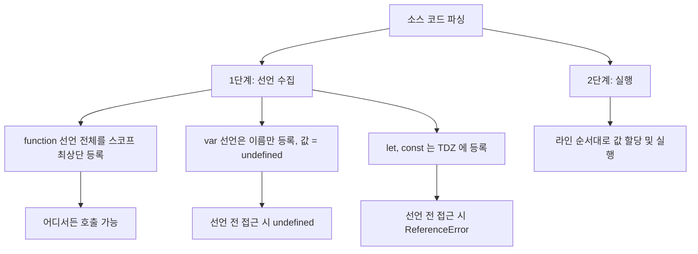
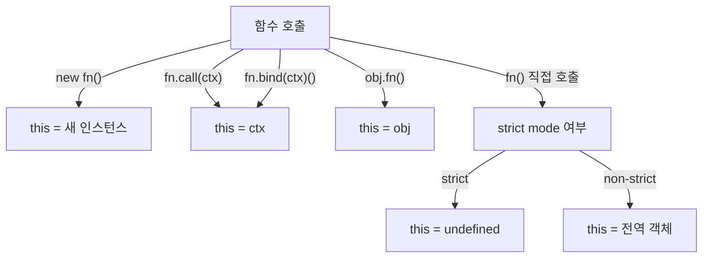

## 정의

**`function`** 은 JavaScript 에서 함수를 만드는 가장 기본적인 키워드. 호이스팅, `this` 동적 바인딩, `arguments` 객체, `new` 호출 등 [[arrow function]] 과 구분되는 고유한 특성을 가진다.

함수가 *값* 으로 다뤄지는 [[일급 함수]] 의 성질은 모든 형태에 공통.

## 사용 상황

| 상황 | 권장 형태 |
|:---|:---|
| 객체 메서드 (`this` 가 객체를 가리켜야 함) | `function` 선언/표현식 |
| 생성자 (`new` 와 함께) | `function` 선언/표현식 |
| prototype 메서드 추가 | `function` 표현식 |
| 재귀 함수 | 이름 있는 함수 표현식 또는 선언문 |
| 콜백, 이벤트 핸들러 (this 불필요) | 화살표 함수 권장 |
| 짧은 단방향 변환 | 화살표 함수 권장 |
| 호이스팅이 필요한 유틸 함수 | 함수 선언문 |

## 두 가지 모양

### 함수 선언 (Function Declaration)

```javascript
function greet(name) {
  return `Hello, ${name}`;
}
```

- **호이스팅** 됨 (선언 전 호출 가능)
- 자기 이름 `greet` 으로 자신을 참조 가능 (재귀)

### 함수 표현식 (Function Expression)

```javascript
const greet = function (name) {
  return `Hello, ${name}`;
};

// 이름 있는 함수 표현식 (named function expression)
const factorial = function fact(n) {
  return n <= 1 ? 1 : n * fact(n - 1);
};
```

- 호이스팅 안 됨 (변수 선언만 호이스팅, 값은 평가 시점에 할당)
- 익명 또는 이름 있음, 이름은 내부에서만 보임

## 호이스팅의 차이

```javascript
greet('A'); // 'Hello, A', 함수 선언은 호이스팅
function greet(name) {
  return `Hello, ${name}`;
}

sayHi('B'); // TypeError: sayHi is not a function
const sayHi = function (name) {
  return `Hi, ${name}`;
};
```

함수 선언은 *함수 자체* 가 스코프 최상단으로 끌어올려진다. 표현식은 `const`/`let`/`var` 가 호이스팅되는 규칙을 따른다.

## 호이스팅 동작 시각화

JavaScript 엔진은 실행 전 코드를 두 단계로 처리한다.



`function` 선언은 1단계에서 **함수 객체 전체** 가 등록되므로 어디서든 호출 가능. [[js-hoisting|호이스팅]] 참고.

## this 동적 바인딩

일반 함수의 가장 큰 특징. **호출 방식에 따라 `this` 가 결정**된다.

| 호출 방식 | `this` |
|:---|:---|
| 일반 호출 `fn()` | `undefined` (strict) 또는 전역 객체 |
| 메서드 호출 `obj.fn()` | `obj` |
| `fn.call(ctx)`, `fn.apply(ctx)` | `ctx` |
| `fn.bind(ctx)()` | `ctx` |
| `new fn()` | 새 인스턴스 |
| DOM 이벤트 리스너 | 이벤트 타겟 (보통) |

```javascript
const obj = {
  name: 'Alice',
  greet() {
    console.log(this.name); // 'Alice'
  },
};

const fn = obj.greet;
fn(); // undefined, this 가 obj 가 아니다
```

이 "this 가 호출 시 결정" 특성이 [[arrow function]] 과 가장 큰 차이.



## arguments 객체

일반 함수 안에는 `arguments` 라는 유사 배열 객체가 자동으로 존재.

```javascript
function sum() {
  let total = 0;
  for (let i = 0; i < arguments.length; i++) {
    total += arguments[i];
  }
  return total;
}
sum(1, 2, 3); // 6
```

> 모던 코드에서는 `...rest` 매개변수를 권장. `arguments` 는 배열이 아니라 유사 배열이라 `.map` 등이 안 통한다.

## new 호출

생성자로 사용 가능. `this` 는 새 인스턴스를 가리킨다.

```javascript
function Person(name) {
  this.name = name;
}
Person.prototype.greet = function () {
  return `Hello, ${this.name}`;
};

const p = new Person('Alice');
p.greet(); // 'Hello, Alice'
```

> ES2015 `class` 문법이 이를 깔끔하게 대체. 그래도 내부적으로는 같은 메커니즘.

## 프로토타입 체인

일반 함수는 `prototype` 속성을 가진다 (생성자로 쓰일 수 있어서).

```javascript
function Animal() {}
Animal.prototype.eat = function () { /* ... */ };

const dog = new Animal();
dog.eat(); // 프로토타입 체인을 따라 찾음
```

[[arrow function]] 은 `prototype` 이 없어 `new` 호출 불가.

## 일반 함수 vs 화살표 함수 비교

| 특성 | `function` | `() => {}` |
|:---|:---|:---|
| `this` | 호출 시 결정 (동적) | 정의 시 결정 (lexical) |
| `arguments` | ✓ | ✗ (rest 사용) |
| `new` 호출 | ✓ (생성자 가능) | ✗ (TypeError) |
| `prototype` | ✓ | ✗ |
| 호이스팅 (선언문) | ✓ | ✗ (표현식만 가능) |
| 짧은 문법 | △ | ✓ |
| 메서드로 적합 | ✓ | △ (this 가 lexical 이라서) |

자세한 화살표 함수 동작은 [[arrow function]] 참고.

## 고급 패턴

### IIFE (즉시 실행 함수)

```javascript
(function () {
  // 즉시 실행, 전역 스코프 오염 방지
  const secret = 'hidden';
  console.log(secret);
})();
```

모듈 시스템이 없던 시절 스코프를 격리하는 패턴. 현재는 ES Modules 가 대체.

### 커링 (Currying)

```javascript
function multiply(a) {
  return function (b) {
    return a * b;
  };
}
const double = multiply(2);
double(5);  // 10
double(10); // 20
```

인자를 하나씩 받는 함수 연쇄. [[js-closure|클로저]] 로 `a` 를 기억한다.

### 메모이제이션

```javascript
function memoize(fn) {
  const cache = new Map();
  return function (...args) {
    const key = JSON.stringify(args);
    if (cache.has(key)) return cache.get(key);
    const result = fn.apply(this, args);
    cache.set(key, result);
    return result;
  };
}

const fib = memoize(function (n) {
  return n <= 1 ? n : fib(n - 1) + fib(n - 2);
});
```

## 언제 일반 함수를 쓰는가

- **객체의 메서드**, `this` 가 객체를 가리켜야 함
- **생성자**, `new` 와 함께
- **prototype 메서드**, 클래스 메서드
- **재귀 함수** (이름 있는 표현식 또는 선언문)

## 함정

### 1. 메서드를 변수에 꺼내면 this 잃음

```javascript
const timer = {
  tick: 0,
  increment() {
    this.tick++;
  },
};

const inc = timer.increment;
inc();              // this = undefined (strict) 또는 전역
inc.call(timer);    // this = timer (해결)

// 또는 bind 로 고정
const boundInc = timer.increment.bind(timer);
boundInc();         // 항상 timer
```

### 2. var 호이스팅과 함수 선언이 같은 이름

```javascript
console.log(typeof foo);   // 'function'
var foo = 'bar';
function foo() {}
// 함수 선언이 var 보다 우선 (호이스팅 순서)
```

### 3. arguments 는 배열이 아님

```javascript
function f() {
  arguments.map(x => x * 2);      // TypeError: arguments.map is not a function
  [...arguments].map(x => x * 2); // ✓ 배열로 변환
}

// 권장: rest 파라미터 사용
function g(...args) {
  args.map(x => x * 2); // ✓
}
```

### 4. 화살표 함수를 메서드로 쓰면 this 가 전역

```javascript
const obj = {
  name: 'Alice',
  greet: () => {
    console.log(this.name); // undefined (lexical this = 전역)
  },
};
obj.greet(); // 의도와 다름
```

## 관련 위키

- [[arrow function]]
- [[일급 함수]]
- [[고차 함수]]
- [[클로저]]
- [[Lexical Environment]]
- [[js-hoisting|호이스팅]]
- [[js-this-binding|this 바인딩]]
- [[js-prototype-chain|프로토타입 체인]]
- [[js-closure|클로저 상세]]
- [[js-lexical-environment|Lexical Environment 상세]]
