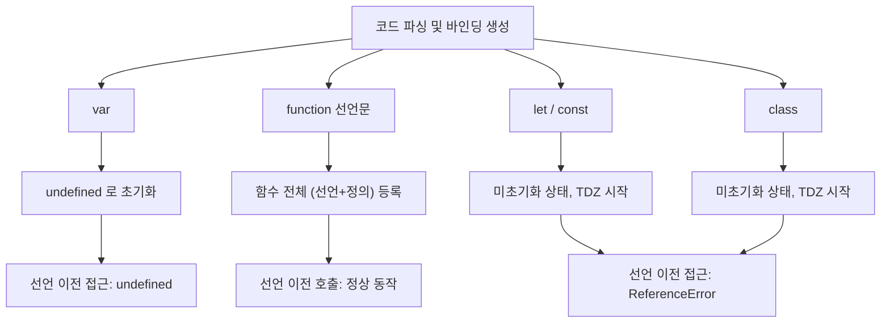

## 정의

**호이스팅 (Hoisting)** 은 JavaScript 엔진이 코드를 실행하기 전 **바인딩 생성 단계** 에서 스코프 내의 선언을 파악하고 등록하는 메커니즘이다. 마치 선언이 스코프 최상단으로 끌어올려진 것처럼 동작해서 "호이스팅" 이라고 부른다.

단, 선언 종류마다 동작이 다르다:
- `var`: 선언 + `undefined` 초기화 (TDZ 없음)
- `function` 선언문: 선언 + 정의 전체 (호출 가능)
- `let` / `const` / `class`: 선언만 (TDZ 발생)

## 언제 만나나

| 상황 | 발생 이유 |
|:---|:---|
| 선언 전에 `var` 에 접근하면 `undefined` | var 호이스팅 |
| 선언 전에 `function` 호출 가능 | 함수 선언문 전체 호이스팅 |
| 선언 전에 `let`/`const` 접근 시 `ReferenceError` | TDZ |
| `var bar = function(){}` 를 선언 전 호출 시 `TypeError` | var 는 호이스팅되지만 값(함수)은 아님 |

## 선언 종류별 호이스팅 비교



## var 의 호이스팅

```javascript
console.log(x);     // undefined (에러 없음)
var x = 5;
console.log(x);     // 5
```

엔진이 실제로 처리하는 방식:

```javascript
var x;              // 선언만 끌어올려짐, undefined 로 초기화
console.log(x);     // undefined
x = 5;              // 할당은 원래 위치에
console.log(x);     // 5
```

`var` 는 **함수 스코프** 다. 블록 `{}` 을 무시하고 가장 가까운 함수(또는 전역)가 스코프가 된다.

```javascript
function foo() {
    if (true) {
        var x = 1;   // 블록 안이지만 foo 스코프로 호이스팅
    }
    console.log(x);  // 1 (블록 밖에서도 접근 가능)
}
```

## function 선언문의 호이스팅

함수 선언문은 **선언과 정의가 함께** 호이스팅된다. 선언 전에도 정상 호출 가능.

```javascript
foo();              // ✓ 'hello' 출력
function foo() {
    console.log('hello');
}

// 엔진이 실제로 처리하는 방식
function foo() { console.log('hello'); }   // 최상단으로 이동
foo();
```

여러 이름이 충돌하면 **마지막 선언이 승리** 한다.

```javascript
function greet() { return 'hi'; }
function greet() { return 'hello'; }

greet();   // 'hello' (마지막 정의)
```

## function expression 은 var 호이스팅만

함수 표현식은 변수 선언만 호이스팅된다. 함수 자체는 할당문 실행 전까지 없다.

```javascript
bar();              // ❌ TypeError: bar is not a function
var bar = function() {
    console.log('bar');
};
```

엔진이 처리하는 방식:

```javascript
var bar;            // undefined 로 호이스팅
bar();              // undefined() → TypeError
bar = function() { console.log('bar'); };
```

> [!WARNING]
> `var bar = function(){}` 에서 `bar` 를 선언 전에 호출하면 `ReferenceError` 가 아닌 **`TypeError`** 가 난다. `bar` 는 `undefined` 로 초기화됐고, `undefined` 를 함수처럼 호출했기 때문이다.

## let / const 의 호이스팅 (TDZ)

`let` / `const` 도 **호이스팅은 된다**. 단, 초기화 없이 "선언 등록" 만 되어 [[js-tdz|TDZ (Temporal Dead Zone)]] 에 들어간다.

```javascript
console.log(y);     // ❌ ReferenceError: Cannot access 'y' before initialization
let y = 5;
```

"호이스팅 안 됐다" 가 아니라 "TDZ 진입" 이 정확한 설명이다. 아래 예시가 이를 증명한다.

```javascript
let x = 'outer';
{
    console.log(x);   // ❌ ReferenceError (TDZ)
    // 만약 호이스팅이 안 됐다면 outer 를 출력해야 하는데,
    // 내부 let x 가 호이스팅되어 outer x 를 가리고 TDZ 에 있음
    let x = 'inner';
}
```

## class 의 호이스팅

`class` 도 `let` / `const` 와 동일하게 TDZ 를 가진다.

```javascript
new Foo();          // ❌ ReferenceError: Cannot access 'Foo' before initialization
class Foo {}
```

Arrow function 은 변수에 할당되므로 해당 변수의 선언 방식(`var`/`let`/`const`)을 따른다.

## 호이스팅 우선순위

같은 이름이 `var` 와 `function` 선언으로 충돌하면 **함수 선언이 우선** 한다.

```javascript
console.log(typeof x);   // 'function' (함수가 우선)
var x = 1;
function x() {}
console.log(typeof x);   // 'number' (할당 후)
```

엔진 처리 순서:
1. `function x() {}` 가 먼저 호이스팅 (선언 + 정의)
2. `var x` 는 이미 `x` 가 있으니 초기화 무시
3. 실행: `x = 1` 할당으로 함수가 숫자로 덮임

## 실전 예시

### 의도하지 않은 var 접근

```javascript
function processItems(items) {
    for (var i = 0; i < items.length; i++) {
        setTimeout(() => {
            console.log(items[i]);   // ❌ 항상 items[items.length] (undefined)
        }, i * 100);
    }
}

// var i 는 함수 스코프, 루프 종료 후 i = items.length
// 클로저가 모두 같은 i 를 참조
```

```javascript
// ✅ let 사용: 매 반복 새 바인딩
function processItems(items) {
    for (let i = 0; i < items.length; i++) {
        setTimeout(() => {
            console.log(items[i]);   // 의도한 순서대로 출력
        }, i * 100);
    }
}
```

### if 블록 안 var 함정

```javascript
function setup(debug) {
    if (debug) {
        var logLevel = 'verbose';
    }
    // var 이므로 블록 무관하게 함수 스코프
    console.log(logLevel);   // debug=false 면 undefined, ReferenceError 아님
}

// ✅ let 으로 의도 명확화
function setup(debug) {
    if (debug) {
        const logLevel = 'verbose';
        console.log(logLevel);
    }
    // 블록 밖에서는 logLevel 없음 (ReferenceError 로 명확히 실패)
}
```

### 함수 선언 vs 표현식 선택

```javascript
// 함수 선언문: 호이스팅, 순서에 덜 민감
function helper() { return 'ok'; }

// 함수 표현식 (const): 선언 전 사용 불가, 더 명확한 의도
const helper = () => 'ok';

// 권장: 팀 컨벤션에 따르되, const + arrow function 이 현대 코드베이스 표준
```

### 조건부 함수 정의 (var 함정)

```javascript
// ❌ 브라우저마다 동작이 다른 위험한 패턴
if (condition) {
    function f() { return 'A'; }
} else {
    function f() { return 'B'; }
}

// ✅ 변수에 할당
let f;
if (condition) {
    f = () => 'A';
} else {
    f = () => 'B';
}
```

## 함정

### 1. var 의 전역 의도하지 않은 undefined

```javascript
function foo() {
    if (false) {
        var x = 1;    // 실행 안 되지만 선언은 호이스팅됨
    }
    console.log(x);   // undefined (ReferenceError 가 아님)
}
```

### 2. 함수 이름 충돌: 마지막 정의가 승리

```javascript
function x() { return 'first'; }
function x() { return 'second'; }
x();   // 'second'
```

### 3. let 의 호이스팅 오해

```javascript
console.log(x);   // ReferenceError (호이스팅 됐지만 TDZ)
let x = 1;
// "호이스팅 안 됐다" 가 아니라 "TDZ" 가 정확한 설명
```

### 4. function expression TypeError vs function 선언 ReferenceError

```javascript
// var 에 함수 표현식
bar();    // TypeError: bar is not a function (bar는 undefined)
var bar = function() {};

// let 에 함수 표현식
baz();    // ReferenceError: Cannot access 'baz' before initialization
let baz = function() {};
```

> [!WARNING]
> `var` 에 함수 표현식을 담으면 선언 전 호출 시 `undefined()` 를 시도해 `TypeError`, `let`/`const` 는 TDZ 로 `ReferenceError`. 에러 종류가 달라서 혼란스러울 수 있다.

## 모범 사례

1. **`var` 지양**, `let`/`const` 사용으로 호이스팅 함정 자동 회피
2. **선언을 사용 직전에 배치**, 호이스팅에 의존한 코드 금지
3. **함수는 사용하는 곳 위에 선언**, 읽기 순서와 실행 순서를 일치시킴
4. **ESLint `no-use-before-define`** 규칙 활성화로 정적 감지

## 관련 위키

- [[js-var-let-const]] - var / let / const 선언 차이 전체
- [[js-tdz]] - TDZ (Temporal Dead Zone) 상세
- [[js-scope-chain]] - 스코프 체인, 블록 스코프
- [[js-function]] - 함수 선언문 vs 함수 표현식
- [[js-closure]] - 클로저와 호이스팅의 상호작용
