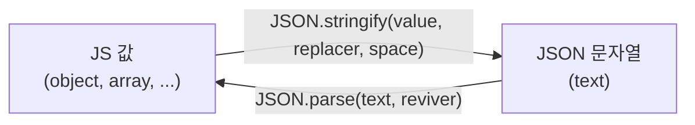
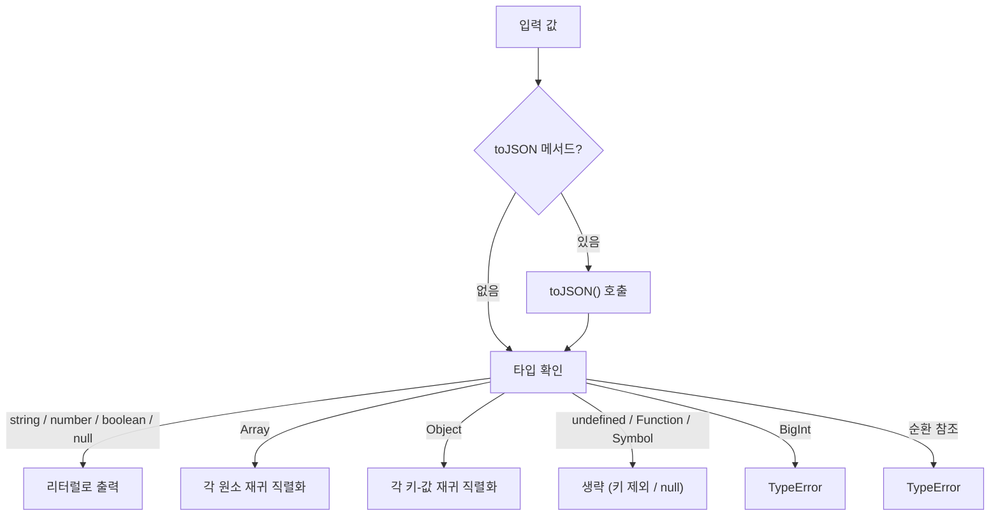

## 정의

**JSON** (JavaScript Object Notation) 은 데이터 교환 형식. JS 의 객체 리터럴과 비슷하지만 엄격한 문법.

- `JSON.stringify(value)` : JS 값 → JSON 문자열
- `JSON.parse(text)` : JSON 문자열 → JS 값

## stringify

```javascript
JSON.stringify({ a: 1, b: [2, 3] })
// '{"a":1,"b":[2,3]}'

JSON.stringify({ a: 1 }, null, 2)
// pretty-print, 2-space indent
// {
//   "a": 1
// }
```

## parse

```javascript
JSON.parse('{"a":1}')        // { a: 1 }
JSON.parse('[1, 2, 3]')      // [1, 2, 3]
JSON.parse('null')            // null
JSON.parse('true')            // true
JSON.parse('"hello"')         // 'hello'
```

## replacer (stringify)

```javascript
JSON.stringify({ a: 1, password: 'secret' }, (key, value) => {
    return key === 'password' ? undefined : value;
});
// '{"a":1}'

// 또는 array (allowlist)
JSON.stringify(obj, ['a', 'b']);    // a, b 만 포함
```

## reviver (parse)

```javascript
JSON.parse(text, (key, value) => {
    if (key === 'date') return new Date(value);
    return value;
});
```

date / BigInt 등 표준 외 타입 복원에 유용.

## 누락되는 값들

`stringify` 가 무시하거나 변환하는 값:

| 입력 | 결과 |
|:---|:---|
| `undefined` (값) | 키 제외 |
| `undefined` (배열 원소) | `null` |
| `Symbol` (값) | 키 제외 |
| `function` | 키 제외 |
| `NaN`, `Infinity` | `null` |
| `Date` | `toISOString()` 호출 → string |
| `BigInt` | ❌ TypeError |
| 순환 참조 | ❌ TypeError |

```javascript
JSON.stringify({
    a: undefined,
    b: Symbol(),
    c: () => {},
    d: NaN,
    e: new Date(),
    f: 1n,    // ❌
});
// '{"d":null,"e":"2024-..."}'   (a, b, c 제외)
```

## toJSON 메서드

객체에 `toJSON` 메서드가 있으면 stringify 가 호출.

```javascript
class Money {
    constructor(amount) { this.amount = amount; }
    toJSON() {
        return `$${this.amount.toFixed(2)}`;
    }
}

JSON.stringify(new Money(99.9));    // '"$99.90"'
```

Date 가 ISO string 되는 것도 이 메커니즘.

## 깊은 복사 (제한적)

```javascript
const copy = JSON.parse(JSON.stringify(obj));
```

장점: 단순.
단점:
- Date → string 으로 변환됨
- function, undefined, Symbol 누락
- BigInt, 순환 참조 에러

깊은 복사는 **`structuredClone(obj)`** 권장 (ES2022+).

## 자주 쓰는 패턴

### API 통신

```javascript
const response = await fetch('/api', {
    method: 'POST',
    headers: { 'Content-Type': 'application/json' },
    body: JSON.stringify(data),
});
const json = await response.json();   // 내부적으로 JSON.parse
```

### localStorage

```javascript
localStorage.setItem('user', JSON.stringify(user));
const user = JSON.parse(localStorage.getItem('user'));
```

### 디버깅 출력

```javascript
console.log(JSON.stringify(complexObj, null, 2));
```

### 보안 (민감 정보 제거)

```javascript
function sanitize(obj) {
    return JSON.parse(JSON.stringify(obj, (k, v) =>
        ['password', 'token', 'apiKey'].includes(k) ? undefined : v
    ));
}
```

## 함정

### 1. 한국어 escape

```javascript
JSON.stringify({ name: '한글' })
// '{"name":"한글"}'  (UTF-8 그대로)

// 옛 환경 호환을 위해 ASCII 만 원한다면 직접 escape
```

### 2. 정수 정밀도

```javascript
JSON.parse('9007199254740993')      // 9007199254740992 (정밀도 손실)
```

큰 정수는 JSON 문자열 → BigInt 수동 변환.

### 3. 순환 참조

```javascript
const a = {};
a.self = a;
JSON.stringify(a)    // ❌ TypeError
```

해법: replacer 로 순환 감지 또는 외부 라이브러리.

### 4. 키 순서

```javascript
JSON.parse(JSON.stringify(obj))
// 객체 키 순서가 보존되긴 하지만 표준은 보장 안 함
```

비교/해시에 키 순서를 의존하지 말 것.

## JSON5 / JSONC

```jsonc
{
    // 주석 가능
    "a": 1,
    "b": 2,    // trailing comma
}
```

JSON 의 확장 (주석, 후행 쉼표). 표준이 아니라 라이브러리 필요. tsconfig.json 이 JSONC 사용.

## 직렬화 흐름 시각화





## structuredClone 과 비교

ES2022 에서 도입된 `structuredClone` 은 JSON 경유 없는 진짜 깊은 복사.

```javascript
const obj = {
    date: new Date(),
    fn: () => {},
    x: undefined,
    big: 9007199254740993n,
};

// JSON 방식 - 문제 많음
const via_json = JSON.parse(JSON.stringify(obj));
// { date: '2024-...', x 없음, fn 없음 }  ← Date 가 string, BigInt 는 에러

// structuredClone - 권장
const clone = structuredClone({ date: new Date(), x: [1, 2] });
// { date: Date, x: [1, 2] }   ← 타입 보존
```

| 항목 | JSON 방식 | structuredClone |
|:---|:---|:---|
| Date | string 변환 | Date 보존 |
| undefined | 키 제외 | undefined 보존 |
| Function | 키 제외 | 지원 안 함 |
| RegExp | `{}` 로 변환 | RegExp 보존 |
| Map / Set | `{}` / `[]` | 보존 |
| BigInt | TypeError | 보존 |
| 순환 참조 | TypeError | 보존 |
| ArrayBuffer | base64 표현 필요 | 보존 |

단순 직렬화 목적 외 깊은 복사는 `structuredClone` 우선.

## 에러 처리 패턴

```javascript
// JSON.parse 는 잘못된 JSON 에서 SyntaxError
function safeJsonParse(str, fallback = null) {
    try {
        return JSON.parse(str);
    } catch {
        return fallback;
    }
}

// optional chaining 과 함께
const user = safeJsonParse(localStorage.getItem('user'), {});
const name = user?.name ?? 'anonymous';
```

## 커스텀 직렬화 패턴

### Map / Set 직렬화

```javascript
function replacer(key, value) {
    if (value instanceof Map) {
        return { __type: 'Map', value: [...value.entries()] };
    }
    if (value instanceof Set) {
        return { __type: 'Set', value: [...value] };
    }
    return value;
}

function reviver(key, value) {
    if (value && value.__type === 'Map') {
        return new Map(value.value);
    }
    if (value && value.__type === 'Set') {
        return new Set(value.value);
    }
    return value;
}

const data = { m: new Map([['a', 1]]), s: new Set([1, 2]) };
const json = JSON.stringify(data, replacer);
const restored = JSON.parse(json, reviver);
```

### BigInt 직렬화 (별도 처리)

```javascript
// BigInt 는 기본 JSON.stringify 에서 TypeError
// replacer 로 처리
const json = JSON.stringify(bigIntValue, (key, value) =>
    typeof value === 'bigint' ? value.toString() + 'n' : value
);

// reviver 로 복원
const restored = JSON.parse(json, (key, value) => {
    if (typeof value === 'string' && /^\d+n$/.test(value)) {
        return BigInt(value.slice(0, -1));
    }
    return value;
});
```

## 성능 고려

| 상황 | 팁 |
|:---|:---|
| 큰 객체 stringify | replacer 배열로 필요한 키만 포함 |
| 반복 직렬화 | 결과를 캐시하거나 불변 객체 사용 |
| 스트림 처리 | Node.js 의 `stream-json` 같은 라이브러리 |
| 정밀 숫자 | BigInt 또는 string 처리 |

```javascript
// replacer 배열로 화이트리스트 - 불필요한 키 직렬화 생략
const lean = JSON.stringify(bigObj, ['id', 'name', 'email']);
```

## JSON Schema (타입 검증)

JSON 문서의 구조를 검증하는 표준. 직접 JSON 이 아닌 별도 스키마 레이어.

```json
{
    "type": "object",
    "required": ["id", "name"],
    "properties": {
        "id":   { "type": "integer" },
        "name": { "type": "string", "minLength": 1 }
    }
}
```

JS 에서는 `ajv`, `zod.parse`, `@sinclair/typebox` 등으로 런타임 검증.

```javascript
import { z } from 'zod';

const UserSchema = z.object({
    id:   z.number().int(),
    name: z.string().min(1),
});

const user = UserSchema.parse(JSON.parse(raw));  // 검증 + 타입 추론
```

## 참고

- [[JS Object]]
- [[JS Array]]
