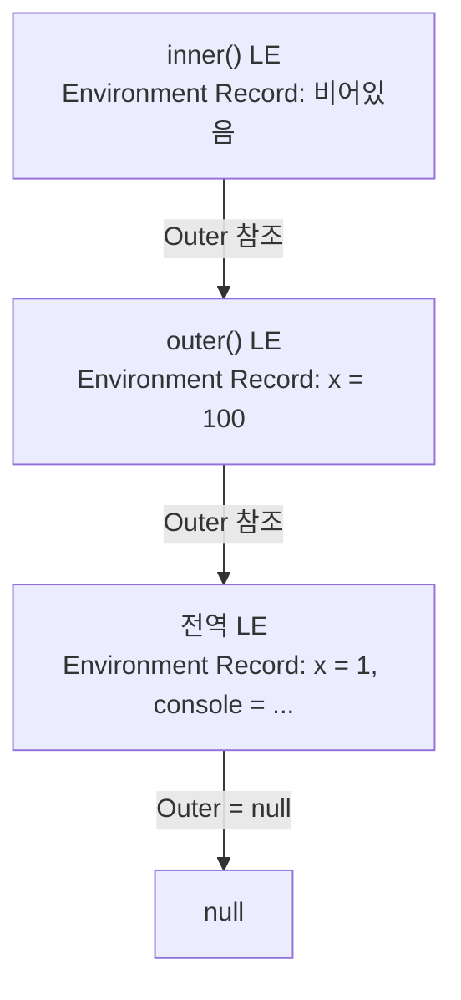
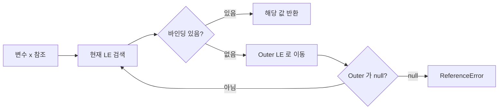

## 정의

**Lexical Environment (어휘적 환경)** 는 ECMAScript 명세 ([§9.1](https://tc39.es/ecma262/#sec-environment-records)) 가 정의한 내부 객체. 함수가 호출될 때마다 새로 만들어지며, **이 호출의 변수들이 어디 살고, 바깥 스코프가 어디인지** 를 기록한다.

자세한 메커니즘과 시각화는 [[함수는 끝났는데 변수가 살아있다, Lexical Environment와 클로저의 메커니즘]] 글 참고.

## 사용 상황

LE 를 직접 다루는 경우는 없지만, 다음 상황에서 LE 개념을 이해해야 한다.

- [[클로저]] 가 어떻게 외부 변수를 기억하는지
- `for + var` vs `for + let` 의 클로저 동작 차이
- 모듈 스코프에서의 변수 격리
- 메모리 누수: 클로저가 거대한 객체를 의도치 않게 잡아두는 경우

## 핵심 구조

LE 는 단 **두 개의 필드** 를 가진다.

| 필드 | 역할 |
|:---|:---|
| **Environment Record** | 이 스코프에서 선언된 식별자 (`let`, `const`, `var`, 함수 선언) 의 실제 binding 저장소 |
| **외부 Environment 참조** (Outer) | 자기를 감싸는 바깥 LE 에 대한 참조. 없으면 `null` |

이 단순한 구조가 **스코프 체인** 그 자체다. LE 들이 outer 포인터로 연결되어 사슬을 이루고, 변수 조회는 안쪽 LE 부터 시작해 outer 를 따라 바깥으로 진행한다.

## LE 체인 시각화



변수 `x` 를 `inner()` 에서 조회하면: `inner LE` 에 없음 → `outer LE` 에 없음 → `전역 LE` 에서 `x = 1` 발견.

## 변수 조회 알고리즘



가장 가까운 binding 이 이긴다 (**lexical shadowing**). 못 찾으면 ReferenceError.

```text
function ResolveBinding(name, lexEnv):
  while lexEnv != null:
    record = lexEnv.EnvironmentRecord
    if record has binding for name:
      return record.GetBindingValue(name)
    lexEnv = lexEnv.OuterEnv
  throw ReferenceError
```

## Environment Record 의 5 가지 종류

ECMAScript 는 Environment Record 를 다섯 가지로 분류한다.

| 종류 | 어디에 산다? |
|:---|:---|
| **Declarative** | 일반 함수 스코프, 블록 스코프. `let` / `const` / 함수 선언이 여기 |
| **Function** | Declarative 의 특수화. `this`, `super`, `new.target` 추가 |
| **Object** | `with` 문 같은 곳에서 객체를 스코프로 쓸 때 |
| **Global** | 가장 바깥. `globalThis`, `console`, `Math` 등 |
| **Module** | 모듈 최상위. `import` 바인딩이 여기 |

## Lexical 인 이유

"Lexical" 은 **정의 시점의 위치** 를 뜻한다. 호출 시점이 아니다.

```javascript
let x = 1;

function outer() {
  let x = 100;
  return inner; // inner 의 외부 LE 는 정의 위치인 outer
}

function inner() {
  return x; // 어느 x?
}

const fn = outer();
fn(); // 1, 100 이 아니다!
```

`inner` 는 `outer` 안에서 호출되는 게 아니라 *전역에서 정의* 되었기 때문에 외부 LE 가 전역 LE 다. 그래서 `x = 1` 을 본다.

만약 JavaScript 가 **dynamic scope** 였다면 `fn()` 의 결과가 호출 시점의 LE (`outer` 의 LE) 를 따라 `100` 이 되었을 것이다.

## 함수 객체의 `[[Environment]]` 슬롯

LE 와 함수 객체의 관계는 이렇다.

> 함수 객체는 내부 슬롯 `[[Environment]]` 를 가진다. 이 슬롯은 **그 함수가 정의된 시점의 LE** 를 가리킨다.

함수가 어디서 어떻게 호출되든, **호출 시 만들어지는 새 LE 의 outer 참조** 는 항상 이 박제된 `[[Environment]]` 슬롯이 된다.

이게 [[클로저]] 의 진짜 정체다. 함수가 끝나도 변수가 살아있는 이유:

1. 변수는 콜 스택이 아니라 **힙에 있는 LE 객체** 에 산다
2. 함수 객체의 `[[Environment]]` 가 그 LE 를 참조한다
3. 함수 객체가 살아있는 한 LE 도 살아있다 (GC 가 회수 못함)

## let 과 var 의 LE 차이

`for + var + 클로저` 의 악명 높은 함정이 LE 메커니즘으로 정확히 설명된다.

```javascript
const fns = [];
for (var i = 0; i < 3; i++) {
  fns.push(() => console.log(i));
}
fns[0](); fns[1](); fns[2](); // 3, 3, 3
```

`var i` 는 함수 스코프 → **LE 가 루프 전체에 단 하나**. 세 콜백 모두 같은 LE 를 outer 로 가진다.

```javascript
for (let i = 0; i < 3; i++) {
  fns.push(() => console.log(i));
}
fns[0](); fns[1](); fns[2](); // 0, 1, 2
```

스펙 ([ECMA-262 §14.7.4.3](https://tc39.es/ecma262/#sec-for-statement-runtime-semantics-labelledevaluation)) 상 `for + let` 은 **매 iteration 마다 별도 LE** 를 만든다. 그래서 세 콜백의 outer 가 셋 다 다른 LE 다.

## 호출마다 새 LE

```javascript
function makeCounter() {
  let count = 0;
  return () => ++count;
}

const a = makeCounter();
const b = makeCounter();
a(); // 1
a(); // 2
b(); // 1, b 의 count 는 별개
```

`makeCounter()` 를 두 번 호출하면 **두 개의 독립된 LE** 가 힙에 만들어진다. 반환된 두 함수의 `[[Environment]]` 는 서로 다른 LE 를 가리키므로 count 도 독립적이다.

## 블록 스코프 LE

`let` / `const` 는 `{}` 블록마다 새 Declarative Environment Record 를 만든다.

```javascript
{
  let a = 1;
  {
    let a = 2;  // 내부 블록의 별도 LE
    console.log(a); // 2
  }
  console.log(a);   // 1
}
```

이 블록 LE 도 outer 포인터를 가지고 체인을 이룬다.

## 모듈 LE

ES module 의 최상위 선언은 Module Environment Record 에 저장된다.

```javascript
// module-a.mjs
export let shared = 1;  // Module LE 에 binding

// module-b.mjs
import { shared } from './module-a.mjs';
// import binding 은 live binding: module-a 의 LE 를 직접 참조
```

모듈 최상위 `var` 도 전역이 아닌 Module LE 에 간다. 모듈은 자동으로 strict mode.

## 클로저 메모리 주의

```javascript
function createClosure() {
  const bigArray = new Array(1_000_000).fill(0);

  return function inner() {
    return bigArray.length; // bigArray 를 참조
  };
}

const fn = createClosure();
// fn 이 살아있는 한 bigArray 도 GC 불가
```

> [!WARNING]
> 클로저가 거대한 객체를 참조하면 메모리 누수가 발생한다. 더 이상 필요 없는 클로저는 참조를 해제하거나, 필요한 데이터만 추출해서 클로저에 전달.

## 함정

- **동적 스코프 착각**: LE 는 **정의 위치** 기준. 호출 위치가 어디든 `[[Environment]]` 슬롯이 결정한다.
- **`var` + 루프**: 루프 내 `var` 는 LE 하나 공유 → 클로저 버그. `let` 으로 해결.
- **클로저 메모리 누수**: 필요 없는 클로저를 오래 유지하면 LE 체인이 살아남아 GC 불가.
- **호이스팅과 TDZ**: `let` / `const` 도 호이스팅 되지만 Declarative ER 에 "uninitialized" 상태. TDZ 에서 접근 시 ReferenceError.

## 실전 활용: 팩토리와 모듈 패턴

LE 를 의식해서 설계하면 Private State 가 가능해진다.

```javascript
// 팩토리 패턴: 각 호출마다 독립 LE
function createStore(initial) {
  let state = initial;           // LE 에 저장

  return {
    getState: () => state,
    setState: (val) => { state = val; },
  };
}

const storeA = createStore(0);
const storeB = createStore(100);
storeA.setState(42);
console.log(storeA.getState()); // 42
console.log(storeB.getState()); // 100 (독립)
```

```javascript
// IIFE 모듈 패턴 (ES module 이전 방식)
const counter = (() => {
  let count = 0;                 // 외부 접근 불가

  return {
    inc: () => ++count,
    dec: () => --count,
    get: () => count,
  };
})();

counter.inc(); counter.inc();
console.log(counter.get()); // 2
console.log(counter.count); // undefined (외부 접근 불가)
```

## 관련 위키

- [[클로저]]
- [[일급 함수]]
- [[JS var / let / const]]
- [[JS 호이스팅]]
- [[JS 스코프 체인]]
- [[함수는 끝났는데 변수가 살아있다, Lexical Environment와 클로저의 메커니즘]]
