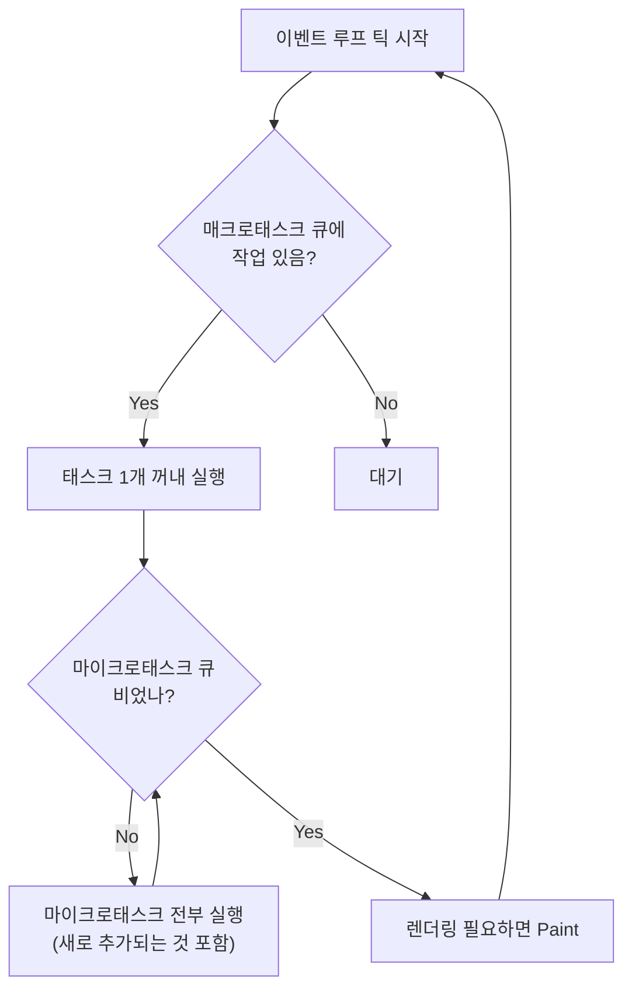

## 정의

**Microtask Queue (마이크로태스크 큐)** 는 [[js-event-loop|이벤트 루프]] 가 매 틱마다 **완전히 비울 때까지** 처리하는 우선순위 큐다. 매크로태스크 큐보다 항상 먼저 처리된다.

ECMAScript 명세는 이를 "PromiseJobs" 라는 Job 큐로 정의한다 ([§9.5](https://tc39.es/ecma262/#sec-jobs)). WHATWG HTML 명세는 별도의 "microtask queue" 로 통합해 관리한다 ([§8.1.4](https://html.spec.whatwg.org/multipage/webappapis.html#microtask-queue)).

## 언제 쓰나

| 목적 | 도구 |
|:---|:---|
| Promise `.then` / `.catch` / `.finally` | 자동으로 마이크로태스크 |
| `await` 이후 코드 재개 | 자동으로 마이크로태스크 |
| 현재 동기 코드 직후, 다음 매크로 전에 실행 | `queueMicrotask(fn)` |
| 렌더링 전에 DOM 상태 일괄 갱신 | `queueMicrotask` |
| 렌더링 이후 실행 필요 | `requestAnimationFrame` 또는 `setTimeout` |

## 이벤트 루프 틱 안에서의 순서



핵심: 매크로태스크 1개 실행 후, 마이크로태스크 큐가 **완전히 빌 때까지** 계속 실행한 뒤 렌더링으로 넘어간다.

## 핵심 특성

| 측면 | 동작 |
|:---|:---|
| **처리량** | 한 틱에 큐가 빌 때까지 **전부** |
| **우선순위** | 매크로태스크보다 **항상** 먼저 |
| **추가 허용** | 마이크로태스크 처리 중 등록된 것도 **같은 틱** 에 처리 |
| **렌더링 블로킹** | 마이크로태스크 비우는 동안 화면 업데이트 없음 |

## 들어가는 콜백

| 출처 | 예시 |
|:---|:---|
| Promise | `.then`, `.catch`, `.finally` 콜백 |
| async/await | `await` 이후 함수 재개 |
| 직접 등록 | `queueMicrotask(fn)` |
| DOM 변경 관찰 | `MutationObserver` 콜백 |
| Node.js | `queueMicrotask`, `process.nextTick` (더 높은 우선순위) |

## 매크로태스크와의 실행 순서

```javascript
console.log('start');

setTimeout(() => console.log('macro'), 0);           // 매크로태스크
Promise.resolve().then(() => console.log('micro'));   // 마이크로태스크
queueMicrotask(() => console.log('microtask'));       // 마이크로태스크

console.log('end');

// 출력: start, end, micro, microtask, macro
```

실행 순서:
1. 동기 코드 (`start`, `end`) 즉시 실행
2. 마이크로태스크 큐 비우기 (`micro`, `microtask`)
3. 매크로태스크 큐에서 1개 (`macro`)

## queueMicrotask: 직접 등록

ES2020 에 표준화. Promise 객체 생성 없이 마이크로태스크를 직접 등록한다.

```javascript
queueMicrotask(() => {
    console.log('동기 코드가 끝난 직후, 렌더링 전에 실행');
});
```

`Promise.resolve().then(fn)` 과 실행 타이밍이 동일하지만:
- 의도가 명확 (스케줄링이 목적임을 코드에서 표현)
- Promise 인스턴스 생성 비용 없음
- 에러가 `unhandledRejection` 으로 튀지 않음 (`Promise.then` 와 다름)

### 언제 쓰나

```javascript
// 라이브러리 내부: "이 작업 끝나면 옵저버에게 알리고 싶은데,
// 동기로 바로 호출하면 호출자 콜 스택을 오염시킴"
function notifyObservers(data) {
    queueMicrotask(() => {
        for (const observer of observers) {
            observer.update(data);
        }
    });
}
```

## await 도 마이크로태스크

`await` 는 함수를 일시정지하고, 재개(resume) 를 마이크로태스크 큐에 등록한다.

```javascript
async function f() {
    console.log('1: async 함수 시작');
    await Promise.resolve();
    console.log('3: await 이후 (마이크로태스크로 재개)');
}

console.log('start');
f();
console.log('2: f() 호출 직후 (동기)');

// 출력: start, 1: async 함수 시작, 2: f() 호출 직후 (동기), 3: await 이후 (마이크로태스크로 재개)
```

`await Promise.resolve()` 가 이미 정착된 Promise 를 기다려도, 재개는 반드시 **다음 마이크로태스크** 에 일어난다.

## 복수 await 의 마이크로태스크 소비

```javascript
async function slow() {
    await null;   // 마이크로태스크 1개 소비
    await null;   // 마이크로태스크 1개 소비
    return 'done';
}

// async function 을 여러 개 await 할 때 순서
async function main() {
    const p1 = slow();
    const p2 = slow();

    // p1 과 p2 는 교대로 마이크로태스크 큐에 재개를 등록
    const [r1, r2] = await Promise.all([p1, p2]);
}
```

## 실전 예시

### DOM 배치 갱신 (배치 업데이트 패턴)

```javascript
let pending = false;
const updates = [];

function scheduleUpdate(data) {
    updates.push(data);
    if (!pending) {
        pending = true;
        queueMicrotask(flushUpdates);   // 다음 마이크로태스크에 일괄 처리
    }
}

function flushUpdates() {
    pending = false;
    const batch = updates.splice(0);
    // batch 를 한 번에 DOM 에 반영
    render(batch);
}

// 동기 코드에서 여러 번 호출해도 렌더링은 1번
scheduleUpdate({ id: 1 });
scheduleUpdate({ id: 2 });
scheduleUpdate({ id: 3 });
// flushUpdates 는 세 호출 후 단 1번 실행
```

### 반응성 시스템의 effect 큐잉

React, Vue, Solid 같은 프레임워크 내부에서 state 변경을 마이크로태스크로 배치 처리하는 패턴.

```javascript
const effectQueue = new Set();
let isFlushing = false;

function scheduleEffect(fn) {
    effectQueue.add(fn);
    if (!isFlushing) {
        isFlushing = true;
        queueMicrotask(() => {
            effectQueue.forEach(effect => effect());
            effectQueue.clear();
            isFlushing = false;
        });
    }
}
```

### 옵저버 패턴에서 동기 안전성 보장

```javascript
class EventEmitter {
    emit(event, data) {
        const handlers = this.listeners.get(event) ?? [];
        // 동기로 호출하면 emit 호출자의 상태가 아직 업데이트 안 됐을 수 있음
        queueMicrotask(() => {
            handlers.forEach(h => h(data));
        });
    }
}
```

## 함정

### 마이크로태스크 무한 등록 (페이지 freeze)

```javascript
function loop() {
    Promise.resolve().then(loop);
}
loop();
// setTimeout 콜백, 렌더링, 사용자 이벤트 모두 영원히 실행 불가
```

마이크로태스크 큐는 "비어있을 때까지" 처리한다. 처리 중 새로 등록한 마이크로태스크도 **같은 틱 안에** 처리되므로, 무한 등록하면 큐가 영원히 비지 않는다.

> [!CAUTION]
> `Promise.resolve().then(loop)` 무한 재귀는 `setTimeout(loop, 0)` 과 달리 렌더링과 I/O 를 완전히 차단한다. 잘게 쪼개야 하는 작업은 **매크로태스크** (`setTimeout`) 로, 즉시 양보해야 하는 작업은 **마이크로태스크** 로 구분하자.

### catch 하지 않은 마이크로태스크 에러

```javascript
queueMicrotask(() => {
    throw new Error('microtask 에러');
});
// 브라우저에서는 window.onerror / unhandledrejection 으로 전파
// Promise 와 달리 try/catch 로 감쌀 수 없음

// ✅ 내부에서 처리
queueMicrotask(() => {
    try {
        riskyOp();
    } catch (err) {
        handleError(err);
    }
});
```

### Promise.then vs queueMicrotask 에러 버블링

```javascript
// ❌ Promise.then 에서 던진 에러: unhandledRejection 이벤트
Promise.resolve().then(() => { throw new Error('oops'); });

// ✅ queueMicrotask 에서 던진 에러: 일반 uncaught 에러 (window.onerror)
queueMicrotask(() => { throw new Error('oops'); });
```

## Node.js: process.nextTick 의 위치

Node.js 는 마이크로태스크보다 **더 높은 우선순위** 의 `process.nextTick` 큐를 따로 관리한다.

```javascript
setImmediate(() => console.log('setImmediate'));       // 매크로태스크
setTimeout(() => console.log('setTimeout'), 0);        // 매크로태스크
Promise.resolve().then(() => console.log('promise')); // 마이크로태스크
process.nextTick(() => console.log('nextTick'));       // nextTick (최우선)

// 출력: nextTick, promise, setTimeout 또는 setImmediate (순서 다를 수 있음)
```

> [!CAUTION]
> `process.nextTick` 도 재귀 등록 시 I/O 와 타이머를 영원히 차단한다. 외부에 노출되는 라이브러리 API 는 `queueMicrotask` 또는 `setImmediate` 가 더 안전하다.

## 관련 위키

- [[js-event-loop]] - 이벤트 루프 전체 구조
- [[js-promise]] - Promise 와 마이크로태스크 연결
- [[js-async-await]] - await 의 마이크로태스크 동작
- [[js-settimeout]] - 매크로태스크 setTimeout
- [[js-request-animation-frame]] - requestAnimationFrame, 렌더링 타이밍
