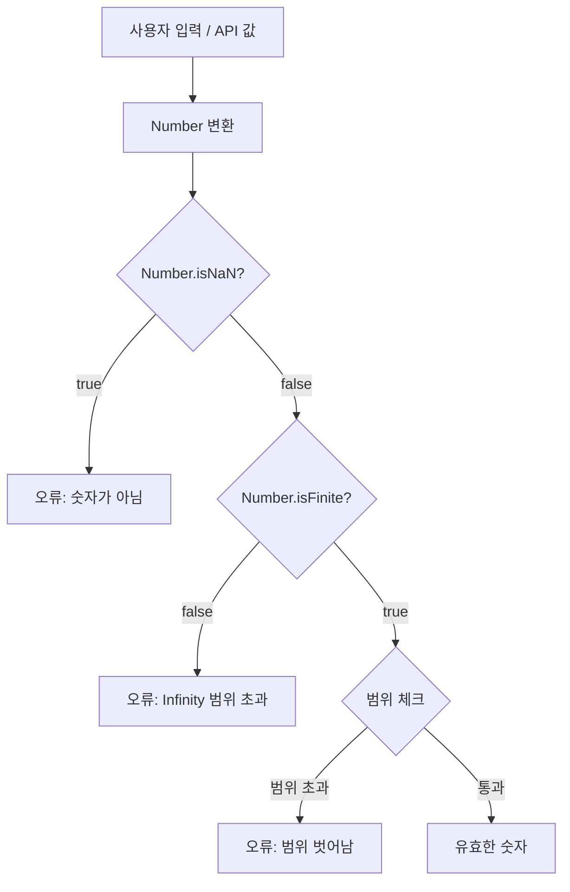

## 정의

- **`NaN`** (Not a Number) : 의미 없는 수치 연산의 결과
- **`Infinity`**, **`-Infinity`** : 너무 큰/작은 수, 0 으로 나누기

IEEE 754 표준에 따른 특수 값. `Number` 타입이지만 특이한 동작.

```javascript
typeof NaN          // 'number'
typeof Infinity     // 'number'
```

## NaN 의 발생

```javascript
0 / 0                    // NaN
Infinity - Infinity      // NaN
Math.sqrt(-1)            // NaN
Number('hello')          // NaN
parseInt('xyz')          // NaN
undefined + 1            // NaN
0 * Infinity             // NaN
```

수치로 해석 불가능한 모든 연산.

## NaN 의 비교 함정

```javascript
NaN === NaN         // false ⚠️
NaN == NaN          // false
NaN === Number.NaN  // false

[NaN].indexOf(NaN)   // -1 (찾지 못함)
[NaN].includes(NaN)  // true (특별 처리)
```

`NaN` 은 **자기 자신과도 다르다**. IEEE 754 의 정의.

## NaN 검사

```javascript
Number.isNaN(NaN)        // true ✓ (권장)
Number.isNaN('NaN')      // false (문자열은 NaN 아님)
Number.isNaN(undefined)  // false

isNaN(NaN)               // true
isNaN('hello')           // true (전역 isNaN 은 강제 변환)
isNaN('5')               // false
```

`Number.isNaN()` 권장 (엄격, 변환 없음).

### Object.is

```javascript
Object.is(NaN, NaN)     // true (특별 처리)
Object.is(0, -0)        // false (구분)
```

## Infinity

```javascript
1 / 0                    // Infinity
-1 / 0                   // -Infinity
Infinity + 1             // Infinity
Infinity - Infinity      // NaN
1e308 * 10               // Infinity (overflow)
-1e308 * 10              // -Infinity

Number.MAX_VALUE         // 1.7976931348623157e+308
Number.MAX_VALUE * 2     // Infinity
Number.MIN_VALUE         // 5e-324
Number.MIN_VALUE / 2     // 0 (underflow)
```

### Infinity 검사

```javascript
Number.isFinite(Infinity)  // false
Number.isFinite(NaN)       // false
Number.isFinite(42)        // true
isFinite('42')             // true (강제 변환)
Number.isFinite('42')      // false (엄격)
```

## 산술 함정

```javascript
NaN + 1                  // NaN
NaN * 0                  // NaN
NaN === undefined        // false
NaN == undefined         // false

Infinity + 1             // Infinity
Infinity * 0             // NaN (수학적 정의 안 됨)
Infinity / Infinity      // NaN
```

`NaN` 이 한 번 연산에 들어가면 **계속 전파** (propagates).

## 사용 예

### 사용자 입력 검증

```javascript
function parseAmount(input) {
    const n = Number(input);
    if (Number.isNaN(n) || !Number.isFinite(n)) {
        throw new Error('Invalid amount');
    }
    return n;
}
```

### 누락 데이터 표현

```javascript
// 통계 계산에서 누락
const data = [1, 2, NaN, 4];
const sum = data.reduce((a, b) => a + b, 0);    // NaN (전파)
const sum2 = data.filter(x => !Number.isNaN(x))
                  .reduce((a, b) => a + b, 0);  // 7 (NaN 제외)
```

## 0 의 양수/음수

```javascript
0 === -0          // true
Object.is(0, -0)  // false (구분)

1 / 0             // Infinity
1 / -0            // -Infinity
0 === -0          // true (수학적으로 같음)
```

## 함정

### 1. == NaN 으로는 검사 불가

```javascript
x == NaN     // 항상 false
x === NaN    // 항상 false
Number.isNaN(x)   // ✓
```

### 2. JSON 의 처리

```javascript
JSON.stringify(NaN)             // 'null'
JSON.stringify(Infinity)        // 'null'
JSON.stringify(-Infinity)       // 'null'
JSON.stringify({ a: NaN })      // '{"a":null}'
```

JSON 표준은 NaN/Infinity 미지원 → null 로 변환.

### 3. typeof

```javascript
typeof NaN        // 'number' (놀라움)
typeof Infinity   // 'number'
```

이름과 달리 둘 다 `number` 타입.

## IEEE 754 배경

JavaScript 는 *모든 숫자를 64-bit IEEE 754 부동소수점* 으로 표현 (double precision).

```
비트 레이아웃:
[63] S  [62-52] exponent (11 bit)  [51-0] fraction (52 bit)
```

| 비트 패턴 | 값 |
|---|---|
| exponent 전부 1, fraction=0 | `Infinity` (sign 비트에 따라 부호) |
| exponent 전부 1, fraction!=0 | `NaN` |
| exponent 전부 0, fraction=0 | `0` 또는 `-0` |

*NaN 은 bit pattern 이 여러 개* (quiet NaN, signaling NaN). JS 는 모두 단일 `NaN` 으로 처리.

## BigInt 와 비교

```javascript
typeof BigInt(42)   // 'bigint'

// BigInt 는 IEEE 754 와 무관 (정수만, 크기 제한 없음)
BigInt(Infinity)    // RangeError
BigInt(NaN)         // RangeError

// 정수 정밀도 문제
Number.MAX_SAFE_INTEGER          // 9007199254740991 (2^53 - 1)
Number.MAX_SAFE_INTEGER + 1      // 9007199254740992 (정확)
Number.MAX_SAFE_INTEGER + 2      // 9007199254740992 (틀림!, 같은 값)

BigInt(Number.MAX_SAFE_INTEGER) + 1n   // 9007199254740992n (정확)
BigInt(Number.MAX_SAFE_INTEGER) + 2n   // 9007199254740993n (정확)
```

> [!TIP]
> 금액 / 정수 정밀도가 중요한 계산은 *BigInt* 또는 *Decimal.js* 사용. `NaN` / `Infinity` 이슈 자체가 사라짐.

## 실용적인 숫자 검증 패턴



```javascript
function validateNumber(input, { min = -Infinity, max = Infinity } = {}) {
    const n = Number(input);
    if (Number.isNaN(n))    throw new TypeError(`Not a number: ${input}`);
    if (!Number.isFinite(n)) throw new RangeError(`Not finite: ${input}`);
    if (n < min || n > max) throw new RangeError(`Out of range [${min}, ${max}]: ${n}`);
    return n;
}

validateNumber('42')                  // 42
validateNumber('hello')               // TypeError
validateNumber(Infinity)              // RangeError
validateNumber(50, { max: 100 })      // 50
validateNumber(150, { max: 100 })     // RangeError
```

## 실전 패턴

### parseFloat / parseInt 안전 래퍼

```javascript
function safeParseInt(str, radix = 10) {
    const n = parseInt(str, radix);
    return Number.isNaN(n) ? null : n;
}

function safeParseFloat(str) {
    const n = parseFloat(str);
    return Number.isNaN(n) ? null : n;
}

safeParseInt('42px')     // 42 (parseInt 는 앞부분까지 파싱)
safeParseInt('px42')     // null
safeParseFloat('3.14')   // 3.14
safeParseFloat('abc')    // null
```

### 통계 / 집계에서 NaN 방어

```javascript
const values = [1, NaN, 3, NaN, 5];

// filter 로 먼저 제거
const clean = values.filter(Number.isFinite);    // [1, 3, 5]
const avg = clean.reduce((a, b) => a + b, 0) / clean.length;   // 3

// reduce 가드
const sum = values.reduce((acc, n) =>
    Number.isFinite(n) ? acc + n : acc, 0);     // 9
```

### Date 연산 결과 검증

```javascript
const d = new Date('invalid-date');
Number.isNaN(d.getTime())   // true: invalid date

function parseDate(str) {
    const d = new Date(str);
    if (Number.isNaN(d.getTime())) return null;
    return d;
}

parseDate('2026-06-01')   // Date 객체
parseDate('not-a-date')   // null
```

## 참고

- [[js-number]]
- [[js-type-coercion]]
- [[js-boolean-null-undefined]]
- [[js-bigint]]
- [[js-json]]
