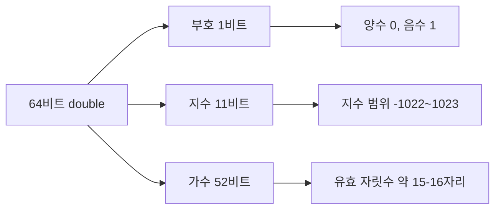
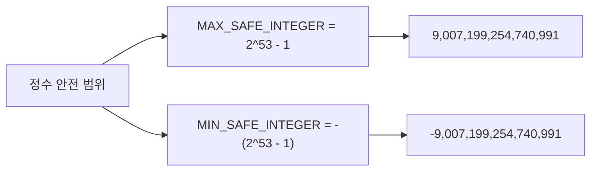

## 정의

JavaScript 의 `number` 는 **IEEE 754 double-precision float** (64-bit). 정수와 실수를 같은 타입으로 표현. 정수 안전 범위는 `±2^53 - 1`.

```javascript
typeof 42         // 'number'
typeof 3.14       // 'number'
typeof NaN        // 'number'
typeof Infinity   // 'number'
```

## IEEE 754 구조

64비트를 세 구역으로 나눠 부동소수점을 표현합니다.



값은 `(-1)^부호 × 2^지수 × (1 + 가수)` 로 계산됩니다. 가수가 52비트이므로 정수는 `2^53` 까지만 정확히 표현 가능합니다.



## 정수 안전 범위

```javascript
Number.MAX_SAFE_INTEGER       // 9007199254740991 (2^53 - 1)
Number.MIN_SAFE_INTEGER       // -9007199254740991
Number.MAX_VALUE              // 1.7976931348623157e+308
Number.MIN_VALUE              // 5e-324

// 안전 범위 초과
9007199254740992 + 1          // 9007199254740992 (정확도 손실!)
```

큰 정수는 `BigInt` 사용.

## 부동소수점 함정

```javascript
0.1 + 0.2 === 0.3            // ❌ false
0.1 + 0.2                     // 0.30000000000000004
```

이진 표현으로 0.1, 0.2 가 정확히 표현 안 됨. 통화 등은 정수 단위 (cent) 로 다룰 것.

```javascript
Math.abs((0.1 + 0.2) - 0.3) < Number.EPSILON    // 비교 idiom
```

`Number.EPSILON` 은 `2^-52 ≈ 2.22e-16`. 두 수의 차이가 이 값보다 작으면 "같다"고 판단합니다.

### 왜 0.1 + 0.2 가 0.3 이 아닌가

`0.1` 의 이진 표현은 `0.0001100110011...` 의 무한 반복. 52비트에서 잘려 반올림됩니다. 이 오차가 연산 중에 누적됩니다.

```javascript
// 통화 연산: 정수 단위로
const price = 0.1 * 100;      // cent 단위
const tax   = 0.2 * 100;
const total = (price + tax) / 100;   // 0.3 (정확)
```

## 특수 값

| 값 | 의미 |
|:---|:---|
| `Infinity` | `1/0`, 너무 큰 수 |
| `-Infinity` | `-1/0` |
| `NaN` | 0/0, 의미 없는 수치 연산 |
| `Number.EPSILON` | 2^-52 ≈ 2.22e-16 |

## NaN

```javascript
NaN === NaN              // ❌ false
Number.isNaN(NaN)        // ✓ true
isNaN('hello')           // true (강제 변환 후)
Number.isNaN('hello')    // false (엄격)
```

`Number.isNaN` 권장 (변환 없이 검사).

```javascript
// NaN 전파: 연산 결과로 퍼짐
NaN + 1     // NaN
NaN * 0     // NaN
Math.sqrt(-1)  // NaN

// 체크 패턴
function isValidNumber(n) {
    return typeof n === 'number' && !Number.isNaN(n) && isFinite(n);
}
```

## BigInt

`Number.MAX_SAFE_INTEGER` 를 초과하는 정수에는 `BigInt` 를 사용합니다.

```javascript
const big = 9007199254740991n;   // 리터럴: 숫자 뒤에 n
const big2 = BigInt('12345678901234567890');

big + 1n       // 9007199254740992n (정확!)
big * 2n       // 18014398509481982n

// BigInt 와 Number 는 섞을 수 없음
big + 1        // ❌ TypeError
Number(big)    // 변환 (정밀도 손실 가능)
```

자세히: [[JS BigInt]]

## 형변환

```javascript
Number('42')              // 42
Number('42.5')            // 42.5
Number('')                // 0
Number(' ')               // 0
Number('hello')           // NaN
Number(null)              // 0
Number(undefined)         // NaN
Number(true)              // 1
Number(false)             // 0
Number([])                // 0
Number([1])               // 1
Number([1, 2])            // NaN

parseInt('42px')          // 42 (관대)
parseFloat('3.14em')      // 3.14
parseInt('hello')         // NaN
parseInt('10', 2)         // 2 (binary)
```

## 정수 검사

```javascript
Number.isInteger(42)         // true
Number.isInteger(42.0)       // true (값이 정수면)
Number.isInteger(42.5)       // false
Number.isInteger('42')       // false (string)
Number.isSafeInteger(2**53)  // false (안전 범위 초과)
```

## 진법 변환

```javascript
(255).toString(16)       // 'ff'
(255).toString(2)         // '11111111'
parseInt('ff', 16)        // 255
parseInt('11111111', 2)   // 255

0xff                      // 255 (16진 리터럴)
0b11111111                // 255 (2진)
0o777                     // 511 (8진, ES6)
```

## 포맷팅

```javascript
(1234567.89).toLocaleString()                      // '1,234,567.89'
(1234567.89).toLocaleString('de-DE')               // '1.234.567,89'
(1234567.89).toLocaleString('ko-KR', { style: 'currency', currency: 'KRW' })
// '₩1,234,568'

(0.1234).toFixed(2)        // '0.12' (string)
(0.1234).toPrecision(3)    // '0.123'
```

## Math

```javascript
Math.PI                  // 3.141592...
Math.E                   // 2.718...
Math.abs(-5)             // 5
Math.round(0.5)          // 1
Math.floor(0.9)          // 0
Math.ceil(0.1)           // 1
Math.trunc(-1.9)         // -1 (정수부만)
Math.sign(-3)            // -1
Math.max(1, 2, 3)        // 3
Math.min(...arr)         // spread 활용
Math.random()            // 0 <= x < 1
Math.pow(2, 10)          // 1024 (또는 2**10)
Math.sqrt(16)            // 4
Math.log(Math.E)         // 1
Math.log2(8)             // 3
Math.log10(1000)         // 3
```

## 실전 패턴

### 범위 내 랜덤 정수

```javascript
function randInt(min, max) {
    return Math.floor(Math.random() * (max - min + 1)) + min;
}
```

### 안전한 파싱

```javascript
function parseNumber(str, fallback = 0) {
    const n = Number(str);
    return isFinite(n) ? n : fallback;
}

parseNumber('3.14')     // 3.14
parseNumber('hello')    // 0 (fallback)
parseNumber('')         // 0 (fallback 아님, Number('') === 0)
```

### 반올림 정확도 확보

```javascript
// toFixed 는 string 반환, 부동소수점 오차 있음
(1.005).toFixed(2)   // '1.00' (예상: '1.01')

// 더 정확한 반올림
function round(n, digits) {
    const factor = 10 ** digits;
    return Math.round(n * factor) / factor;
}
```

## 함정

> [!WARNING]
> 다음 함정들은 실제 운영 환경에서 자주 발생합니다.

### 1. 0 의 양수/음수

```javascript
0 === -0              // true
1 / 0                  // Infinity
1 / -0                 // -Infinity
Object.is(0, -0)       // false (구분)
```

### 2. parseInt 의 radix

```javascript
parseInt('010')         // 10 (modern), 8 (legacy)
parseInt('010', 10)     // 10 (명시 권장)
```

### 3. 큰 정수의 손실

```javascript
const id = 12345678901234567;
console.log(id);    // 12345678901234568 (마지막 자리 변형)
// 큰 ID 는 string 또는 BigInt 로
```

### 4. 암묵적 형변환

```javascript
'5' - 3   // 2 (문자열이 숫자로 변환)
'5' + 3   // '53' (숫자가 문자열로 변환)
true + 1  // 2
```

타입 명시 변환 (`Number(...)`, `parseInt(...)`) 을 권장합니다.

### 5. toFixed 는 문자열 반환

```javascript
typeof (1.23).toFixed(2)   // 'string', '1.23'
// 연산에 쓰려면 Number 변환 필요
Number((1.23).toFixed(2))  // 1.23
```

## 관련 위키

- [[JS BigInt]]
- [[JS 타입 변환]]
- [[JS NaN / Infinity]]
- [[JS Date]]
