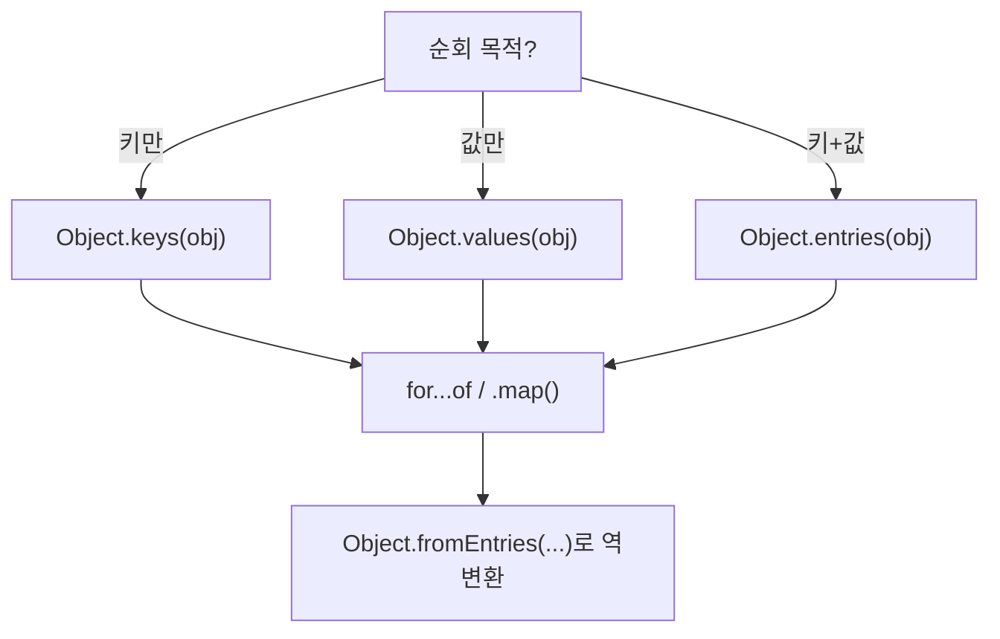

## 정의

JavaScript 의 **`object`** 는 key-value 쌍의 컬렉션. 거의 모든 non-primitive 값이 객체. 함수, 배열, 정규식도 객체.

```javascript
const obj = { a: 1, b: 'hi', c: true };
typeof obj            // 'object'
```

## 생성

```javascript
// literal (가장 흔함)
const a = { x: 1, y: 2 };

// constructor
const b = new Object();
const c = Object.create(null);     // prototype 없는 깨끗한 객체
const d = Object.create({ inherited: 1 });    // 상속

// computed key
const key = 'foo';
const e = { [key]: 1 };            // { foo: 1 }

// shorthand
const x = 1, y = 2;
const f = { x, y };                // { x: 1, y: 2 }

// method shorthand
const g = {
    greet() { return 'hi'; }       // = greet: function() {...}
};
```

## 접근

```javascript
obj.a               // dot notation
obj['a']            // bracket
obj[variable]       // 동적 키

// nested
deep.a.b.c
deep?.a?.b?.c       // optional chaining

// destructuring
const { a, b } = obj;
const { a: alias } = obj;          // rename
const { a = 1 } = obj;             // default
const { a, ...rest } = obj;        // rest
```

## 수정 / 삭제

```javascript
obj.new = 1;
obj['key'] = 2;
delete obj.a;

// spread
const merged = { ...obj, x: 100 };
const cloned = { ...obj };          // shallow copy
```

## Object 메서드

| 메서드 | 의미 |
|:---|:---|
| `Object.keys(obj)` | 키 배열 |
| `Object.values(obj)` | 값 배열 |
| `Object.entries(obj)` | [key, value] 쌍 배열 |
| `Object.fromEntries(entries)` | 역변환 |
| `Object.assign(target, ...src)` | 얕은 병합 (target 변경) |
| `Object.freeze(obj)` | 변경 불가 (얕음) |
| `Object.seal(obj)` | 추가/삭제 금지, 수정 OK |
| `Object.preventExtensions(obj)` | 추가만 금지 |
| `Object.isFrozen / isSealed / isExtensible` | 검사 |
| `Object.getPrototypeOf / setPrototypeOf` | 프로토타입 |
| `Object.getOwnPropertyNames` | 모든 own keys (Symbol 제외) |
| `Object.getOwnPropertySymbols` | Symbol 키만 |
| `Object.getOwnPropertyDescriptor(s)` | descriptor |
| `Object.defineProperty / defineProperties` | descriptor 설정 |
| `Object.create(proto, descriptors)` | 생성 |

```javascript
Object.keys({ a: 1, b: 2 })       // ['a', 'b']
Object.entries({ a: 1, b: 2 })    // [['a', 1], ['b', 2]]
Object.fromEntries([['a', 1]])    // { a: 1 }
```

## property descriptor

각 property 는 4 가지 attribute.

```javascript
{
    value: 1,
    writable: true,
    enumerable: true,
    configurable: true,
}

// 또는 accessor
{
    get() { return ... },
    set(v) { ... },
    enumerable: true,
    configurable: true,
}
```

`Object.defineProperty(obj, key, descriptor)` 로 명시.

```javascript
Object.defineProperty(obj, 'x', {
    value: 1,
    writable: false,    // 변경 불가
    enumerable: false,  // for...in 에서 제외
    configurable: false // delete / 재정의 금지
});
```

## 키 순서

```javascript
const obj = { 2: 'a', 1: 'b', name: 'c', [Symbol()]: 'd' };
Object.keys(obj);     // ['1', '2', 'name']
// 1. 정수처럼 보이는 키 (오름차순)
// 2. 그 외 string 키 (삽입 순서)
// 3. Symbol 키
```

## 동등성

```javascript
const a = { x: 1 };
const b = { x: 1 };
a === b               // false (참조 비교)

// 깊은 비교는 직접
JSON.stringify(a) === JSON.stringify(b)    // ⚠️ 순서, 타입 함정
// 또는 lodash _.isEqual
```

## 함정

### 1. 얕은 복사

```javascript
const a = { x: { y: 1 } };
const b = { ...a };
b.x.y = 99;
a.x.y      // 99 (참조 공유)

// 깊은 복사
const c = structuredClone(a);    // 모던
const d = JSON.parse(JSON.stringify(a));   // 옛 방식 (date, function 손실)
```

### 2. for...in 의 함정

```javascript
for (const key in obj) {
    // prototype chain 의 키도 포함
}

// 안전한 패턴
for (const key in obj) {
    if (Object.hasOwn(obj, key)) { ... }
}

// 또는
Object.keys(obj).forEach(key => ...)
```

### 3. typeof null

```javascript
typeof null      // 'object' (역사적 버그)
```

## Symbol 키

```javascript
const id = Symbol('id');
const user = {
    name: 'Alice',
    [id]: 123,         // Symbol key
};

user[id]                              // 123
Object.keys(user)                     // ['name'] - Symbol 제외
Object.getOwnPropertySymbols(user)    // [Symbol(id)]
```

Symbol 키는 `for...in`, `Object.keys()` 에 노출되지 않아 "숨김 속성" 처럼 동작. 자세히: [[JS Symbol]]

## Proxy 로 객체 제어

```javascript
const handler = {
    get(target, key) {
        return key in target ? target[key] : `${String(key)} 없음`;
    },
    set(target, key, value) {
        if (typeof value !== 'number') throw new TypeError('숫자만 허용');
        target[key] = value;
        return true;
    },
};

const proxy = new Proxy({}, handler);
proxy.x = 1;           // ✓
proxy.y;               // 'y 없음'
proxy.z = 'str';       // TypeError
```

자세히: [[JS Proxy]]

## JSON 직렬화 주의점

```javascript
const obj = {
    date: new Date(),
    fn: () => 'hi',
    sym: Symbol('x'),
    undef: undefined,
    nan: NaN,
    inf: Infinity,
};

JSON.stringify(obj);
// {"date":"2026-07-17T00:00:00.000Z","nan":null,"inf":null}
// fn, sym, undef: 키 제거됨
// NaN, Infinity: null 로 변환
```

| 타입 | JSON.stringify 결과 |
|:---|:---|
| `undefined` | 키 제거 |
| `function` | 키 제거 |
| `Symbol` | 키 제거 |
| `NaN` / `Infinity` | `null` |
| `Date` | ISO 8601 문자열 |
| `BigInt` | **TypeError** |

깊은 복사: `structuredClone(obj)` 은 Date, Map, Set, Error, TypedArray 를 올바르게 처리.

## 객체 순회 패턴



```javascript
// 값 변환 패턴
const doubled = Object.fromEntries(
    Object.entries(obj).map(([k, v]) => [k, v * 2])
);

// 필터 패턴
const positive = Object.fromEntries(
    Object.entries(obj).filter(([, v]) => v > 0)
);
```

## 참고

- [[JS Array]]
- [[JS Prototype Chain]]
- [[JS Destructuring]]
- [[JS Spread / Rest]]
