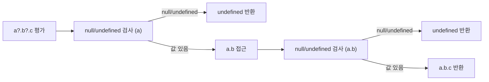

## 정의

ES2020 도입의 두 가지 단축 문법.

- **`?.`** (Optional Chaining) : 중간이 null/undefined 면 `undefined` 반환
- **`??`** (Nullish Coalescing) : 왼쪽이 null/undefined 면 오른쪽 사용

## Optional Chaining `?.`

```javascript
user?.address?.city
// user 가 null/undefined 면 즉시 undefined
// 그 외에는 평소처럼 평가

// 옛 방식
user && user.address && user.address.city
```

### 메서드 호출

```javascript
obj.method?.()         // method 가 없으면 undefined, 있으면 호출
arr?.[0]               // 배열 인덱스
fn?.(arg)              // 함수 호출
```

### 함수 호출 우회

```javascript
window.callback?.(data)    // callback 정의되어 있을 때만 호출
```

## Nullish Coalescing `??`

```javascript
const port = config.port ?? 3000;
// port 가 null 또는 undefined 면 3000, 그 외 그대로
```

`||` 과의 차이:

```javascript
0 || 'default'           // 'default'  (0 은 falsy)
0 ?? 'default'           // 0          (null/undefined 만 default)

'' || 'fallback'         // 'fallback'
'' ?? 'fallback'         // ''

null || 'x'              // 'x'
null ?? 'x'              // 'x'

undefined || 'x'         // 'x'
undefined ?? 'x'         // 'x'
```

`??` 가 더 명확. **0, '', false 가 유효한 값일 때** `??` 필수.

## Nullish Assignment `??=`

```javascript
obj.a ??= 'default';
// obj.a 가 null/undefined 면 'default' 할당
// 동등: obj.a = obj.a ?? 'default';
```

다른 단축:
- `||=` : falsy 면 할당
- `&&=` : truthy 면 할당

```javascript
config.timeout ||= 5000;     // 0, '', false 도 덮어씀
config.timeout ??= 5000;     // null/undefined 만 덮어씀
config.flag &&= 'enabled';   // truthy 면 'enabled' 로
```

## 자주 쓰는 패턴

### API 응답 안전 접근

```javascript
const username = response?.data?.user?.name ?? 'Guest';
```

### 옵션 객체 default

```javascript
function api({ timeout, retries } = {}) {
    timeout = timeout ?? 5000;
    retries = retries ?? 3;
}
```

### 콜백 안전 호출

```javascript
function process(items, { onSuccess, onError } = {}) {
    try {
        const result = doWork(items);
        onSuccess?.(result);
    } catch (e) {
        onError?.(e);
    }
}
```

### 배열 / Map 안전 lookup

```javascript
const first = arr?.[0];
const value = map.get?.(key);    // map 자체가 없을 수도
const found = users?.find?.(u => u.id === id);
```

### React state

```javascript
const name = user?.profile?.name ?? 'Anonymous';
```

## 함정

### 1. ?? 와 || 의 우선순위

```javascript
a || b ?? c       // ❌ SyntaxError (괄호 필요)
(a || b) ?? c     // ✓
a || (b ?? c)     // ✓
```

`??` 와 `||` / `&&` 는 함께 쓸 때 괄호 필수.

### 2. ?. 의 short-circuit

```javascript
user?.greet().toUpperCase()
// user 가 undefined 면 → undefined.toUpperCase() ❌ TypeError

user?.greet()?.toUpperCase()
// 안전한 chaining
```

각 단계마다 `?.` 필요.

### 3. 할당의 왼쪽에는 못 씀

```javascript
obj?.x = 1    // ❌ SyntaxError
if (obj) obj.x = 1;
```

### 4. delete 와의 조합

```javascript
delete obj?.prop
// obj 가 null 이면 무시, 있으면 delete
```

이건 가능.

### 5. 0, false, '' 의 처리

```javascript
function getCount({ count = 10 } = {}) {
    return count;
}
getCount({ count: 0 });     // 0 (default 적용 안 됨)
getCount({ count: null });   // null (default 적용 안 됨, ⚠️)
getCount({});                 // 10
```

`= ` default 는 undefined 만 적용. null 처리에 `??` 활용.

```javascript
function getCount({ count } = {}) {
    return count ?? 10;
}
getCount({ count: null });   // 10 ✓
```

## ?. 평가 흐름



short-circuit: null/undefined 발견 즉시 평가 종료. 이후 side-effect 있는 메서드 호출도 건너뜀.

```javascript
let x = 0;
const obj = null;
obj?.method(x++);   // x++ 실행 안 됨, x 는 여전히 0
```

## TypeScript 와의 관계

`?.` 는 TypeScript 의 타입 좁히기와 함께 쓰면 효과적이다.

```typescript
interface User {
    profile?: {
        name: string;
        email?: string;
    };
}

function greet(user: User) {
    const name = user.profile?.name ?? 'Guest';
    // name: string (undefined 제거)

    const email = user.profile?.email ?? 'N/A';
    // email: string
}
```

TypeScript 컴파일러는 `?.` 결과를 `T | undefined` 로 추론한다.

```typescript
declare const arr: string[] | null;
const first = arr?.[0];              // string | undefined
const upper = arr?.[0]?.toUpperCase(); // string | undefined
```

## 프레임워크 실제 패턴

### React

```tsx
function UserCard({ user }: { user?: User }) {
    return (
        <div>
            <h1>{user?.name ?? 'Unknown'}</h1>
            <p>{user?.profile?.bio ?? '소개 없음'}</p>
            <button onClick={() => user?.onDelete?.()}>삭제</button>
        </div>
    );
}
```

### API fetch 결과 안전 접근

```javascript
async function loadUser(id) {
    const res = await fetch(`/api/users/${id}`);
    const data = await res.json();

    return {
        name: data?.user?.name ?? 'Unknown',
        role: data?.user?.roles?.[0] ?? 'guest',
        meta: data?.meta ?? {},
    };
}
```

### DOM 요소 안전 접근

```javascript
document.querySelector('.btn')?.addEventListener('click', handler);
// 요소 없으면 에러 없이 건너뜀

const text = document.getElementById('title')?.textContent?.trim() ?? '';
```

## 연산자 우선순위 정리

| 표현식 | 결과 |
|:---|:---|
| `a?.b.c` | `a` 가 null 이면 undefined, 아니면 `a.b.c` (b/c 는 보호 안 됨) |
| `a?.b?.c` | 각 단계 독립 보호 |
| `a?.b ?? 'x'` | `a.b` 가 null/undefined 면 `'x'` |
| `a == null ? 'x' : a.b` | `a?.b ?? 'x'` 와 동등 |

> [!NOTE]
> `?.` 는 `null` 과 `undefined` 만 단락 평가. `0`, `''`, `false` 는 short-circuit 되지 않는다.

## 참고

- [[JS boolean / null / undefined]]
- [[JS Destructuring]]
- [[JS 타입 변환]]
- [[async/await]]
- [[JS Error / try-catch]]
