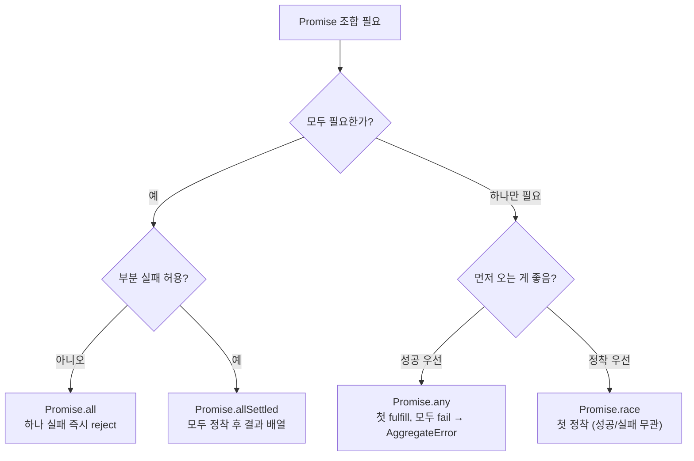

## 정의

`Promise` 의 정적 메서드 4 형제. 여러 Promise 를 동시에 다루는 도구.

| 메서드 | fulfilled 조건 | rejected 조건 | 결과 |
|:---|:---|:---|:---|
| **`all`** | 모두 fulfilled | 하나라도 rejected | 값 배열 / 첫 rejection |
| **`allSettled`** | 모두 정착 | 절대 안 됨 | `{status, value/reason}` 배열 |
| **`race`** | 가장 먼저 fulfilled | 가장 먼저 rejected | 첫 정착값/사유 |
| **`any`** | 하나라도 fulfilled | 모두 rejected | 첫 fulfilled / AggregateError |

## Promise.all

```javascript
const [users, posts, comments] = await Promise.all([
    fetch('/api/users').then(r => r.json()),
    fetch('/api/posts').then(r => r.json()),
    fetch('/api/comments').then(r => r.json()),
]);
```

**모두 성공해야 결과**. 하나라도 실패하면 즉시 throw, 나머지는 계속 실행되지만 결과 못 받음.

```javascript
try {
    const results = await Promise.all([p1, p2, p3]);
} catch (e) {
    // 가장 먼저 실패한 reason
}
```

## Promise.allSettled

```javascript
const results = await Promise.allSettled([p1, p2, p3]);
results.forEach((r, i) => {
    if (r.status === 'fulfilled') console.log(i, r.value);
    else console.log(i, r.reason);
});
```

**모두 정착 (성공/실패 무관)** 까지 대기. 부분 실패가 OK 일 때.

## Promise.race

```javascript
// 타임아웃 패턴
function timeout(ms) {
    return new Promise((_, reject) =>
        setTimeout(() => reject(new Error('timeout')), ms));
}

const result = await Promise.race([
    fetch('/api/slow'),
    timeout(3000),
]);
```

**가장 먼저 정착** (성공/실패 무관) 한 Promise 결과.

## Promise.any (ES2021)

```javascript
// 여러 CDN mirror 중 하나라도 응답하면
const data = await Promise.any([
    fetch('https://mirror1/data'),
    fetch('https://mirror2/data'),
    fetch('https://mirror3/data'),
]);
```

**하나라도 성공** 하면 그 값. 모두 실패하면 `AggregateError` (errors 배열).

```javascript
try {
    const data = await Promise.any([...]);
} catch (e) {
    if (e instanceof AggregateError) {
        e.errors.forEach(err => console.error(err));
    }
}
```

## 비교 매트릭스

| 상황 | 권장 |
|:---|:---|
| 모두 필요 | `all` |
| 부분 실패 OK | `allSettled` |
| 가장 빠른 응답 (성공/실패 무관) | `race` |
| 하나라도 성공 | `any` |
| 타임아웃 | `race` + timeout Promise |

## 흔히 만나는 패턴

### concurrent fetch

```javascript
const users = await Promise.all(
    userIds.map(id => fetch(`/api/users/${id}`).then(r => r.json()))
);
```

배열의 map 콜백에서 Promise 반환 → all 로 모음.

### concurrent with limit

```javascript
// 동시 5 개로 제한
async function pool(items, fn, concurrency = 5) {
    const results = [];
    for (let i = 0; i < items.length; i += concurrency) {
        const chunk = items.slice(i, i + concurrency);
        const r = await Promise.all(chunk.map(fn));
        results.push(...r);
    }
    return results;
}

await pool(urls, fetch, 5);
```

라이브러리: `p-limit`, `p-queue`.

### timeout wrapper

```javascript
function withTimeout(promise, ms) {
    return Promise.race([
        promise,
        new Promise((_, reject) =>
            setTimeout(() => reject(new Error('timeout')), ms))
    ]);
}

const r = await withTimeout(fetch('/api'), 5000);
```

### 부분 실패 통계

```javascript
const results = await Promise.allSettled(
    items.map(item => process(item))
);
const success = results.filter(r => r.status === 'fulfilled').length;
const failed = results.length - success;
console.log(`${success}/${results.length} succeeded`);
```

## 함정

### 1. Promise.all 의 fail-fast

```javascript
Promise.all([slow_p, fail_p])
// fail_p 가 즉시 throw → slow_p 의 결과는 못 받음
// 그러나 slow_p 는 background 에서 계속 실행됨 (cancel 안 됨)
```

진짜 cancel 은 `AbortController` 사용.

### 2. 빈 배열

```javascript
Promise.all([])             // [] (즉시 resolve)
Promise.allSettled([])      // []
Promise.race([])             // 영원히 pending ⚠️
Promise.any([])              // AggregateError
```

`race` / `any` 에 빈 배열 주의.

### 3. await Promise.all vs 순차

```javascript
// ❌ 순차 (2 sec)
const a = await fetch('/a');   // 1 sec
const b = await fetch('/b');   // 1 sec

// ✓ 동시 (1 sec)
const [a, b] = await Promise.all([
    fetch('/a'),
    fetch('/b'),
]);
```

의존성 없으면 항상 `all` 로 묶기.

### 4. 큰 배열의 메모리

```javascript
Promise.all(arr.map(fn))     // 100,000 개면 모두 동시 시작
```

concurrency limit 권장.

## 선택 가이드 시각화



## 내부 동작 - 타임라인 예제

p1 = 100ms 후 resolve, p2 = 50ms 후 reject, p3 = 200ms 후 resolve 라 가정.

```mermaid
gantt
    title Promise 조합 타임라인
    dateFormat X
    axisFormat %Lms
    section p1
    pending     :0, 100
    resolved    :milestone, 100, 0
    section p2
    pending     :0, 50
    rejected    :milestone, 50, 0
    section p3
    pending     :0, 200
    resolved    :milestone, 200, 0
    section all
    fail at p2 reject :crit, 50, 150
    section allSettled
    wait all    :0, 200
    section race
    settle at p2 :50, 150
    section any
    settle at p1 :100, 100
```



| 메서드 | 정착 시점 | 결과 |
|:---|:---|:---|
| `all` | 50ms (p2 reject) | reject reason of p2 |
| `allSettled` | 200ms (p3 resolve) | `[fulfilled, rejected, fulfilled]` |
| `race` | 50ms (p2 reject) | reject reason of p2 |
| `any` | 100ms (p1 resolve) | p1 value |

## AbortController 와 함께

`Promise.all` 은 fail-fast 이지만 나머지 Promise 는 cancel 되지 않는다. 실제로 취소하려면 `AbortController` 가 필요.

```javascript
async function fetchAll(urls) {
    const controller = new AbortController();
    const { signal } = controller;

    try {
        const results = await Promise.all(
            urls.map(url => fetch(url, { signal }))
        );
        return results;
    } catch (e) {
        controller.abort();  // 나머지 요청 취소
        throw e;
    }
}
```

## p-limit 패턴 (concurrency 제어)

Node.js 에서 대용량 작업 시 동시 실행 수를 제한.

```javascript
import pLimit from 'p-limit';

const limit = pLimit(5);  // 동시 5개

const input = Array.from({ length: 100 }, (_, i) => `https://api.example.com/item/${i}`);
const results = await Promise.all(
    input.map(url => limit(() => fetch(url).then(r => r.json())))
);
```

내부적으로 `Promise.all` 에 전달되는 Promise 는 100개지만, 실제 동시 실행은 최대 5개로 제한. `p-queue` 는 우선순위까지 추가.

## 오류 수집 패턴

`allSettled` 결과를 구분해서 성공과 실패를 각각 처리.

```javascript
const results = await Promise.allSettled(jobs.map(execute));

const { fulfilled, rejected } = results.reduce(
    (acc, r) => {
        if (r.status === 'fulfilled') acc.fulfilled.push(r.value);
        else acc.rejected.push(r.reason);
        return acc;
    },
    { fulfilled: [], rejected: [] }
);

console.log(`success: ${fulfilled.length}, failed: ${rejected.length}`);
if (rejected.length > 0) {
    // 일부 실패 로깅 / 재시도
    logger.error('partial failures', rejected);
}
```

## 재시도 wrapper 패턴

```javascript
function withRetry(fn, retries = 3, delay = 500) {
    return async function (...args) {
        let lastError;
        for (let i = 0; i < retries; i++) {
            try {
                return await fn(...args);
            } catch (e) {
                lastError = e;
                if (i < retries - 1) {
                    await new Promise(res => setTimeout(res, delay * 2 ** i));
                }
            }
        }
        throw lastError;
    };
}

const safeProcess = withRetry(process, 3, 200);
const results = await Promise.allSettled(items.map(safeProcess));
```

## Node.js 특유의 util.promisify

콜백 기반 API 를 Promise 로 변환.

```javascript
import { promisify } from 'node:util';
import { readFile } from 'node:fs';

const readFileAsync = promisify(readFile);

const files = await Promise.all([
    readFileAsync('./a.json', 'utf8'),
    readFileAsync('./b.json', 'utf8'),
]);
const [a, b] = files.map(JSON.parse);
```

## React 에서의 패턴

```javascript
// 여러 API 동시 호출
function useDashboard(userId) {
    const [data, setData] = useState(null);
    const [error, setError] = useState(null);

    useEffect(() => {
        let cancelled = false;
        Promise.all([
            fetch(`/api/user/${userId}`).then(r => r.json()),
            fetch(`/api/user/${userId}/posts`).then(r => r.json()),
        ])
            .then(([user, posts]) => {
                if (!cancelled) setData({ user, posts });
            })
            .catch(e => {
                if (!cancelled) setError(e);
            });
        return () => { cancelled = true; };
    }, [userId]);

    return { data, error };
}
```

`cancelled` 플래그로 unmount 후 state 설정 방지.

## 참고

- [[Promise]]
- [[async/await]]
- [[비동기와 타이밍, 콜백부터 async/await까지의 발전사]]
